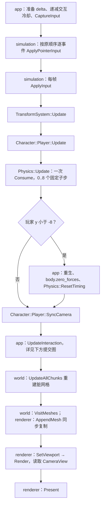
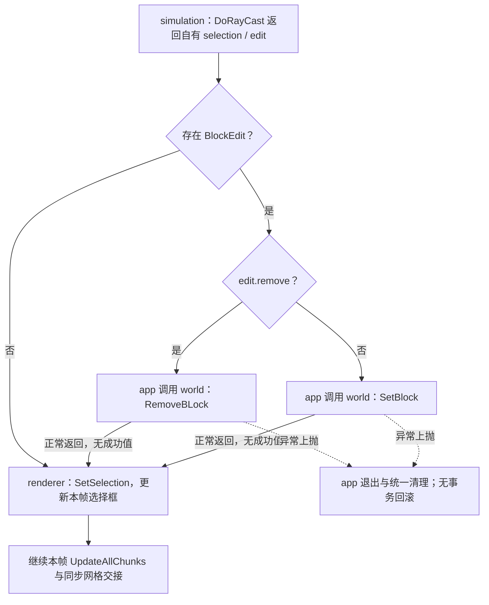

# Simulation 普通玩法更新系统设计示例

> 按 [08 系统与数据流模板](../templates/08-系统与数据流设计.md) 整理的教学摘录，2026-10-05 核对下列源码。聚焦普通玩法，省略 Benchmark 专用场景分支，不是完整 app 设计或新的生产契约。未独立运行游戏或模拟测试。

2026-10-06 核对 app 调用位置，将调用顺序与提交改为 Mermaid 表达；原摘录日期、草稿身份和运行验收范围保持。正式函数契约见 [Simulation 样板](../../project/architecture/simulation/Simulation-系统设计.md#公开接口预期行为)，本示例不复制其完整接口表。

关联功能：[Simulation 玩家与玩法推进](../../project/architecture/simulation/Simulation-功能.md)。抽取来源：[原模拟数据与系统](../../project/architecture/simulation/Simulation-数据设计.md)、[App 运行编排](../../project/architecture/app/App-运行编排-功能.md)。组件字段与借用规则引用来源，不在这里重复数据成员表。

## 当前设计

职责 / 处理边界：simulation 解释输入、推进组件、同步相机并生成交互结果；Registry 拥有组件，world 负责方块存储，app 负责调用顺序和实际编辑提交。系统是函数，不额外建立 System 基类。

执行入口 / 当前模式：app 的 `Run` 主循环串行调用；启动时另行注册组件并创建玩家/相机。本例只描述已进入正常主循环的玩法路径。

### 输入、查询与读写集

| 阶段 / 操作 | 数据与筛选条件 | 访问模式 | 结果 / 副作用 |
| --- | --- | --- | --- |
| `ApplyPointerInput` | 有序指针事件、明确玩家与 Camera | 读事件；写玩家 Transform 的 yaw/pitch 与 Camera FOV | 每事件裁剪视角与 FOV |
| `ApplyInput` | PlayerIntent、PlayerInputState、玩家组件 | 读意图；写 Character/RigidBody、选材与冷却 | 设置移动/跳跃/模式；成功选材时输出块名 |
| `TransformSystem::Update` | `View<Transform>` | 读 yaw/pitch；写 front/right/up | 更新派生方向 |
| `Character::Player::Update` | `View<Transform, CharacterComponent, RigidBody>` | 读姿态；写 Character 与 RigidBody | 产生速度、跳跃与状态变化 |
| `Physics::Update` | 每子步 `View<Transform, RigidBody, HitBox>`、world 方块查询 | 写位置、速度与碰撞状态；读 HitBox/world | 固定步积分与静态碰撞；空查询不处理实体 |
| `SyncCamera` | 有效相机 Transform；`View<Transform, PlayerComponent>` | 读玩家；写相机实体 Transform | 同步位置、角度与方向；相机无对应 Transform 时返回 |
| `DoRayCast` | 玩家 Transform/PlayerComponent，放置约束按需读取 HitBox，world 查询 | 只读组件/world；写外部交互冷却 | 返回自有 selection/edit，不直接改世界 |

输入与结果不持有窗口、世界或 GPU 指针。组件引用只在同步访问内借用，有效期受 [ECS 存储契约](../../project/architecture/ecs/ECS-存储边界-类设计.md#不变量) I2/I3 限制；不能从 View 筛选推定组件引用永久有效。

工作负载：当前路径创建一个玩家并另有相机实体，不是大规模实体压力测试；各 View 的实际匹配数量和查询开销没有在本示例测量。没有额外指定帧预算或目标硬件，不能从小规模正常玩法推出大规模吞吐结论。

### 处理规则

主流程与提交分支见下方 Mermaid 图；读写集、频率和数值边界由本页表格及来源契约补充，不用长段文字再复述整条调用链。

查询按当前 Registry 的遍历顺序执行；不承诺多玩家相机选择、跨平台数值确定性或并发执行。这里的 world 重建和渲染交接是下游时序，不归 simulation 所有。

### 调用顺序与提交

图示范围是普通玩法已通过暂停/退出检查、继续模拟的本帧；不包含 Benchmark 采样分支。

每个事件指针处理与每帧 ApplyInput 分开；后者的鼠标汇总为零，避免重复。Transform/Character 每帧各一次，Physics 每帧消费一次预算后才运行子步。重生后直接同步相机，不额外调用一次 TransformSystem。

提交图展开 app 的 UpdateInteraction；虚线只表示异常传播，不表示后台任务。无 edit 仍更新选择框；void 世界 API 正常返回不等于有成功确认。allow_input=false、放置拒绝及冷却限制见提交边界，不能把请求生成画成保证世界写入成功。

### 批处理与数据移动

- Transform / Character 按各自组件组合查询并遍历；Physics 每个实际子步重新遍历匹配实体。多阶段访问同一实体不等于已合并成一次遍历，查询和组件查找的代价尚未测量。
- 组件由 Registry 持有，系统通过引用原地修改相关字段，不为 DOD 复制整份 Registry 或构造不可变世界。系统只保存当前调用内的借用；交互结果按自有值交接。
- 这里的处理单位是匹配实体，当前没有显式工作批大小、SoA 重排或 SIMD 内核。布局与身份规则仍由 ECS 契约维护；本例展示引擎 DOD 的处理路径记录方式，不声称当前稀疏存储已经最优。

### 阶段、频率与顺序

| 阶段 / 系统 | 触发时机 / 频率 | 时间与依赖 | 结果可见时机 |
| --- | --- | --- | --- |
| app 时间准备 | 每个继续模拟的帧一次 | delta 为秒，裁剪到 0..0.1；暂停恢复的当帧为 0 | 传给本帧输入和 Physics |
| 指针事件 / 键盘意图 | 每事件 / 每帧 | 指针按原事件顺序；不得将相反事件合并后只裁剪一次 | 后续 Transform/Character 使用 |
| Transform / Character | 每个继续模拟的帧一次 | 输入之后，Physics 之前；不是每物理子步各调用一次 | 组件原地写回 |
| Physics | 每帧消费一次预算，执行 0..8 步 | `Step=1/120` 秒；非有限/非正 delta 不产生步数 | 每步原地更新，SyncCamera 读取最终位置 |
| 相机 / 射线 / 编辑 | 本帧 Physics 与可能重生之后 | 相机先同步；射线最大距离 3 格；app 同帧提交 | 本帧 world 重建和渲染读取 |

状态负责人：PlayerInputState 和放置/移除冷却由 app 持有；`ApplyInput` 每帧递减选材冷却，app 每帧递减交互冷却，`DoRayCast` 在相关分支设置 0.2 秒。物理预算为模块私有静态状态，启动、暂停/恢复和重生通过 `ResetTiming` 清除余量，不是每会话独立预算。

暂停边界：当前普通玩法在失焦/最小化等 inactive 条件且没有 frame-limit/performance 的分支中清输入与部分运动状态、重置预算并跳过后续模拟；恢复帧 delta 为 0。不能把这个分支推广成所有启动模式的统一暂停保证。

### 结构变化与提交边界

- 更新遍历只改字段，不增删正在遍历的实体/组件；启动阶段 `CreatePlayer` 的结构变化不混入本帧处理。
- `DoRayCast` 只返回自有结果；`allow_input=false` 时可保留 selection，但没有 edit。冷却未就绪或放置拒绝也不等于成功编辑。
- app 在世界未被其他流程改变的同帧调用 `RemoveBLock` 或 `SetBlock`，随后更新选择框和 world 网格。这是直接同步提交，不是有版本校验的异步队列。
- 当前调用方没有将世界提交状态作为独立确认结果返回给 simulation；不能把“产生 edit 请求”写成“世界写入一定成功”或已实现失败回滚。

### 正确性契约

沿用原 Simulation 的相关编号作为展示；正式维护位置仍是来源笔记。数据所有权 S1 和有效期 S5 只引用来源，不在此复制维护。

| 编号 | 可检查条件 | 成立边界 |
| --- | --- | --- |
| S2 | 正常输入路径选材在 0..7 环回，pitch 裁剪到 -89..89 | 有效玩家及初始状态前提下；当前表述来自原笔记 |
| S3 | DoRayCast 不修改方块，只返回可提交请求 | 每次返回后；请求不是提交成功证明 |
| S4 | FixedStepBudget 单次 Consume 返回 0..8，每步 1/120 秒 | 非有限/非正输入返回 0；超长帧限制补步，不承诺补完所有墙钟时间 |

失败 / 中断 / 退出：空的正常 View 不更新实体；无效实体直接 GetComponent 并非通用可恢复输入，本例不补造失败接口。组件创建/分配也不具有完整事务回滚。退出和异常清理由 app 编排，先停止循环再释放所借用数据；详细资源次序引用 App 文档。

并发与缓冲：当前串行，没有任务分区、屏障、取消队列或跨线程快照契约。输入值与组件就地处理不证明所有调用都无分配，也不证明新性能收益。

实现与核对位置：[app 实际调用链](../../../game/app/src/application.cpp)、[输入处理](../../../game/modules/simulation/src/player.cpp)、[Transform](../../../game/modules/simulation/src/transform_system.cpp)、[Character 与相机同步](../../../game/modules/simulation/src/character_system.cpp)、[Physics](../../../game/modules/simulation/src/physics_system.cpp)、[步进预算](../../../game/modules/simulation/include/symocraft/simulation/player_math.h)、[交互](../../../game/modules/simulation/src/playercontroller.cpp)。

原验收依据：[Simulation 验收案例](../../project/architecture/simulation/Simulation-功能.md#验收案例)、[T0 交付报告](../../milestones/m3-t0/README.md)。本轮只核对摘录；不将原单会话验收扩成并行、多会话、输入回放或 T4 存储正确性证明。

## 本次变更

无。本文只展示当前串行玩法流程，不提议修改调度或产品行为，也不表示正式笔记迁移已执行。验收在上述来源中唯一维护，本示例不复制勾选表。

## 后续考虑

| 触发条件 | 再考虑的变化 |
| --- | --- |
| 多世界 / 多会话 | 先明确预算、冷却和玩家/相机身份的会话所有者；不能沿用隐式共享状态 |
| 异步编辑或回放 | 另立命令序号、世界版本、过期结果与失败反馈契约 |
| 正式笔记完成迁移 | 同步来源链接；示例事实需另行核对后才更新摘录日期 |
