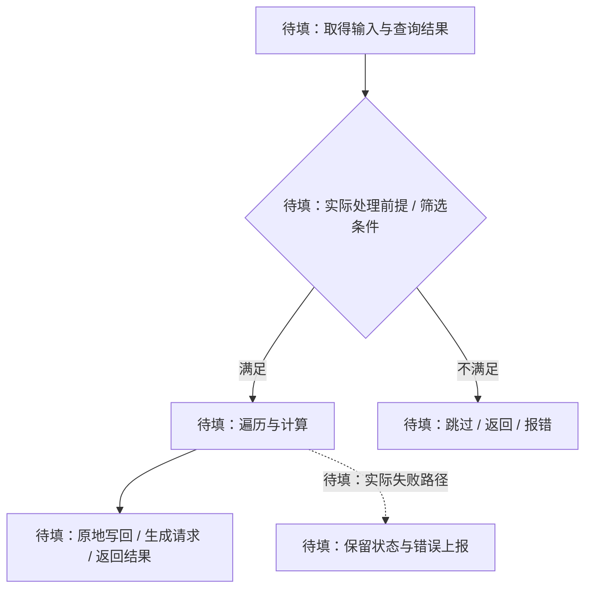
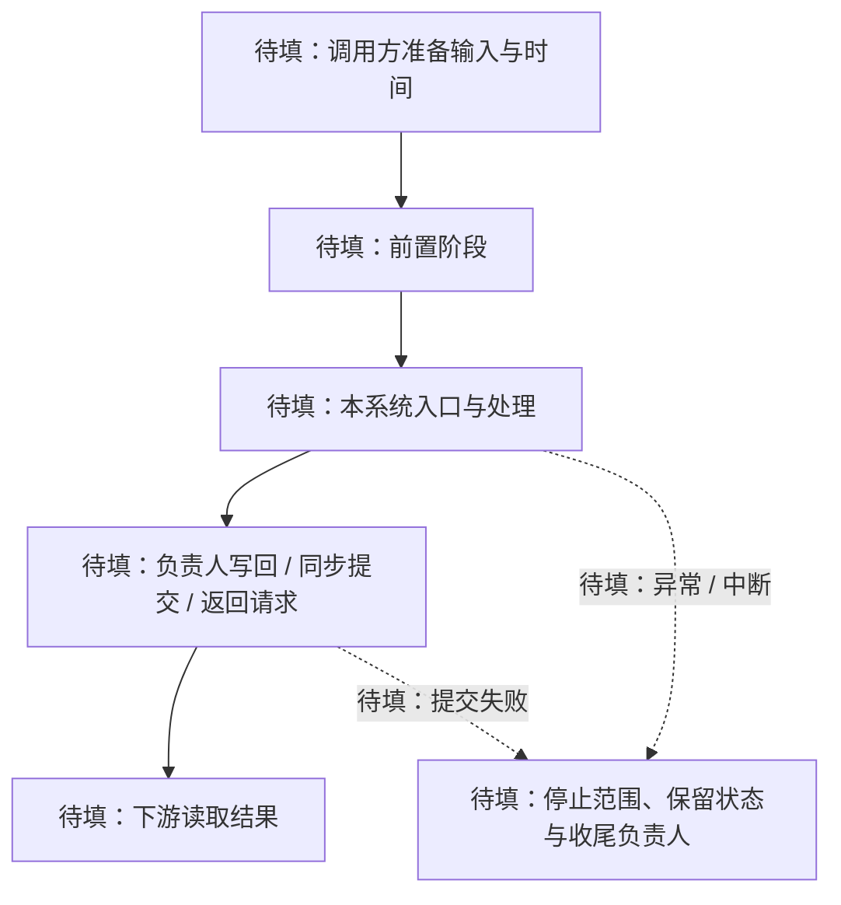

# {{title}}

关联功能 / 数据与存储设计 / 调用方：

<!-- 游戏引擎语境的 Data-Oriented Design（DOD）：记录真实数据变换、访问路径与批处理代价，不强制纯函数或不可变数据。适用于系统函数、数据变换与处理管线，不要求 System 类或 ECS。首次设计时，当前设计写“暂无”，将必要设计表移到本次变更填写候选方案。不为填表增加调度器、任务或命令缓冲。 -->

## 当前设计

职责 / 处理边界 / 相邻职责负责人：
执行入口 / 调用方 / 当前串行或并行模式：

### 输入、查询与读写集

| 阶段 / 操作 | 数据与筛选条件 | 访问模式 | 结果 / 副作用 |
| --- | --- | --- | --- |
| 待填 | 参数、组件组合、过滤条件与空集行为 | 只读 / 读写 / 创建 / 删除；注明借用或副本 | 修改的数据、自有输出、外部请求或副作用 |

数据布局、所有权与引用有效期：链接数据笔记的对应约束；这里只补充本系统特有的访问前提。
工作负载：输入总量 / 活跃量 / 查询命中量、典型与极端分布；目标平台及帧/阶段预算（没有要求则注明）。未知规模和未测瓶颈不编造数值。

### 公开接口预期行为

| 签名 / 入口 | 调用方与可见范围 | 预期行为：输出及状态变化 | 前提 / 边界 | 失败反馈及失败后状态 | 源码 / 约束 |
| --- | --- | --- | --- | --- | --- |
| 待填：实际系统入口或公开算法 | 调用方、阶段与频率；公开范围 | 输出、读写集及结果可见时机 | 输入、查询、顺序、线程与借用 | 停止 / 部分完成 / 返回错误；能否重用 | 定义链接、S… 或数据约束 |

### 私有函数预期行为

| 签名 / 入口 | 内部调用方 | 预期行为：处理规则及副作用 | 前提 / 边界 | 失败传播及清理责任 | 源码 / 约束 |
| --- | --- | --- | --- | --- | --- |
| 待填：内部算法或 helper | 调用入口及实际阶段 | 筛选、计算、写回或提交规则 | 数值、内部状态、禁止操作 | 如何传回失败、保留结果、谁收尾 | 定义链接、S… 或数据约束 |

<!-- namespace 无 C++ public/private，按公开头、内部共享头、translation-unit helper 标明范围。每个函数有审核落点，行为不同的 overload 分开；无相应函数写“不适用：原因”，不创造新系统。 -->

### 处理规则

遍历与计算约定：顺序是否影响结果、边界值处理、关键数值规则；简单逻辑留在源码，只展开影响契约的步骤。

<!-- 有明确顺序、分支或循环的流程优先用 Mermaid，再用文字补充数值、前提和失败后的状态。替换占位节点/边；没有实际检查或错误路径时删除相应分支，不虚构回滚。伪代码仅补充图难以表达的计算，不重复同一流程。批大小、算法复杂度或分配代价仅在相关时补充；性能收益必须有测量依据。 -->

### 批处理与数据移动

- 实际处理单位与访问路径：按实体 / 组件集合 / 数组范围 / 世界区块等处理；查询筛选、间接寻址和实际遍历次数。不为了“批处理”预设固定批大小或新任务。
- 数据移动：哪些数据就地更新，哪些被收集、复制、打包或重排；临时数据由谁持有与复用。没有相应操作则注明。
- 布局与处理的对应：引用数据笔记说明本阶段实际访问哪些字段，哪里连续、哪里跳转；耗时或缓存/带宽瓶颈必须有证据，未知则列为待测。

### 调用顺序与提交

必要补充：图的适用路径、各阶段频率、提交负责人、结果可见时机、失败后允许操作。节点标明实际 owner/入口；箭头表示实际调用顺序或条件，虚线含义显式说明，不把它默认解释为异步或后台任务。

<!-- 此图描述跨阶段协作，处理规则图描述系统内部算法；不重复画同一条流程。候选顺序放本次变更，当前图只保留已实现顺序。不存在提交阶段时改为真实写回/返回，不为填图新增队列、屏障或事务。 -->

### 阶段、频率与顺序

| 阶段 / 系统 | 触发时机 / 频率 | 时间与执行依赖 | 结果可见时机 |
| --- | --- | --- | --- |
| 待填 | 每事件 / 每帧 / 固定步 / 按需等实际方式 | 前置阶段；delta 的来源、单位及裁剪 / 补步规则（适用时） | 立即写回 / 阶段末 / 提交后等实际边界 |

- 状态负责人：跨次调用的预算、冷却、缓存或队列由谁持有，何时重置；无状态则注明。
- 顺序保证：调用者如何维持必要依赖；多个对象的处理顺序是否保证、是否要求确定性。
- 时间语义：涉及固定步时，区分事件 / 每帧逻辑与每子步逻辑，注明一次输入和冷却处理是否会重复执行；不适用则删除。

### 结构变化与提交边界

- 遍历中的允许操作：哪些字段可写，是否允许增删实体 / 组件或改变正在访问的集合。
- 提交方式：当前直接修改 / 返回请求 / 延迟提交等实际机制；谁提交、何时提交、如何处理失败。
- 可见性与失效：其他阶段何时看到新状态；结构变化如何影响正在使用的查询与借用。

<!-- 不存在延迟命令、快照或版本机制时不要补造。借用不能跨越数据笔记规定的失效边界。 -->

### 正确性契约

| 编号 | 可检查条件 | 成立边界 |
| --- | --- | --- |
| S1 | 待填：输入前提、输出保证或顺序条件 | 调用前 / 返回后 / 提交后；例外与未验证风险 |

失败 / 中断 / 退出：谁停止处理，是否留下部分结果，哪些状态可重用，资源与未提交请求如何处理。

<!-- 编号固定；数据笔记已有的不变量以链接和编号引用，不在这里复制。未实现的取消或异步退出机制不是当前保证。 -->

### 按需补充：并发与缓冲

<!-- 当前串行时删除本节，或只注明“串行；尚无并发契约”。仅为真实实现或本次候选展开。 -->
- 任务与分区：执行线程、划分依据、每任务读写范围与共享资源。
- 冲突与同步：读写冲突如何排除，依赖 / 屏障由谁建立，结果何时发布。
- 异步有效期：输入副本 / 借用的寿命、版本校验、过期结果处理、取消与退出等待。
- 缓冲与分配：临时数据负责人、复用和释放时机；双缓冲、SIMD 等仅在确有实现时记录。

已采纳的选择与理由：
实现位置 / 已验证版本 / 验收与实验依据 / 未验证项：

## 本次变更

目标 / 范围 / 不包含的能力：

### 流程与契约增量

| 方面 | 新增 / 修改 / 删除：当前 → 候选 | 受影响的数据 / 阶段 / 调用方 |
| --- | --- | --- |
| 工作负载 / 读写集 / 批处理与数据移动 / 算法 / 频率 / 顺序 / 提交边界中受影响的项 | 待填；仅写本轮变化 | 对应约束及需要同步修改的笔记 |

| 编号 | 新增 / 修改 / 删除的条件 | 成立边界 |
| --- | --- | --- |
| S… | 已有约束沿用编号，新约束使用未用过的编号 | 待填 |

决定与理由：当前选择 → 原因 → 何时重新考虑。
阻塞问题 / 尚未验证的假设：无 / 问题 → 最小确认方式。

### 验收案例

验收位置：优先链接关联功能的验收章节并注明 S…；已有唯一记录时删除下表，仅独立验收时保留。
性能问题：链接技术实验或 Benchmark 的条件、结果与适用范围，不从“数据导向”推定收益。
若本轮优化处理路径：注明行为等价判据、代表性负载、基线与候选的阶段耗时/吞吐或实际相关指标；计入查询、复制、分配与提交代价，不只测计算内核。目标平台和构建条件一并记录。

| 状态 | 场景 | 预期行为 |
| --- | --- | --- |
| [ ] | 正常输入 / 命中查询 | 正确的输出与副作用，建立 / 保持 S… |
| [ ] | 空查询 / 边界输入 / 多次调用 / 补步中适用的场景 | 顺序、次数及时间语义符合契约 |
| [ ] | 提交失败 / 中断 / 退出中适用的场景 | 保留状态、错误反馈与资源处理符合约定 |

环境 / 运行入口 / 版本 / 结果与证据（按场景）：
实现落点：

<!-- 实际通过才改 [x]，失败写 [ ] 失败。验证后将成立的流程、约束、理由与证据合并到当前设计，更新关联数据与调用方笔记并清空本次变更。不把串行验收当作并发或确定性保证。 -->

## 后续考虑

| 触发条件 | 再考虑的变化 |
| --- | --- |
| 待填 | 待填 |
