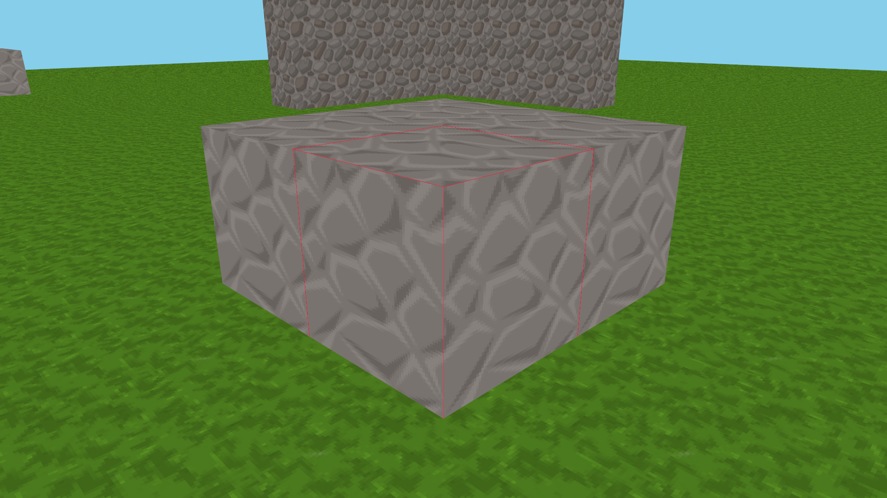

# M3-T0 模块边界迁移

本报告对应 [M3-T0 spec](../../spec/M3-T0-模块软硬边界.md)。模块迁移、构建隔离、自动回归与用户玩法复查已完成，等待 T0 整体验收；不代表整个 M3、多后端或性能优化已完成。

## 前提与身份

- 用户于 2026-10-05 在聊天中确认迁移前玩法回归通过，并授权开始 M3-T0；这是用户确认，不是本轮重新执行的人工用例记录，不推定未提供的机器、时长或逐项结果。
- 迁移起点提交：`cadc349aa752e252454a481c3199281c112998c9`，叠加用户已有文档修改；未替用户提交 Git，也未还原这些修改。
- 旧 Release 游戏 SHA-256：`f73285a0ac164073da7b8dfb912ef2fae558061df433a69a2fdbfa7b25729af1`，与冻结基准身份一致。原冻结运行包和采样数据不覆盖。
- S0 保存源文件哈希、源码与构建快照、Git 状态和原 20 项测试清单，位于 `out/m3-t0/pre-migration/`。迁移前 17 项在沙箱通过，3 项受子进程 / 文件发布权限限制的用例在获准环境复测通过；保留两份日志，不隐去失败。

## 实现与取舍

九个真实模块、app 和测试树已迁移，模块说明见 [架构索引](../../project/architecture/Overview.md)，逐文件追踪见 [源码迁移表](../../project/architecture/source-migration.tsv)。

1. world 私有持有 Chunk 与哈希表，通过受限同步网格视图交给 app，再交给 renderer。保留旧遍历顺序、网格算法、批次打包与全量上传，未把 GPU 命令留在区块数据中。
2. simulation 拥有玩家组件、相机和玩法算法。平台回调只产生事实，由 app 映射为意图；鼠标 / 滚轮事件保序，避免聚合后改变俯仰角与 FOV 截断结果。
3. renderer 独占 GLAD、着色器、批次、纹理、截图和 GPU 计时，通过仅含图形桥接头的私有目录借用 platform；不反向查询 Application、World 或 Registry。
4. ECS 存储实现头私有化，模板 API 转发到字节操作；不趁此次迁移替换存储算法。assets 保留源图片通道与旧纹理验证规则，YAML 只在世界配置和 telemetry 私有实现中出现。
5. telemetry 接收中立样本与自有配置，保持 v2 导出及原子状态文件发布。Data::Value 提供拥有数据的元数据契约，不把解析器原生类型传给调用方。
6. 13 份无运行期调用的旧输入、事件、线程池和聚合头按原字节保存在 `game/app/legacy/*.disabled`；不参与构建、不作为兼容回退。原分配器和 ECS 正确性债务明确留到 T4。

没有引入工作线程、ECS 替换、新玩法、动态区块或 D3D12/Vulkan，也不把短测成绩当作新的冻结基准。

## 验证状态

验证日期：2026-10-05。环境为 Windows x64、MSVC 19.38、CLion 附带 CMake 4.3.1 / Ninja，MSVC 英文诊断环境。表中的“通过”表示对应实现与检查有证据，不代替用户对整个节点的批准。

| 验收 | 状态 | 证据 / 边界 |
| --- | --- | --- |
| A01 / A04 目录、目标与源码唯一归属 | 通过 | 九模块与 app 归位；[迁移表](../../project/architecture/source-migration.tsv) 追踪起点 112 份源码/构建/测试文件；当前 [36 份自有生产 cpp](evidence/production-sources.tsv) 归属 12 个实现 target，scene 为纯头目标；[依赖表](evidence/production-dependencies.tsv) 与 [目标图](evidence/production-targets.dot) 无环 |
| A02 公开头独立消费者 | 通过 | [34 个公开头](evidence/public-headers.tsv) 在 Debug/Release 独立编译并链接正式模块，不使用聚合头；CPU-only 覆盖其中 28 个 |
| A03 正负向边界检查 | 通过 | 16 个源码/真实 target 负向案例拒绝越界依赖、私有头、宽 include、生产依赖测试、重复实现和循环；清单格式最后补充 LINK_ONLY 后 [再次通过 2/2](evidence/final-boundary-check.log) |
| A05 CPU-only | 通过 | 43/43；构建图无 GLFW / GLAD / platform / renderer / 游戏窗口目标 |
| A06 Debug / Release | 通过 | 独立新目录配置、构建并最终各 60/60；不复用迁移前对象 |
| A07 关闭测试 | 通过 | `BUILD_TESTING=OFF` 配置、构建、安装通过；无测试/fixture 产物 |
| A08 独立 benchmark | 通过 | 独立入口和根入口仅工具模式均完成配置、构建、安装；独立工具测试 5/5，无游戏/图形模块依赖 |
| A09 测试真实性 | 通过 | [原 20 项](evidence/pre-migration-test-list.json) 全部保留并链接正式库；移除旧 Chunk GPU 命令字段断言，保留网格越界/容量等有效断言；新增元数据、图片、ECS 基本和模拟契约测试 |
| A10 增量编译 | 通过 | [实测结果](evidence/incremental.json)：私有 batch 头只重编译 renderer 1 份；共享 mesh 头重编译 world 4 / simulation 2 / renderer 2 / app 1；两次均重链接，源内容与时间戳恢复 |
| A11 世界与协议 | 通过 | seed 424242 四区块交点编辑摘要字节一致；v2 文件/CSV 契约及固定场景元数据一致；静态截图字节一致；短测不等于重新冻结基准 |
| A12 真实 OpenGL 与玩法 | 通过 | Debug 120 帧、Release static/edit 自动探针通过；用户对已安装 Release 的移动/跳跃、视角、放置/破坏、切出切回、最小化恢复和正常退出确认“全部正常，已退出游戏” |
| A13 安装包与资源错误 | 通过 | 无关 CWD、缺失资源自动用例通过；隔离包损坏 shader / 图片 / 方块配置各以退出码 3 和具名诊断结束；6 个已安装资源与源码哈希一致 |

静态库私有依赖仍需参加最终链接，因此依赖表保留 `raw_reference`、图中保留 `LINK_ONLY`；这不代表私有 YAML / SDK 的头文件传播给调用者。

### 构建矩阵

| 配置 | 最终测试 | 证据 |
| --- | --- | --- |
| 完整 Debug | 60/60，31.43 秒 | [CTest](evidence/full-debug-final-ctest.log) |
| 完整 Release | 60/60，27.87 秒 | [CTest](evidence/full-release-final-ctest.log) |
| CPU-only Debug | 43/43，3.41 秒 | [CTest](evidence/cpu-debug-final-ctest.log) |
| 独立 benchmark | 5/5，24.17 秒 | [CTest](evidence/standalone-runner-final-ctest.log) |
| 关闭测试 / 独立工具 / 根入口仅工具 | 三种配置 configure / build / install 均通过 | [矩阵](evidence/matrix.log)、[安装文件清单](evidence/no-tests-install-files.txt) |

完整构建目录分别为 `out/m3-t0/build/{full-debug,full-release,cpu-debug}`，隔离配置位于 `out/m3-t0/matrix/`。开发者可在 MSVC x64 环境复用 [构建矩阵探针](../../../test/integration/VerifyBuildMatrix.cmake)、[增量探针](../../../test/integration/CheckIncrementalBuild.ps1)；正常 CLion Debug/Release 预设名称不变。

### 真实运行与人工复查

[运行身份](evidence/identity.json)、[9 次探针参数与退出码](evidence/probes.json)、[旧新对照](evidence/comparison.json) 已归档。旧/新世界摘要、旧/新 static、新 edit、Debug 有限帧、三类损坏资源探针全部得到预期结果。Debug stderr 为空。故障测试只修改 `out/m3-t0/runtime-001/` 中的隔离副本，未改源码资产或交付包。

静态场景每帧 2,063,250 个顶点、57,770,616 上传字节、2 次绘制调用保持一致；初次上传字节也一致。编辑场景采样段完成 60 次编辑，总计调度 79 次，数据保留重建与上传变化。原有逐帧全量上传并未在 T0 优化。

用户在聊天中确认上述玩法/窗口操作全部正常，并已退出游戏。请求约 3 分钟，但未采集实际游玩时长；不把这次局部复查扩写为双机完整玩法或长时稳定性验收。本轮没有重新执行 walk 场景真实采样，也未专门注入 benchmark 最小化/分辨率变化或窗口创建失败；协议单元测试不冒充这些人工故障操作。

截图 SHA-256：`3d4765d8bafd5388c2d60cd5ec4cc41e335d1b6416bebb1c692c299fc3b01851`。一致性只适用于本次固定场景，不是所有玩法画面的数学证明。

### 短测性能观察

本机 RTX 5070 Ti、OpenGL 4.6 / NVIDIA 616.64；1920×1080 framebuffer、VSync 关闭、4x MSAA、seed 424242。每组预热 5 秒、采样 15 秒、仅 1 次，策略为 `allow-unfocused`。

| 场景 | 帧数 | 平均 FPS | P50 / P95 / P99 帧时间（ms） | 采样段失焦帧 |
| --- | --- | --- | --- | --- |
| 旧 static | 2599 | 173.28 | 5.6626 / 6.7339 / 7.5850 | 0 |
| 新 static | 2560 | 170.67 | 5.7352 / 6.8517 / 7.8970 | 2560 |
| 新 edit | 2551 | 170.02 | 5.7637 / 6.8299 / 7.6749 | 2551 |

新旧 static 平均 FPS 数值相差约 -1.51%，但两轮实际焦点状态不同、样本很短且没有重复；**不能据此归因于架构迁移，也不能宣称性能持平或达标**。三轮按 allow-unfocused 均有效；旧 static 缺失 1 个 GPU 查询样本，保留缺失而非补零。此表用于发现明显问题和确认观测链路仍可运行，不替代原三档硬件 36 分钟正式基准，也没有覆盖或合并冻结数据。

### 失败与复测

- S0 的 3 个受沙箱限制测试获准重跑通过，保留 [初次记录](evidence/pre-migration-ctest.log) 与 [复测](evidence/pre-migration-ctest-retry.log)。
- 集成构建曾暴露受限第三方头视图缺少图片写出头、app 源清单和资源输出作用域问题；修正真实声明/部署路径后重建，初始与后续构建日志均保留，没有放宽模块 include 根。
- 初次完整 Debug 的负向边界用例曾失败；修复探针配置调用后复测通过，再补强生产引用 test/support、app 链接 benchmark 和独立工具检查，共 16 个负向案例。最终矩阵是修复后的结果，不使用早期通过数替代。
- 审阅另发现图片通道转换、YAML 字符串类型、失败时 GPU 元数据时机及按键 helper 脱离实际生产路径的问题，已修正并补充/保留相关契约测试后完成最终构建与运行。

## 运行与证据

完整构建日志、原始短测 CSV、二进制、包、故障夹具均放在 `out/m3-t0/`；本目录只保留报告、选定日志 / 小型结果与必要截图。短测不覆盖任何 M2 冻结数据。

九模块以及 app / build 共 26 篇架构笔记已完成整理，每模块配套功能与类设计说明。最终 [YAML / 标签检查](evidence/docs-tag-validation.json) 通过，新架构笔记、阶段报告、总导航与 T0 spec 的本地链接检查无断链；`git diff --check` 通过。所选证据约 1.25 MB，只有日志、文本清单、小型结构化结果和 1 张截图，不含二进制或完整逐帧 CSV。

自动真实驱动检查由 [VerifyMigrationRuntime.ps1](../../../test/integration/VerifyMigrationRuntime.ps1) 运行。它是开发机集成检查脚本（PowerShell 7），不是给朋友的采样入口；独立 Benchmark 仍是原生 exe，不要求终端用户绕过 PowerShell 策略。

### 可运行交付

- 游戏：[SymoCraft.exe (retired)](../../../out/maintenance/archive-20261008/deleted-packages.json)，用户复查和自动 Release 运行均使用这份安装文件。
- 压缩包：[SymoCraft-M3-T0-windows-x64.zip (retired)](../../../out/maintenance/archive-20261008/deleted-packages.json)。包含游戏、原生 benchmark、app-local VC 运行库、资源、说明及许可，共 21 个文件；不含 PowerShell 脚本、CSV、测试 fixture 或编译中间产物。
- 游戏 SHA-256：`93c970a955cde39b9a5fa81ccc494d0d2b8a33d336547c72a226c0be7ac81eb4`。
- ZIP SHA-256：`631efa914a0ac7cdfafedffa0d21f43917ed0f5d55abf80cd5b3aa0dfa10b8fe`；ZIP 内游戏哈希与已验证安装文件相同，见 [交付核验](evidence/package-verification.json)。

增量编译探针只针对 build 目录，不覆盖这份已安装/打包的游戏。当前包验证仍限本机；无开发环境机器的独立发布认证属于 M6。

## 已知限制

- 模块内部仍有 world / renderer 的旧私有状态和全量顶点上传；T0 的目标是隔离和约束，不是宣称 T1/T2 内部架构已完成。
- ECS 旧 ID 校验、删除压缩、分配失败及休眠序列化仍需 T4 审计；新基本契约测试不等于完整存储正确性证明。
- 短测只能发现明显回归，不能据此证明三档硬件性能目标、长时稳定性或最低配置兼容性。
- 当前只验证 Windows x64 / MSVC / OpenGL；本机受影响玩法已由用户确认，T0 整体验收仍待用户批准，不自动进入 T1。
- 架构文档已纳入 `area/architecture`；没有修改 Obsidian 图谱设置，第九个颜色分组的界面配置尚未执行，不将文档标签检查当作 UI 验证。
