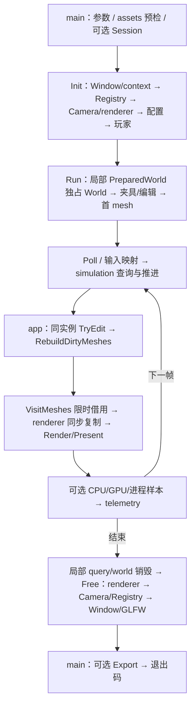

# App 运行编排

关联设计：[Application 生命周期](Application-类设计.md)。依据：[M3-T0](../../../spec/M3-T0-模块软硬边界.md)、[M3-T1](../../../spec/M3-T1-世界模块重构.md)。

验证：[T1 统一报告](../../../milestones/m3-t1/README.md)、[T0 历史报告](../../../milestones/m3-t0/README.md)。当前包两项问题按用户要求延期，其余人工项目已确认正常；节点待批准。

## 当前设计

`game/app` 是可执行程序组合入口，不是底层模块的服务定位器。`main` 负责参数、资源预检、致命错误与退出码；`Application` 负责连接模块、主循环和关闭次序。`symocraft_startup` 为真实参数解析静态库，供产品和测试共用，不重编同一份 cpp。

源码：[主循环](../../../../game/app/src/application.cpp)、[main](../../../../game/app/src/main.cpp)、[构建](../../../../game/app/CMakeLists.txt)。原 Application 的 GLFW callback 转至 platform，键鼠玩法映射规则转至 simulation；公共的 GetCamera/GetRegistry/GetWindow 服务入口已移除。

### 目标与流程

普通玩法暂停和 benchmark 继续运行是显式分支。benchmark 输入只有 Esc 取消，其移动/编辑场景仍按 v2 固定计划执行，不将鼠标或朋友的键盘操作混入采样。

### 公开接口预期行为

| 签名 / 入口 | 调用方与可见范围 | 预期行为：输出及状态变化 | 前提 / 边界 | 失败反馈及失败后状态 | 源码 / 约束 |
| --- | --- | --- | --- | --- | --- |
| Application::Init / Run / PrintWorldSummary / Free | main；app 私有头 | [逐函数权威表](Application-类设计.md#公开接口预期行为) | 串行生命周期及局部 world | 同目标表；不保证完整会话恢复 | application.h / I1-I6 |
| ParseStartupOptions / main | 进程启动与参数测试 | [参数与退出码权威表](Application-类设计.md#公开接口预期行为) | argv/view 与 Session 寿命由调用方维持 | 同目标表；错误码不混作世界编辑结果 | startup_options.h / main.cpp |

### 私有函数预期行为

| 签名 / 入口 | 内部调用方 | 预期行为：处理规则及副作用 | 前提 / 边界 | 失败传播及清理责任 | 源码 / 约束 |
| --- | --- | --- | --- | --- | --- |
| ReadBlockDefinition / PrepareWorld | Init / Run / summary | [内部权威表](Application-类设计.md#私有函数预期行为) | 定义按值交接；实例失败局部释放 | 同目标表；Session 写入非事务 | application.cpp / I6 |
| MapInput / CurrentCamera / UpdateInteraction / 两处 mesh callback | Run | [内部权威表](Application-类设计.md#私有函数预期行为) | 同步值映射、同帧编辑及限时 span | 同目标表；不另缓存世界网格 | application.cpp / I1/I6 |

### 关键约束与取舍

- 不新增游戏算法。`MapInput` 转换物理键；保序鼠标/滚轮事件逐条交 `ApplyPointerInput`，维持每个事件的俯仰/FOV 限制。速度、跳跃条件、选块限制与 debounce 属于 simulation。
- app 拥有玩家 ID 和 camera，world 不再创建玩家或依赖 ECS。
- `PrepareWorld` 把定义按值交给 `VoxelWorld::Create`，启动元数据、夹具、碰撞、交互和 benchmark 均使用这同一实例；world 不是 namespace 静态值，也不提供当前世界服务入口。
- pack 计时包住 `VisitMeshes -> AppendMesh`，render 包住相机值准备、GPU 提交，present 单独计时；GPU query 保持异步。
- world mesh 只在 callback 期间借用，renderer 立即复制；模块之间没有额外的整世界缓存和第二份网格容器。
- world-summary 不创建窗口；资源错误沿现有退出码报告。BUILD_TESTING=OFF 产品不依赖 fixture。
- 旧未调用线程池、另一套 input/event 保留为 `.disabled`，不编译、不导出，详见[遗留清单](App-休眠源码清单.md)。它们不是当前支持能力。

### 验收案例

以下是 T0 历史快照；不将旧勾选或用户玩法确认继承为当前 T1 安装包的验收。

| 状态 | 场景 | 预期行为 |
| --- | --- | --- |
| [x] | Debug/Release 干净构建和原测试 | 通过，生产 cpp 唯一 target 所有者 |
| [x] | 固定 seed summary | 旧新摘要字节一致，digest、441 区块和姿态不变 |
| [x] | 普通游戏操作及失焦恢复 | 用户确认本轮安装包移动跳跃、视角、放破、切出切回、最小化恢复与正常退出均正常 |
| [x] | static/edit 真实短采样 | v2 元数据与采样列对照一致；新 static/edit 失焦条件下有效完成 |
| [x] | 安装包从无关目录启动 / 资源缺失 | 资源定位与错误退出保持，不包含测试脚手架；损坏配置/shader/图片真实探针均退出 3 |

2026-10-05 最终 Debug 与 Release 分别 60/60，通过的独立 benchmark 为 5/5；真实探针和包身份见最终报告。用户对 `out/m3-t0/install/full-release/SymoCraft.exe` 的本轮人工复查与迁移前确认分别记录。上述短采样不包含新的 walk 真实运行，不是 36 分钟正式基准或完整输入回放。

## 本次变更

2026-10-06，M3-T1 的最小调用适配已落地，自动构建/契约与旧新真实运行短测完成。人工已知问题及延期边界由阶段报告维护，节点尚未批准；上面的已勾验收及旧日志只证明 T0，不构成本轮通过。

### 世界实例与文件组合

`Init` 使用 assets `ReadBytes` 获取配置文本，再交 `BlockDefinition::FromConfig`；不让 world 接触资源路径。定义临时存于 app 的 `pending_block_definition`，`Run` 在首次绘制前验证实际纹理层数，随后移动进局部 `PreparedWorld::instance`。移动完成即清空 pending 值；运行成功或抛出异常都通过局部 `unique_ptr` 销毁世界。`PrintWorldSummary` 用独立局部对象完成同样组合，不创建窗口或先生成 CPU 网格。

`Run` 只接受尚未消费定义的成功 Init，误用抛 `logic_error`，不解引用缺失 optional。仍不提供完整 T4 Application 实例状态机。

### 编辑、发布和计时

- 普通交互收到整数 `World::EditRequest` 后调用同一实例的 `TryEdit`。拒绝无副作用；正常交互不新增日志或采样计数。
- benchmark 先用整数坐标查询并核对 before ID，再检查 `EditResult::Accepted()`；Rejected 才导致失败，Unchanged 属于已接受计划动作，继续推进原 `applied_edits`、`sample.edits` 与 lateness。
- 世界创建不隐含 mesh。夹具和启动测试编辑完成后调用 `RebuildDirtyMeshes`，保留 `first_mesh` 分段；每帧 mesh、pack、render、present 原分段和 v2 字段不变。
- `VisitMeshes` 的每个 record（含空发布）都同步交 `AppendMesh(record.vertices)`；身份和版本暂不缓存，renderer 不依赖 world，也没有第二份完整世界网格快照。
- 出生点、重生、摘要和最终 benchmark digest 均来自运行实例；旧生成字段由 `VoxelWorld::Describe` 提供，不从另一套 app 设置重建。

本轮摘要、玩法、benchmark 与失败/退出验证统一见 [M3-T1 报告](../../../milestones/m3-t1/README.md)，不另维护平行验收表。

## 后续考虑

| 触发条件 | 再考虑的变化 |
| --- | --- |
| T4 开始 | 把本层 namespace 生命周期状态收束为实例，完善 state machine；不反向恢复服务定位 |
| 明确要求 gameplay profiling | 另行定义可选采集，不复用禁用正常输入的 benchmark 冒充玩法回放 |
