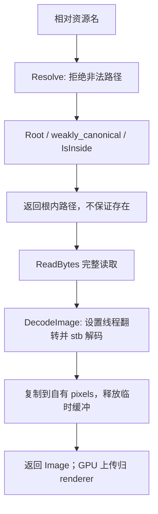

# Assets namespace API

历史文件名保留为入口。关联：[功能与验收](Assets-资源读取与解码.md)、[Image 数据](Image-数据设计.md)、[覆盖清单](../对象笔记覆盖清单.md)。 

## 当前设计

### 函数边界

路径解析与读取/解码是独立入口，不能把 Resolve 的根内约束推定为 ReadBytes 的隐含保证。逐函数审核见下表；通道/布局/I1/I3 归 [Image](Image-数据设计.md#不变量)，renderer 只接受 RGB/RGBA，不靠改 CWD 兜底。

### 不变量

原 I2：Resolve 正常返回在可执行文件 assets 目录内；不等于存在/已解码，不承诺文件系统任意并发变更事务隔离。

### 既有迁移与风险

T0 接管原 application/texture CPU 解码，图片库/平台路径实现私有；GPU 归 renderer，方块规则归 world。加载期复制不是逐帧拷贝；并发加载、重入、OOM、全部解码故障未专项证明。
[实现](../../../../game/modules/assets/src)、[公开头](../../../../game/modules/assets/include/symocraft/assets)、[功能验收](Assets-资源读取与解码.md#验收案例)、[T0 报告](../../../milestones/m3-t0/README.md)。原正式库图片/路径、独立消费者、损坏纹理退出结论保留，2026-10-06 未重跑。

### 公开接口预期行为

本篇为 Assets 函数集合的唯一行为表，历史文件名保留；Image 自身的值语义仍归数据笔记。公开定义：[asset_paths.h](../../../../game/modules/assets/include/symocraft/assets/asset_paths.h)、[image.h](../../../../game/modules/assets/include/symocraft/assets/image.h)。

| 签名 / 入口 | 调用方与可见范围 | 预期行为：输出及状态变化 | 前提 / 边界 | 失败反馈及失败后状态 | 源码 / 约束 |
| --- | --- | --- | --- | --- | --- |
| `ExecutableDirectory()` | 模块公开；app / 资源定位 | 自有 path，取当前 Windows exe 的父目录 | 动态扩展缓冲；不依赖 CWD | system_error、length_error、分配异常；不改进程目录 | [asset_paths.cpp](../../../../game/modules/assets/src/asset_paths.cpp) |
| `Root()` | 模块公开；Resolve | 返回 ExecutableDirectory()/assets | 不承诺目录存在 | 路径查询/分配异常上抛 | asset_paths.cpp |
| `Resolve(const filesystem::path&)` | 模块公开；app 等 | weakly_canonical 后返回根内子路径 | 非空相对路径，无根、NUL、冒号、..；根自身也不接受 | invalid_argument/文件系统异常上抛；没有写文件或路径事务 | asset_paths.cpp / I2 |
| `RequiredFiles()` | 模块公开；资源检查 | 返回静态 array<string_view,6> 的 const 引用 | 元素指向静态字符串，进程期有效 | 无每次分配；不能修改 | asset_paths.cpp |
| `CheckRequiredAssets(ostream&)` | 模块公开；启动自检 | 检查六项普通文件；逐项输出缺失/解析错误，全部有效 true | 只检查存在/类型，不解码；流借用至返回 | 各项 std::exception 捕获后 false 并继续；诊断流自身异常可能逃逸 | asset_paths.cpp |
| `ReadBytes(const filesystem::path&)` | 模块公开；Shader / DecodeImage | 完整读取自有 vector<uint8_t>；空文件返回空 | **不自动 Resolve**，path 安全由调用方决定 | runtime_error 或分配异常上抛，不返回部分字节 | [image.cpp](../../../../game/modules/assets/src/image.cpp) |
| `DecodeImage(const filesystem::path&, bool = false)` | 模块公开；renderer | 返回自有 Image，保留通道、紧密行排列；显式线程翻转开关 | 输入字节长度可用 int 表示；无 GPU 创建 | 读取/解码/分配异常；stb 临时缓冲 RAII 释放，不返回半成品 | image.cpp / [Image I1/I3](Image-数据设计.md#不变量) |

### 私有函数预期行为

namespace 无 private 访问控制；下表两项均为 asset_paths.cpp anonymous namespace helper。

| 签名 / 入口 | 内部调用方 | 预期行为：处理规则及副作用 | 前提 / 边界 | 失败传播及清理责任 | 源码 / 约束 |
| --- | --- | --- | --- | --- | --- |
| `IsInside(const filesystem::path& root, const filesystem::path& candidate)` | Resolve | 逐 path 组件比较前缀，且 candidate 必须多出组件 | 两路径已 canonicalize；不是字符串前缀 | false 由 Resolve 转 invalid_argument；不改文件系统 | asset_paths.cpp / I2 |
| `ToUtf8(const filesystem::path&)` | CheckRequiredAssets 诊断 | u8string 转自有 string | 仅诊断路径编码 | 转换/分配异常在该项 try 内捕获；流异常边界见公开表 | asset_paths.cpp |

### 路径与解码流程

Resolve 与 ReadBytes/DecodeImage 是独立 API；图是调用方先 Resolve 的现有加载路径，不表示读取函数强制根内路径。无缓存、异步任务或并发文件系统隔离保证。

## 本次变更

无。

## 后续考虑

新格式/共享缓存/并发需另定消费与寿命契约。

