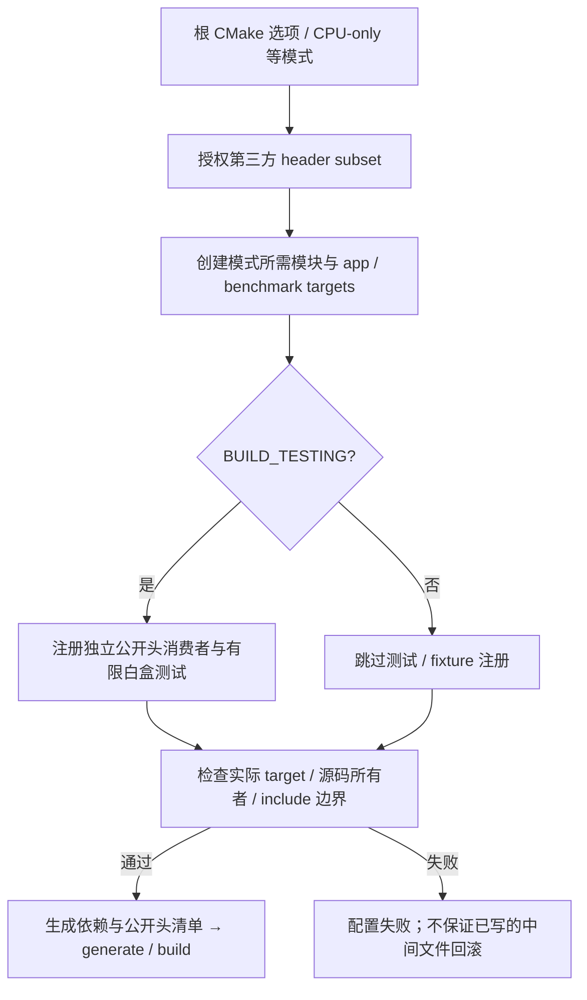

# 构建与测试边界

关联契约：[构建契约设计](构建契约设计.md)。实施依据：[M3-T0 模块软硬边界](../../../spec/M3-T0-模块软硬边界.md)。

## 当前设计

根构建负责选择游戏、CPU 模块、独立采样执行器和测试；`game/CMakeLists.txt` 只组织模块。九个模块各自声明实现、公开头根和依赖。除承载值类型的 scene 为 INTERFACE 外，其余模块均为真实 STATIC 库。启动选项单独归 app 私有的 `symocraft_startup`，供游戏和参数测试链接，不成为其他游戏模块依赖。

测试迁至根 `test/`。旧生产 `.cpp` 不再由测试重复编译；网格与生成测试改用真实 world 库和真实方块配置，去掉假的 `get_block` 和全局绘制批次。GL 单元测试仍使用既有 GLAD 函数指针替身，只验证 CPU 调用和清理契约，不能代替真实 OpenGL 运行验收。当前 SDL3 Window 实现已接入正式 platform 库；受限生产桥接探针导入该库，不重编 window.cpp 或另造窗口实现。

实现位置：[根构建](../../../../CMakeLists.txt)、[模块组织](../../../../game/CMakeLists.txt)、[统一测试入口](../../../../test/CMakeLists.txt)、[边界检查](../../../../cmake/ModuleBoundaries.cmake)。本页验收表为 T0 历史；S1 隔离及后续 S2 实施验证见 [T2 记录](../../../milestones/m3-t2/README.md)，不会把旧二进制结果当成迁移后结果，也不在本文宣布 S2/T2 通过。

### 目标与流程

输入为 Windows x64 MSVC 工具链和源码；输出为可追踪的生产目标、独立头消费者、测试程序及按需安装的游戏/执行器。

### 公开接口预期行为

| 签名 / 入口 | 调用方与可见范围 | 预期行为：输出及状态变化 | 前提 / 边界 | 失败反馈及失败后状态 | 源码 / 约束 |
| --- | --- | --- | --- | --- | --- |
| 4 个 CMake 项目集成入口 | 根构建 / 模块构建 | [构建契约权威表](构建契约设计.md#公开接口预期行为) | 四项签名与 CMake scope 分别记录 | 同目标表 | ModuleBoundaries.cmake / ThirdParty.cmake |

### 私有函数预期行为

| 签名 / 入口 | 内部调用方 | 预期行为：处理规则及副作用 | 前提 / 边界 | 失败传播及清理责任 | 源码 / 约束 |
| --- | --- | --- | --- | --- | --- |
| 4 个边界检查 helper | 集成入口 / 授权负向测试 | [构建内部权威表](构建契约设计.md#私有函数预期行为) | 无 C++ private；不扩大生产访问授权 | 同目标表 | ModuleBoundaries.cmake |

### 配置模式

| 入口 | 作用 |
| --- | --- |
| 默认配置 | 九个模块、游戏和独立 benchmark；测试取决于 `BUILD_TESTING` |
| `SYMOCRAFT_CPU_ONLY=ON` | 仅 CPU 模块、启动参数库和适用测试；不创建 GLFW、SDL3、GLAD、platform、renderer 或窗口程序 |
| `SYMOCRAFT_BUILD_GAME=OFF` | 新构建目录中默认只保留 benchmark；已有缓存中的 `SYMOCRAFT_BUILD_CPU_MODULES` 可显式关闭 |
| `SYMOCRAFT_BUILD_CPU_MODULES=ON` | 可在没有游戏程序时显式创建 CPU 库 |
| `BUILD_TESTING=OFF` | 不注册任何测试/fixture，也不查找 PowerShell 测试入口 |
| `cmake -S tools/benchmark` | 独立工具配置，仅从 `test/benchmark` 注册工具测试，不加入游戏 |
| `cmake -S test/experimental/platform-sdl3` | 显式导入同源码、同配置的正式 platform/foundation/SDL/GLAD 静态库；Vulkan 探针开关默认 OFF，启用时要求固定 SDK Include；真实窗口由单独验证入口执行，不注册进纯 CTest |

开发验证中保留的 PowerShell 脚本不是朋友运行 benchmark 的前置条件。交付仍由原生 `SymoCraftBenchmark.exe` 执行；这里的脚本只服务开发与历史兼容测试。

### 关键约束与取舍

- 每个目标公开自己的 `include/`，实现只获得自己的 `src/` 和经审核的依赖。renderer 仅额外私有获得 platform 的 `src/graphics_bridge/`，不是整个平台实现目录。
- `header-views/` 位于构建目录，只复制已授权第三方的头文件。GLM、YAML、噪声、robin_hood、图片读取、图片写出、GLAD 分开授权，不再把整个 vendor 加入搜索路径。
- 公开头的独立消费者只链接对应模块，不增加私有路径、聚合头或预编译头。每个头单独编译并链接，不能靠其他头的包含顺序补齐依赖。
- M3-T2 仅授权 platform 私有链接 `SDL3::SDL3-static`，实际生产 Window 已改为 SDL3。SDL 头只在 platform 私有实现可见，共享桥接头不能暴露 SDL；相对 vendor 包含、app/renderer/CPU 直接 SDL target 或 include path 均拒绝。静态 `LINK_ONLY` 只传递链接，不传播 SDL 编译使用要求。
- platform 私有使用 `SDL_MAIN_HANDLED` 与 SDL_SetMainReady，不要求 app 包含 SDL 主入口头。固定 SDL 静态、关闭共享库/内部测试/例子/独立安装，并保持原 MSVC CRT 策略；仅启用窗口/输入及 GL/动态 Vulkan 窗口能力。工程无自动下载，不把 SDK 或驱动打包进 vendor。
- renderer 的额外私有目录仍只为 `platform/src/graphics_bridge/`，源包含白名单为 `graphics_bridge.h`、`native_bridge.h`、`vulkan_bridge.h`。Native/Vulkan SDK 类型可进入授权私有头，SDL 头不得进入这些共享头；不允许整个平台 src、公开 SDK 类型或 app 借原生句柄绕过边界。当前 renderer 只消费 GL 桥，未来后端的 SDK 编译条件需单独明确。
- 当前 platform 编译私有 Vulkan 交接使用 SDL 原样附带的 Khronos 头路径，GL/Native 游戏构建不因此强制安装外部 SDK；显式 Vulkan 探针另用已固定 SDK Include 复测。入口来自 SDL loader，不新增 `vulkan-1.lib` 链接，也不安装 `SDL3.dll`。游戏安装 SDL3 许可；S5 已撤除 GLFW 的活动子目录配置、platform 外部授权和新安装包 GLFW 许可规则，`vendor/glfw`、`lib/glfw`、休眠源及历史/冻结包原样保留。
- 活动目标中即使未被链接的 GLFW 配置也被拒绝；检查器同时拒绝 vendor 内改名目标、任何生产 GLFW 包含、相对 vendor/lib 路径、原始/表达式 GLFW 链接和 include path。实际模式矩阵对 target/cache、已编译产物与新安装目录检查无 GLFW，独立 CPU/runner 仍不得配置 SDL。旧构建缓存/安装前缀不清洗为新证据，阶段回归使用新目录。
- [生产桥接探针](../../../../test/experimental/platform-sdl3/CMakeLists.txt)核对导入配置/源码根/静态选项与库摘要，拒绝过时 platform archive。故障替身局限于根 test 的 fixture DLL/显式探针，使用 SDL 动态入口表执行受限故障，不修改 vendor 或生产公共 API；注入结果不得冒充真实驱动故障。独立 SDL 准备探针和纯 GL 单测不能替代真实生产库运行。
- 配置检查读取真实 target 的 source/link/include 属性，并扫描生产 include。负向测试在隔离目录注入错误，再调用同一个检查器；不会修改工作区生产文件。
- 边界检查是工程约束，不是安全沙箱或完整 C++ 解析器。宏生成 include 被禁止；深层语义依赖仍需代码审查和实际消费者构建验证。
- 历史未启用的 input/event/thread-pool 实现原样归档为 app 私有 `.disabled` 文件，不参与编译；检查器拒绝把它们重新加入生产目标。

### 验收案例

以下为 T0 历史快照；T1、T2 结果分别归阶段报告，不覆盖原数字、GLFW 基线或增量编译记录。

| 状态 | 场景 | 预期行为 / 当前证据 |
| --- | --- | --- |
| [x] | CPU-only 最终复测 | 43/43 通过，含 28 个独立公开头消费者与补充的模拟契约；实际构建图无 GLFW/GLAD/窗口/渲染目标 |
| [x] | 真实生产测试链接 | world 网格、生成、配置及 telemetry 等链接正式库；生产源码清单无重复所有者 |
| [x] | 源码负向检查 | world -> renderer、simulation -> platform、模块 -> app、生产 -> test、私有跨目录和公开 YAML 均被拒绝 |
| [x] | 实际 target 负向配置 | 越界 link、宽 include、生产 test 搜索路径、公开私有头路径、重复实现、依赖环均使真正 CMake 配置失败；共 16 个源码/target 负向案例 |
| [x] | 最终 Debug / Release / CPU-only 测试 | 60/60、60/60、43/43 通过；完整配置包含 34 个独立公开头消费者 |
| [x] | 关闭测试 / 独立执行器 | 三种配置 configure/build/install 通过；安装无 fixture、测试 exe、lib、obj、pdb；独立执行器图无游戏/图形目标，其独立 CTest 5/5 通过 |
| [x] | 私有/公开头增量编译 | 私有 batch：renderer 1、world/simulation/app 0；共享 mesh：world 4、simulation 2、renderer 2、app 1；均重链接，原内容和时间戳恢复 |

环境为 Windows x64、MSVC 19.38、CLion 附带 CMake/Ninja。最终日志：[Debug](../../../milestones/m3-t0/evidence/full-debug-final-ctest.log)、[Release](../../../milestones/m3-t0/evidence/full-release-final-ctest.log)、[CPU-only](../../../milestones/m3-t0/evidence/cpu-debug-final-ctest.log)、[独立执行器](../../../milestones/m3-t0/evidence/standalone-runner-final-ctest.log)、[构建矩阵](../../../milestones/m3-t0/evidence/matrix.log)、[增量编译结果](../../../milestones/m3-t0/evidence/incremental.json)。整体验收与交付身份见 [M3-T0 报告](../../../milestones/m3-t0/README.md)。

可复用验证入口为 [VerifyBuildMatrix.cmake](../../../../test/integration/VerifyBuildMatrix.cmake) 和 [CheckIncrementalBuild.ps1](../../../../test/integration/CheckIncrementalBuild.ps1)，需要 MSVC x64 开发环境；后一入口只触碰并恢复两个头文件的时间戳。它们不随 benchmark 玩家包部署，也不是运行游戏的必要条件。

迁移前源码哈希、工作区状态和测试列表在 [pre-migration](../../../../out/m3-t0/archive/delivery/evidence/pre-migration/)。迁移前沙箱中的三个文件/子进程测试曾受访问限制失败，批准沙箱外复测全部通过；没有放宽测试断言。最终记录由 M3-T0 总验收报告汇总，二进制和完整构建输出不放入 docs。

### 既有 T0 实现与验收

T0 构建迁移、实际边界约束及相应验证保留为历史基线；当前 SDL3 依赖/桥接授权增量已并入当前设计。本页不替代 T2 的生产窗口、游戏运行、硬件输入或用户手动玩法验收记录。

## 本次变更

T1 的 world 移除 robin_hood 依赖、增加 BlockDefinition 公开头与 World/Mesher 实现；simulation 的 World 类型依赖改为 PUBLIC。世界契约/真实分配故障测试链接正式库，新增 World→旧 Batch 空发布组合测试仍使用 GL 替身。矩阵与独立头消费者结果、普通 MSVC Debug 分配扫描的禁用原因及全库一致的专用配置，统一见 [T1报告](../../../milestones/m3-t1/README.md#构建与故障扫描)。

2026-10-07 同步 T2 已写入源码的 SDL3 私有依赖与三份桥接白名单、静态/入口/许可和显式生产库探针边界。S1 验证结果仍由 T2 记录维护；新 `core.cleanup_sequence` 是不链接 application.cpp/SDL 的 app 私有纯 CPU 清理测试，不将其通过当作窗口/GPU 故障矩阵通过。本文不写 S2 验证结论。

2026-10-08 同步 S5 的活动 GLFW 配置/许可退役及禁止重新接入约束。生产检查器的隔离正负向案例从 45 增至 61（新增 16 项 GLFW 退役检查），CMake 3.22.6 实际配置检查 61/61 通过；首次夹具的错误文字换行匹配失败保留在 `out/m3-t2/s5/dependency-retirement-boundaries-001`，只调整预期诊断片段后在新目录 `dependency-retirement-boundaries-002` 复测通过，没有放宽生产拒绝条件。全模式构建/安装与 T2 整体验收由 [T2 记录](../../../milestones/m3-t2/README.md)汇总，不能由此宣布硬件验证、Y9000P 或 T2 通过。

## 后续考虑

| 触发条件 | 再考虑的变化 |
| --- | --- |
| 增加图形后端 | renderer 内部新增目标，并同步授权表和 CPU-only 图检查，不扩大公共 include |
| 新增跨模块数据类型 | 明确所有者与公开使用要求后，增加独立消费者和失败用例 |
| 私有白盒路径扩大 | 先确认是否应通过公共契约测试；不得把测试便捷路径传播给生产目标 |
