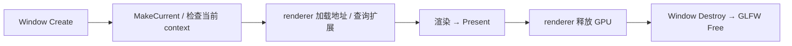

# Platform 独立采样与图形桥接 API

## 当前设计

从 [功能笔记](Platform-窗口与输入-功能.md)分离函数契约；Window 对象/输入职责见 [Window](Window-类设计.md)。本篇不建立 Platform 实例，不拥有或缓存 Window，不公开 native handle。2026-10-06 源码核对，未新增运行验收。

### 状态与值

`ProcessMemory` 为两个默认空的 optional<uint64_t>：working_set_bytes/private_bytes，字节单位，可独立复制/移动，不拥有 OS handle。`GraphicsBridge::Procedure` 为函数指针别名，不代表持有设备资源。上下文由 Window/GLFW 持有；bridge 仅同步适配。

### 公开接口预期行为

| 签名 / 入口 | 调用方与可见范围 | 预期行为：输出及状态变化 | 前提 / 边界 | 失败反馈及失败后状态 | 源码 / 约束 |
| --- | --- | --- | --- | --- | --- |
| `ProcessMemory SampleProcessMemory()` | process_memory.h 公开；app | 当前进程查询成功时填 working set/private bytes，返回自有值 | Windows 实现，无 Window/GPU 依赖 | OS 调用失败两项为空，不补零、不抛 OS 异常 | [process_memory.cpp](../../../../game/modules/platform/src/process_memory.cpp) |
| ProcessMemory 成员函数：不适用 | 值消费者 | 无显式函数；optional 值构造/复制/移动 | 不借用 OS 缓冲 | 无本类型校验/清理函数 | [process_memory.h](../../../../game/modules/platform/include/symocraft/platform/process_memory.h) |

### 私有函数预期行为

六项为 GraphicsBridge 的 struct public static，因位于受限内部共享头而列在内部表。实现见 [window.cpp](../../../../game/modules/platform/src/window.cpp)，声明见 [graphics_bridge.h](../../../../game/modules/platform/src/graphics_bridge/graphics_bridge.h)。GLFW 失败通常经错误 callback 诊断，不统一抛异常或返回成功值。

| 签名 / 入口 | 内部调用方 | 预期行为：处理规则及副作用 | 前提 / 边界 | 失败传播及清理责任 | 源码 / 约束 |
| --- | --- | --- | --- | --- | --- |
| `MakeCurrent(Window&)` | Window::Create / renderer | glfwMakeContextCurrent 当前化借用窗口 | Window native 有效；主线程 | 不验证结果；Create 自己检查当前 context | window.cpp / [Window I5](Window-类设计.md#不变量) |
| `HasCurrentContext()` | renderer | 当前 context 非空返回 true | GLFW 有效；不判断设备能力 | false 不自动修复 context | window.cpp |
| `GetProcedure(const char*)` | renderer GLAD 加载 | 返回 glfwGetProcAddress 函数地址 | 有效名字/当前 context，借用函数地址 | 可为 null；GLAD/renderer 决定失败 | window.cpp |
| `ExtensionSupported(const char*)` | renderer 设备能力 | 返回 GLFW 扩展查询 bool | 合法扩展名、当前 context | false 不区分所有错误原因 | window.cpp |
| `SetVsync(bool)` | Create / renderer | swap interval 设 1/0 | 当前 context 有效 | 无 bridge 成功值；不保证驱动实际呈现策略 | window.cpp |
| `Present(Window&)` | renderer | 交换窗口 buffers，不保存 Window | native/context 有效；主线程 | 无统一成功值/恢复，owner 仍负责寿命 | window.cpp / Window I5 |

### 调用与清理

图表示 app 的同步生命周期前提，bridge 不增加顺序检查或资源回滚。SampleProcessMemory 独立采样后由 app 交 telemetry；没有隐含 GPU/输入状态读取。

## 本次变更

无。仅将已有函数契约从功能入口分离，不增加实现。

## 后续考虑

多窗口/后端扩展需另定实际访问授权及 context 生命周期；不能用 bridge 绕过模块边界。历史验证仍见 [功能验收](Platform-窗口与输入-功能.md#验收案例)，创建失败与 callback 分配失败未专项注入。
