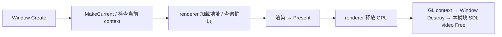

# Platform 独立采样与图形桥接 API

## 当前设计

从 [功能笔记](Platform-窗口与输入-功能.md)分离函数契约；Window 对象/输入职责见 [Window](Window-类设计.md)。本篇不建立 Platform 实例，不拥有或缓存 Window，不向 app 公开 native handle。2026-10-07 按实际 SDL3 源码同步；实施验证以 [T2 记录](../../../milestones/m3-t2/README.md)为准，不把接口已经实现写作 S2/T2 通过。

2026-10-08 [T2-S4 平台交接](../../../milestones/m3-t2/s4-platform-handoff.md) 核对当前实际 `SymoCraft::Window`、三种模式、借用期、像素与 loader 约定；独立公开头/三桥接声明及私有授权测试另行留证。S3 可运行包已冻结，Y9000P 暂缓；交接不替代 T2 最终验收或 T3 Renderer v1 冻结。

### 状态与值

`ProcessMemory` 为两个默认空的 optional<uint64_t>：working_set_bytes/private_bytes，字节单位，可独立复制/移动，不拥有 OS handle。`GraphicsBridge::Procedure` 为函数指针别名，不代表持有设备资源。SDL 系统窗口和 GL context 由 Window 分别持有；bridge 只同步适配。Native 的 HWND 为借用，Vulkan 的扩展名以 `vector<string>` 自有副本返回；instance/surface 仍由探针或后续 renderer 后端拥有。

### 公开接口预期行为

| 签名 / 入口 | 调用方与可见范围 | 预期行为：输出及状态变化 | 前提 / 边界 | 失败反馈及失败后状态 | 源码 / 约束 |
| --- | --- | --- | --- | --- | --- |
| `ProcessMemory SampleProcessMemory()` | process_memory.h 公开；app | 当前进程查询成功时填 working set/private bytes，返回自有值 | Windows 实现，无 Window/GPU 依赖 | OS 调用失败两项为空，不补零、不抛 OS 异常 | [process_memory.cpp](../../../../game/modules/platform/src/process_memory.cpp) |
| ProcessMemory 成员函数：不适用 | 值消费者 | 无显式函数；optional 值构造/复制/移动 | 不借用 OS 缓冲 | 无本类型校验/清理函数 | [process_memory.h](../../../../game/modules/platform/include/symocraft/platform/process_memory.h) |

### 私有函数预期行为

GraphicsBridge 六项签名保留，按 Q02 已选方案1为必要失败补具名异常，不新增公开 BridgeResult。实现见 [window.cpp](../../../../game/modules/platform/src/window.cpp)，声明见 [graphics_bridge.h](../../../../game/modules/platform/src/graphics_bridge/graphics_bridge.h)。struct 的 public static 不等于模块公开 API；只通过授权私有头供 renderer 使用，SDL 头不得出现在这些共享头中。

| 签名 / 入口 | 内部调用方 | 预期行为：处理规则及副作用 | 前提 / 边界 | 失败传播及清理责任 | 源码 / 约束 |
| --- | --- | --- | --- | --- | --- |
| `MakeCurrent(Window&)` | Window::Create / renderer | checked SDL 当前化，核实当前 window/context 均为请求对象 | 活 OpenGL 窗口、Window Init 有效、主线程 | 非 GL/销毁窗口/当前化失败具名抛错，不继续 GLAD/绘制 | window.cpp / [Window I5](Window-类设计.md#不变量) |
| `HasCurrentContext()` | renderer | 本模块未 Init 或当前 context 为空时合法 false | 已 Init 时主线程；不判断设备能力 | false 是合法无 context，不是失败或自动修复；必要操作另行检查 | window.cpp |
| `GetProcedure(const char*)` | renderer GLAD 加载 | 经 SDL 获取 GL 函数地址，不保存 SDK 借用字符串 | 有效非空名字、当前 context、主线程；地址不延长窗口/context/loader 寿命 | 允许空地址交 GLAD 判断必需/可选；无 context 或无效名字另行抛错 | window.cpp |
| `ExtensionSupported(const char*)` | renderer 设备能力 | 校验必要 GL 查询入口、GL version、extension 枚举及 GL 错误；合法不支持或 SDL hint 禁用返回 false | 有效扩展名、当前 context；不以 SDL 的 false 单独推定查询成功 | 无 context、无效名、入口/GL 查询失败具名抛错，与合法 unsupported 分开 | window.cpp |
| `SetVsync(bool)` | Create / renderer | checked interval 1/0，并读取实际 interval 核对 | 当前 context 有效、主线程 | 设置/读取失败或实际值不符具名抛错，不静默沿用旧设置生成 Benchmark 成绩；不承诺物理显示器呈现时序 | window.cpp |
| `Present(Window&)` | renderer | checked SDL 交换缓冲，不保存 Window | 活 OpenGL 窗口，且本窗口/context 当前；主线程 | 失败具名抛错并停止正常帧提交，owner 仍负责清理 | window.cpp / Window I5 |

### Native 与 Vulkan 私有桥接

两个新增授权头为 [native_bridge.h](../../../../game/modules/platform/src/graphics_bridge/native_bridge.h) 和 [vulkan_bridge.h](../../../../game/modules/platform/src/graphics_bridge/vulkan_bridge.h)。前者仅在私有接口引入 Windows 类型，后者使用 `VK_NO_PROTOTYPES` 和 Vulkan 类型；都不含 SDL 头，不向 app/CPU 模块提供逃生口。当前 renderer 仍只使用 GL 桥，不表示已经实现 D3D12/Vulkan 游戏后端。

| 签名 / 入口 | 内部调用方 | 预期行为：处理规则及副作用 | 前提 / 边界 | 失败传播及清理责任 | 源码 / 约束 |
| --- | --- | --- | --- | --- | --- |
| `NativeBridge::GetHandle(Window&) -> HWND` | 平台 Benchmark 策略 / 授权探针 / 后续后端 | 读取 SDL window 属性并检查有效 Win32 HWND；可借用三种用途的活窗口 | video 有效、主线程；借用至 Window Destroy，不调用 DestroyWindow | 无有效属性/句柄具名失败，不额外创建或拥有窗口 | window.cpp / native_bridge.h |
| `VulkanBridge::GetInstanceProcedureAddress(Window&) -> PFN_vkGetInstanceProcAddr` | 授权 Vulkan 探针 / 后续后端 | 入口唯一来自 SDL Vulkan loader | 活 Vulkan 用途窗口、主线程；不得缓存后越过窗口/loader 寿命调用 | 无 loader 入口具名抛错，不改用 import lib | window.cpp / vulkan_bridge.h |
| `VulkanBridge::GetRequiredExtensions(Window&) -> vector<string>` | 同上 | 取得必需扩展并立即复制成自有字符串 | 活 Vulkan 窗口；名称副本不延长 loader/窗口寿命 | 查询/复制失败具名抛错，不返回误导空扩展集合 | window.cpp |
| `VulkanBridge::CreateSurface(Window&, VkInstance, const VkAllocationCallbacks* = nullptr) -> VkSurfaceKHR` | 同上 | 通过 SDL 在借用 instance 上创建 caller-owned surface | 活 Vulkan 窗口、非空有效 instance、匹配分配回调；instance 来自同一 loader | 失败具名抛错；成功 surface 由调用方保存及逆序销毁，不归 Window | window.cpp |
| `VulkanBridge::DestroySurface(Window&, VkInstance, VkSurfaceKHR, const VkAllocationCallbacks* = nullptr)` | surface owner | 通过 SDL 销毁借用 surface；空 surface 为无操作 | 活 Vulkan 窗口、有效 instance、成对一致 allocator；销毁在 instance/window 前 | 非空 surface 的 instance 前置错误具名拒绝；参数按值，不替 owner 清空句柄或保证重复销毁非空 handle 安全 | window.cpp |

SDL 创建 Vulkan 窗口时加载 Vulkan 库，销毁该窗口时释放对应加载责任。因此调用方必须先结束相关在途 GPU 工作，再释放 surface/device/instance，最后 Window 和本模块 video；所有 Vulkan 入口调用都在 loader 有效期内。不额外 SDL_Vulkan_UnloadLibrary，不把静态 SDL 推导为静态 Vulkan loader；GL/Native 启动不创建 Vulkan 标志窗口、不要求 Vulkan SDK/驱动。显式 Vulkan 测试的 SDK 头源、构建身份与真实结果单独进入 T2 记录。

### 调用与清理

图表示 app 的同步 GL 生命周期，bridge 校验前提但不拥有 GPU，也不代替后端恢复交换链。运行主错误先保留；app 每段清理故障单独诊断并继续释放，不能以二次清理错误覆盖主错误。SampleProcessMemory 独立采样后由 app 交 telemetry，没有隐含 GPU/输入状态读取。

## 本次变更

2026-10-07 同步 SDL3 的六项 checked GL 入口、合法 unsupported/null 与故障的区别，以及新 Native/Vulkan 私有桥接的借用和 loader 寿命。不在本文填写 S2 通过结论。

## 后续考虑

T3 在独立后端实验后冻结设备、交换链、GPU 同步与恢复策略，不由这三个窄桥接提前实现完整 RHI。多窗口扩展仍需另定实际访问授权及 context 生命周期，不能绕过模块边界。GLFW 的历史验证见 [功能验收](Platform-窗口与输入-功能.md#验收案例)，不自动成为 SDL 新失败矩阵的证据。
