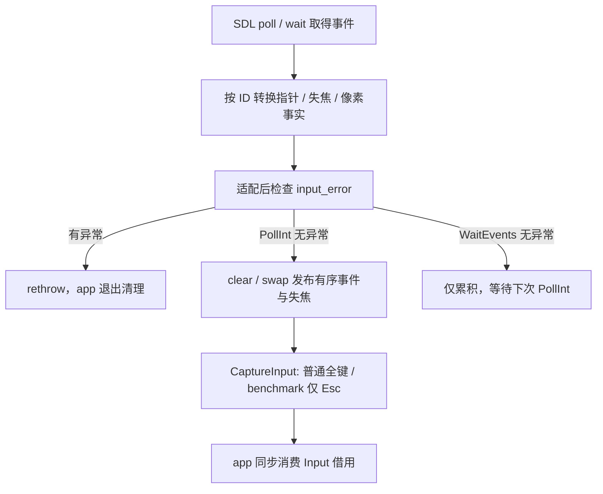

# Window 与平台协作者

关联功能：[窗口与输入](Platform-窗口与输入-功能.md)。

历史验证：[M3-T0 交付与验收报告](../../../milestones/m3-t0/README.md)。当前 SDL3 实施与验证状态见 [M3-T2 记录](../../../milestones/m3-t2/README.md)，本页仅描述已写入源码的契约，不声明 S2 或 T2 验收通过。

## 当前设计

`Window` 管理 SDL3 系统窗口与按需 GL context，`Impl` 隔离 SDK 和输入状态；`GraphicsBridge`、`NativeBridge`、`VulkanBridge` 是不拥有调用方图形资源的私有静态适配。`ProcessMemory` 是独立采样值，不依赖 telemetry。保持现有 app 静态 Init/Free 与 `unique_ptr<Window>` 路径，不新增 Runtime 管理器。

### 数据成员

| 类型 | 成员 | 初值 / 范围 | 含义与所有权 |
| --- | --- | --- | --- |
| `unique_ptr<Impl>` | `impl_` | 构造时分配 | Window 独占，公开头无需 SDK |
| `SDL_Window*`，私有 | `Impl::native` | null / 有效窗口 | Window 独占，不对外暴露 |
| `SDL_GLContext`，私有 | `Impl::context` | null；仅 OpenGL 模式创建 | 和系统窗口分别拥有，先于窗口销毁 |
| `WindowMode` | `Impl::mode` | OpenGL / Native / Vulkan | Create 时确定用途；不在运行中切换后端 |
| `HWND`，私有 | `Impl::non_rude_window` | null / 本窗口借用句柄 | 仅 Benchmark 保存已设置 `NonRudeHWND` 的窗口，移除属性后清空 |
| `int` | `width/height` | 0 / 实际绘制像素 | Create、SetSize 及尺寸/最小化事件后查询 SDL 像素，不直接采用请求值 |
| `unique_ptr<InputState>`，私有 | `Impl::input` | 创建成功前为空 | 独占中立快照、物理按住态、短按锁存与保序双缓冲；公开只借用快照 |
| `exception_ptr` | `Impl::input_error` | 空 | 保存具名输入适配错误，立即在受控 C++ 边界抛出，不发布成功空快照 |
| `bool` / 计数 / 时间基准，TU 私有 | `initialized/active_windows/timer_origin/timer_frequency` | false / 0 | 本模块只取得一次 video 初始化责任；当前最多一个 platform 窗口 |

### 不变量

| 编号 | 条件 | 成立边界 |
| --- | --- | --- |
| I1 | `native` 非空期间 `impl_` 存活；创建中途失败不发布 Window | Create 局部 owner 至 Destroy 完成 |
| I2 | Destroy 清空 context/native/输入与像素状态，重复调用不再销毁；清理诊断不阻断余下释放 | 正常或已完成资源回收后抛错的清理边界 |
| I3 | 每个映射 scancode 采样一次，短按锁存每次 Capture 消费一次；指针事件保序交换复用 | PollInt / CaptureInput / ResetInput 返回 |
| I4 | SDL 事件只转换平台事实，不访问 simulation/renderer；公开接口不泄漏 SDK | 编译及源码边界；无游戏状态 C callback |
| I5 | 主线程单窗口；本模块 video 责任覆盖 Window，renderer/借用 surface 先于 context/window 释放 | app 控制的同步运行期；Free 拒绝活 platform 窗口 |

### 接口与生命周期

### 公开接口预期行为

全部定义见 [window.h](../../../../game/modules/platform/include/symocraft/platform/window.h)、[window.cpp](../../../../game/modules/platform/src/window.cpp)。涉及活窗口/video 的操作由 app 主线程同步调用；必要 SDL 操作失败以拥有文字的具名异常报告，不隐式换模式或降低 GL/MSAA 要求。公开 `WindowMode` 是项目枚举，不是 SDL 标志。

| 签名 / 入口 | 调用方与可见范围 | 预期行为：输出及状态变化 | 前提 / 边界 | 失败反馈及失败后状态 | 源码 / 约束 |
| --- | --- | --- | --- | --- | --- |
| `Window()` | 模块公开类 | 分配空 Impl；native/context/input 为空 | 不自动 Init/Create；实际窗口通过工厂创建 | 分配异常上抛，成员自动清内存 | window.cpp |
| `~Window() noexcept` | owner | best-effort Destroy，释放 Impl | GPU/借用 surface 已释放，video 尚有效 | 捕获并具名输出清理故障，不抛出、不结束 video；不替代正常 checked Destroy | I1/I5 |
| `Window(const Window&) = delete` | 禁止 | 禁止复制 | 唯一资源所有者 | 编译不通过 | window.h / I1 |
| `operator=(const Window&) = delete` | 禁止 | 禁止赋值 | 不提供移动成员 | 编译不通过 | window.h / I1 |
| `Init()` static | app 启动 | 私有 SDL_MAIN_HANDLED/SetMainReady；取得一次 SDL video 责任和性能计数器基准 | 主线程；重复 Init 不增本模块持有次数 | 初始化失败具名抛错，未发布 initialized；计时器异常时释放刚取得的 video 责任 | window.cpp |
| `Free()` static | app 结束 | 仅释放本模块取得的 `SDL_QuitSubSystem(SDL_INIT_VIDEO)` 责任；重复安全 | 全部 platform 窗口及借用 GPU 对象已释放 | 活窗口或错误线程具名拒绝，不全局 SDL_Quit、不结束其他持有者责任 | I5 |
| `Create(const char*, int=0, int=0, bool=false, bool=false, WindowMode=WindowMode::OpenGL)` static | app | 三种用途分别建 GL、无图形标志或 Vulkan 窗口；返回**拥有的裸指针**，app 立即接管 unique_ptr | Init 后，当前无 platform 窗口；有效 title/模式；非正尺寸用主显示器一半及 800×600 下限 | 中途异常由局部 owner 先清 context 再窗口；不发布半初始化对象，不回滚全局 SDL hints | window.cpp / I1/I5 |
| `PollInt()` | app 每帧 | 排空本轮 SDL 事件，按窗口 ID 适配并处理全局退出；成功后 clear/swap 保序事件及失焦事实 | 窗口存活；更新旧 Input 借用内容 | SDL/输入适配故障具名抛出，不继续模拟，不发布成功空快照 | window.cpp / I3 |
| `CaptureInput()` | app 模拟计时内 | 对焦且非最小化时同步 scancode/鼠标物理态，再消费短按锁存；Benchmark 只采用 Escape | native 有效；不复制事件 vector，未失焦窗口才采纳全局物理输入 | input_error 仍抛出；不是错误恢复器 | window.cpp / I3 |
| `Input() const` | app 短期借用 | 返回 InputState 内 InputSnapshot const 引用 | 活窗口；Poll/Capture/Reset 更新内容，事件元素可失效 | 未 Init/已销毁时具名拒绝 | window.cpp / I1/I3 |
| `Focused() const` | app | 查询 SDL_WINDOW_INPUT_FOCUS | 活窗口时主线程；销毁后 false | 前置条件错误具名拒绝 | window.cpp |
| `Minimized() const` | app | 查询 SDL_WINDOW_MINIMIZED | 活窗口时主线程；销毁后 false | 前置条件错误具名拒绝 | window.cpp |
| `ShouldClose() const` | app | 窗口为空或已累积关闭请求时 true | 销毁后也允许；活窗口时主线程 | 关闭事件不自行销毁图形对象 | window.cpp / I2 |
| `Close()` | app 退出请求 | 标记关闭请求 | 主线程，不立即销毁 | native 空时无操作 | window.cpp |
| `Destroy()` | owner / 析构兜底 | context→NonRude 属性→窗口；清空输入、像素及活窗口计数，重复安全 | GPU/surface 先释放，video 仍有效，主线程 | SDK/Win32清理失败仍继续释放，保留首故障并单独记录次级故障；完成回收后再抛首故障 | window.cpp / I2/I5 |
| `ResetInput()` | app 暂停/恢复 | 清快照、短按、待发布事件/失焦标志，恢复首运动基准；活跃重置后仍可再次同步物理按住态 | native 有效 | 不清 input_error；失焦/最小化时清 held，不把错误变成功输入 | input_state.h |
| `WaitEvents(double timeout_seconds)` | app 暂停 | 秒转毫秒：正小值向上取整，最大 INT_MAX，零不等待；首事件及后续事件走同一适配路径 | 有限非负超时、活窗口、主线程；仅累积，不主动发布 Input | timeout 合法；SDL/适配错误具名抛出；首关闭/失焦事件不被吞掉 | window.cpp |
| `SetCursorMode(CursorMode)` | app | Lock 启用相对模式并隐藏；Hidden 退出相对模式并隐藏；Normal 退出相对模式并显示；随后 ResetInput | native 有效；固定已选 SystemScale=1 | 非法枚举或 SDL 失败具名抛出，不宣称切换成功 | window.cpp |
| `SetTitle(const char*)` | app | SDL 设置标题，不缓存输入字符串 | native / 非空字符串有效 | checked SDL 操作失败具名抛出 | window.cpp |
| `SetSize(int, int)` | app | 设置逻辑窗口尺寸，再查询实际绘制像素到 width/height | 正尺寸；不把参数改成像素语义 | 非法尺寸/SDL 失败具名抛出，不用请求值伪造 framebuffer | window.cpp |
| `GetAspectRatio() const` | app | max(width,1)/max(height,1) | 字段为 framebuffer；零/负值也返回 fallback 比例，不代表可绘制 | 无异常 | window.cpp |
| `Time()` static | app | 性能计数器相对本次 Init 基准的秒值；Init 前/Free 后为 0 | 初始化期间单调；重新 Init 重置起点 | 不替换 Benchmark 的独立 CPU/GPU 采样时钟 | window.cpp |
| `InputSnapshot::Down(Key) const` | app；公开数据成员方法 | 按索引返回键值 | 必须有效枚举；值复制深拷贝事件 vector | 不检查越界，非法值无恢复保证 | window.h |
| `KeySampling::Snapshot::Down(Control) const` | CPU 消费者 | 按索引返回 pressed | 必须有效枚举；纯值复制 | 不检查越界 | [key_snapshot.h](../../../../game/modules/platform/include/symocraft/platform/key_snapshot.h) |
| `template<class ReadKey> KeySampling::Capture(ReadKey&&)` | CPU 消费者；历史 GLFW CaptureInput | 顺序遍历所有 Control，每项调用 read_key 一次，返回自有 Snapshot | callback 同步使用，不保留；不得以短路跳过键；SDL Capture 使用私有 InputState | callback 异常上抛，外部读键副作用不回滚 | key_snapshot.h / I3 |

### 私有函数预期行为

以下为 Impl、TU helper 与私有 InputState。事件适配在受控 C++ 调用边界内进行，不注册修改 ECS/相机的 SDL C callback。

| 签名 / 入口 | 内部调用方 | 预期行为：处理规则及副作用 | 前提 / 边界 | 失败传播及清理责任 | 源码 / 约束 |
| --- | --- | --- | --- | --- | --- |
| `Failure/Require` | 必要 SDL 操作 | 立即复制 SDL 错误到具名 runtime_error | 不缓存借用 SDL_GetError 指针 | 调用方抛出；失败创建或 app 统一清理负责回收 | window.cpp |
| `RequireVideo/RequireCurrentContext` | Window / GL 桥 | 检查本模块 Init、主线程及必要当前 context | 合法无 context 与必要操作失败分开 | 前置条件具名拒绝，不继续 GLAD/呈现 | window.cpp |
| `ConfigureOpenGL/VerifyOpenGL` | OpenGL Create | 请求 4.6 Core、4x MSAA、Debug；校验 SDL 参数及真实驱动 version/profile/flags/samples | GL context 已取得且当前；请求缓存不是实际属性证明 | 查询或规格不符抛错；不降级继续 | window.cpp |
| `Impl::RequireNative/RequireMode` | Window / 三种桥接 | 检查活窗口及用途 | 普通 HWND 借用可用于三种窗口；GL/Vulkan 操作只接受匹配用途 | 已销毁/不兼容用途具名拒绝 | window.cpp |
| `Impl::Handle/CheckInputError` | PollInt / WaitEvents | 自窗口像素事件更新尺寸；InputState 转换事件、保持首适配错误 | 过滤窗口 ID，接受全局退出；不提交图形命令 | 输入分配异常具名保存后立即抛出；停止当前调用 | window.cpp / I3/I4 |
| `Impl::SynchronizeInput` | CaptureInput | 焦点/最小化与 reducer 一致才采纳全局物理态，逐 scancode 读取一次 | 排空事件后、Capture 前 | 不采纳其它未聚焦窗口的全局 held state | window.cpp / input_state.h |
| `InputState::Handle/PublishEvents/CaptureKeys/ResetInput` | Impl | 按住态与短按锁存分离；保序双缓冲；重复 key-down 不制造短按；恢复首运动丢弃基准 | 私有 SDL event 输入，中立 InputSnapshot 输出 | 扩容可抛，不承诺绝对零分配；不提供回放系统 | input_state.h |

持有者为 app 的 `unique_ptr<Window>`，不可拷贝或移动。正常退出先结束 Run 的局部 GPU 对象，再释放 renderer、context、系统窗口和本模块 SDL video 责任；[app 清理路径](../../../../game/app/src/application.cpp) 每段故障仍继续余下释放，[main 错误出口](../../../../game/app/src/main.cpp) 不让清理故障覆盖主运行错误。Vulkan surface/instance 由探针或后续后端先释放，不由 Window 管理。无后台窗口线程或销毁后任务。

实现：[window.h](../../../../game/modules/platform/include/symocraft/platform/window.h)、[window.cpp](../../../../game/modules/platform/src/window.cpp)。

### 既有迁移与验证

以下为 GLFW 的 T0 历史事实，不作为当前 SDL3 实测：T0 移除公开 `void* window_ptr`，把 app 中 GLFW callback 迁到 Impl；平台 glViewport、GLAD 与设备查询职责迁给 renderer。不新增多窗口抽象或输入回放机制。

历史验收位置：[功能验收表](Platform-窗口与输入-功能.md#验收案例)。当时公开头与边界、正常/资源错误退出、Benchmark 失焦及用户确认的切出/恢复有证据；强制创建失败、callback 分配失败、Benchmark 主动最小化/改尺寸未作当轮专项注入。T2 新增失败、硬件输入与双机要求以阶段记录单独确认，不覆盖这些基线。

### Window Impl

Window::Impl 独占 SDL native、按需 GL context、InputState 与 input_error；用途和 Benchmark 策略在 Create 确定。取得系统窗口后活窗口计数加一，所有后续创建失败由局部 Window owner 清理；Destroy 只减一次计数。HWND 是同一窗口的借用，不额外拥有 Win32 系统窗口。

### InputState

[input_state.h](../../../../game/modules/platform/src/input_state.h) 从已选准备候选移植至真实 platform 私有实现。11 个 Key 对应 SDL scancode；down 与 pressed 分离，短按/同帧按放采样一次。按钮为 held 采样，不额外增加 sticky 点击。失焦/最小化清 held，focus_lost 延迟到 Poll 发布；恢复及模式切换重置首运动。双 vector 各 reserve(64)，mouse xrel/-yrel 为右/上正向，wheel 翻转标志统一方向，逐事件保序，不先合并裁剪。等待仅累积，下次 Poll 发布。

S3 在 Poll/Wait 排空后及 Capture/Reset 内，以真实 SDL flags 收敛焦点/最小化事实，遗漏恢复事件不会让适配器永久拒绝输入；转换清旧缓冲并保留一次待发布失焦。键鼠物理重同步仍只在 Capture 的模拟计时边界内执行，不在后台采集全局按键。Benchmark 的本窗口未消费 Escape 锁存跨失焦保留（两种事件先后次序均覆盖）；最小化仍清锁存并由 app 判无效。创建 Window/Impl 或输入缓冲分配失败具有 owner 诊断，Poll/Wait 扩容失败保存嵌套原因，立即停止发布，后续 Capture 重抛；测试覆盖与剩余硬件限制见 [S3 记录](../../../milestones/m3-t2/README.md#s3-输入与窗口行为)，不把合成结果升级为人工通过。

### PointerEvent

double mouse_dx/mouse_dy/scroll_y=0；向右/向上中立增量。SDL 事件适配逐条 push，发布顺序有意义，不能先合并再逐项裁剪。

### InputSnapshot

array<bool,Key::Count> keys 全 false，left_button/right_button/focus_lost=false，vector<PointerEvent> pointer_events 自有事件；Down(Key) 按枚举索引，不检查任意强转非法枚举。Window::Input const 引用仅短期消费，下一 PollInt/CaptureInput/ResetInput 会更新内容。

### KeySampling Snapshot

KeySampling::Snapshot：array<bool,Count> pressed；Capture 遍历 Control 的每项一次，保留 CPU 纯值契约与历史 sticky 采样基线。当前 SDL 输入由 InputState 负责，未用这个纯 helper 代替真实 SDL 事件/物理采样。Down 同样要求有效枚举，不拥有平台 handle。
[源码](../../../../game/modules/platform/include/symocraft/platform/key_snapshot.h)。

### 关联平台值

[GraphicsBridge/ProcessMemory](Platform-窗口与输入-功能.md#graphicsbridge)在功能笔记覆盖，不列作 Window 成员或实例类。更多对象见 [覆盖清单](../对象笔记覆盖清单.md)。

## 本次变更

2026-10-07 同步已写入的 SDL3 实现、WindowMode 默认末参、video/三模式所有权、checked 清理与私有输入候选移植。这里只更新当前设计，S2 运行结果与 T2 验收均由阶段记录另行汇总。

## 后续考虑

| 触发条件 | 再考虑的变化 |
| --- | --- |
| S3 输入与硬件验证 | 补全真实 platform 事件故障、held/Reset、切出释放、布局、DPI/任务栏证据，不改变已选手感 |
| 后续多窗口或输入回放要求 | 另定所有权与事件调度；当前单窗口私有 InputState 不自动成为公开回放框架 |
