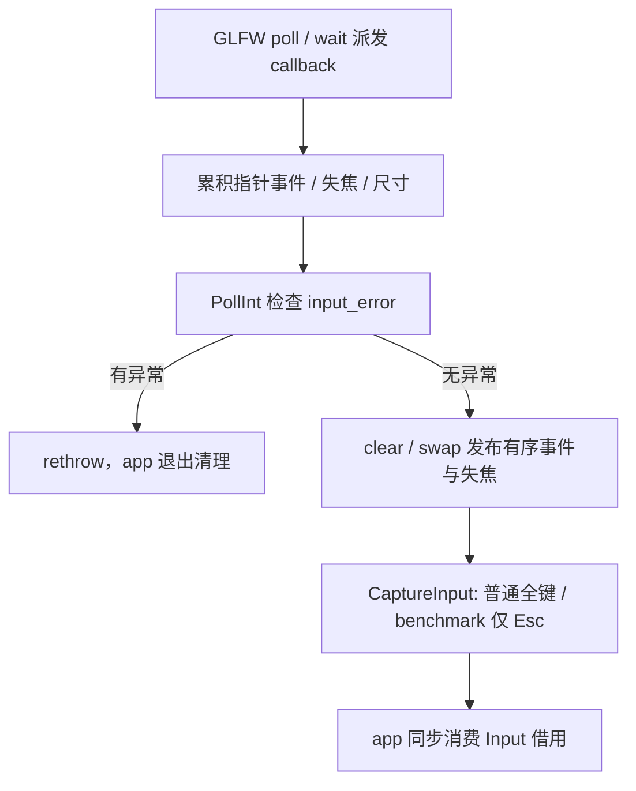

# Window 与平台协作者

关联功能：[窗口与输入](Platform-窗口与输入-功能.md)。

最终验证：[M3-T0 交付与验收报告](../../../milestones/m3-t0/README.md)。

## 当前设计

`Window` 管理系统窗口，`Impl` 隔离 SDK 和 callback 状态；`GraphicsBridge` 是私有静态适配，不拥有窗口；`ProcessMemory` 是独立采样值，不依赖 telemetry。

### 数据成员

| 类型 | 成员 | 初值 / 范围 | 含义与所有权 |
| --- | --- | --- | --- |
| `unique_ptr<Impl>` | `impl_` | 构造时分配 | Window 独占，公开头无需 SDK |
| `GLFWwindow*`，私有 | `Impl::native` | null / 有效窗口 | 唯一销毁责任；不对外暴露 |
| `int` | `width/height` | 0 / framebuffer 像素 | callback 更新；零尺寸可表示暂不可绘制 |
| `InputSnapshot` | `Impl::input` | 键全 false，事件空 | 最近 PollInt 结果；公开借用，不全量复制 |
| `vector<PointerEvent>` | `pending_pointer_events` | reserve 64 | 保序记录，和快照事件 vector 交换复用容量 |
| `exception_ptr` | `input_error` | 空 | callback 分配失败的延迟错误，从 PollInt 安全抛出 |
| `bool` | `first_cursor/pending_focus_loss` | true / false | 抑制首个鼠标跳跃，发布失焦事实 |

### 不变量

| 编号 | 条件 | 成立边界 |
| --- | --- | --- |
| I1 | `native` 非空期间 Window 地址稳定且 `impl_` 存活 | 注册 callback 至 Destroy 完成 |
| I2 | Destroy 后 `native == nullptr`；重复 Destroy 不再调用系统销毁 | 清理返回后 |
| I3 | CaptureInput 每个所需物理键只读取一次；PollInt 事件保序且已消费缓冲清空复用 | 对应操作返回 |
| I4 | callback 不调用 simulation/renderer；公开接口不泄漏 SDK | 编译及边界检查 |
| I5 | GLFW 生命周期覆盖所有 Window，图形对象先于窗口销毁 | app 控制的主线程运行期 |

### 接口与生命周期

### 公开接口预期行为

全部定义见 [window.h](../../../../game/modules/platform/include/symocraft/platform/window.h)、[window.cpp](../../../../game/modules/platform/src/window.cpp)；除纯值查询外，平台操作要求 GLFW 生命周期有效、主线程调用。不把 GLFW 错误 callback 当成所有方法的可恢复异常反馈。

| 签名 / 入口 | 调用方与可见范围 | 预期行为：输出及状态变化 | 前提 / 边界 | 失败反馈及失败后状态 | 源码 / 约束 |
| --- | --- | --- | --- | --- | --- |
| `Window()` | 模块公开类 | 分配 Impl，两个事件 vector 各 reserve 64；native=null | 不自动 Init/Create | 分配异常上抛，unique_ptr/成员清内存 | window.cpp |
| `~Window()` | owner | Destroy，释放 Impl | GPU 已释放；GLFW 尚有效 | 不终止 GLFW | I1/I5 |
| `Window(const Window&) = delete` | 禁止 | 禁止复制 | callback 地址稳定 | 编译不通过 | window.h / I1 |
| `operator=(const Window&) = delete` | 禁止 | 禁止赋值 | 不提供移动成员 | 编译不通过 | window.h / I1 |
| `Init()` static | app 启动 | 幂等初始化 GLFW，设置 4.6 core / MSAA / Debug hints | 主线程 | 初始化失败抛 Failure；initialized 尚 false | window.cpp |
| `Free()` static | app 结束 | 已初始化才 terminate 并清标记 | 所有窗口已 Destroy | 不负责每个 Window native 指针归零 | I5 |
| `Create(const char*, int=0, int=0, bool=false, bool=false)` static | app | 创建窗口、设当前上下文、callback 与输入模式；返回**拥有的裸指针** | Init 后；title 有效；非正尺寸用显示器默认；app 立即接管 unique_ptr | 创建/系统/分配异常，局部 unique_ptr 销毁 native；不回滚 GLFW 全局 hints/context | window.cpp / I1/I5 |
| `PollInt()` | app 每帧 | poll events，若无延迟异常则 clear/swap 保序事件并发布失焦标志 | 窗口存活；更新旧 Input 借用内容 | input_error 先 rethrow，未发布新快照；错误未清零，不是继续运行恢复 | window.cpp / I3 |
| `CaptureInput()` | app 模拟计时内 | 普通每键读一次及鼠标键；benchmark 仅 Esc | native 有效；不复制事件 vector | 不统一抛 GLFW 错误 | window.cpp / I3 |
| `Input() const` | app 短期借用 | 返回 Impl input const 引用 | 对象存活；Poll/Capture/Reset 更新内容，事件元素可失效 | 无寿命检查 | window.cpp / I1/I3 |
| `Focused() const` | app | 查询 GLFW_FOCUSED | native 有效 | 无自定义错误值 | window.cpp |
| `Minimized() const` | app | 查询 GLFW_ICONIFIED | native 有效 | 无自定义错误值 | window.cpp |
| `ShouldClose() const` | app | native 空或 should-close 时 true | 销毁后也允许 | 无自定义错误值 | window.cpp / I2 |
| `Close()` | app 退出请求 | native 非空才设关闭标志 | 不立即销毁 | native 空时无操作 | window.cpp |
| `Destroy()` | owner / 析构 | native 非空移除 Win32 属性并销毁窗口，置 null | GPU 先释放，GLFW 仍有效；幂等 | 不提供完整 OS 错误反馈；不清全部 Input | window.cpp / I2/I5 |
| `ResetInput()` | app 暂停/恢复 | 切换 sticky 模式、清键与事件、first_cursor=true | native 有效 | 未清 input_error / pending_focus_loss，不是错误恢复器 | window.cpp |
| `WaitEvents(double timeout_seconds)` | app 暂停 | glfwWaitEventsTimeout | GLFW 有效，合法超时；不主动发布 Input | 无类层成功值；callback 延迟错误由 PollInt 抛 | window.cpp |
| `SetCursorMode(CursorMode)` | app | Lock→disabled，Hidden→hidden，其余 normal | native 有效 | 不拒绝强转非法枚举 | window.cpp |
| `SetTitle(const char*)` | app | glfwSetWindowTitle | native / 字符串有效 | 无类层成功值 | window.cpp |
| `SetSize(int, int)` | app | 设置窗口逻辑尺寸 | 合法尺寸；framebuffer 字段由 callback 更新 | 不直接同步 width/height；无类层成功值 | window.cpp |
| `GetAspectRatio() const` | app | max(width,1)/max(height,1) | 字段为 framebuffer；零/负值也返回 fallback 比例，不代表可绘制 | 无异常 | window.cpp |
| `Time()` static | app | glfwGetTime 秒 | GLFW 生命周期有效 | 非独立采样时钟 | window.cpp |
| `InputSnapshot::Down(Key) const` | app；公开数据成员方法 | 按索引返回键值 | 必须有效枚举；值复制深拷贝事件 vector | 不检查越界，非法值无恢复保证 | window.h |
| `KeySampling::Snapshot::Down(Control) const` | CPU 消费者 | 按索引返回 pressed | 必须有效枚举；纯值复制 | 不检查越界 | [key_snapshot.h](../../../../game/modules/platform/include/symocraft/platform/key_snapshot.h) |
| `template<class ReadKey> KeySampling::Capture(ReadKey&&)` | CaptureInput / CPU 消费者 | 顺序遍历所有 Control，每项调用 read_key 一次，返回自有 Snapshot | callback 同步使用，不保留；不得以短路跳过键 | callback 异常上抛，外部读键副作用不回滚 | key_snapshot.h / I3 |

### 私有函数预期行为

Window 无命名 private 方法；以下为 Impl 构造、TU helper 与 Create 注册的 callback。callback 不是模块 API。

| 签名 / 入口 | 内部调用方 | 预期行为：处理规则及副作用 | 前提 / 边界 | 失败传播及清理责任 | 源码 / 约束 |
| --- | --- | --- | --- | --- | --- |
| `Window::Impl::Impl()` | Window 构造 | 两个 vector 预留 64；其余字段默认值 | native 尚为空 | 分配异常，成员自动清理 | window.cpp |
| `ErrorCallback(int, const char*)` | GLFW 错误 callback | stderr 输出 code / 描述，null 用 unknown | 不访问游戏状态 | 无 C++ 异常生成，不保证错误已恢复 | window.cpp |
| `Failure(const char*)` | Init / Create | 读取 GLFW 错误，构造 runtime_error | operation 有效字符串 | 返回异常对象，调用方 throw；字符串分配可抛 | window.cpp |
| framebuffer lambda `(GLFWwindow*, int, int)` | GLFW | 经 user pointer 写 width/height | Window 地址稳定 | 不分配，不调用 renderer | window.cpp / I1/I4 |
| focus lambda `(GLFWwindow*, int)` | GLFW | 失焦设 pending_focus_loss / first_cursor | Window 地址稳定；不自己暂停 | 无清键/游戏状态修改 | window.cpp / I1/I4 |
| cursor lambda `(GLFWwindow*, double, double)` | GLFW；仅非 benchmark 注册 | 未聚焦重置 first；首事件只存基准，之后 push 右/上增量 | 按原事件顺序，last_x/y 用 float | push 异常保存 input_error，仍更新 last；PollInt 再抛 | window.cpp / I3/I4 |
| scroll lambda `(GLFWwindow*, double, double)` | GLFW；仅非 benchmark 注册 | 忽略 x，追加 y scroll 事件 | Window 地址稳定 | push 异常保存 input_error，PollInt 再抛 | window.cpp / I3/I4 |

持有者为 app 的 `unique_ptr<Window>`。Window 不可拷贝，因用户指针绑定固定地址也不移动；析构兜底 Destroy。GLFW 全局初始化不在 Window 析构中结束，应用显式在全部对象销毁后调用 Free。无后台线程，无销毁后 callback 或异步任务。

实现：[window.h](../../../../game/modules/platform/include/symocraft/platform/window.h)、[window.cpp](../../../../game/modules/platform/src/window.cpp)。

### 既有迁移与验证

T0 移除公开 `void* window_ptr`；把散落在 app 的 GLFW callback 迁到 Impl。删除平台 glViewport、GLAD 和设备查询职责，改为私有桥接供 renderer 调用。不新增多窗口抽象或输入回放机制。

验收位置：[功能验收表](Platform-窗口与输入-功能.md#验收案例)。公开头与边界、正常/资源错误退出、benchmark 失焦采样，以及用户确认的普通切出切回和最小化恢复均有证据。I1-I5 作为当前调用契约保留；强制创建失败、callback 分配失败、benchmark 主动最小化/改尺寸未作本轮专项注入，不能以正常恢复替代。

### Window Impl

Window::Impl 独占 native、input、pending_pointer_events、input_error；last_x/last_y=0，first_cursor=true，pending_focus_loss/benchmark=false。两个事件 vector 各 reserve(64)，callback 累积/轮询发布交换复用。Impl 随 Window 销毁；native 由 Destroy 处理，callback 通过稳定 Window 地址访问，不跨销毁 callback；Window 不可移动，不能借普通值移动改变 callback 绑定地址。

### PointerEvent

double mouse_dx/mouse_dy/scroll_y=0；向右/向上中立增量。callback 逐事件 push，发布顺序有意义，不能先合并再逐项裁剪。

### InputSnapshot

array<bool,Key::Count> keys 全 false，left_button/right_button/focus_lost=false，vector<PointerEvent> pointer_events 自有事件；Down(Key) 按枚举索引，不检查任意强转非法枚举。Window::Input const 引用仅短期消费，下一 PollInt/CaptureInput/ResetInput 会更新内容。

### KeySampling Snapshot

KeySampling::Snapshot：array<bool,Count> pressed；Capture 遍历 Control 的每项一次，避免 sticky 键在条件短路时未消费。Down 同样要求有效枚举；纯值，不拥有平台 handle。
[源码](../../../../game/modules/platform/include/symocraft/platform/key_snapshot.h)。

### 关联平台值

[GraphicsBridge/ProcessMemory](Platform-窗口与输入-功能.md#graphicsbridge)在功能笔记覆盖，不列作 Window 成员或实例类。更多对象见 [覆盖清单](../对象笔记覆盖清单.md)。

## 本次变更

无。已完成的 T0 变更归入当前设计；本轮只整理文档。

## 后续考虑

| 触发条件 | 再考虑的变化 |
| --- | --- |
| 需要独立自动测试事件累积细节 | 抽出纯值累积器，但不把 SDK callback 公开 |
