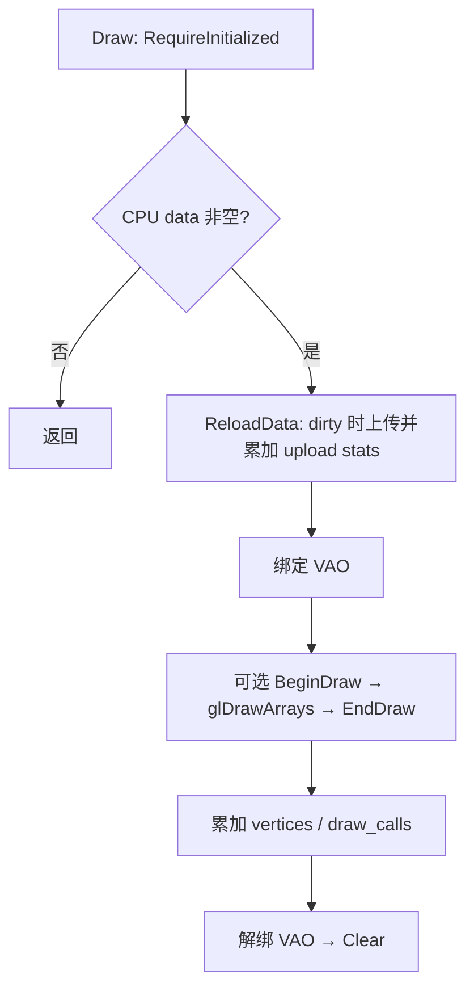

# Batch 顶点批次

2026-10-06 源码核对；从 [Renderer](Renderer%20namespace%20API.md)拆出，未独立运行验收。

## 当前设计

### 职责与状态

私有模板要求 T trivially-copyable；拥有连续 CPU vector<T> 与一个 VBO/VAO。Renderer 的 chunk_batch 上限 10,000,000 顶点，line_batch 配置 100；不是自动扩张无限批次或间接绘制系统。

成员：m_vao/m_vertex_data_vbo 初始 0；m_batch_size 默认 10,000,000；m_primitive_type 默认 GL_TRIANGLES；data 空；m_initialized/m_dirty=false。修改 CPU 数据后 dirty，Draw 上传并绘制再 Clear。GPU 固定容量与 CPU vector 的增长分配是不同成本。

### VertexAttribute

uint16 attribute_slot/element_amount/offset 与 GLenum data_type 的顶点输入描述，Init 使用 DSA 配置属性；不是拥有资源的对象。调用方需提供匹配 T 布局，不能据描述自动验证任意顶点格式。

### DrawArraysIndirectCommand

四个 uint32：count/instanceCount/first/baseInstance，初值 0；保留声明，无当前 Draw 路径使用。原 Chunk 的间接命令已删除，不据此宣称当前支持 indirect draw。

### 不变量

原 Renderer I2：data.size() <= m_batch_size，追加先检查余量；有效初始化后的公开追加入口。上下文/释放见 [I1/I5](Renderer%20namespace%20API.md#不变量)。

### 接口与失败边界

### 公开接口预期行为

类 public，但仅 renderer 内部可用。以下行均对应 [batch.hpp](../../../../game/modules/renderer/src/batch.hpp)，不是模块消费者 API。

| 签名 / 入口 | 调用方与可见范围 | 预期行为：输出及状态变化 | 前提 / 边界 | 失败反馈及失败后状态 | 源码 / 约束 |
| --- | --- | --- | --- | --- | --- |
| `Batch()` | Renderer | 默认无 GPU ID、空 CPU data | T trivially-copyable | vector 构造语义 | batch.hpp |
| `Batch(const Batch&) = delete` | 禁止 | 禁止复制所有权 | 编译期边界 | 编译不通过 | batch.hpp |
| `operator=(const Batch&) = delete` | 禁止 | 禁止复制赋值 | 编译期边界 | 编译不通过 | batch.hpp |
| `Batch(Batch&&) = delete` | 禁止 | 禁止移动 | 编译期边界 | 编译不通过 | batch.hpp |
| `operator=(Batch&&) = delete` | 禁止 | 禁止移动赋值 | 编译期边界 | 编译不通过 | batch.hpp |
| `~Batch()` | owner | 调用 Free | GPU context 有效 | 不提供上下文丢失恢复 | I1/I5 |
| `CanAppend(size_t count, size_t amount, size_t capacity) noexcept` static constexpr | 追加检查 / 白盒测试 | 返回 count 不越界且 amount 不超过余量 | 无对象依赖，避免加法溢出 | 无异常 | I2 |
| `Init(initializer_list<VertexAttribute>)` | Renderer::Init | 先校验容量再 Free，创建和配置 GPU 存储 | attributes 匹配 T 布局；有效 context | length_error/runtime_error；可能留部分 ID，Free 负责回收，旧数据不恢复 | I1/I2 |
| `AddVertex(const T&)` | Append 路径 | 校验后追加一项，dirty=true | 已初始化且有余量 | logic_error/length_error 或分配异常；未承诺 GPU 状态事务 | I2 |
| `AddVertex(const T*, size_t)` | AppendMesh | 校验后追加范围，dirty=true；0 不写入 | 非零数量需有效指针和可读范围 | 空指针 invalid_argument；容量/初始化/分配异常 | I2 |
| `Draw(RenderStats* = nullptr, GpuTimer* = nullptr)` | Render | 按上图绘制；空批次不上传、不计数 | 已初始化；timer/stats 借用至返回 | timer 异常可中断解绑/计数/Clear，无完整回滚 | I1/I2 |
| `ReloadData(RenderStats* = nullptr)` | Draw / 内部调用方 | dirty 且非空时上传；累加 bytes/ms，最后 dirty=false | 已初始化；GPU 固定容量 | 初始化异常；不逐条检查驱动错误 | I2 |
| `Clear()` | Draw / owner | 清 CPU 长度与 dirty，保留 vector 容量 | 无初始化要求 | 不释放 GPU | batch.hpp |
| `Free() noexcept` | owner / 析构 / Init | 删除非零 ID，清零；释放 CPU 容量并清 flags | 有效 context；可重复 | 不抛 C++ 异常，无 context 恢复 | I5 |
| `SetPrimitiveType(GLenum)` | Renderer 初始化 | 改绘制图元 | 调用方提供合法枚举 | 不校验 GL 枚举 | batch.hpp |
| `SetBatchSize(size_t)` | Init 前 / Free 后 | 校验后改容量 | 尚无 VAO/VBO，正容量且 GL 长度可表示 | logic_error/length_error，失败不改容量 | I2 |
| `VertexCount() const noexcept` | Renderer stats | 返回 CPU 元素数 | 不返回 view | 无异常 | batch.hpp |
| `AllocatedBytes() const noexcept` | Renderer stats | 初始化后 capacity*sizeof(T)，否则 0 | 不含 CPU/驱动其他分配 | 无异常 | batch.hpp |

### 私有函数预期行为

| 签名 / 入口 | 内部调用方 | 预期行为：处理规则及副作用 | 前提 / 边界 | 失败传播及清理责任 | 源码 / 约束 |
| --- | --- | --- | --- | --- | --- |
| `ValidateCapacity(size_t)` static | Init / SetBatchSize | 拒绝 0、超 GLsizei 或字节数超 GLsizeiptr | T 大小已确定，不写状态 | length_error 上抛；调用方尚未修改状态 | batch.hpp / I2 |
| `RequireInitialized() const` | Draw / ReloadData / RequireRoom | 检查 initialized | 不获取 context | logic_error 上抛 | batch.hpp |
| `RequireRoom(size_t) const` | 两个 AddVertex | 先检查初始化，再 CanAppend | 使用当前 CPU 长度和固定容量 | 初始化/长度异常在追加前上抛 | batch.hpp / I2 |

不可复制/移动；Renderer namespace 持有，Free 先于上下文销毁。仅主上下文线程，不重入。Draw 中 timer 抛错时没有全局状态回滚保证，不能承诺所有异常路径恢复绑定/清批状态。

### 依据与风险

[源码](../../../../game/modules/renderer/src/batch.hpp)、[调用方](../../../../game/modules/renderer/src/renderer.cpp)、[历史功能验收](Renderer-显式场景输入-功能.md#验收案例)、[覆盖清单](../对象笔记覆盖清单.md)。
T0 维护原批次/布局，私有白盒测试白名单不使其成为公共 API。未测布局瓶颈、长期泄漏、OOM/全部驱动故障；不是 T3 handle/多后端完成。

## 本次变更

无。

## 后续考虑

容量、分批策略或上传优化需等价验证和代表负载基线；不本轮改变实现。

