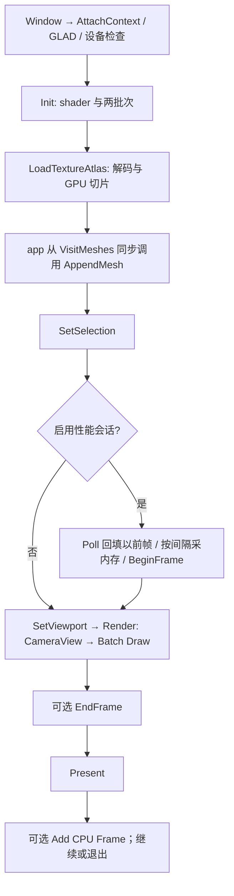

# Renderer 显式场景输入

关联设计：[namespace API](Renderer%20namespace%20API.md)、[GpuTimer](GpuTimer%20Class.md)、[Batch](Batch-类设计.md)、[Shader](Shader-类设计.md)、[ShaderProgram](ShaderProgram-类设计.md)、[Texture](Texture-类设计.md)、[TextureArray](TextureArray-类设计.md)。依据：[M3-T0](../../../spec/M3-T0-模块软硬边界.md)、[后续 M3-T3](../../../spec/M3-T3-渲染器重构.md)。

最终验证：[M3-T0 交付与验收报告](../../../milestones/m3-t0/README.md)。

## 当前设计

真实 OpenGL 实现归 `symocraft_renderer` 静态库。公开接口接收 `CameraView`、只读网格范围、选中位置和资源路径，不找 World、Registry 或 Application singleton。

内部职责分为渲染编排、Batch 上传、Shader/ShaderProgram、Texture/TextureArray、GpuTimer、设备内存/截图。保留现有单上下文 namespace 状态，不在 T0 伪装已完成多实例 Renderer/PImpl 或多后端。

源码：[renderer.cpp](../../../../game/modules/renderer/src/renderer.cpp)、[模块构建](../../../../game/modules/renderer/CMakeLists.txt)。GLAD、stb 写图、robin_hood 和 platform 私有图形桥接不传播给公开消费者。CPU 图像解码已交还 assets。

### 既有 T0 实现与验收

### 目标与流程

图是 renderer 调用边界摘要，不替代 [app 主循环](../app/App-运行编排-功能.md)。app 实际先做 Poll/按间隔采内存及 BeginFrame，再 SetViewport/Render。采样结束后再非等待 Poll，完成时截图另渲染一帧，不计入采样；清理在上下文销毁前执行。对象内部 Draw、候选链接、图集切片流程分别链接各自设计，异常部分完成见行为表。

### 公开接口预期行为

此表为功能入口索引，不复制函数契约。

| 签名 / 入口 | 调用方与可见范围 | 预期行为：输出及状态变化 | 前提 / 边界 | 失败反馈及失败后状态 | 源码 / 约束 |
| --- | --- | --- | --- | --- | --- |
| Renderer 15 个公开入口 | app / 模块消费者 | [namespace API 权威表](Renderer%20namespace%20API.md#公开接口预期行为) | 初始化、同步借用、GPU context | 逐函数见目标表 | renderer.h / I1/I3/I5/I6 |
| GpuTimer 全部 public 成员 | app owner / Render 借用 | [Timer 权威表](GpuTimer%20Class.md#公开接口预期行为) | query 槽与调用顺序见对象 | 逐函数见目标表 | gpu_timer.h / I4 |

### 私有函数预期行为

| 签名 / 入口 | 内部调用方 | 预期行为：处理规则及副作用 | 前提 / 边界 | 失败传播及清理责任 | 源码 / 约束 |
| --- | --- | --- | --- | --- | --- |
| Debug callback | GL Debug | [Renderer 内部表](Renderer%20namespace%20API.md#私有函数预期行为) | TU 函数，非公开 API | 同目标表 | renderer.cpp |
| Batch public/private 成员 | renderer 编排 | [Batch 公开表](Batch-类设计.md#公开接口预期行为)、[内部表](Batch-类设计.md#私有函数预期行为) | 内部类 public 不等于模块 API | 同目标表 | batch.hpp / I2 |
| Shader / ShaderProgram 成员与缓存 helper | Renderer shader 路径 | [Shader](Shader-类设计.md#公开接口预期行为)、[Program 公开表](ShaderProgram-类设计.md#公开接口预期行为)、[内部表](ShaderProgram-类设计.md#私有函数预期行为) | 内部 struct public 与 TU helper 区分 | 同目标表 | shader.cpp / shader_program.cpp |
| Texture / TextureArray 成员与 CheckTextureError | atlas 加载 | [Texture 公开表](Texture-类设计.md#公开接口预期行为)、[内部表](Texture-类设计.md#私有函数预期行为)、[Array](TextureArray-类设计.md#公开接口预期行为) | 内部类成员；CubeMap 未实现 | 同目标表 | texture.cpp |

### 关键约束与取舍

- 保留当前每帧重打包、整批 VBO 上传和 10,000,000 个 BlockVertex3D 容量，即约 280,000,000 字节的区块 VBO。这里是原设计成本，不宣称本次有帧率优化。
- `AppendMesh` 立即复制进私有批次，不保留区块指针；保持原迭代顺序和复制次数。选择框为固定 24 顶点，不创建世界依赖。
- `Render` 的相机矩阵为值输入，合成矩阵一次；viewport 只在尺寸变化时提交，不每帧重复改变 GL 状态。
- GpuTimer 保持 64 个槽、每槽最多 2 次 draw query。无可用槽就跳过，不等待 GPU，不调用强制同步来伪造完整数据。
- 图像资源、shader 和 batch 在上下文销毁前释放；纹理解码或编译异常交 main 报错并统一清理，不能悄悄用错误资源继续。
- `window_and_context` 仍包含上下文及 GLAD 初始化；`shaders_buffers_and_block_config` 仍覆盖相机初始建立、shader/buffer 和 world 配置加载，虽然代码所有者已拆开。

### 验收案例

| 状态 | 场景 | 预期行为 |
| --- | --- | --- |
| [x] | 独立公开头消费者 | 不需要图形 SDK，也不看到 world/app |
| [x] | shader 失败、Batch 边界、GPU timer 单元测试 | 链接生产库而不是重编生产 cpp；原测试保护保留 |
| [x] | 固定世界 static/edit 短测 | 首次上传字节与旧版相同，digest、元数据和 CSV schema 保持；旧新 static 截图同 SHA256 |
| [x] | 错误资源、有限帧退出 | 三类资源损坏退出 3，Debug 120 帧正常退出；保持图形对象先于上下文的清理路径 |
| [x] | 修改私有 renderer 头 | world/simulation/app 不重新编译，renderer 必要重编译并重新链接 |

2026-10-05 最终 Debug/Release、34 个公开头消费者及私有头增量验证通过；真实 OpenGL 对照与用户安装包玩法复查均完成，详见最终报告。5 秒预热加 15 秒采样的单次对照不用于宣布性能提升或性能回归；正式 36 分钟重测、多后端和长期 GPU 资源泄漏专项未执行。

## 本次变更

无。2026-10-06 仅整理文档；以上为原 T0 实现与验收记录，不是本次重新运行测试。

## 后续考虑

| 触发条件 | 再考虑的变化 |
| --- | --- |
| M3-T3 | Renderer PImpl、稳定 handle、多后端真实实现及更细资源所有权；在 T2 SDL3 迁移验收后冻结 |
| profiling 证明上传瓶颈且进入对应优化阶段 | 增量上传、持久区块 GPU 数据和容量策略；必须另建可比实验 |
