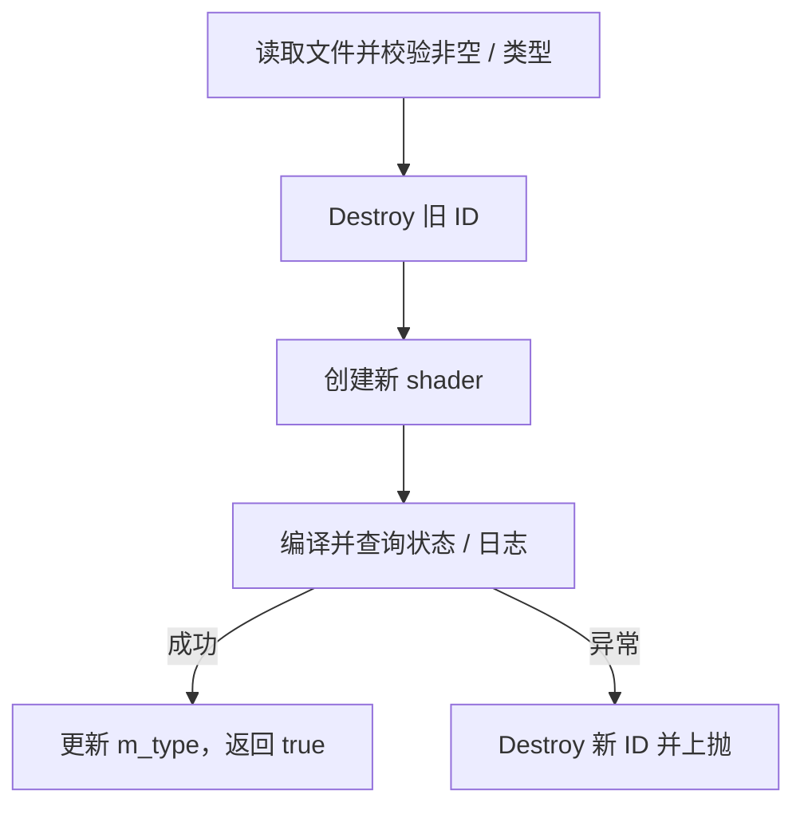

# Shader 编译资源

## 当前设计

### 职责与成员

全局 struct Shader 为 renderer 私有 GPU shader handle 包装，不是纯值。shaderId 初始 0，m_type 为 ShaderType（Vertex/Fragment）的值初始化状态；不保存 CPU 源文本或窗口。

### 接口与生命周期

当前上下文主线程；[ShaderProgram](ShaderProgram-类设计.md)在成功/失败路径显式销毁临时 shader。编译的前后阶段失败保证不同，见下方逐函数表及流程图，不概括为通用强异常保证。

不可复制，未定义移动；**没有自动释放 handle 的析构**，不能称完整 RAII。调用者必须 Destroy；裸 ID 公开可被误用，未提供线程/重入/上下文失效防护。对象离开作用域本身不替代 GPU 清理。

### 公开接口预期行为

struct public 只对 renderer 内部调用方开放；定义见 [shader.h](../../../../game/modules/renderer/src/shader.h)、[shader.cpp](../../../../game/modules/renderer/src/shader.cpp)。

| 签名 / 入口 | 调用方与可见范围 | 预期行为：输出及状态变化 | 前提 / 边界 | 失败反馈及失败后状态 | 源码 / 约束 |
| --- | --- | --- | --- | --- | --- |
| `Shader()` | ShaderProgram 临时值 | shaderId=0，类型值初始化 | 不分配 GPU | 默认构造语义 | shader.h |
| `Shader(const Shader&) = delete` | 禁止 | 不复制 ID | 编译期 | 编译不通过 | shader.h |
| `operator=(const Shader&) = delete` | 禁止 | 不复制赋值 | 编译期 | 编译不通过 | shader.h |
| `Compile(ShaderType, string_view)` | ShaderProgram | 读取、校验、替换并编译，成功 true | 借用路径至返回；有效 context | 读/类型失败保留旧 ID；替换后失败 Destroy 新 ID 并上抛 | shader.cpp / I1/I5 |
| `Destroy()` | ShaderProgram 成功/异常清理 | 删除非零 ID 并置 0，保留类型 | context 有效，可重复 | 不检查所有 GL 错误 | shader.cpp / I5 |
| `toGlShaderType(ShaderType)` static | Compile / 内部调用方 | Vertex/Fragment 映射；其他返回 GL_INVALID_ENUM | 不改状态 | 不抛类型异常，Compile 再拒绝 | shader.cpp |

### 私有函数预期行为

| 签名 / 入口 | 内部调用方 | 预期行为：处理规则及副作用 | 前提 / 边界 | 失败传播及清理责任 | 源码 / 约束 |
| --- | --- | --- | --- | --- | --- |
| 不适用 | Shader | 无 private/helper 函数 | struct 成员均 public；无自定义 GPU 析构 | 调用者显式 Destroy | shader.h / shader.cpp |

### 编译流程

创建 ID 为 0 时直接抛出；读取/校验异常在 A 阶段，尚未 Destroy 旧值。

### 审核依据

[shader.h](../../../../game/modules/renderer/src/shader.h)、[shader.cpp](../../../../game/modules/renderer/src/shader.cpp)、[Renderer 约束 I1/I5](Renderer%20namespace%20API.md#不变量)、[历史验收](Renderer-显式场景输入-功能.md#验收案例)、[覆盖清单](../对象笔记覆盖清单.md)。2026-10-06 仅源码核对，未重跑编译失败/驱动/OOM 测试。

## 本次变更

无。

## 后续考虑

自动所有权与资源 handle 方案留 T3；本次不补造析构或事务保证。

