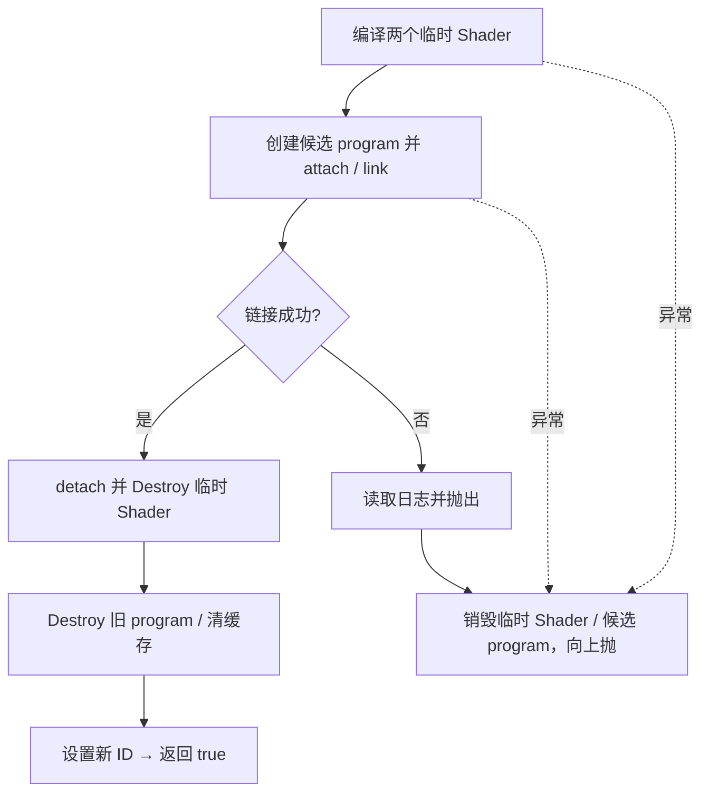

# ShaderProgram 链接与 Uniform

## 当前设计

### 职责与成员

renderer 私有 struct，programId 初始 0；namespace 的 block_shader/line_shader 持有它。拥有 GPU program，但 uniform 查找缓存是文件静态状态，不是本对象成员。无 GPU 上下文所有权。

### 接口与失败状态

不可复制，未定义移动，**没有释放 GPU 的析构**，Renderer::Free 必须显式 Destroy。候选链接、上传与清缓存的行为分别见下表；主上下文线程，无并发/重入/多上下文缓存隔离保证。

### ShaderVariable

全局辅助结构：string name、GLint location、uint32 programID；相等按 name+programID，location 不参与键。缺失 location=-1 也缓存；不说明该 uniform 必定存在。

### HashShaderVar

按 name+programID 合并哈希，供私有 allShaderVariableLocations 使用。缓存增长会分配；不是逐 program 的 RAII 成员，删除任一 program 清全部缓存。

### 公开接口预期行为

此表为内部 struct public，不是模块公开 API；所有上传都要求目标 program 已由调用方 Bind，名字/类型/指针有效，不隐式绑定。定义见 [头](../../../../game/modules/renderer/src/shader_program.h)、[实现](../../../../game/modules/renderer/src/shader_program.cpp)。GL 错误不统一转换为异常；location 缓存分配可能抛出。

| 签名 / 入口 | 调用方与可见范围 | 预期行为：输出及状态变化 | 前提 / 边界 | 失败反馈及失败后状态 | 源码 / 约束 |
| --- | --- | --- | --- | --- | --- |
| `ShaderProgram()` | Renderer | programId=0 | 无 GPU 创建 | 默认构造语义 | shader_program.h |
| `ShaderProgram(const ShaderProgram&) = delete` | 禁止 | 不复制 ID | 编译期 | 编译不通过 | shader_program.h |
| `operator=(const ShaderProgram&) = delete` | 禁止 | 不复制赋值 | 编译期 | 编译不通过 | shader_program.h |
| `CompileAndLink(string_view vertex, string_view fragment)` | Renderer 初始化/重载 | 候选成功后替换旧 program，返回 true | 路径借用至返回；context 有效 | 候选编译/链接失败清临时对象并上抛，旧 program 保留 | shader_program.cpp / I1/I5 |
| `Bind() const` | Render | glUseProgram(programId) | ID 非零 | logic_error；不绑定 0 | shader_program.cpp |
| `Unbind() const` | Render | glUseProgram(0) | context 有效 | 不报告所有 GL 错误 | shader_program.cpp |
| `Destroy()` | Renderer::Free | 删除非零 ID、置 0 并清全局 location 缓存 | context 有效，可重复 | 无 GPU 析构；owner 负责显式调用 | shader_program.cpp / I5 |
| `UploadVec4(const char*, const glm::vec4&) const` | Render | 查 location，glUniform4f | 通用上传前提 | 缓存异常上抛，未上传；GL 错误无统一反馈 | shader_program.cpp |
| `UploadVec3(const char*, const glm::vec3&) const` | Render | 查 location，glUniform3f | 通用上传前提 | 同上 | shader_program.cpp |
| `UploadVec2(const char*, const glm::vec2&) const` | 内部调用方 | 查 location，glUniform2f | 通用上传前提 | 同上 | shader_program.cpp |
| `UploadIVec4(const char*, const glm::ivec4&) const` | 内部调用方 | 查 location，glUniform4i | 通用上传前提 | 同上 | shader_program.cpp |
| `UploadIVec3(const char*, const glm::ivec3&) const` | 内部调用方 | 查 location，glUniform3i | 通用上传前提 | 同上 | shader_program.cpp |
| `UploadIVec2(const char*, const glm::ivec2&) const` | 内部调用方 | 查 location，glUniform2i | 通用上传前提 | 同上 | shader_program.cpp |
| `UploadFloat(const char*, float) const` | 内部调用方 | 查 location，glUniform1f | 通用上传前提 | 同上 | shader_program.cpp |
| `UploadInt(const char*, int) const` | Render | 查 location，glUniform1i | 通用上传前提 | 同上 | shader_program.cpp |
| `UploadIntArray(const char*, int length, const int*) const` | 内部调用方 | glUniform1iv 上传 length 项 | 指针范围/长度由调用方保证 | 不校验长度；缓存异常上抛 | shader_program.cpp |
| `UploadUInt(const char*, uint32) const` | 内部调用方 | 查 location，glUniform1ui | 通用上传前提 | 同上 | shader_program.cpp |
| `UploadBool(const char*, bool) const` | 内部调用方 | glUniform1i 上传 1/0 | 通用上传前提 | 同上 | shader_program.cpp |
| `UploadMat4(const char*, const glm::mat4&) const` | Render | glUniformMatrix4fv，1 个，不转置 | 通用上传前提 | 同上 | shader_program.cpp |
| `UploadMat3(const char*, const glm::mat3&) const` | 内部调用方 | glUniformMatrix3fv，1 个，不转置 | 通用上传前提 | 同上 | shader_program.cpp |
| `clearAllShaderVariables()` static | Destroy / 内部调用方 | 清全部 program 的 location 缓存 | 单线程；不删除 GPU program | 不提供并发保护 | shader_program.cpp |

### 私有函数预期行为

无 C++ private 成员；下表为 translation-unit helper 与仅在该文件定义的辅助类型 public 运算符。

| 签名 / 入口 | 内部调用方 | 预期行为：处理规则及副作用 | 前提 / 边界 | 失败传播及清理责任 | 源码 / 约束 |
| --- | --- | --- | --- | --- | --- |
| `getVariableLocation(const ShaderProgram&, const char*)` static | 全部 Upload | 按 name+programId 命中缓存，否则查询并缓存，包括 -1 | 有效 C 字符串；无并发保护 | 分配异常上抛，Upload 尚未提交；无成功 uniform 存在保证 | shader_program.cpp |
| `ShaderVariable::operator==(const ShaderVariable&) const` | 缓存查找；TU 辅助类型 public | 比较 name 和 ID，忽略 location | 有效对象 | 无状态写入 | shader_program.cpp |
| `HashShaderVar::operator()(const ShaderVariable&) const` | 缓存哈希；TU 辅助类型 public | 合并 name 与 ID 哈希 | 同键同 hash；不保证无碰撞 | 无缓存写入 | shader_program.cpp |

### 链接提交流程

虚线表示异常清理，不表示旧 program 回滚队列；旧值在候选失败时尚未替换。

### 审核边界

旧 Renderer “program 与 uniform 缓存”现明确分离；链接候选清理不是所有 GL 错误/OOM 都已验证。源码：[头](../../../../game/modules/renderer/src/shader_program.h)、[实现](../../../../game/modules/renderer/src/shader_program.cpp)、[Shader](Shader-类设计.md)。历史 [功能验收](Renderer-显式场景输入-功能.md#验收案例)与 [T0 报告](../../../milestones/m3-t0/README.md)保留；2026-10-06 仅源码核对，未独立运行。见 [覆盖清单](../对象笔记覆盖清单.md)。

## 本次变更

无。

## 后续考虑

独立缓存所有权、显式资源 handle 与上下文方案另行批准，不本轮实现。

