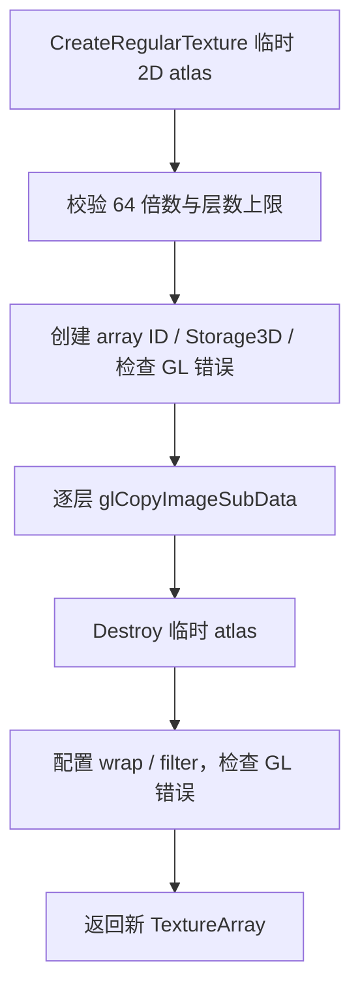

# TextureArray 图集切片

## 当前设计

### 职责与成员

public 继承 [Texture](Texture-类设计.md)，拥有二维数组纹理 ID 与 uint16 layer_amount=0。Renderer namespace 持有具体对象；不是共享材质注册表或 CubeMap。

### 创建与数据移动

CreateAtlasSlice(path,pixelated) 返回新 TextureArray，不改 this。先经 CreateRegularTexture 将源图解码并上传成临时二维 atlas；宽高须为 64 的倍数，每层固定 64×64，层数=(源宽/64)*(源高/64)，要求正数且不超过 GL_MAX_ARRAY_TEXTURE_LAYERS/UINT16_MAX。创建数组存储后逐层 glCopyImageSubData，从临时二维 GPU atlas 复制到 GL_TEXTURE_2D_ARRAY，随后 Destroy 临时 atlas；layer_amount 为实际层数，不固定 256。没有额外 CPU 像素重排 vector。

继承 Texture 的通道/尺寸/GL 错误前提；失败抛出，局部值析构清 GPU ID，不能概括所有上下文/GL 状态错误自动恢复。解码/临时 atlas/逐层 GPU 复制成本在加载期，量级/瓶颈未测。

### 公开接口预期行为

| 签名 / 入口 | 调用方与可见范围 | 预期行为：输出及状态变化 | 前提 / 边界 | 失败反馈及失败后状态 | 源码 / 约束 |
| --- | --- | --- | --- | --- | --- |
| `CreateAtlasSlice(string_view, bool)` | renderer 内部 public | 按下图创建并返回新数组，不改 this；逐层 GPU 复制 | 正尺寸为 64 倍数、层数在 GPU/uint16 范围 | 异常上抛；局部 atlas/tile_set 析构释放 ID，无 GL 全状态恢复 | [texture.cpp](../../../../game/modules/renderer/src/texture.cpp) |
| 继承的显式 Texture 接口 | renderer 内部 | [唯一基类契约](Texture-类设计.md#公开接口预期行为) | Destroy 只清 ID，不清 layer_amount | 具体值析构；禁止基类指针多态 delete | [texture.h](../../../../game/modules/renderer/src/texture.h) |
| 隐式构造 / 析构 / 特殊成员 | owner | 默认 layer_amount=0；复制被基类禁用；移动转移基类资源并复制层数 | moved-from layer_amount 不必清零 | 基类资源释放需有效 context | texture.h / Texture 契约 |

### 私有函数预期行为

| 签名 / 入口 | 内部调用方 | 预期行为：处理规则及副作用 | 前提 / 边界 | 失败传播及清理责任 | 源码 / 约束 |
| --- | --- | --- | --- | --- | --- |
| 不适用：无本类 private 函数 | CreateAtlasSlice | TU `CheckTextureError` 链接 [Texture 权威表](Texture-类设计.md#私有函数预期行为) | 不重复维护 helper 契约 | 局部值负责 GPU 清理 | texture.cpp |

### 生命周期与拷贝移动

禁止复制（基类），隐式移动调用基类 ID 转移；派生的 layer_amount 是普通数值，**移动源 layer_amount 不必归零**。Destroy/析构由基类释放 ID；非 virtual 基类不提供多态 delete 保证。GPU 释放早于上下文销毁，只主线程，无重入/多设备安全声明。

### 依据与风险

[texture.h](../../../../game/modules/renderer/src/texture.h)、[texture.cpp](../../../../game/modules/renderer/src/texture.cpp)、[历史功能验收](Renderer-显式场景输入-功能.md#验收案例)、[覆盖清单](../对象笔记覆盖清单.md)。2026-10-06 源码核对，未独立运行测试；只接受符合固定 tile 尺寸和层数范围的 atlas。方块层号验证由 SymoCraft::ValidateBlockTextures，app 编排调用，不归此对象解释规则。

## 本次变更

无。

## 后续考虑

可变图集/资源 handle 改变需先定义容量、层号与失败生命周期，不本轮实现。

