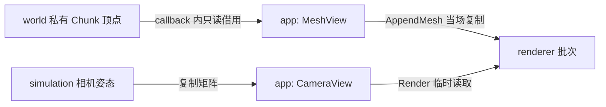

# Scene-共享场景数据

关联数据：[共享值与 view](Scene-共享场景数据-数据设计.md)。依赖边界：[M3-T0](../../../spec/M3-T0-模块软硬边界.md)；新增自有网格：[M3-T1](../../../spec/M3-T1-世界模块重构.md)。

最终验证：[M3-T0 交付与验收报告](../../../milestones/m3-t0/README.md)。

本轮记录：[M3-T1 报告](../../../milestones/m3-t1/README.md)。自动与本轮人工结果已记录，节点待批准；数据笔记沿此入口查看实际结果。

## 当前设计

scene 是真正由 world、simulation 和 renderer 共享的 CPU 值契约，不是场景管理器。其 INTERFACE target 只携带公开数据与数学使用要求，没有无意义的空实现库。

实现位置：[模块源码](../../../../game/modules/scene/CMakeLists.txt)。当前实现与历史验证见下文；不将已有 M2 结果冒充新实现证据。

### 既有 T0 实现与验收

### 目标与流程

T0 仅建立真实模块、公开数据契约及测试边界，维持原正常运行路径，不提前做领域算法重写。

### 公开接口预期行为

| 签名 / 入口 | 调用方与可见范围 | 预期行为：输出及状态变化 | 前提 / 边界 | 失败反馈及失败后状态 | 源码 / 约束 |
| --- | --- | --- | --- | --- | --- |
| 不适用：scene 无自定义函数；共享值 / MeshView | world / simulation / renderer | [数据权威表](Scene-共享场景数据-数据设计.md#公开接口预期行为) | 构造、复制及借用失效见目标表 | 同目标表 | mesh.h / camera.h / I1-I3 |

### 私有函数预期行为

| 签名 / 入口 | 内部调用方 | 预期行为：处理规则及副作用 | 前提 / 边界 | 失败传播及清理责任 | 源码 / 约束 |
| --- | --- | --- | --- | --- | --- |
| 不适用：无私有实现函数 | scene | [数据权威表](Scene-共享场景数据-数据设计.md#私有函数预期行为) | 生产/消费行为不归 scene | 同目标表 | scene INTERFACE target |

### 关键约束与取舍

- BlockVertex3D 保留原 pos_coord、tex_coord、normal 布局与 28 字节尺寸，LineVertex3D 为 12 字节，有静态断言。
- MeshView 不拥有内存，只允许在所属 world 访问 callback 期间同步消费；renderer 不保存该 view。T1 新增 MeshData 的自有 vector，候选/最终网格及空发布语义见数据笔记，不加入 GPU 句柄。
- CameraView 只复制两份矩阵，不借用 ECS、相机或窗口。
- 不把 GPU 间接命令、原生 handle、chunk 状态或材质业务规则搬入 scene。

### 验收案例

| 状态 | 场景 | 预期行为 |
| --- | --- | --- |
| [x] | 独立公开头消费者 | 不需要聚合 core.h、SDK 或私有 include |
| [x] | 公开头独立消费者 + world.mesh_safety | 正常 / 失败路径通过正式库验证 |
| [x] | Debug / Release 与 CPU-only | 相同源码所有者；CPU 库无需窗口 |
| [x] | 共享公开头增量编译与实际渲染 | 真实消费者重新编译；旧新 static 截图字节一致 |

2026-10-05 正式测试矩阵、公开头消费者、共享头增量验证及真实 OpenGL 对照通过。证据与限制统一见最终报告；scene 仍只是 CPU 数据契约，不表示已建立场景图或新的资源 handle 系统。

## 本次变更

T1 新增自有 MeshData，保留顶点/相机布局、INTERFACE target 与无 SDK 边界。新增契约自动结果见 [World功能](../world/World-功能.md#验收案例)；以上已勾选为历史 T0 记录，不作为 T1 新结果。

## 后续考虑

| 触发条件 | 再考虑的变化 |
| --- | --- |
| 边界成为实际瓶颈 | 先测量分配、复制或调用开销，再调整接口；不恢复私有跨模块访问 |
| 后续阶段修改内部算法 | 同步更新本笔记、类不变量与回归证据 |

