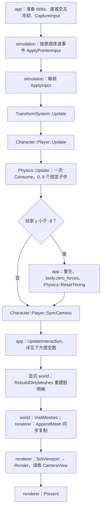
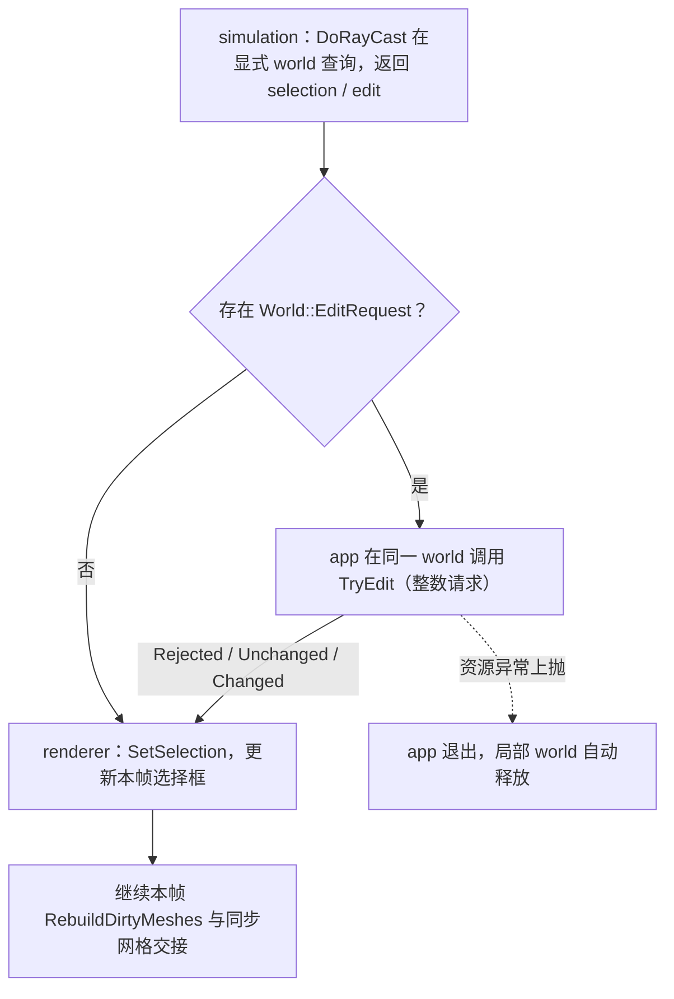

# Simulation 系统与数据流

2026-10-06 从原 Simulation 类设计与 app 调用链拆出，并适配 T1 显式 World；自动契约及实际运行已验证，人工玩法状态归阶段报告。
关联：[功能与唯一验收](Simulation-功能.md)、[数据契约](Simulation-数据设计.md)、[Camera](Camera-类设计.md)、[覆盖清单](../对象笔记覆盖清单.md)。

## 当前设计

### 处理边界

namespace 函数串行更新 Registry，通过传入的 `const World::VoxelWorld&` 查询公开方块与规则；不保存 Registry/world 引用，不访问原生输入、GPU 或反向调用 app。没有调度器、并行作业、命令队列或事务提交框架。

### 接口与读写集

两表覆盖 player、playercontroller、character_system、physics_system、transform_system 的全部活动系统函数，以及公开 player_math 算法。Camera 对象接口归 [Camera](Camera-类设计.md)，FixedStepBudget 方法链接独立笔记，不重复其完整契约；组件和输入字段归 [数据设计](Simulation-数据设计.md)。注释中停用的 GetInterval/ClosetPointOnRay 不算已实现接口。

表中类型名省略外层 `SymoCraft::`；`Registry` / `EntityId` 为 `ECS::` 类型。所有 Registry/world 操作当前串行，无遍历中结构修改、重入或跨线程保证，依赖 [S1/S5](Simulation-数据设计.md#不变量与失效)与 [ECS 已知风险](../ecs/ECS-组件存储-数据设计.md#已知风险)。

### 公开接口预期行为

| 签名 / 入口 | 调用方与可见范围 | 预期行为：输出及状态变化 | 前提 / 边界 | 失败反馈及失败后状态 | 源码 / 约束 |
| --- | --- | --- | --- | --- | --- |
| `EntityId Simulation::CreatePlayer(Registry&, Camera&)` | app 启动；player.h 公开 | 创建实体和 Transform/HitBox/RigidBody/Character/Player 五类组件；由相机姿态初始化玩家，返回 ID | 类型已注册；Camera Transform 与玩家使用同一 Registry 且有效 | 注册/分配等失败无完整实体回滚，可能留下部分组件；不保证存储分配失败可恢复 | [实现][player-src]；S1/S5 |
| `void Simulation::ApplyPointerInput(Registry&, EntityId, Camera&, double mouse_dx, double mouse_dy, double scroll_y)` | app 每个有序事件；player.h 公开 | pitch 加 mouse_dy×0.05 并裁剪 -89..89，yaw 加 mouse_dx×0.05，Camera Scroll 改 FOV | 玩家 Transform 有效；事件逐项处理；有限输入由调用方保证 | 无统一错误值；相机更新失败前玩家姿态可能已写入，无整体回滚 | [实现][player-src]；S2 |
| `void Simulation::ApplyInput(Registry&, EntityId, Camera&, const PlayerIntent&, PlayerInputState&, float delta)` | app 每帧；player.h 公开 | 非零汇总指针输入先应用；写运行/方向/sensor/gravity/jump 意图；减选材冷却，0..7 环回，成功切换设 0.2 s 并显示名字 | 所需组件有效，selected_block 在正常范围；delta 已由 app 裁剪；不在每个物理子步重复执行 | 无统一错误值；组件/输出异常可能发生在部分写入之后，不提供事务 | [实现][player-src]；S2 |
| `void Character::Player::Update(Registry&)` | app 每帧；character_system.h 公开 | 遍历 Transform/Character/RigidBody；按方向和速度写 velocity，处理 jump/on_ground/下落加速度，消耗 apply_jump_force | 执行在 ApplyInput 与 Physics::Update 之间；空查询不更新 | 无批次错误反馈或回滚；存储风险仍存在，不能因组件查询推定所有 ID 安全 | [实现][character-src]；S1/S5 |
| `void Character::Player::SyncCamera(Registry&, EntityId camera_entity)` | app 每帧；character_system.h 公开 | 无有效相机 Transform 则返回；否则遍历 Transform/Player，把位置+offset、姿态与方向写到同一相机 | 玩家/相机属于同 Registry；当前单玩家路径；多玩家时后遍历者覆盖前者，不保证选择顺序 | 无成功值；HasComponent 的检查不构成完整 ECS 多代 ID 保证 | [实现][character-src]；S1/S5 |
| `void TransformSystem::Update(Registry&)` | app 每帧；transform_system.h 公开 | 从 yaw/pitch 计算并 normalize front，再 cross/normalize right/up，原地更新所有 Transform | 正常有限姿态；不能与遍历中的结构修改并发；空查询无操作 | 无非法姿态检查或错误值；极点/非有限输入不保证得到有效基向量 | [实现][transform-src]；S1/S5 |
| `void Physics::Update(Registry&, const World::VoxelWorld&, float frame_delta)` | app 每帧入口；physics_system.h 公开 | step_budget 一次 Consume，随后至多 8 个 120 Hz 子步；积分位置/速度、重力、速度裁剪和指定 world 的静态碰撞；sensor 清接地并跳过碰撞 | 共享单预算、正常组件、同帧有效的显式 world；不是每实体 Consume，非并行调度 | 非有限/非正 delta 得 0 子步；异常前部分实体/子步可能已更新，预算已消费，无事务回滚 | [实现][physics-src]；[S4](FixedStepBudget-类设计.md#不变量) |
| `void Physics::ResetTiming()` | app 启动/暂停/重生；physics_system.h 公开 | step_budget.Reset 清共享余数，不重置 Registry 组件 | 不与 Update 并发；不代表多会话隔离 | 无错误值；非异步取消机制 | [实现][physics-src]；[S4](FixedStepBudget-类设计.md#不变量) |
| `RaycastStaticResult Physics::RayCastStatic(const World::VoxelWorld&, const glm::vec3& origin, const glm::vec3& normal_direction, float max_distance, bool draw=false)` | PlayerController/消费者；physics_system.h 公开 | 用 RaycastVoxels/IsSolidVoxel 查询参数指定的世界，返回自有 hit/center/size/normal/point；draw 参数未使用，不渲染 | 单位网格 world；方向在算法内归一化，输入校验见算法行；不保存 world 引用 | 无命中/非法输入返回 value-init 未命中结果；Found 方块规则缺失抛 logic_error，不当空气，无编辑副作用 | [实现][physics-src]；S3 |
| `InteractionResult PlayerController::DoRayCast(Registry&, const World::VoxelWorld&, EntityId, const InteractionInput&, float& placement_debounce)` | app 每帧；playercontroller.h 公开 | 指定 world 上 3 m 查询，返回 selection；允许输入且冷却到期才计算整数 World::EditRequest；place 分支即使不可放置也设 0.2 s，优先于 remove；不编辑 world | 有效玩家/同一实例方块配置；placement_debounce 由 app 每帧递减；放置检查高度/目标方块/实体重叠；float 仅经 TryToBlockCoord | 无命中返回空；禁止输入保留 selection；域外/不可放置返回空 edit；未知规则抛 logic_error，不退回空规则；结果不是提交成功，可能已改变冷却 | [实现][controller-src]；S3 |
| `void PlayerController::DisplayCurrentBlockName(int selected_block)` | ApplyInput；playercontroller.h 公开，虽供内部使用仍属公开 API | 索引在 8 项库存范围内时 cout 输出对应名称；不修改游戏状态 | 当前内置 block ID 可索引名称表 | 越界索引无输出；没有返回错误码，不保证输出设备可用 | [实现][controller-src] |
| `bool PlayerMath::IsFinite(const glm::vec3& value)` | RaycastVoxels/消费者；player_math.h 公开 inline | 三分量均 finite 返回 true，否则 false；无写入 | 无对象生命周期 | 无异常/状态恢复协议；只是数值判据 | [定义][math-header] |
| `bool PlayerMath::Overlaps(const glm::vec3& first_min, const glm::vec3& first_max, const glm::vec3& second_min, const glm::vec3& second_max, float tolerance=0)` | 碰撞/放置；player_math.h 公开 inline | 每轴交叠长度均大于 tolerance 才 true；仅接触边界不算 overlap | 有效有序 AABB、有限数值；函数不完整验证这些前提 | 无错误值；非法 AABB/非有限值不保证合理结论 | [定义][math-header] |
| `glm::vec3 PlayerMath::DesiredVelocity(const glm::vec3& movement, float yaw_degrees, float speed, bool use_gravity)` | Character::Player::Update；player_math.h 公开 inline | yaw 构造水平 front/right；无重力时加入 y；存在水平分量时按完整向量长度缩放到 speed | 有限正常参数；仅 y 分量时不走 speed 缩放 | 无数值错误反馈；不校验非法 speed/姿态 | [定义][math-header] |
| `template<class IsSolid> bool PlayerMath::HasGroundSupport(const glm::vec3& minimum, const glm::vec3& maximum, IsSolid&& is_solid)` | Physics 内部 adapter/消费者；player_math.h 公开 | 容差 0.002，要求底面邻近 voxel 顶面；遍历脚下 x/z，任一实体方块返回 true | 合法有限 AABB；callback 不改变 world，不延长借用 | 不贴地或未找到支持返回 false；callback 异常上抛，无写入回滚需求 | [定义][math-header] |
| `template<class IsSolid> VoxelRayHit PlayerMath::RaycastVoxels(const glm::vec3& origin, const glm::vec3& direction, float max_distance, IsSolid&& is_solid)` | Physics::RayCastStatic/消费者；player_math.h 公开 | 单位网格 DDA，等距跨轴同时推进；返回首个 solid cell、normal 和 distance，自有值 | 检查 finite、非零方向、非负距离及 ±1,000,000 坐标/距离上限；callback 同步查询 | 非法输入/超距离/无命中返回默认未命中；callback 异常上抛；起点在 solid 内 normal 可为零 | [定义][math-header] |
| `unsigned PlayerMath::FixedStepBudget::Consume(float frame_seconds)` | Physics::Update；对象 public、公开头 | 预算处理的权威契约见独立对象，不在系统复制 | 当前 Physics 使用 translation-unit 共享实例 | 输入/余数规则见对象行为表 | [独立契约](FixedStepBudget-类设计.md#接口与生命周期)；[定义][math-header] |
| `void PlayerMath::FixedStepBudget::Reset()` | Physics::ResetTiming；对象 public、公开头 | 重置行为的权威契约见独立对象 | 非并发重置 | 无新增系统级恢复保证 | [独立契约](FixedStepBudget-类设计.md#接口与生命周期)；[定义][math-header] |

### 私有函数预期行为

以下 7 个函数均为 `physics_system.cpp` 的 static translation-unit helper，不在公开头声明；PlayerMath 的算法虽然用于内部流程，却因位于公开头而列在公开表，不误标为私有。

| 签名 / 入口 | 内部调用方 | 预期行为：处理规则及副作用 | 前提 / 边界 | 失败传播及清理责任 | 源码 / 约束 |
| --- | --- | --- | --- | --- | --- |
| `bool IsSolidVoxel(const World::VoxelWorld&, const glm::ivec3& cell)` | 射线与接地算法 callback、碰撞扫描 | 高度越界、OutsideWorld/AIR 返回 false；否则从同一 world 按整数格查询方块，再按值取规则 solid 属性 | world/config 已准备；只读查询；不把域外作为合法存储空气 | Found 的规则缺失抛 logic_error；optional 缺失不退回默认规则 | [实现][physics-src] |
| `bool HasGroundSupport(const World::VoxelWorld&, const Transform&, const HitBox&)` | ResolveStaticCollision 尾部 | 根据 position+offset 和 size 计算 AABB，以捕获当前 world 的局部 predicate 调用公开 PlayerMath::HasGroundSupport | 有效有限组件；callback 只持续本次算法调用；与公开模板同名但不是同一 API | 返回支撑判据；无写入；底层失败上抛 | [实现][physics-src] |
| `void ResolveStaticCollision(const World::VoxelWorld&, RigidBody&, Transform&, HitBox&)` | Physics::Update 每个非 sensor 子步 | 清 on_ground，按原 y/x/z 顺序扫附近 solid；box_pos 经 TryToBlockCoord，碰撞时位置纠正、相应轴速度/加速度归零，最后检查脚底支撑 | 有效组件/world；先积分再碰撞；原扫描顺序影响结果；没有修改 world | 无事务或统一失败值；dot<0 时跳过该纠正，异常可留下部分调整 | [实现][physics-src] |
| `bool IsColliding(const HitBox&, const Transform&, const HitBox&, const Transform&)` | ResolveStaticCollision | 由中心与半尺寸构造两个 AABB，用 Overlaps 返回是否严格交叠；不写组件 | 合法 AABB；不处理旋转包围盒 | 无错误反馈；数值前提继承公开算法 | [实现][physics-src] |
| `CollisionInfo StaticCollisionInformation(const RigidBody& rb1, const HitBox&, const Transform&, const HitBox&, const Transform&)` | ResolveStaticCollision 已命中后 | 扩大静态 box，按中心差象限选 face，GetQuadrantResult 填 overlap/force；rb1 参数未使用 | 已检测碰撞、正常有限数据；不是独立可靠求交验证器 | 未能选择象限时日志并 did_collision=false；调用方没有完整错误恢复分支 | [实现][physics-src] |
| `float GetDirection(Direction face)` | GetQuadrantResult | BACK/LEFT/BOTTOM 得 +1，FRONT/RIGHT/TOP 得 -1，用于有向半尺寸 | 预期是非 NONE 的轴向 face | NONE 写错误日志；未匹配 face 返回 0.0001f，不抛异常或停止计算 | [实现][physics-src] |
| `void GetQuadrantResult(const Transform&, const Transform&, const HitBox&, const HitBox& hb2_expanded, CollisionInfo* res, Direction x_face, Direction y_face, Direction z_face)` | StaticCollisionInformation | 计算象限角与 delta，严格最小 x/y 分支选对应轴；否则选 z，写 res 的 overlap_part/force | res 非空，box 已扩大、face 有效；相等时走 z 分支，不声称稳健碰撞求解 | 无指针/数值验证，不更新 did_collision；非法前提无恢复协议 | [实现][physics-src] |

### 跨调用状态负责人

Physics translation-unit 持有 uniform_gravity=(0,20,0)、terminal_velocity=(50,50,50)、kPhysicsUpdateRate=1/120 和一个 step_budget。预算不是 Registry 成员，多次 Update 共用；重置只经 ResetTiming。处理过程中查询结果及组件引用均同步消费，不跨结构变化或帧保存。

### 调用顺序与提交

以下是普通玩法中已通过暂停/退出检查、继续模拟的本帧路径；不展开 Benchmark 采样与协议场景分支。节点前缀注明负责人，系统入口只改组件或产生结果，不接管 app 的世界提交与渲染编排。

ApplyPointerInput 按每条事件分别裁剪；app 映射到 ApplyInput 的鼠标汇总为零，避免重复应用。Transform/Character 每帧各一次，不在物理子步重复。重生不追加第二次 TransformSystem::Update。交互冷却由 app 每帧递减，DoRayCast 在放置/移除相关分支更新；放置被拒绝也可能设置冷却，不只限于成功请求。

第二图展开 UpdateInteraction 的同步提交；虚线表示异常传播，不表示异步任务。DoRayCast 不修改 world，allow_input=false 时仍可有 selection 但无 edit。普通交互接收 world 的三态结果，不新增失败采样；benchmark 在同实例核对 before 后检查 Accepted()，合法 Unchanged 仍计已接受的计划动作。编辑提交的失败保证、按块 mesh 首错策略归 world 的 T1 契约，模拟组件本身不具事务回滚保证；其他调用中的异常退出详见 app。

失焦/最小化暂停及重生按 app 路径重置物理余数和输入，禁止把暂停时间作为大段补步。benchmark 的姿态与编辑来自协议场景，不使用普通玩家键盘控制；详见 [app 编排](../app/App-运行编排-功能.md)。

### 批处理与数据移动

RegistryViewer 从实体槽位过滤，逐实体取得所需组件，不是 archetype 连续批块。组件原地写回；输入/交互跨边界按值传递。网格复制发生于 renderer 批次，不在本系统创建世界快照。处理规模、访问分布、阶段预算和瓶颈未测量，无性能改进结论。

### 不变量

| 原编号 | 条件与边界 |
| --- | --- |
| S2 | 有效玩家/正常初始状态下，选材 0..7 环回，pitch 裁剪 -89..89 |
| S3 | DoRayCast 只返回选择/编辑值，不修改方块；提交由 app 负责 |

[S1/S5](Simulation-数据设计.md#不变量与失效)约束值/组件借用；[S4](FixedStepBudget-类设计.md#不变量)约束预算，不在此重复维护。

### 依据与限制

源码：[app](../../../../game/app/src/application.cpp)、[player](../../../../game/modules/simulation/src/player.cpp)、[physics](../../../../game/modules/simulation/src/physics_system.cpp)、[playercontroller](../../../../game/modules/simulation/src/playercontroller.cpp)。
历史 [T0 报告](../../../milestones/m3-t0/README.md)支持原同步玩家路径；T1 显式 world 与整数请求适配的自动结果见 [T1报告](../../../milestones/m3-t1/README.md)。Registry 查询、ID 版本、删除压缩及分配失败仍有 [T5 风险](../ecs/ECS-组件存储-数据设计.md#已知风险)，不支持并发结构修改、重入更新或多会话全局预算。

## 本次变更

T1 只修改 world 参数与编辑值的交接：所有查询沿显式引用传递，回调不持久保存引用，输入/运动/碰撞/DDA 算法未重构。唯一 T1 适配验收归[功能笔记](Simulation-功能.md#本次变更)，不重复维护测试状态。

## 后续考虑

多玩家/世界时先显式划分玩家、相机、预算和提交负责人；优化另需等价验证与代表负载测量。

[player-src]: ../../../../game/modules/simulation/src/player.cpp
[controller-src]: ../../../../game/modules/simulation/src/playercontroller.cpp
[character-src]: ../../../../game/modules/simulation/src/character_system.cpp
[transform-src]: ../../../../game/modules/simulation/src/transform_system.cpp
[physics-src]: ../../../../game/modules/simulation/src/physics_system.cpp
[math-header]: ../../../../game/modules/simulation/include/symocraft/simulation/player_math.h

