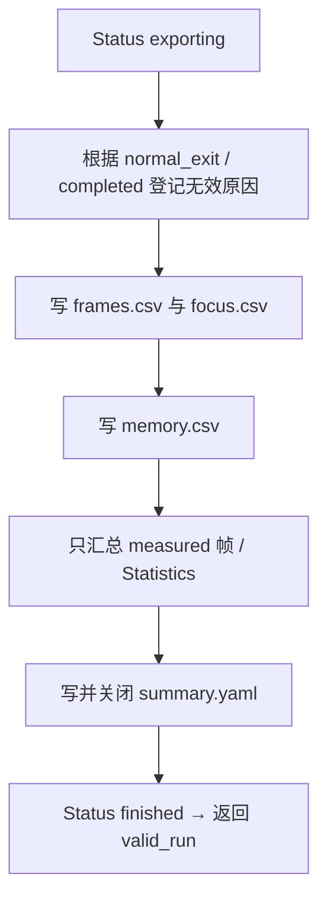

# Session 采样与导出对象

## 当前设计

### 职责与所有权

main 持有性能会话，覆盖 app Run/退出后 Export。拥有 frames_、memory_、invalid_reasons_、directory_，公开 metadata/startup 为 Data::Value，completed=false，entry 为 steady_clock 时间点；allow_unfocused_=false 由构造配置决定。不持有 GPU/Window/app 对象，不借用 CLI string_view。

frames_ reserve 100000，最大 1000000；memory_ reserve 1300，但 **没有同样的显式样本上限**。预留不是全程无分配保证。不可复制，未定义移动；标准成员自动释放内存，销毁不自动 Export 或删除结果目录。

### 不变量

| 原 Telemetry 编号 | 条件与边界 |
| --- | --- |
| I1 | 构造成功要求新建输出目录、父目录已存在，不覆盖已有结果 |
| I2 | SetGpu 索引必须已存在于 frames_，否则 logic_error |
| I3 | Export 有效 = 正常退出、completed、无 invalid reason、measured 帧非空 |
| I4 | GPU 缺失不写成 0，预热排除统计，慢帧不剔除 |

字段公开允许调用者错误设置 completed/元数据；这些条件不意味着全部 CLI 参数由 Session 再校验。

### 接口、状态与失败

详细接口、失败后状态和导出顺序分别见下方两表与流程图。**目录/文件不事务删除**，Status 不是严格受保护 state machine。单线程，不支持重入收集/导出、并发回填；主循环结束后排序/转换。

### 数据、单位与关联

完整字段、SessionConfig/YAML 适配见 [Telemetry 数据摘要](Telemetry-采样与导出-类设计.md)。GpuTimer frame 来自 NextFrame，CPU Add 后后续 Poll 回填；末次非等待 Poll 可能留缺失。GPU draw ms 不含显式 upload/clear/swap，[计时器](../renderer/GpuTimer%20Class.md#采样关联与计时范围)维护范围。

Statistics 契约见 [Telemetry API](Telemetry-namespace-API.md#公开接口预期行为)。v2 原始/焦点/失焦策略见 [benchmark 文件协议](../../benchmark/Benchmark-文件协议.md)，不是新独立协议。

### 依据与风险

[performance.h](../../../../game/modules/telemetry/include/symocraft/telemetry/performance.h)、[performance.cpp](../../../../game/modules/telemetry/src/performance.cpp)、[main](../../../../game/app/src/main.cpp)、[功能验收](Telemetry-采样与导出.md#验收案例)、[T0 报告](../../../milestones/m3-t0/README.md)、[覆盖清单](../对象笔记覆盖清单.md)。
2026-10-06 源码核对，未重新运行正式协议/短采样/OOM/磁盘故障测试；T0 正式库/YAML/static/edit 短测结论保留，不形成性能优化结论。

### 公开接口预期行为

定义见 [performance.h](../../../../game/modules/telemetry/include/symocraft/telemetry/performance.h)、[performance.cpp](../../../../game/modules/telemetry/src/performance.cpp)。全部为公开类成员；收集、回填与导出串行，引用不跨对象寿命。

| 签名 / 入口 | 调用方与可见范围 | 预期行为：输出及状态变化 | 前提 / 边界 | 失败反馈及失败后状态 | 源码 / 约束 |
| --- | --- | --- | --- | --- | --- |
| `Session(const SessionConfig&, Clock::time_point)` | main owner | 创建新目录，reserve，写 v2 metadata 与 initializing status | 输出为 UTF-8 字节路径；父目录存在；不重校所有 CLI 参数 | 目录/分配/写入异常；已创建目录或文件保留，不事务删除 | performance.cpp / I1 |
| `Session(const Session&) = delete` | 禁止 | 不复制会话 | 编译期 | 编译不通过 | performance.h |
| `operator=(const Session&) = delete` | 禁止 | 不复制赋值 | 未定义移动；成员自动释放，不自动 Export | 编译不通过 | performance.h |
| `NextFrame() const` | app → GpuTimer | 返回 frames_.size()，无写入 | 后续 Add 后才可回填该索引 | 无错误值 | performance.h / I2 |
| `Add(Frame)` | app 每帧 | size==1000000 拒绝；strict 失焦先 Invalidate，再 push | 传入自有值；reserve 不等于最大容量 | runtime_error/分配异常；可能已登记失焦原因但未加入帧 | performance.cpp |
| `Add(Memory)` | app 内存采样 | append 自有 Memory | 无显式样本上限 | 分配异常上抛 | performance.h |
| `SetGpu(size_t frame, double milliseconds)` | app Poll 回填 | 已有索引写 gpu_draw_ms | 不全面校验 ms；不生成帧 | 越界 logic_error；正常覆盖既有值 | performance.cpp / I2 |
| `Invalidate(const string&)` | app / Add / Export | 去重后存自有原因 string | 可重复同一原因 | 分配异常上抛，不自动恢复有效性 | performance.cpp |
| `Directory() const` | main / 输出调用方 | 借用 const path 引用 | 有效至会话销毁；不借用 CLI 输入 | 无错误值 | performance.h / I1 |
| `Status(const char*, double = 0)` | 构造 / app / Export | 写 status.tmp，close 后 Publish status.yaml | 合法 phase；不是受保护 state machine | 写入/序列化/Publish 异常；旧 status 可保留，tmp 可残留 | performance.cpp |
| `Export(bool normal_exit)` | main 退出后 | 按下图生成 CSV、summary，finished，返回 valid_run | main 停止 Add/SetGpu；数值供 Statistics 校验 | 异常上抛，已写文件保留；false 表示无效，不等于写入失败 | performance.cpp / I3/I4 |

### 私有函数预期行为

无类 private 方法；下表为 performance.cpp anonymous namespace helper。Statistics 与 YAML adapter 位于公开头，不误标私有，见 [Telemetry API](Telemetry-namespace-API.md)。

| 签名 / 入口 | 内部调用方 | 预期行为：处理规则及副作用 | 前提 / 边界 | 失败传播及清理责任 | 源码 / 约束 |
| --- | --- | --- | --- | --- | --- |
| `Output(const filesystem::path&)` | Status / Export | 创建 ofstream，启用 fail/bad 异常，classic locale / precision 10，按值返回 | 路径可写；现有文件可能被截断 | ios/locale 等异常上抛；局部流析构关闭，文件不回滚 | performance.cpp |
| `template<class T> Optional(ostream&, const optional<T>&)` | Export CSV | 有值写 *value；缺失不写字符 | 借用 stream/value 至返回 | 流异常上抛；已写 CSV 保留 | performance.cpp / I4 |

### 导出顺序与发布

每个 Status 内是 Output(status.tmp) → DumpYaml → close → Files::Publish；只有状态文件替换采用 Publish，CSV/summary 直接写，不是全套文件事务。统计异常可在原始 CSV 已写后发生；finished 也不表示 valid_run=true。

## 本次变更

无。

## 后续考虑

采样/导出并发、恢复和新协议另立 spec；本次不改变原记录与缺失值语义。

