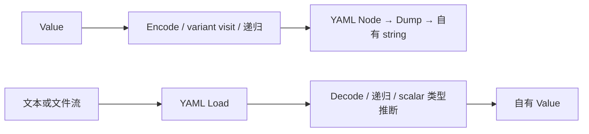

# Telemetry 数学与文档 API

## 当前设计

Performance 自由函数处理计时/统计，Data 自由函数适配 YAML；没有 Adapter 实例或全局 Session。值定义归 [数据设计](Telemetry-采样与导出-类设计.md)，会话状态与文件发布归 [Session](Session-类设计.md)。源码核对不是新运行验收。

### 公开接口预期行为

| 签名 / 入口 | 调用方与可见范围 | 预期行为：输出及状态变化 | 前提 / 边界 | 失败反馈及失败后状态 | 源码 / 约束 |
| --- | --- | --- | --- | --- | --- |
| `double Performance::Milliseconds(Clock::time_point start, Clock::time_point end = Clock::now())` | app；performance.h inline 公开 | 返回 steady_clock 间隔 double 毫秒，不写状态 | end 可由调用方指定 | 不拒绝 end 早于 start，可返回负值 | [performance.h](../../../../game/modules/telemetry/include/symocraft/telemetry/performance.h) |
| `Data::Value Performance::Statistics(vector<double> values)` | Session / CPU 消费者；公开 | 拷贝入参后排序，count/min/max/mean/p50/p95/p99；nearest-rank，无慢帧剔除 | 样本有限且非负；空集合只有 count | invalid_argument 或分配异常上抛；原调用方 vector 不被排序；总和不另校验溢出 | [performance.cpp](../../../../game/modules/telemetry/src/performance.cpp) |
| `string Data::DumpYaml(const Value&)` | Session / world 等；公开 | Encode 后返回自有 YAML 文本，保持 map 顺序/flow 标志 | Value 有效，适配递归结构 | parser/分配异常上抛；输入不改，无文件写入 | [document_io.cpp](../../../../game/modules/telemetry/src/document_io.cpp) |
| `Value Data::LoadYaml(string_view)` | world 等；公开 | 同步复制文本、YAML::Load 后 Decode，返回自有 Value | view 有效至返回；不保存输入 view | YAML/转换/分配异常上抛，无部分 Value 出口 | document_io.cpp |
| `Value Data::LoadYamlFile(const filesystem::path&)` | world 配置；公开 | 打开二进制流，解析/Decode 为自有 Value | 直接读取 path，不自动 Assets::Resolve | 打开失败 runtime_error；YAML/转换/分配异常上抛，流自动关闭 | document_io.cpp |

### 私有函数预期行为

namespace 无 private；以下仅 document_io.cpp anonymous namespace。

| 签名 / 入口 | 内部调用方 | 预期行为：处理规则及副作用 | 前提 / 边界 | 失败传播及清理责任 | 源码 / 约束 |
| --- | --- | --- | --- | --- | --- |
| `YAML::Node Encode(const Value&)` | DumpYaml / 自身递归 | visit 转成 YAML node；按 FlowStyle 设置 emitter style | 不暴露 parser 类型 | 分配/转换异常上抛，局部对象析构 | document_io.cpp |
| Encode 内 `visit(const auto& item) -> YAML::Node` lambda | Encode 的 variant dispatch | null/sequence/mapping/scalar 分支；可被解释为 bool/数字的 string 显式加 str tag | 递归子项按 Encode；不是通用序列化多态接口 | 递归/分配异常上抛，输入不改 | document_io.cpp |
| `Value Decode(const YAML::Node&)` | LoadYaml / LoadYamlFile / 自身递归 | map/sequence 递归；标明 string 的 scalar 保留字符串，否则依次 bool/int64/uint64/double/string；flow 标志保留 | YAML scalar 推断不是任意显式 schema 验证；map key 转 string | YAML/转换/分配异常上抛，局部 Value 清理 | document_io.cpp |

### 转换流程

输出与解析都是同步调用，无任务队列、共享解析缓存或持久化事务。文件发布不归此 API；Status 的 Files::Publish 契约见 Session / foundation。

## 本次变更

无。仅拆出既有自由函数的审核落点。

## 后续考虑

新增 schema/大文档限制或并发导出需单独约定与测试；历史 [功能验收](Telemetry-采样与导出.md#验收案例)不扩展成任意 YAML 或 OOM 证明。
