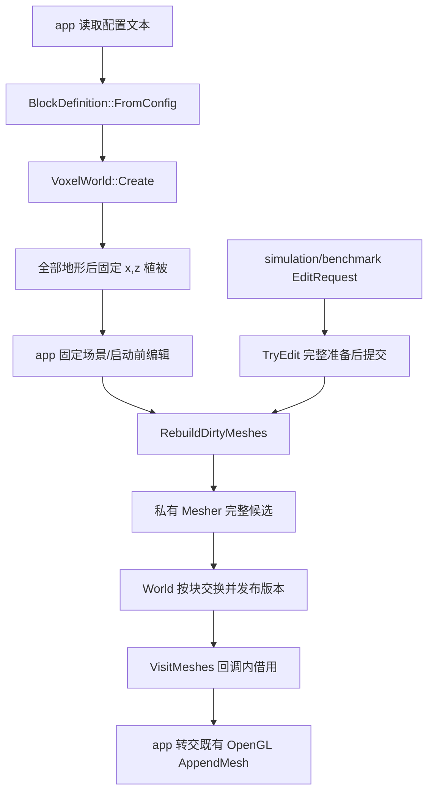

# World 世界数据与 CPU 网格

关联契约：[M3-T1 正式 Spec](../../../spec/M3-T1-世界模块重构.md)。关联笔记：[VoxelWorld](World-类设计.md)、[BlockDefinition](BlockDefinition-类设计.md)、[Chunk](Chunk-类设计.md)、[ChunkMesher](ChunkMesher-类设计.md)、[Generator](Generator-类设计.md)、[Block](Block-数据设计.md)、[World 数据](World-数据设计.md)、[namespace API](World-namespace-API.md)。

阶段记录：[M3-T1 报告](../../../milestones/m3-t1/README.md)。自动验证与本轮人工确认完成，已知问题延期、节点待批准；各对象笔记沿此唯一入口查看实际结果。

## 当前设计

`symocraft_world` 负责有限世界方块、实例化定义、确定性生成、受控编辑与自有 CPU 网格；不持有 Registry、窗口、GPU、telemetry 会话或 app 配置。T1 实现已落到生产源码，下面描述当前代码，不将源码核对当作测试通过。

| 边界 | 当前落点 |
| --- | --- |
| 构建 | [world CMake](../../../../game/modules/world/CMakeLists.txt)；公开 foundation/scene，YAML/noise 为私有实现依赖 |
| 公开头 | `block.h`、`block_definition.h`、`constants.h`、`generation.h`、`world.h`、`test_scene.h`、`benchmark_workload.h` |
| 实例 | app 通过 `unique_ptr<VoxelWorld>` 独占当前世界；CPU 测试可同时持有多世界；没有全局当前世界/定义表 |
| 私有表示 | World 的 PImpl 保存按 x,z 排列的 `vector<unique_ptr<Detail::Chunk>>`；Chunk 不复制/移动，查询使用坐标查找 |
| 输出 | 查询/规则/结果为自有值；已发布网格提供身份、发布版本、输入版本和回调内 `MeshView` |

### 流程与状态

工厂完成方块、实际配置及派生seed，不创建报告树或初始CPU网格；Describe按实例事实构造自有元数据，app在场景安装后显式首网格构建。内容与网格输入初始版本为1，发布版本无值；首次未发布不输出，已发布空网格必须输出。编辑只推进真实变化版本，Unchanged不新增脏状态，也不清掉已有脏状态。

### 约束与取舍

- 定义按值归每份 World；规则查询返回 optional 副本，不借用 map。缺失、域外、合法空气不是同一状态。
- 格坐标是整数；浮点调用统一 `TryToBlockCoord`，先 floor，再有限值/i32 范围检查。
- 重建固定 x,z 顺序、每块完整提交、首错停止；之前成功块保留，失败与未处理块仍待更新。
- World 私有持有一个串行 Mesher；Face 工作列保留容量，候选顶点和最终网格自有且不别名工作区。实际容量、分配/峰值及代价见测试证据，不从类名推定收益。
- `VisitMeshes` 不隐式重建，包含仍待更新块的旧发布结果。调用期间编辑、重建、重入访问明确拒绝；禁止调用方销毁被借用 World 或延长 span。
- 保留 16×16×256 Block AoS、原六邻格/面顺序/28 字节顶点、生成版本与摘要 schema；边缘块存储/参与摘要但不进入可绘制集合。
- 串行主线程调用；不承诺多线程、流式卸载、存档、greedy meshing、SoA、新透明/光照规则或 T3 持久 GPU 缓存。

### 历史 T0 证据

2026-10-05 的 CPU-only、网格安全、配置、固定 seed、static/edit 与实际旧新摘要/图像对照见 [T0 报告](../../../milestones/m3-t0/README.md)。当时仍使用全局 ChunkManager/定义表、长期邻接指针、空网格跳过；这些是迁移前历史，不是现在的实现或本轮 T1 验收依据。T0 保留原三角形顺序、哈希遍历和帧内打包时点，没有新增逐帧快照或第二份 GPU/count 状态。

## 本次变更

目标：落实 D01-D09，向后续 T3 渲染交付中立 CPU 网格及身份/版本/寿命契约；编号调整不改变 T1 已交付数据。原隐式 ChunkManager、LoadBlocks/get_block 和 Generation::Build/Populate/BlockDigest/FindSpawn/Describe 已从公开调用链退出；具体 C++ 清单见 [World 数据](World-数据设计.md)、[World 类](World-类设计.md) 与 [API](World-namespace-API.md)。

### 验收案例

唯一验收表为 [T1-A01-A16](../../../spec/M3-T1-世界模块重构.md#验收案例)。其中 A01/A02/A03/A04/A13 覆盖实例/定义/编辑，A05/A06/A08/A09/A14/A15/A16 覆盖网格/RAII/借用，A07/A10/A11/A12 覆盖基线/玩法/构建/测量。本文不复制勾选，不把历史 T0 用例作为 T1 已通过。

实现落点：`game/modules/world`、scene 的 `MeshData` 与 app/simulation 最小显式参数迁移。环境：Windows x64、C++20、MSVC；自动结果、实际分配故障扫描边界与待人工项统一见阶段报告。

## 后续考虑

| 触发条件 | 再考虑的变化 |
| --- | --- |
| T3 启动 | app 私有 WorldRenderBindings/GPU 句柄与增量提交；不让 renderer 依赖 world |
| 流式区块/存档 | 身份失效、消费者解绑、版本与数据格式独立契约 |
| 确需后台构建 | 任务独占工作区、输入寿命/版本、取消/过期结果与退出等待 |
| 实测扫描/分配瓶颈 | 对照循环、工作列策略或热冷拆分；保留失败和确定性基线 |
