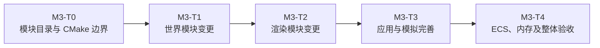
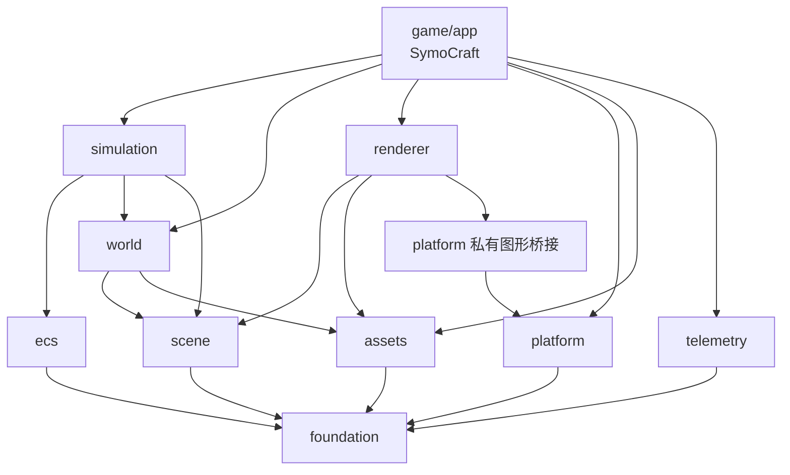
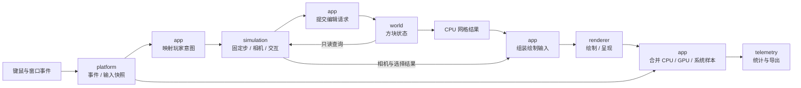

# M3-T0 模块软硬边界

关联规划：[项目范围与 M3 任务](project-scope.md)。后续模块变更：M3-T1 世界模块、[M3-T2 渲染模块](M3-T2-渲染器重构.md)。本文沿用 [完整功能模板](../Obsidian-功能笔记模板/templates/02-完整功能.md)。

用户已确认总体结构与阶段划分；下文明确拟划分模块的功能和边界，供进一步审核。**本次只更新 spec，目录、target 和接口尚未按本设计迁移，所有验收未执行。**

## 当前设计

| 已有结构 | 当前限制 |
| --- | --- |
| 根 CMake 已区分 `game` 和 `tools/benchmark` | 游戏构建仍集中列出根级 `src/`、`include/` 内大量源文件，不等于游戏内部模块已经解耦 |
| 源码按 world、renderer、ECS、input 等目录组织 | `core.h` 汇集图形、窗口、YAML、内存等依赖；公开头和实现头没有实际隔离 |
| 世界、玩家和渲染已有局部测试 | 部分测试直接编译生产 `.cpp` 并使用替身，尚不能证明生产库依赖正确 |
| 游戏测试在 `tests/`，工具测试在 `tools/benchmark/tests/` | 测试脚手架没有统一归属；生产与测试构建组织需同步调整 |

源码依据：[根构建](../../CMakeLists.txt)、[游戏构建](../../game/CMakeLists.txt)、[公共聚合头](../../include/core.h)、[游戏测试](../../tests/CMakeLists.txt)、[工具构建](../../tools/benchmark/CMakeLists.txt)。已有版本证据见 [M2-T2](../milestones/m2-t2/README.md) 和 [M2-T3](../milestones/m2-t3/README.md)，不代表 T0 已通过。

## 本次变更

### 目标与阶段分工

T0 回答“代码归谁、谁能依赖谁、编译时如何约束”，并在这些边界内迁移现有真实实现。T1/T2 再回答“世界/渲染模块内部要改成什么设计”。不是先造空目录，再把全部断依赖工作留给后续。

| 阶段           | 必做                                       | 不提前做                                                  |
| ------------ | ---------------------------------------- | ----------------------------------------------------- |
| T0 模块解耦      | 生产/测试归位、模块 target、公开/私有头、断环所需最小接口、现有功能回归 | 不更换 ECS、不重写网格/物理算法、不接入 D3D12/Vulkan、不预先实现完整 PImpl 渲染器 |
| T1 世界模块变更    | 在已成立的 world/scene 边界中明确类职责、接口、实现、版本及失效规则 | 不重新制定全项目目录结构，不恢复对 renderer 的依赖                        |
| T2 渲染模块变更    | 在已有 renderer 边界内实现 PImpl、稳定门面和三个后端       | 不把图形 SDK、原生设备或私有头暴露给游戏和世界                             |
| T3/T4 后续模块变更 | 完善应用/模拟类设计、状态及 ECS/内存正确性                 | 不以这些阶段为理由延期 T0 的构建断环和生产/测试隔离                          |



输入：当前工作区实现、现有构建/测试入口和 M2 行为基线。输出：可构建的真实模块、统一测试树、依赖图、公开头清单、迁移记录和回归证据。允许移动实现、拆聚合头、提取中立类型、改为传参或窄查询接口；这些是断依赖所必需的修改，不借机改变玩法。

### 软硬边界的定性

| 边界      | 在本项目中的含义                                        | 如何判断成立                                                   |
| ------- | ----------------------------------------------- | -------------------------------------------------------- |
| 软边界     | 按职责组织文件夹，明确生产、测试、公开头和私有实现的归属                    | 看路径就能知道所有者；相邻模块不因“方便”随意引用内部文件；只改文件夹名字不算解耦                |
| 硬边界     | CMake target 决定每份实现由谁编译、消费者能得到哪些头/编译条件以及必须链接哪些库 | 独立消费者可构建，依赖图无环，错误的越界依赖被检查拒绝；可执行程序不能靠全局 include 和汇总全部源码兜底 |
| 接口契约    | 模块跨边界交换什么数据、谁拥有、何时有效、失败后是什么状态                   | T0 至少明确迁移接口的这些条件；T1/T2 在不破坏模块边界的前提下进一步变更并冻结领域接口          |
| 生产/测试隔离 | test 使用 game 的能力，game 不使用 test 的能力              | 关闭测试仍可构建/运行产品；测试脚手架不进入产品依赖或安装包                           |

软边界便于理解和维护，硬边界让依赖关系受到构建与检查约束；两者必须同时成立。CMake 不是文件系统访问控制，因此“PRIVATE 已写好”也不能替代越界 include 的检查。

### 目录归属

“release 模块代码”在本项目指生产代码，Debug/Release 都编译同一套实现；不是只供 Release 配置使用，也不是 exe、lib 或发布包目录。

```text
game/
  CMakeLists.txt                       # 游戏模块组织，不再罗列所有实现文件
  app/
    CMakeLists.txt                     # SymoCraft 可执行程序
    src/                              # main、Application、启动选项与编排
  modules/
    foundation/
    scene/
    assets/
    world/
    ecs/
    simulation/
    platform/
    renderer/                         # OpenGL 及后续 D3D12/Vulkan 都在这里
    telemetry/

test/
  CMakeLists.txt
  unit/<模块>/                        # 模块级测试及自己的 CMakeLists.txt
  integration/                        # 跨模块、安装包、启动及运行回归
  benchmark/                          # 独立 benchmark 工具及脚本的测试
  support/                            # fixture、mock、故障注入和测试辅助进程

tools/benchmark/                      # 工具生产代码，保持独立构建入口
assets/                               # 真实游戏资源，本次不搬
vendor/                               # 第三方依赖，本次不整体搬
cmake/                                # 工具链、第三方和部署辅助规则
scripts/                              # 正常构建、运行与采样工具
docs/                                 # 设计、报告与历史证据
out/                                  # 构建、运行证据、安装包等生成产物
```

九个生产模块内部统一采用 `CMakeLists.txt`、`include/symocraft/<模块>/`、`src/`。纯数据头模块可以没有无意义的 `.cpp`；其 INTERFACE target 必须真正承载使用要求和被验证的数据契约。模块内不再放 `tests/`；T2 的后端私有子目录仍位于 `game/modules/renderer/`。

根级旧 `src/`、`include/`、`tests/` 中的自有源码逐项迁移，不保留第二套继续参与编译的副本。历史日志中的旧路径不改写；当前维护的构建脚本、资源部署规则和源码文档链接随实际迁移更新。

### 模块功能总览

先按下面这张表审核“是否需要这个模块”，再看每个模块的边界。不是旧目录有一个名字就必须建一个新库。

| 模块 | 用直白的话说 | 主要产物 |
| --- | --- | --- |
| foundation | 大家共同使用的最小基础词汇 | 基础类型、统一数学约定、诊断和确有共享需求的基础实现 |
| scene | 世界、模拟和渲染之间传递的 CPU 数据格式 | 网格、顶点、纹理层标识、相机描述等值类型 |
| assets | 从交付目录正确找到并读出资源 | 文件字节、解码后的 CPU 图片及明确读取错误 |
| world | 记住哪里有什么方块，并生成可绘制的形状 | 方块数据、查询/编辑、确定性生成、CPU 网格 |
| ecs | 保存“哪些实体拥有哪些组件” | 实体 ID、组件存储、增删和查询能力 |
| simulation | 根据玩家意图和世界状态推进玩法 | 位移/碰撞/跳跃、相机状态、选块和编辑意图 |
| platform | 把操作系统的窗口、事件和输入接进来 | 窗口、焦点/尺寸变化、输入快照、原生图形桥接 |
| renderer | 把 CPU 场景数据变成屏幕上的图像 | GPU 资源、绘制/呈现、截图和图形诊断 |
| telemetry | 把采样结果整理成可以分析的记录 | 帧统计、有效性判断、性能文件和摘要 |
| game/app | 决定以上模块何时工作、如何连接 | 对象生命周期、启动配置与主循环 |
| tools/benchmark | 在游戏进程之外组织和检查基准运行 | 启动/采样编排、文件协议处理及工具界面 |
| test | 验证生产模块，而不是提供游戏功能 | 单元/集成测试、替身和故障注入脚手架 |

### 各模块的职责与审核说明

#### foundation：最小公共基础

- **负责：** 无业务含义的基础类型和数学配置，最小诊断接口，以及多个生产模块确实共用的底层实现。类型别名或数学助手按需包含，不再有一个包办所有依赖的 `core.h`。
- **不负责：** 世界规则、玩家组件、资源路径、图形句柄、全局服务定位和通用线程池框架。
- **输入/输出与所有权：** 传入数值/诊断内容，返回值或输出诊断；不持有世界、窗口或 Registry 单例。
- **来源/依赖：** 拆分 `core.h`、`core/utils.h` 中真正通用的部分；只依赖标准库和明确数学依赖。现有 AmoBase 中仍被多处使用的实现先通过私有适配保留，不顺带重写分配器。
- **审核重点：** 某个类型只有一个模块使用时，应留在那个模块，而不是为了少写 include 放进 foundation。

#### scene：共享 CPU 数据，不是场景管理器

- **负责：** `MeshData`、顶点属性、纹理层标识和相机描述等跨模块值类型。T0 先迁出当前已有数据布局，T1 再完善网格契约，T2 消费这些类型。
- **不负责：** 场景树、实体管理、区块存储、文件加载、GPU 分配、GL 间接绘制命令或帧调度。名字叫 scene 不代表引入一套通用场景系统。
- **输入/输出与所有权：** 构造、传递自有容器或明确生命周期的只读视图；数据不借用不可控的 Chunk/ECS 内部地址。
- **来源/依赖：** 从当前 renderer/world/camera 交叉使用的类型提取，依赖 foundation；不能依赖 world、ecs、platform 或 renderer。
- **审核重点：** world 输出可绘制数据，但不依赖“怎样绘制”的库；renderer 理解网格，不需要理解区块和玩家。

#### assets：资源读取与解码

- **负责：** 保留独立于工作目录的资源定位，读取文件字节，解码 CPU 图片；约定路径、错误和解码数据的所有权。
- **不负责：** 创建纹理/program、选择显卡、解释方块玩法规则或保存游戏世界。方块配置的语义校验属于 world，shader 编译属于 renderer。
- **输入/输出与所有权：** 相对资源名 -> 自有字节/图片结果或具名错误；调用者接收 CPU 数据后决定如何使用。GPU 纹理的寿命不属于 assets。
- **来源/依赖：** `core/asset_paths`、现有纹理加载中的 CPU 解码部分；依赖 foundation，解码库私有。world 的配置适配器可以读取 assets 的结果，不建立 assets -> world 的反向依赖。
- **审核重点：** `assets/` 目录放资源文件，`game/modules/assets/` 放读取资源的代码，两者不是同一个目录职责。

#### world：方块世界与 CPU 网格

- **负责：** 方块类型及配置语义、区块所有权/邻接、坐标转换、读写方块、seed 确定性生成、编辑失效标记和当前 CPU 网格生成。
- **不负责：** 玩家实体创建、输入查询、相机控制、上传顶点或 GPU 绘制。当前 `World::CreatePlayer` 一类逻辑按实际职责移交 simulation/app，而不是仅按文件名整体搬入。
- **输入/输出与所有权：** 生成配置/seed、方块查询/编辑请求 -> 方块状态、结果及 CPU 网格；模块拥有区块，向调用方提供受约束的查询或数据结果。
- **来源/依赖：** `src/world` 中相应实现；依赖 foundation、scene，资源读取适配私有依赖 assets。禁止 renderer、platform、Application 和 ecs。
- **审核重点：** T0 先把现有顶点结果交给应用，再由应用交给 renderer；不在 T0 改变生成顺序、网格算法和有限世界规则。T1 才进一步重构类职责。

#### ecs：实体与组件存储

- **负责：** 实体标识/版本、组件容器、增删查和遍历契约，维持现有存储实现的运行能力。
- **不负责：** 更新物理、读取输入、创建相机、决定世界内容或发起绘制。某段代码现在位于 `core/ECS/Systems`，不代表它应该属于存储模块。
- **输入/输出与所有权：** 实体/组件操作 -> ID、查询结果和受有效期约束的引用；Registry 拥有存储，使用者不得操作私有容器布局。
- **来源/依赖：** Registry、component_container、internal 等存储代码；依赖 foundation，专用内存细节私有。Character/RigidBody 等游戏组件及系统归 simulation。
- **审核重点：** T0 隔离存储，不承诺旧容器所有风险已修复；替换方案、引用失效和分配失败的深入审计仍在 T4。

#### simulation：玩家与游戏规则推进

- **负责：** 角色/刚体/碰撞盒等游戏组件、固定步预算、运动/接地/跳跃、相机姿态、体素射线与编辑约束。玩家初始化也归这一业务层。
- **不负责：** 轮询 GLFW、接收操作系统原生消息、维护 GPU 选择框、写性能文件或决定启动/退出整个程序。
- **输入/输出与所有权：** 玩家输入意图、步进时间、Registry 和世界查询 -> 更新的组件、相机描述、选择结果及编辑请求；具体对象持有/借用在类契约中写清，不能通过 Application 单例获取。
- **来源/依赖：** `ECS/Systems`、playercontroller、camera 的业务逻辑；依赖 foundation、scene、ecs 和 world 的公开查询契约，不依赖 platform/renderer。
- **审核重点：** “鼠标右键按下”是 platform 的输入事实；“是否允许在玩家旁边放块”是 simulation 的规则；“实际修改哪个格子”最终由 world 校验并执行。

#### platform：窗口、事件与输入

- **负责：** 窗口寿命、事件轮询、焦点/尺寸变化、光标和键鼠快照；必要的进程内存/系统信息查询；向图形实现提供受限原生桥接。
- **不负责：** 直接修改玩家组件、构造 view/projection、调用 `glViewport` 绘制、持有 World 或依赖 renderer 实现。
- **输入/输出与所有权：** 操作系统事件/窗口配置 -> 中立事件、输入快照和尺寸；窗口由平台对象管理，renderer 只在约定寿命内借用其图形能力。
- **来源/依赖：** Window 与实际使用的 input/event 适配；依赖 foundation，GLFW/Win32 私有。GL 上下文创建/当前化是平台桥接，GLAD 加载、viewport、纹理和绘制属于 renderer。
- **审核重点：** 原生句柄只对私有图形桥接开放，不以公开 `void*` 让所有模块强转。应用把原始输入映射为 simulation 的玩家意图，两模块不互相引用。

#### renderer：图像生成与 GPU 资源

- **负责：** 接收相机、网格、纹理和选择信息；管理实际图形资源、绘制/呈现、截图、GPU 计时和设备诊断。
- **不负责：** 查询方块、找玩家组件、处理键盘、拥有世界/相机对象，或从 Application 反向取数据。
- **输入/输出与所有权：** CPU 场景数据和借用窗口能力 -> 画面、截图与图形统计；原生资源由 renderer 内部持有，不能由 world/app 操作全局批次。
- **来源/依赖：** `src/renderer`，以及 Application/Window 中散落的图形操作；依赖 foundation、scene、assets 和 platform 窄桥接，不依赖 world/ecs/simulation/app。
- **审核重点：** T0 只形成真实 OpenGL 模块和中立边界，可保留模块内部旧实现；PImpl、实例化门面、资源句柄和 D3D12/Vulkan 属于 T2。无需在 T0 创建空后端库冒充完成。

#### telemetry：统计与结果导出

- **负责：** 接收帧/内存等中立样本，关联样本、标注无效原因、计算统计并导出当前性能协议。
- **不负责：** 向 GPU 发起 query、截图、轮询窗口、控制角色或启动另一个游戏进程。它整理数据，不拥有被测系统。
- **输入/输出与所有权：** 样本及明确配置/元数据 -> 原始记录和摘要；Session 拥有采样记录，不保留 renderer/window 指针。
- **来源/依赖：** `core/performance` 的 CPU 汇总/导出部分；依赖 foundation，YAML 等序列化实现私有。把当前公开的 `YAML::Node` 改成项目数据契约，配置不直接绑定 app 的 `StartupOptions` 类型。
- **审核重点：** GPU 数据由 renderer 产生，系统内存由 platform 采集，应用交给 telemetry；独立 benchmark 在进程外读取文件，不能倒过来被游戏链接。

#### game/app、benchmark 与 test 的位置

`game/app` 是组合入口，不是底层模块可依赖的服务库：解析启动参数，创建和销毁模块对象，把平台输入变为玩家意图，安排模拟/世界编辑/渲染/采样顺序。只编译本层源码并链接模块，不收纳从各模块“临时搬来”的主要算法。

`tools/benchmark` 保持现有独立进程、界面和文件协议职责，不因为共享“性能”一词就并入 telemetry。其生产代码仍在工具目录，自己的 fixture、runner 测试和边界检查迁入 `test/benchmark`；单独配置工具时仍能选择运行这些测试，不依赖整个游戏构建。

`test` 只验证和构造测试环境，不能为正常游戏提供实现。现有 `test_scene`、`benchmark_workload` 等名称须按实际调用判断：已由交付游戏的固定场景/采样入口使用的诊断功能仍属 `game`，分别归 world 的场景数据或 app 的执行编排；只给测试进程使用的 fixture、mock、故障注入才归 `test/support`，不能因文件名含 test 就让生产目标反向依赖 test。

现有 input、camera、event、MemoryAllocator 不自动各建一库：输入事实归 platform，输入意图/相机业务归 simulation，资源读取归 assets，通用/专用内存分别进入 foundation/ecs 的私有实现。无实际调用的旧线程池/输入路径先列清单，再按证据处置，不趁迁移批量删除。

### 依赖方向与运行数据流

下面的箭头表示“左侧编译/接口使用依赖右侧”，不是调用先后。只画项目模块，第三方依赖仍按私有目标管理。



simulation 只消费 world 的公开查询/编辑数据契约；是否调用某个实现由应用传入，不借此暴露区块私有存储。图中省略已由传递依赖表达的 foundation 边。纯公共数据依赖如需单独 INTERFACE target，须有实际头文件消费者，不为凑层数新增空接口库。

运行时的数据流则是：



运行数据流可以反馈，**不表示 CMake 依赖可以成环**。例如 world 向 simulation 提供查询结果，但 world 不包含 simulation 的头；renderer 返回统计结果，但不链接 telemetry。

### 硬边界：target 与构建规则

| 目录 | 目标 | 类型 / 责任 |
| --- | --- | --- |
| `game/modules/foundation` | `symocraft_foundation` | STATIC，公共基础及必需的共享实现 |
| `game/modules/scene` | `symocraft_scene` | INTERFACE，真实共享值类型和数学使用要求 |
| `game/modules/assets` | `symocraft_assets` | STATIC，读取/解码实现 |
| `game/modules/world` | `symocraft_world` | STATIC，世界与 CPU 网格实现 |
| `game/modules/ecs` | `symocraft_ecs` | STATIC，实体/组件存储 |
| `game/modules/simulation` | `symocraft_simulation` | STATIC，游戏规则及步进实现 |
| `game/modules/platform` | `symocraft_platform` | STATIC，窗口与系统适配；原生图形桥接受控开放 |
| `game/modules/renderer` | `symocraft_renderer` | STATIC，T0 先承载隔离后的真实 OpenGL 实现；T2 扩展内部后端 target |
| `game/modules/telemetry` | `symocraft_telemetry` | STATIC，样本聚合及导出 |
| `game/app` | `SymoCraft` | EXECUTABLE，应用编排及生产模块链接 |
| `tools/benchmark` | 现有 `benchmark_core` / `SymoCraftBenchmark` | 保留工具库和程序目标，禁止依赖游戏实现 |
| `test` 各子目录 | 模块测试、集成测试、benchmark 测试和必要 support targets | 只在相应测试配置启用，永不成为生产 target 的依赖 |

根 CMake 负责选择 game、工具和 test；`game/CMakeLists.txt` 负责生产模块组织及应用选择；每个模块只声明自己的源文件、公开 include 根和依赖。配置 CPU 测试时可只启用所需游戏 CPU 库而不构建 `SymoCraft`、platform 或 renderer，不得将 CPU 库创建与游戏窗口程序强行绑定。

1. 模块自己的 `include/` 才是公开头根，`src/` 为 PRIVATE；对方的 `src/`、根级旧 include 和整个仓库路径都不能作为兜底搜索路径。
2. PUBLIC 表达公开头真正需要的依赖，PRIVATE 表达实现需要的依赖，INTERFACE 表达纯头契约。使用 `PRIVATE` 不会消除静态库最终链接所需的库，也不自动禁止用相对路径偷包含，因此还要检查依赖图和越界 include。
3. GLFW/GLAD、YAML、图片解码、噪声等依赖按使用者授权；公共头移除 SDK/解析器原生类型。现有 GLM 使用宽泛 vendor 路径的问题通过受限头路径或构建期头视图解决，不因此整体搬迁 vendor 源码。
4. 一个生产 `.cpp` 只归一个生产 target。测试链接正式 target，不把同一实现再编译成另一套“测试版本”；依赖替换通过窄接口或已有函数指针测试入口完成。
5. API 契约测试只用公开头；确需白盒检查的测试仅私有获得被测模块指定内部路径，列入白名单，不向别的测试/生产 target 传递，也不能因此改变生产依赖。
6. `BUILD_TESTING=OFF` 不创建测试/support targets、不查找测试框架、不安装 fixture。Debug/Release 生产代码位置一致，不建立 `release/`、`debug/` 双份源码。
7. 根级构建与 benchmark 单独构建各有唯一的测试注册入口；工具独立配置可直接加入 `test/benchmark` 的必要子目录，不因此加入 game，也不重复定义 target/CTest 名称。
8. 保留资源随 exe 部署、当前无关 CWD 启动和生成产物在 `out/` 的约定；迁移代码后必须复核资产源路径、生成文件路径和安装依赖，不能靠改变工作目录修复。

测试树按 `test/unit/<模块>`、`test/integration`、`test/benchmark`、`test/support` 分责；测试专用 CMake/PowerShell 探针进入对应测试目录，正常构建/人工采样工具仍在 scripts，历史验收脚本与日志保留历史定位。

### 必要迁移与不变量

| 编号 | 迁移后必须成立 | 允许保留到后续的内部实现 |
| --- | --- | --- |
| B1 | world 不包含 renderer/平台 SDK，GPU 命令不在区块公开数据中 | 旧 CPU 网格算法和区块内部方法，可由 T1 再重构 |
| B2 | simulation 不读取 GLFW 或 Application，全局窗口回调不直接写 ECS | 原运动/碰撞算法，由 T3 完善类设计和场景覆盖 |
| B3 | renderer 只接受显式场景输入，通过私有桥接使用窗口；不回读 Application/World | 模块内部的旧 OpenGL 批次、私有状态，可由 T2 改为 PImpl/句柄模型 |
| B4 | CPU 数据、资源读取与统计导出不间接包含图形 SDK | 算法、序列化输出和确定性场景格式保持现状 |
| B5 | 生产模块不能包含、链接或运行依赖 test/support | 测试本身可以使用独立辅助进程，必须只被测试构建启用 |
| B6 | 所有模块依赖与公开 include 都能在 CMake 中解释，依赖图无环 | 不为目录整齐强行拆成每类一个库；内部细分按后续需求进行 |

`core/constants`、`core/utils`、`ECS/component` 等混合文件按内容拆分，不整体丢进 foundation；共用数据可以迁到 scene，方块规则归 world，玩家组件归 simulation。遗留接口若仍使 B1-B6 失效，不能称为“暂时兼容”并通过 T0。

### 实施顺序

| 步骤 | 主要交付 | 检查点 |
| --- | --- | --- |
| S0 基线与归属清单 | 保存当前源码/构建身份、测试清单和模块归属，确认此次要保留的行为 | 用户工作区改动不丢失，历史结果不冒充迁移后结果 |
| S1 数据与底层迁移 | foundation、scene、assets、ecs、telemetry 的真实目标与受限头路径 | 无图形 CPU 消费者可编译，输出协议不变 |
| S2 世界与模拟断环 | world、simulation 迁移，显式查询/输入/输出，移除反向全局访问 | seed/场景摘要及现有数学/网格回归正确 |
| S3 平台、渲染与 app | 窗口事件/图形桥接、真实 GL 模块、应用连接与生命周期 | 不改变旧玩法，图形释放仍先于窗口 |
| S4 测试与工具归位 | root test 树、正式库链接、benchmark 独立测试入口 | 无重复生产编译，生产目标不反向依赖测试脚手架 |
| S5 全面验证与交付 | 下表证据、公开头清单、实际 target 图和未解决事项 | 全部边界成立后申请 T0 验收，才进入 T1 |

迁移期间可以分批调整测试路径以保持每步可验证；S4 是统一收尾，不要求此前暂停测试。若发现现有 bug，分别记录“迁移导致的回归”和“历史缺陷”，不能把与结构无关的大修混入 T0。

### 验收案例

| 状态 | 场景 | 预期行为 |
| --- | --- | --- |
| [ ] | T0-A01 目录及源码归属 | 九个生产模块和 app 位于 game；renderer 不在根级独立生产目录；测试脚手架位于 root test；旧源码不留重复编译副本 |
| [ ] | T0-A02 公开头独立消费者 | 每模块的公开头按其 target 使用要求可独立编译；不依赖先包含 core.h/私有头或游戏预编译头 |
| [ ] | T0-A03 负向边界检查 | 故意引入 world -> renderer、simulation -> platform、模块 -> app、production -> test 或私有跨模块 include 时，构建约束/检查明确拒绝 |
| [ ] | T0-A04 目标依赖图与生产源码清单 | 无环；每个生产源文件只有一个实现所有者；模块有真实内容，不以空目标和可执行程序兜底实现 |
| [ ] | T0-A05 CPU-only 测试 | 不查找/链接 GLFW、GLAD、D3D12/Vulkan，运行 world、ecs、simulation、assets、telemetry 等适用 CPU 测试，无需窗口 |
| [ ] | T0-A06 Debug/Release 干净构建 | 游戏和选定测试均通过，不依赖旧目录对象或 IDE 隐式 include；两种配置使用同一生产模块树 |
| [ ] | T0-A07 关闭测试 | `BUILD_TESTING=OFF` 不查找测试依赖、不构建/安装测试程序；游戏及工具正常链接 |
| [ ] | T0-A08 单独构建 benchmark | 保留独立构建/运行能力；启用工具测试时从 test/benchmark 注册，未链接游戏/渲染器，无重复测试名称 |
| [ ] | T0-A09 测试真实性与覆盖保持 | 已有测试按配置逐项迁移，链接正式生产模块；旧替身的范围透明，未通过跳过失败用例或放宽 include 来凑通过 |
| [ ] | T0-A10 私有头增量修改 | 改动 renderer 私有实现头不会重编译 world/模拟/游戏调用者；公开契约修改会重编译真实依赖方，仍正确重链接 |
| [ ] | T0-A11 世界与采样结果 | 固定 seed/配置的摘要、网格边界结果和既有性能文件协议保持一致；场景/计时语义不因搬迁静默改变 |
| [ ] | T0-A12 真实 OpenGL 回归 | 完成有限帧渲染、受影响的移动/编辑/窗口恢复及正常退出检查；迁移前后基线可比较，资源先于上下文清理 |
| [ ] | T0-A13 安装包与资源失败 | 在无关 CWD 启动安装包；资源定位、缺失/损坏诊断与退出语义不变，原资产未为测试故障被修改 |

环境 / 运行入口：沿用 Windows x64、MSVC、现有 Debug/Release 构建与固定场景；迁移实施时记录最终配置选项和测试命令。只编译一个游戏可执行文件不能替代上表的边界验证。

验证版本 / 结果与证据：**无，本次只写设计。** 按 T0-A01 至 A13 记录构建身份、完整日志、目标图、接口消费者及负向检查、源文件迁移清单、失败复测和实际运行结果。验收通过后才更新“当前设计”；本 spec 不改变 M2 的未完成状态。

### 本次审核关注点

1. 九个模块的职责是否容易区分，尤其 scene 只是数据格式、ecs 只是存储、simulation 才是玩法。
2. game/app 只负责组合，renderer 属于游戏生产模块，test 不给生产代码提供能力。
3. T0 是否在不重写算法的前提下真正切断依赖，而不是只移动文件；T1/T2 仍有清晰独立的模块变更范围。

目录原则与 T0/T1/T2 顺序已经确认；以上功能划分仍作为可审核的设计明示，不将 spec 更新等同于实现批准或验收通过。

## 后续考虑

| 触发条件 | 再考虑的变化 |
| --- | --- |
| 某模块在实际迁移中没有独立职责、实现或消费者 | 提交合并理由并同步依赖图，不保留空壳库 |
| 多个真实调用方需要新的公共能力 | 先明确所有者与数据契约，再决定新增模块；不默认放入 foundation |
| T1/T2 需要改变已公开的数据契约 | 按模块变更需求更新接口、调用方和测试，不绕过 T0 的目录/CMake 约束 |
| 后续出现插件、并发或动态世界需求 | 另立生命周期和接口设计，不从本轮目录解耦推定已支持 |
