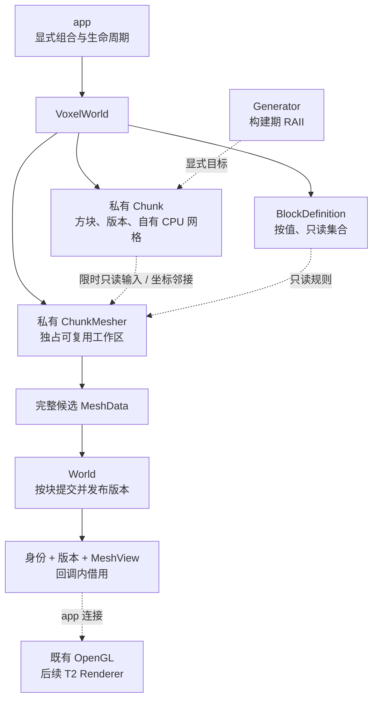
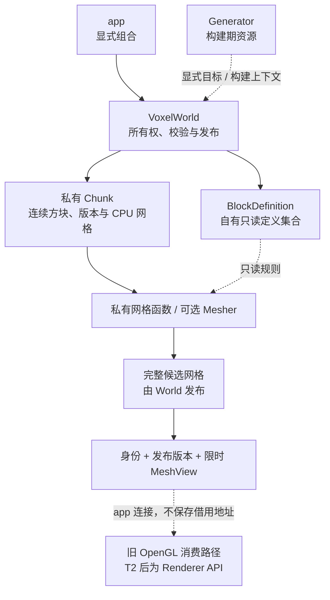

# M3-T1 世界模块重构：实例所有权与 CPU 网格契约

关联规划：[项目范围与 M3 任务](project-scope.md)。前置边界：[M3-T0 模块软硬边界](M3-T0-模块软硬边界.md)。后续消费者：[M3-T3 渲染器重构](M3-T3-渲染器重构.md)。文档结构沿用 [完整功能模板](../Obsidian-功能笔记模板/templates/02-完整功能.md)，其余模块设计见 [架构初稿](project-architecture/面向对象与数据导向架构设计初稿.md)。

编号说明：2026-10-07 用户确认将 SDL3 迁移前移为新 T2，并已填写方案；当前入口为 [T2 正式计划](M3-T2-SDL3迁移.md#已确定的决策)，原 draft 见其 [归档附录](M3-T2-SDL3迁移.md#附录归档)。原 T2 渲染任务改为 T3，原应用与 ECS 后续工作现为 T4/T5；先迁移验收再冻结 T3 渲染器 spec。本文已交付契约及历史草稿附录保留原编号，其中 T2 消费者仍指原渲染任务（现 T3）；CPU 数据约定、验收状态和延期问题不变。当前交接入口为 [T1→T3 CPU 契约清单](M3-T1-T3-CPU契约清单.md)。

> 本文是 T1 正式任务契约，D08 采用方案二，其余 D01–D07、D09 采用方案一。2026-10-06 用户授权实施，现已落地并完成自动验证；人工两项问题按用户要求延期，其余项目确认正常，技术交付完成、节点待批准。统一见 [T1 报告](../milestones/m3-t1/README.md)，不预先宣布阶段通过。完整草稿只作历史附录。

2026-10-07 用户澄清：树叶剔除与视角突变不属于本 spec，也不属于 T2 前置范围；两项继续延期，T2 准备已获直接授权。不据此修改历史实测或扩展本轮修复范围。

**契约优先级：** 本文“本次变更”是 T1 的实施与验收依据；附录为历史审核快照，保留原有“待确认”、推荐与未选方案，不再构成实施要求。T0 的依赖/目录约束和 T2 的图形后端验收继续独立有效；发现冲突先修订相应契约，不静默扩大范围。

## 阅读导航

| 阅读目的 | 入口 |
| --- | --- |
| 核对已选方案 | [[M3-T1-世界模块重构#已确定的决策\|九项决策]] |
| 理解对象、数据与 Mesher | [[M3-T1-世界模块重构#世界对象与数据所有权\|职责与所有权]]、[[M3-T1-世界模块重构#ChunkMesher工作区与失败恢复\|Mesher]] |
| 审公开操作和生命周期 | [[M3-T1-世界模块重构#公开数据与接口契约\|公开契约]]、[[M3-T1-世界模块重构#状态、RAII与失败保证\|版本与 RAII]] |
| 审迁移和完成门槛 | [[M3-T1-世界模块重构#实施步骤与完成条件\|实施步骤]]、[[M3-T1-世界模块重构#验收案例\|验收表]] |
| 查看原始选择与对比 | [[M3-T1-世界模块重构#附录：Spec Draft归档\|完整草稿归档]] |

## 当前设计

本节保留 T0 重构前快照，旧源码以起点提交 `d79d255` / 修改前归档为准；表中未删除路径现已承载 T1，不以当前文件反证旧事实。实际 T1 设计见 [world 笔记](../project/architecture/world/World-功能.md)。

| 能力     | 现有形态与行为                                                 | 源码依据                                                                                                                                                 |
| ------ | ------------------------------------------------------- | ---------------------------------------------------------------------------------------------------------------------------------------------------- |
| 世界存储   | 文件级 `chunks`；ChunkManager 函数隐式访问它，Chunk 暴露方块/顶点/状态及邻居指针 | [原管理器的 T0 归档](../milestones/m3-t0/README.md)、[Chunk 路径](../../game/modules/world/src/chunk.h)                                                        |
| 方块定义   | 两份全局 map；配置从路径读取；未知规则退回空规则，未知名称退回 0                     | [定义实现](../../game/modules/world/src/block.cpp)、[公开声明](../../game/modules/world/include/symocraft/world/block.h)                                      |
| 编辑     | 合法设置/删除都会置脏；`Block::operator==` 只比较 ID；设置会同步三项材料标记      | [编辑及邻接](../../game/modules/world/src/chunk.cpp)                                                                                                      |
| 生成     | Generator 自有噪声；全部地形后按区块 x,z 顺序生成植被，跨块重叠后写覆盖             | [Generator](../../game/modules/world/include/symocraft/world/generation.h)、[生成实现](../../game/modules/world/src/generation.cpp)                       |
| CPU 网格 | 共享 `g_normal/block_faces`；域外不当空气，边缘区块不构建/交付网格，访问跳过空结果   | [原网格路径](../../game/modules/world/src/chunk.cpp)、[原遍历的 T0 归档](../milestones/m3-t0/README.md)                                                          |
| 消费与测试  | app、模拟和固定场景使用全局 world；已有真实生产库配置、生成及网格安全测试               | [应用](../../game/app/src/application.cpp)、[物理](../../game/modules/simulation/src/physics_system.cpp)、[world 测试](../../test/unit/world/CMakeLists.txt) |

当前方块 AoS 索引为 `(y * 16 + x) * 16 + z`；每块 `16 × 16 × 256 = 65,536` 格。默认半径 10 共 `441` 块、`28,901,376` 格，包含边缘区块；现有 Generator 半径范围为 2–10。此规模不是每帧扫描量。CPU 顶点为 28 字节 `BlockVertex3D`，见 [scene 网格契约](../../game/modules/scene/include/symocraft/scene/mesh.h)。

已有版本证据见 [T0 报告](../milestones/m3-t0/README.md)、[M2-T2](../milestones/m2-t2/README.md)、[M2-T3](../milestones/m2-t3/README.md)。本次没有重新运行这些场景，旧证据不能直接作为 T1 通过结论。

## 本次变更

### 目标与范围

目标：一份世界由一个明确实例拥有；定义、生成、编辑和 CPU 网格构建在 T0 已成立的边界内解耦。公开操作稳定，状态变化、借用和失败可验证；旧 OpenGL 玩法继续使用同一实例，向 T2 交付中立 CPU 契约。

| 项目 | 本轮要求 |
| --- | --- |
| 输入 | 配置文本、已校验定义、显式 seed/生成设置、查询/编辑请求；不传 StartupOptions、窗口或图形对象 |
| 输出 | 独占 World、查询/规则值、编辑结果、自有 CPU 网格、网格身份/发布版本/限时视图，以及原有生成元数据 |
| OOP 与 DOD | 对象维护所有权、生命周期与不变量；连续 Block/顶点和批量算法保留简单表示，计算助手可保留函数 |
| 必做 | 定义按值归 World、显式实例、整数坐标、按值规则查询、无变化编辑不置脏、坐标邻接、按块发布、私有 Mesher、Chunk 禁止复制/移动 |
| 不包含 | 存档/联网、流式加载卸载、无限世界、并行构建/线程池、SoA/SIMD、greedy meshing、新光照/透明/剔除算法、窗口库替换、完整 T3/T4 对象体系或新图形后端 |
| 兼容底线 | 生成配置/版本、摘要编码、植被顺序、边缘/域外规则、单块顶点格式/顺序、原玩法与性能文件协议不静默改变 |

**本次正式化补足的细节：** 下面明确初始网格时点、结果状态、版本初值/溢出、遍历及首错策略。这些是依据已选方向形成的实施约定，不声称用户在原决策表逐项填写过所有类型和字段。C++ 声明完整清单在 T1-S1 落到设计笔记/公开头清单，不能重新打开已选架构方案或改变下述行为。

### 已确定的决策

| 编号  | 用户选择 | 正式采用的方案                                         | 原选择记录                                           |
| --- | ---- | ----------------------------------------------- | ----------------------------------------------- |
| D01 | 方案一  | 受控工厂返回 `unique_ptr<VoxelWorld>`；失败不返回半初始化实例     | [[M3-T1-世界模块重构#归档 - D01 世界创建入口\|原表]]            |
| D02 | 方案一  | 核心查询/编辑使用整数格坐标；一个显式浮点转换入口                       | [[M3-T1-世界模块重构#归档 - D02 查询与编辑的坐标类型\|原表]]        |
| D03 | 方案一  | 规则查询返回自有小型值及明确缺失状态，不返回容器借用                      | [[M3-T1-世界模块重构#归档 - D03 定义查询的返回所有权\|原表]]        |
| D04 | 方案一  | 完整受影响状态无变化则返回 Unchanged，不推进版本或新增脏状态             | [[M3-T1-世界模块重构#归档 - D04 无变化编辑与版本策略\|原表]]        |
| D05 | 方案一  | 邻格按坐标经当前 World 查找；只允许单次构建内的局部邻接视图               | [[M3-T1-世界模块重构#归档 - D05 私有邻接读取\|原表]]            |
| D06 | 方案一  | 网格身份为 World 身份 + ChunkCoord，重建不换身份              | [[M3-T1-世界模块重构#归档 - D06 CPU网格的稳定标识\|原表]]        |
| D07 | 方案一  | 按块完整发布；后续失败不撤回前面成功块，首错停止并传播                     | [[M3-T1-世界模块重构#归档 - D07 多个脏块的发布失败边界\|原表]]       |
| D08 | 方案二  | World 私有拥有具体 ChunkMesher，独占 scratch 串行复用，失败后可恢复 | [[M3-T1-世界模块重构#归档 - D08 函数还是私有ChunkMesher\|原表]] |
| D09 | 方案一  | Chunk 明确禁止复制/移动，使用稳定节点或独占指针的私有存储                | [[M3-T1-世界模块重构#归档 - D09 私有Chunk的移动语义\|原表]]      |

未选方案仅保留在归档的对比表中。World 不强制采用 PImpl；公开头不得泄漏 Chunk、YAML 或私有容器。Renderer 的 PImpl 仍以 T2 为准。

### 世界对象与数据所有权

| 对象 / 能力 | 自有内容 | 负责 | 不负责 |
| --- | --- | --- | --- |
| `World::BlockDefinition` | 完整 ID -> 规则、名称 -> ID 集合 | 从文本建立/校验，只读查找，验证纹理层范围 | 不是一条规则/一格方块/GPU 材质；不拥有 World、资产系统或纹理句柄 |
| `World::VoxelWorld` | 按值定义、实际生成设置/元数据、独占 Chunk 集合、一个私有 Mesher | 查询、受控编辑、邻接、版本、完整网格发布、摘要/出生点 | 不拥有 renderer/window/Registry/telemetry，不读取 app 全局当前世界 |
| 私有 `Chunk` | 固定坐标、连续方块、自有 CPU 网格、三种版本状态 | 存储本块；内部写入只经 World 控制 | 不向外提供地址/可写数组，不拥有邻块，不承担生成配置/任务调度 |
| `Generation::Generator` | 现有 settings/noise/noise_seeds | 构建期生成，显式写入目标 World 的私有构建范围 | 不强制常驻 World，不新增 GeneratorManager，不保留全局随机游标 |
| 私有 `ChunkMesher` | 自有工作缓冲及可复用容量 | 同步生成完整候选 CPU 网格，恢复工作区 | 不编辑方块、不发布网格、不处理文件/GPU/任务队列，不拥有长期邻块指针 |
| 中立值 / 算法 | Block、规则值、坐标、结果、MeshData/MeshView；坐标随机派生和摘要函数 | 连续批量处理与显式交接 | 不变成逐格堆对象/虚函数；热路径不用 Data::Value/YAML 动态 map |



单条规则统一称 `BlockDefinitionEntry`，字段覆盖现有 `BlockFormat` 的纹理层、碰撞/透明/混合与发光规则；`BlockDefinition` 是集合，两者不混名。Block 仍是每格的轻量值，外部拿到的副本不能改写 World。私有邻接依赖本 World 坐标查找，不保留现有四向长期 Chunk 指针；局部视图只在当前同步 Build 内有效。

### 公开数据与接口契约

下表冻结语义、所有权与具名入口；现行精确声明与字段清单见 [World 类](../project/architecture/world/World-类设计.md)和[数据契约](../project/architecture/world/World-数据设计.md)。C++20 使用自有结构/`std::optional`，不引入全项目 Result 框架或依赖 C++23 expected。

| 数据 | 内容 / 有效期 | 所属边界 |
| --- | --- | --- |
| `BlockId`、`BlockCoord`、`ChunkCoord` | ID 沿用 uint16；格坐标为 i32 x/y/z；块坐标为 i32 x/z | world 公共值；内存布局/容器不成为契约 |
| `BlockDefinitionEntry` | 必要规则的自有小值，名称查询另返回 ID；结果不引用 map/字符串内存 | world；未知 ID/名称返回空 optional，不当空气 |
| `BlockQueryResult` | Found + 自有 Block，或 OutsideWorld；空气是 Found 的合法 ID=1，域外不是存储中的 ID=0 | world；调用方显式处理域外，旧 NULL_BLOCK 适配不混入合法存储 |
| `EditRequest/EditResult` | Set/Remove、整数坐标及 Set 的 ID；结果为 Rejected/Unchanged/Changed，拒绝原因含域外/未知 ID | world；不把资源异常报告成普通拒绝 |
| `WorldId`、`MeshIdentity` | 进程内不重复使用的 World 身份 + ChunkCoord；不取 Chunk 地址、不作存档身份 | world 数据，经 app 建立映射；renderer 不因此依赖 world |
| `MeshData/MeshView` | 自有顶点容器 / 只读 span，沿用 BlockVertex3D 格式与属性 | scene 描述中立 CPU 格式，world 拥有最终实例 |
| `WorldMeshRecord` | MeshIdentity、已发布 Revision、MeshView；另含 mesh_input_revision 用于诊断，不把输入版本冒充已发布版本 | world 输出；视图最长至对应回调结束，标识/版本值可复制 |
| `Revision` | uint64，不回绕；创建后的初始内容/输入版本为 1，已发布版本初始无值 | world；精确推进与溢出见后文 |
| 生成设置/元数据 | 复用现有 Settings/Timings；World 保留实际配置、版本/派生 seed，Describe 返回自有 Data::Value | world/foundation 冷路径；原摘要/报告字段不重命名 |

| 签名 / 入口 | 调用方与可见范围 | 预期行为：输出及状态变化 | 前提 / 边界 | 失败反馈及失败后状态 |
| --- | --- | --- | --- | --- |
| `BlockDefinition::FromConfig(text)` | app、CPU 工具/测试 | 返回完整自有集合，内部解析 YAML 文本而非路径 | 文本借用仅至返回；assets 读取文本由 app 组合 | 配置诊断异常；已有定义/世界不改写 |
| `Find(id)/FindId(name)` | 规则消费者 | 返回 optional 规则副本 / optional ID | 只读，合法空气与缺失不同 | 缺失是正常结果；不可退回空规则掩盖错误 |
| `ValidateTextureLayers(layer_count)` | app/CPU 校验 | 校验全部定义纹理索引，不操作 GPU | count 必须 >0；app 在首次绘制前与实际资产层数对照 | 非法层数/索引明确报错；集合不变 |
| `VoxelWorld::Create(definition, settings, timings*)` | app、CPU 工具/测试 | 返回独占完整方块世界，按值接管定义；可填既有生成分段耗时 | 工厂是唯一创建入口；设置/完整有限世界规则沿用基线 | 参数先校验；失败不返回对象、不损坏另一 World；已获得资源 RAII 清理 |
| `TryToBlockCoord(position)` | 浮点位置的旧调用方 | 唯一显式转换：逐轴 floor 后检查 i32 可表示性，返回 optional 格坐标 | 拒绝 NaN/Inf/超范围；不以截断替代负数 floor | 返回缺失，不做非法浮点转整数、不改世界 |
| `QueryBlock(BlockCoord)/DescribeBlock(BlockId)` | 碰撞/射线/交互 | 返回方块自有结果 / optional 规则副本 | x,z 用 floorDiv(坐标,16)，局部坐标为 0–15；y 为 0–255 | 域外明确返回 OutsideWorld；规则缺失明确 optional |
| `TryEdit(EditRequest)` | app/玩法/固定场景 | 校验后返回三态，Changed 同步提交内容与受影响版本 | Remove 使用既有空气状态；Set 不隐式重置未受操作影响的光字段 | Rejected/准备失败无副作用；Unchanged 保留调用前脏状态，不强制清脏 |
| `RebuildDirtyMeshes()` | app 同步阶段 | 固定 x,z 顺序按块构建/发布，返回成功发布块数，空发布也计入 | 只处理既有非边缘可绘制块；不跨调用暴露半成品 | 首错停止并传播；先成功块保留，失败/未处理块仍待更新 |
| `VisitMeshes(visitor)` | app、CPU 消费者 | 固定 x,z 顺序提供所有已发布非边缘网格，包括空结果和仍待更新的旧发布结果 | 不自动重建；视图借用限当前回调，访问期间禁止任何 World 修改/重入遍历 | 回调异常传播，退出访问状态由作用域 guard 恢复；World 数据不变，可再访问/重建 |
| `Digest()/FindSpawn()/Describe()/ChunkCount()/Identity()` | app、工具/测试 | 返回当前实例摘要/出生点/自有元数据及数量/身份 | 定义查找与生成报告都绑定本实例 | 保留既有摘要/出生点规则与异常；不访问隐式全局世界 |

浮点查询/编辑调用方先通过同一个转换入口，转换失败不得当有效编辑统计。核心操作不另开一套 float 重载做不同转换。例如 `x=-1` 属块 `-1`、局部 x=15；`x=16` 属块 1、局部 x=0。域外在旧玩法适配中仍遵守原碰撞政策，不顺便变成墙或空气；UnknownBlockId 则明确拒绝，不能混同域外。

**创建完成与初始网格：** 工厂成功表示定义、配置、全部方块和邻接查找范围完整，不表示已创建 GPU 或所有 CPU 网格。初始网格保持未发布，app 在固定场景安装/启动前编辑之后显式调用 RebuildDirtyMeshes，再进入首帧。这保留生成、夹具、first_mesh 与上传的测量分段；CPU-only 摘要工具无需生成网格。VisitMeshes 不输出“尚未发布”块，不能把它当已发布空网格。

| 私有函数 / 能力 | 内部调用方 | 预期行为：处理规则与副作用 | 前提 / 失败传播及清理 |
| --- | --- | --- | --- |
| 定义解析/校验 | FromConfig | 先建候选两张表；检查 ID/名称唯一、字段与现有必需名称/ID 1–11 映射 | YAML 类型仅私有；失败释放候选，不替换旧集合；未知 ID=0 不进入世界 |
| Build/Populate 的显式目标 | 工厂及私有构建上下文 | 先全部地形，再固定 x,z 顺序植被；保留 RNG、写入、摘要及半径 2–10 | 不对外暴露“空世界再填充”；失败世界不发布，Generator 自动清理 |
| 坐标邻接 / 编辑准备 | 查询、TryEdit、Mesher | 校验索引，读取本 World 邻格；预先收集所有受影响块、准备版本增量 | 不保存长期可写引用；提交前检查可能失败步骤，之后内容/版本提交不抛异常 |
| `ChunkMesher::Build(input, rules) -> MeshData` | World 同步重建 | 使用私有 scratch 构建完整自有候选，固定面表 constexpr、可变临时量无共享全局 | 输入借用只持续本次 Build；失败清理候选/恢复工作区，不改最终 mesh 或发布版本 |
| 单块 CommitMesh | RebuildDirtyMeshes | 以不抛异常的所有权交换替换完整网格，再更新发布版本 | 旧 mesh/版本不能在构建成功前被清空；不增加整批事务 |

**CPU 表面提取不等于相机可见性：** 保留当前六邻格规则及“邻格非 NULL 且透明才输出面”，每面四个角点展开为两三角形六顶点；不改变顶点绕序、UV、纹理层与法线编码。边缘区块仍保留在方块/摘要中但不进入可绘制网格集合。视锥/遮挡与 GPU 剔除不归 Mesher，本轮不新增算法。

### ChunkMesher工作区与失败恢复

采用 D08 方案二：每个 World 私有拥有一个具体 ChunkMesher，当前同步串行使用，不是每个 Chunk 各放一个 Mesher，也不建立公共 MeshBuilder 基类、全局服务或任务池。

**跨调用复用的准确含义：** 同一对象的 Build(A) 返回后，临时内容清理，合适的工作容量仍由该 Mesher 拥有；下一次 Build(B) 或下一帧重建 A 可继续使用。容量不足可以扩展，销毁 World/Mesher 时由成员释放。它不表示同一工作区可同时供多个任务使用。

| 边界 | 必须做到 | 不得据此声称 |
| --- | --- | --- |
| 输入 | 方块/邻接/规则只在本次同步 Build 内只读借用；不缓存长期 Chunk 指针 | 建了类就支持后台访问、区块卸载或并发 |
| scratch | 类笔记列出真实自有工作数据、容量复用点与清理方式；固定模板可 constexpr | 只套空类就减少分配；为复用强制增加全量面表/整世界副本 |
| 输出 | 返回完整自有 MeshData；不引用即将复用的 scratch，World 决定发布 | 复用下一次 scratch 可以覆盖上一次已发布网格 |
| 成功 | 临时逻辑状态恢复，可继续 Build；最终输出的内存所有权已经独立 | 将输出容器移走后，原容量仍必然留在 Mesher |
| 失败 | 候选输出由 RAII 清理；作用域清理恢复工作区/执行标记，再传播原错误；下次 Build 可用 | Mesher 负责回滚方块、回滚已成功块或伪造新发布版本 |
| 内存与收益 | 记录 scratch 及候选/旧网格并存的实际峰值；仅保留合理可复用容量，不保留历次输出 | 所有构建零分配、内存必然更少或 FPS 必然更高 |

具体容器/容量增长策略是私有实现细节，但实际复用与失败后再次使用必须有测试；不能把工作区借用藏入返回值。发布提交不得抛异常；若无法满足，先修改本契约并明确状态保证，不能靠 Release 断言遮盖。

### 状态、RAII与失败保证

#### 版本与编辑提交

每块的 `content_revision` 只描述本块内容；`mesh_input_revision` 包含本块内容及邻接可见性变化；`published_mesh_revision` 是最后完整成功网格的输入版本。三者均为进程内运行状态，不是存档协议。

| 场景 | 内容版本 | 网格输入版本 | 已发布网格/版本 |
| --- | --- | --- | --- |
| 工厂完成生成 | 设为 1，生成内的写入不计为运行时编辑次数 | 设为 1 | 未发布，无视图；不是已发布空结果 |
| Rejected | 所有块不变 | 所有块不变 | 不变 |
| Unchanged | 不变 | 不变；已有脏状态保留 | 不变 |
| Changed | 目标块 +1 | 目标块 +1；触及 x/z 边界时，存在的受影响四向邻块也各 +1 | 保留旧网格/版本，直到重建成功 |
| 单块完整发布（含空 mesh） | 不变 | 不变 | 以当前输入版本发布完整候选 |
| 单块构建失败 | 不变 | 不变，仍待更新 | 失败块旧网格/旧版本不变；此前已发布块不回滚 |

边角最多涉及本块及对应两个水平邻块，不额外标记无关系对角块；y=0/255 没有新增上下区块。即使相邻块本已待更新，输入版本也反映本次新变化。边缘块继续遵守原“无可绘制网格”政策，不因 pending 状态被自动纳入构建/访问。

Set/Remove 先按旧操作规则算出候选 Block，再逐字段比较所有实际受影响状态。相同 ID 但材料标记需要纠正属于 Changed；相同 ID/标记且其他受影响状态也相同才是 Unchanged。不能直接使用当前只比较 ID 的 operator==，也不能用包含 padding 的 memcmp。未受操作影响的光字段沿用现有规则，不借 T1 改成另一套初始化/光照算法。

提交前完成 ID/坐标校验、受影响块查找及所有可能失败准备。所有待推进版本均检查 uint64 上限；将溢出时在提交前报告 RevisionExhausted，内容/版本不变，不回绕。准备完成后，一次操作的内容及所有受影响输入版本共同以不抛异常步骤提交。

#### 按块发布与视图寿命

RebuildDirtyMeshes 按固定 x,z 顺序逐块处理：完整 Build -> 检查尺寸/格式 -> 无异常交换自有网格 -> 发布版本。首个失败停止并传播，已成功块保持新结果，失败及尚未处理块保留待更新状态；再次调用只需处理仍待更新块。这不是多块统一事务，更不是方块编辑回滚。

MeshIdentity 在同一 World/Chunk 生命周期内不随重建变化；WorldId 只保证进程内独立实例区分且不复用，不拿地址作 ID，不承诺跨进程恢复。新世界必须与旧世界区分，T2 的映射以 World/Renderer 配对为范围。

VisitMeshes 提供的是已发布结果，即使该块已有新输入但重建尚未成功，也只提供旧发布版本；不能把新输入版本贴到旧网格上。空网格仍有身份和发布版本，表示旧绘制应清除；首次未发布与空发布严格区分。顶点数/字节数采用可表示的宽类型和检查过的乘法，不能用 uint16 容纳任意网格数量。

访问期间禁止编辑、生成、重建、销毁当前 World 或重入 VisitMeshes。可复制身份/版本值，不能保存 span/顶点地址供回调外使用；消费者需保留数据时在回调内取得自有副本。运行时重入修改必须在改变状态前明确拒绝，不靠断言；调用方销毁正在借用的 World 是禁止的寿命违规。回调抛出时访问 guard 恢复，后续合法调用仍可执行。

#### 不变量与特殊成员

| 不变量 | 可检查条件 | 成立时点 |
| --- | --- | --- |
| BC-I1 | 定义 ID/名称一致且只读；非法/重复及必需定义不兼容在发布前拒绝，未知查询明确缺失 | 定义创建及全部只读操作后 |
| W-I1 | 当前 World 坐标/索引/ID 合法，外部不能绕过受控编辑；两份世界互不污染 | 工厂成功、查询/编辑返回 |
| W-I2 | 版本覆盖自身/相关邻接输入；已发布版本只对应完整网格，失败保留待更新 | 编辑/重建成功或失败后 |
| GE-I1 | 同定义、生成/噪声版本、数值环境、seed/配置与固定顺序结果一致 | 生成/摘要结束，不承诺跨平台位级一致 |
| ME-I1 | Mesher 独占 scratch，成功/失败后可再次 Build，结果不借用 scratch | 每次构建退出，包括异常路径 |

| 类型 | 复制 / 移动 | RAII 与生命周期要求 |
| --- | --- | --- |
| VoxelWorld | 均禁止 | 定义、Chunk、Mesher 由成员独占；部分构建自动清理，身份与消费者绑定不漂移 |
| 私有 Chunk | 均禁止 | 稳定节点或 unique_ptr 私有存储；方块/最终 mesh 自有，邻接只是限时借用 |
| 私有 ChunkMesher | 均禁止 | 与本 World 配套；容器自动释放，Build 的工作状态恢复不能仅依赖析构 |
| BlockDefinition | 独立值允许复制/移动 | 优先 Rule of Zero；被 World 接管的实际成员不在运行中搬走/替换 |
| Generator | 均禁止，不新增移动能力 | 保留 unique_ptr 噪声与出线析构，不新增手工 FreeNoise |
| Block、规则/结果、MeshData | 值语义 | 自有成员清理；移动拥有者使旧借用失效，不能借“值可移动”承诺地址不变 |
| MeshView/身份/版本值 | 可复制值或借用 | 不转移所有权、不延长底层寿命；不 delete 邻接/World |

构造中途失败由已完成成员与局部 guard 清理；完整对象自身析构不会执行。资源获得后立即纳入 RAII，不等全部成功才接管。所有析构不抛异常，不隐式生成/发布/导出，不删除借用对象；需要看到私有完整类型的析构放实现文件。

配置/构建/资源错误使用明确异常诊断，包含操作阶段及可取得的块坐标；std::bad_alloc 不必吞掉或伪装成普通 EditResult。普通域外/未知 ID 编辑用 Rejected；无变化用 Unchanged；违反运行阶段或版本耗尽明确报错。当前 World/Generator/Mesher 都不承诺并发安全。

### 最小迁移与跨阶段边界

| 现有入口 / 调用链 | T1 迁移目标 | 兼容责任 |
| --- | --- | --- |
| LoadBlocks/get_block/get_block_id | app 读文本 -> 自有 BlockDefinition -> World 的规则/名称值查询 | 1–11 必需定义、字段/纹理校验保留；未知不再无声退回空气，列为明确错误契约修正 |
| Generation::Build/Populate/BlockDigest/FindSpawn/Describe | 工厂与显式目标构建；摘要/出生点/元数据来自实际 World | 旧 seed/算法/摘要 schema 与报告含义不变，不能用另一配置重建 metadata |
| ChunkManager 查询/编辑 | 整数入口 + 唯一浮点转换，显式传 World 引用 | 保留负坐标/域外/边缘玩法；不提供 Application::GetWorld 等新服务定位 |
| TestScene::Install/ApplyEdits、benchmark 编辑 | 显式传当前 World，使用受控编辑；无状态路线/编辑序列保留值/函数 | 检查 before 和三态结果；Changed/Unchanged 均是合法接受，Rejected/异常不算应用成功 |
| simulation 碰撞/射线/玩家交互 | 最小参数适配，查询/规则均消费同一 World | 不提前实现完整 SimulationSession/Controller，不更换 ECS 或输入方案 |
| UpdateAllChunks/VisitMeshes、app 首网格/每帧绘制 | RebuildDirtyMeshes/带身份版本的 VisitMeshes；旧 AppendMesh 消费视图 | 空结果不留旧画面；T1 不要求旧 OpenGL 立即实现 T2 持久句柄缓存 |
| 清理与重新创建 | app 关闭借用消费后销毁 World；重开用工厂创建新实例 | 不保留独立全局 chunks/定义表，不长期保留实例与全局两套状态 |

**显式行为差异要留证：** 无变化合法编辑不再额外置脏/重建，因此 rebuilt_chunks/分配/上传测量可能减少；合法应用次数与现有文件协议含义保持，不能将 Unchanged 统计成拒绝。未知定义从“空规则”变成缺失/明确拒绝，NaN/Inf/超范围转换得到安全反馈，这些是正确性契约修正，必须有对照案例，不能借此宣称性能达标。

T0 的 game/test 目录与 target 继续沿用：生产代码在 `game/modules/world`，公开头在其 include、私有 Chunk/Mesher/构建上下文在 src；scene 只描述 CPU 数据；测试统一根级 test。world 公开依赖仍为 foundation/scene，YAML、noise、容器实现私有；不新增 world -> app/assets/platform/renderer/telemetry 依赖。测试链接生产 target，BUILD_TESTING=OFF 不引入框架/fixture/故障注入依赖；已有生产固定场景工具不能依赖 test/support。

T2 消费本文确定的 MeshData/属性、身份/版本、空结果与有效期；GPU 句柄、PImpl、多后端和 app 私有 WorldRenderBindings 仍在 T2。T1 只交付 CPU 契约并适配旧 OpenGL；编制本文不修改 T0 验收状态，也不自动开始 T2/T3。

### 实施步骤与完成条件

| 状态  | 子步骤                 | 必须交付                                                     | 退出条件                                            |
| --- | ------------------- | -------------------------------------------------------- | ----------------------------------------------- |
| [x] | T1-S1 契约与基线         | 根据本文形成公开头/完整类型字段清单、类/数据/函数行为笔记；固定配置、seed、网格与原玩法/测量基线     | 不重新选择 D01–D09；精确 C++ 声明与错误清单完整，生产消费者/CPU 测试入口明确 |
| [x] | T1-S2 定义与世界实例       | BlockDefinition、工厂、独占不可移动 Chunk、显式 Generator/固定场景目标、坐标邻接 | 两实例隔离，非法输入无副作用；无公开私有容器/全局当前世界                   |
| [x] | T1-S3 编辑、Mesher 与发布 | 三态编辑、三种版本、私有 scratch 复用、按块失败/恢复、空结果/视图                   | 不发布半成品；失败可重试，scratch 与最终网格所有权独立                 |
| [x] | T1-S4 最小调用迁移        | app/simulation/工具/旧 OpenGL 显式参数适配，协议字段及计时分段对照，临时适配删除清单   | 一个权威 World，旧入口无隐式状态；CPU-only 与原玩法流程可用           |
| [ ] | T1-S5 验证与交付         | 下表全部结果、构建输入/包身份、环境与日志；T2 CPU 契约清单；实际架构笔记更新               | 必验通过后提交用户验收；未执行/失败不勾选，阶段通过不由编译或类数量推定            |

精确声明清单/私有容器与容量策略不允许改变本文的返回所有权、失败边界、坐标语义及版本规则；需要破坏性变更时先修订 spec 并记录影响，再实现，不能在 S1 把已选 Mesher 改回可选。

### 验收案例

以下勾选仅代表当前实现的具名验证，不复用旧阶段结果；A10 按用户确认登记，含两项明确延期问题、不表示修复，S5 节点批准待完成。普通 MSVC Debug 的真实分配扫描因 STL `noexcept` 代理分配而禁用，A09 由 Release 及全库一致关闭迭代器代理的专用 Debug 验证，具体配置、失败与限制见 [T1 报告](../milestones/m3-t1/README.md#构建与故障扫描)。T1-A01–A12 延续草稿编号，A13–A16 补足已确定契约的验证。

| 状态 | 编号 / 场景 | 预期行为 / 证据要求 |
| --- | --- | --- |
| [x] | T1-A01 两份 CPU 世界独立生成/编辑 | 定义、方块、mesh、版本/摘要互不污染，WorldId 不同；不同配置也不交叉查询 |
| [x] | T1-A02 定义与工厂失败 | 重复/非法 ID/名称、必需定义不兼容、纹理层越界及无效设置拒绝；另一有效世界不受影响，无半初始化实例 |
| [x] | T1-A03 坐标/邻接 | 覆盖 -17/-16/-1/0/15/16、四块交点、y=-1/0/255/256、域外/边缘、NaN/Inf/i32 转换上界；与既有合法 floor 口径一致 |
| [x] | T1-A04 Rejected/Unchanged/Changed | 分别验证无副作用、保留已有脏状态、内容/自身/邻块版本推进；同 ID 材料标记变化不是 Unchanged；协议有效应用计数兼容 |
| [x] | T1-A05 单块/多块失败及重试 | 在候选构建/尺寸校验/分配失败点注入；失败块旧 mesh/版本、输入待更新；前面成功块保留，后面未处理；重试恢复 |
| [x] | T1-A06 身份/首次/空结果/格式 | 未发布不输出，空发布有身份/版本并清除旧绘制；重建身份不换，不用地址当身份；28 字节顶点/属性/单块顺序及字节计数安全 |
| [x] | T1-A07 确定性与固定场景 | seed=424242、现有半径/植被组合；重复创建/销毁重建、不同 seed、场景/编辑摘要、出生点与植被后写覆盖对照原基线 |
| [x] | T1-A08 Mesher 连续调用/借用 | 同一 Mesher 构建 A -> B -> A，实际容量复用有证据；前面自有网格不被覆盖，输入/输出不跨规定寿命借用 |
| [x] | T1-A09 RAII 部分获取失败/退出 | 定义/Chunk/噪声/scratch/候选输出分配与构建失败后资源回收，无重复释放、不 delete 邻接；另一 World 仍可使用 |
| [x] | T1-A10 旧 OpenGL 原玩法 | 移动/碰撞、射线/选块、放置/挖掘、边界/材料/选择框、正常退出后重启；受影响人工用例记录机器/包身份与结果；用户确认其余正常，树叶剔除/视角突变延期见报告 |
| [x] | T1-A11 Debug/Release 与依赖边界 | 当前全套 CTest、CPU-only 游戏模块、benchmark 独立工具、BUILD_TESTING=OFF、公开消费者/负向越界检查；生产不链接测试实现 |
| [x] | T1-A12 测量/文件协议对照 | 生成/夹具/first_mesh 分段及有效编辑数不漂移；记录 before/after CPU、scratch/候选峰值、重建/上传成本；明确无变化策略影响，不宣称新性能目标通过 |
| [x] | T1-A13 版本耗尽与完整提交 | 用测试侧受控入口覆盖 uint64 上限，任一受影响块不能推进则内容/全部版本不改；无回绕、无部分编辑提交 |
| [x] | T1-A14 回调抛出/重入 | 修改/重入访问在状态变化前拒绝；回调异常后 guard 恢复，可再次访问/重建；不通过解引用悬空指针验收 |
| [x] | T1-A15 特殊成员及公开头 | 编译期确认 World/Chunk/Mesher/Generator 禁止复制移动；值规则结果自有；公开头无 Chunk/YAML/容器/GPU 类型泄漏 |
| [x] | T1-A16 Mesher 失败后恢复 | 同一实例先失败再成功，不发布残留/半成品，已发布网格不受 scratch 清理影响；记录真实恢复和复用点 |

环境 / 运行入口：沿用 Windows x64、C++20、MSVC 的现有 [构建脚本](../../scripts/build.ps1)、根级 [测试注册](../../test/CMakeLists.txt)、[运行探针](../../scripts/verify-runtime.ps1)、[资源故障探针](../../scripts/verify-runtime-faults.ps1)、[固定场景](../project/benchmark/testing/reproducible-scenes.md) 和 [玩法验收](../testing/gameplay-smoke.md)。实现时在根级 test/unit/world 与 integration 添加/迁移场景，不能让测试重复编译生产 cpp 代替链接真实库。

故障注入仅通过确有需要的测试侧设施/私有窄入口，不新增生产公开“设置版本/模拟成功”接口或通用分配器框架。每项记录源码/包身份、Debug/Release、命令或人工操作、预期/实际结果、日志及限制；性能对照沿用已冻结协议与硬件条件，不把缺失指标补 0 或用新结果覆盖旧证据。

**完成门槛：** T1-S1–S5 与全部必验有真实结果，原合法输入基线保持、契约修正有对照，临时隐式入口退出，CPU 数据交付清单完整，用户确认 T1 交付。失败/未执行项显式阻塞，不自动放宽生成、玩法或 T2 前置要求。

验证版本 / 结果与证据：[T1 报告](../milestones/m3-t1/README.md)。S1–S4 实现与自动结果已成立，S4 勾选不代替 A10 人工批准；S5 尚未完成。实际职责/函数行为已同步到 [world 功能](../project/architecture/world/World-功能.md)、[World 类](../project/architecture/world/World-类设计.md)、[Generator](../project/architecture/world/Generator-类设计.md)、[Chunk](../project/architecture/world/Chunk-类设计.md) 及实际对象笔记，不修改附录的历史审核状态。

## 后续考虑

| 触发条件 | 单独审核的变化 |
| --- | --- |
| 确需运行时区块加载/卸载或存档 | 定义数据/格式兼容、内容保存状态、身份失效/邻接变化及消费者解绑；Mesher 不负责存档或加载调度 |
| 确需并行构建 | 独占任务工作区/工作区池、输入寿命与版本、取消/过期结果、退出等待；不能共享当前一个 Mesher 并发 Build |
| 方块访问/构建分配实测为瓶颈 | 对照循环顺序、热/冷拆分、scratch 策略或 SoA，另留成本与正确性证据，不自动扩展 T1 |
| 确需缓存派生网格或更换算法 | 单独定义缓存兼容/失效、顶点输出变化与确定性/边界对照，不把 CPU mesh 当存档权威内容 |

## 附录：Spec Draft归档

归档日期：2026-10-06。来源为原 `docs/spec/M3-T1-spec-draft.md` 在正式化前的完整内容，包含九项已填写选择、全部候选对比与原审核记录。归档后删除独立 draft 文件；后续需求修改正式正文，不继续维护第二份草稿。

为在同一文档中保持可读与可跳转，原 YAML 属性放入代码块，原标题统一加“归档 - ”并下移两级，原 draft 的内部 At Link 指向本文对应归档标题；其余原文不改写。原推荐、待确认、未实现/未执行及旧阶段措辞均是历史状态，不覆盖正式正文。

返回 [[M3-T1-世界模块重构#已确定的决策|正式决策表]]、[[M3-T1-世界模块重构#公开数据与接口契约|正式接口契约]]、[[M3-T1-世界模块重构#验收案例|正式验收表]]。

### 归档元数据

```yaml
---
type: 功能
status: 草稿
project: Symocraft
module: M3-T1-World
created: 2026-10-06
tags:
  - area/spec
---
```

### 归档 - M3-T1 世界模块重构 Spec Draft

> 本稿归档架构初稿中已经明确的 T1 范围，并列出尚未敲定的方案。它仍是供审核的 spec draft，不是实施授权；不改写 project-scope、T0 或 T2 的正式任务。审核意见中的 `pass` 表示认可设计范围，不表示代码或验收已通过。

关联依据：[项目范围](project-scope.md)、[T0 模块边界](M3-T0-模块软硬边界.md)、[原 T2 渲染器重构（现 T3）](M3-T3-渲染器重构.md)、[剩余架构初稿](project-architecture/面向对象与数据导向架构设计初稿.md)、[完整功能模板](../Obsidian-功能笔记模板/templates/02-完整功能.md)。

#### 归档 - 阅读导航

| 阅读目的 | 入口 |
| --- | --- |
| 先审已经明确的范围与对象职责 | [[M3-T1-世界模块重构#归档 - 已经明确的设计范围\|范围]]、[[M3-T1-世界模块重构#归档 - 世界对象与数据所有权\|对象与数据]] |
| 审公开接口、版本、RAII 和失败 | [[M3-T1-世界模块重构#归档 - 公开操作与数据交接草案\|公开操作]]、[[M3-T1-世界模块重构#归档 - 状态、RAII与失败保证\|状态与寿命]] |
| 填写最终方案 | [[M3-T1-世界模块重构#归档 - 需要最终敲定的方案\|待选择表]]；每项链接到对应附录对比 |
| 审迁移、完成条件和原审核意见 | [[M3-T1-世界模块重构#归档 - 最小迁移与跨阶段边界\|迁移步骤]]、[[M3-T1-世界模块重构#归档 - 候选验收与完成条件\|验收]]、[[M3-T1-世界模块重构#归档 - 已填写的T1审核意见归档\|审核归档]] |

#### 归档 - 当前设计

以下仅描述迁移前的已实现形态，新对象和版本协议尚未实现。源码依据：[ChunkManager 历史归档](../milestones/m3-t0/README.md)、[Chunk](../../game/modules/world/src/chunk.h)、[方块定义](../../game/modules/world/src/block.cpp)、[Generator](../../game/modules/world/include/symocraft/world/generation.h)、[网格生成](../../game/modules/world/src/chunk.cpp)。

| 能力 | 现有实现 | T1 需要解决的问题 |
| --- | --- | --- |
| 世界与定义 | 文件级 `chunks` 和两份定义 map，由 namespace 函数访问 | 缺少明确实例所有者，调用隐式绑定当前世界 |
| 方块存储与编辑 | Chunk 内连续 `vector<Block>`，索引为 `(y * 16 + x) * 16 + z`；合法写入/删除会标脏 | 外部可写表示与受控操作未收束；当前 `Block::operator==` 只比较 ID |
| 生成与摘要 | Generator 已拥有配置、噪声和派生 seed；外围函数仍访问全局世界 | 让目标实例显式化，同时保留确定性与植被覆盖顺序 |
| CPU 网格 | 遍历方块/邻格输出顶点，使用共享 `g_normal` 和可变 `block_faces` | 移除共享工作状态，建立身份、发布版本及借用有效期 |
| 消费调用链 | app、碰撞/射线、编辑与旧 OpenGL 路径消费当前世界 | 迁到同一显式实例，不留下两套权威状态 |

现有主要入口包括 `Generation::Build/Populate/BlockDigest/FindSpawn/Describe`、ChunkManager 查询/编辑/网格遍历，以及定义加载/查询。其实际语义以源码为基线，下面的候选签名不冒充已存在接口。

**规模与布局基线：** 当前单区块 `16 × 16 × 256 = 65,536` 格；默认半径 10 对应 `21 × 21 = 441` 个区块，共 `28,901,376` 格，包含边缘区块。这不是每帧扫描量或活跃物理实体数。依据：[原尺寸的 T0 归档](../milestones/m3-t0/README.md)、[默认配置](../../game/modules/world/include/symocraft/world/generation.h)。T1 保留简单 AoS 方块与现有 CPU 顶点格式，不以对象化承诺性能收益。

#### 归档 - 本次变更

##### 归档 - 已经明确的设计范围

下表归档已经填写 `pass` 的 T1 审核范围，以及定义命名/按值所有权的明确意见。接口细节仍按 [[M3-T1-世界模块重构#归档 - 需要最终敲定的方案|待选择表]] 和后面的冻结清单审核。

| 编号 | 明确的设计方向 | 不包含 / 边界 |
| --- | --- | --- |
| F01 | VoxelWorld 独占区块，按值拥有只读 `World::BlockDefinition`；Chunk 是私有存储 | 不默认共享定义或引入 shared_ptr；外部不取得可写容器 |
| F02 | 查询、编辑、出生点与摘要明确绑定实例；区分域外、空气、未知定义、拒绝和无变化 | 坐标/错误类型仍待定，不借重构改变边缘、碰撞或材料规则 |
| F03 | Generator 显式写入目标；world 提取体素表面并生成 CPU 几何 | 不读相机，不拥有 GPU 资源，不让 renderer 重做体素遍历 |
| F04 | 消除全局世界/定义及共享网格工作状态；无状态计算保留函数 | 不为增加类数量建立 GeneratorManager、公开 Mesher 基类或逐格对象 |
| F05 | 对 T2 提供身份、发布版本、只读网格视图及明确空结果 | scene 描述中立格式；无 Chunk 地址、GPU 句柄、SDK 或 YAML 类型泄漏 |
| F06 | 内容、网格输入、已发布版本分别表达状态；边界编辑影响相邻网格 | 拒绝无副作用；完整构建才发布。无变化/整批失败规则待选 |
| F07 | World 不复制/移动；资源由成员 RAII 管理；借用有效期显式化 | Chunk 移动仍待选；不把析构、业务提交、整世界事务混为一谈 |
| F08 | app 拥有 world，生成/玩法/旧 OpenGL 用同一实例，做最小参数适配 | 完整 Application/SimulationSession、性能探针及窗口替换不纳入 T1 |
| F09 | 保持 seed、配置、噪声环境、植被写入顺序、摘要编码与网格基线 | 不添加 greedy meshing、视锥/遮挡剔除、流式加载、并行或跨平台位级承诺 |
| F10 | 真实生产 target 测试与原玩法/确定性场景留证 | 不按类数量、编译成功或已填写 pass 判定完成；不扩展新 ECS/Pawn 活跃度 |

##### 归档 - 世界对象与数据所有权

**OOP 负责“谁拥有、何时可变、如何清理和发布”；DOD 负责连续数据如何批量读写。** 两者按职责结合，不按语法二选一；类方法可以批处理，私有自由函数可以修改明确传入的范围。

| 对象 / 能力 | 所有状态与资源 | 负责 | 明确不负责 |
| --- | --- | --- | --- |
| `World::BlockDefinition` | 校验后的 ID -> 规则与名称 -> ID 集合 | 配置校验、规则查找、纹理层合法性；发布后只读 | 不是一格 Block、单条定义或 GPU 材质；不保存 World/Renderer 指针 |
| `World::VoxelWorld` | 定义值、生成配置、独占 Chunk 集合与 CPU 网格 | 受控查询/编辑、邻接、版本、发布、摘要与出生点 | 不拥有窗口、renderer、Registry、采样会话；不依赖 app/assets/renderer |
| 私有 `Chunk` | 固定坐标、连续 Block 值、内容/网格版本和自有 mesh | 内部存储与受控局部变换 | 不作为公开可写对象；不拥有邻块或 GPU 对象 |
| `Generation::Generator` | 现有 settings/noise/noise_seeds | 显式目标的确定性生成 | 不共享当前世界/随机游标；通常只在构建期间存在，不强制常驻 World |
| 网格函数，或条件性私有 `ChunkMesher` | 局部工作值；若选 Mesher 则独占 scratch 容量 | 依据输入/规则生成临时 CPU 网格 | 不接管 World、不上传 GPU、不建线程池；对象形态按 D08 选择 |
| 轻量数据 / 算法 | Block、规则值、坐标、编辑结果、MeshView、坐标 RNG 和摘要计算 | 连续存储、具名交换、固定顺序变换 | 不变成逐格堆分配、虚函数或通用动态元数据 map |



单条记录暂称 `BlockDefinitionEntry`，也可沿用 `BlockFormat`；它与集合名称不能混淆。这只是类型名草案，不是本轮源码重命名。配置文本由 app 经 assets 读取，再交 world 私有解析/校验；world 不新增反向依赖。

##### 归档 - 公开操作与数据交接草案

下表是拟公开操作的行为索引，不是冻结的 C++ 头文件。确切类型/签名须在相关决定后补齐；不得对外暴露私有 Chunk、容器或解析器类型。

| 拟签名 / 入口 | 调用方与可见范围 | 预期输出及状态变化 | 前提 / 失败后状态 | 待定事项 |
| --- | --- | --- | --- | --- |
| `BlockDefinition::FromConfig(text)` | app/CPU 工具，经 world 公共契约 | 返回完整校验的定义集合 | 重复 ID/名称、无效规则拒绝；已有集合不被改写 | 诊断类型与单条记录名 |
| `Find(id)/FindId(name)/ValidateTextureLayers(count)` | world 规则消费者 | 窄查询或层数校验，未知明确缺失 | 只读，不伪装空气；不触碰 GPU | [[M3-T1-世界模块重构#归档 - D03 定义查询的返回所有权\|D03 返回所有权]] |
| 创建 / 受控构建 World | app/CPU 测试 | 完整有限世界及对应定义/配置 | 不发布半初始化对象；构建期资源由 RAII 清理 | [[M3-T1-世界模块重构#归档 - D01 世界创建入口\|D01 入口]]、初始网格时点 |
| `QueryBlock(position)/DescribeBlock(id)` | 碰撞、射线、玩法 | 自有中立方块/状态结果，规则查询不修改世界 | 域外/空气/缺失明确；保持既有边界规则 | [[M3-T1-世界模块重构#归档 - D02 查询与编辑的坐标类型\|D02 坐标]]、[[M3-T1-世界模块重构#归档 - D03 定义查询的返回所有权\|D03 规则]] |
| `TryEdit(request) -> EditResult` | app/玩法编辑 | 校验、内容提交、影响自身/邻块输入版本 | 拒绝不改状态；资源失败不被 bool 吞掉 | [[M3-T1-世界模块重构#归档 - D04 无变化编辑与版本策略\|D04 无变化]]、错误枚举 |
| `RebuildDirtyMeshes()` | app 同步阶段 | 完整构建后发布，成功块推进发布版本 | 失败块保留旧网格与脏状态；不是方块编辑回滚 | [[M3-T1-世界模块重构#归档 - D07 多个脏块的发布失败边界\|D07 批次]] |
| `VisitMeshes(visitor)` | app 的绘制连接/CPU 测试 | 同步交付身份、发布版本、顶点视图，包括已发布空网格 | 回调期间禁止编辑/重建/清空/生成/重入修改；视图不得跨回调保存 | [[M3-T1-世界模块重构#归档 - D06 CPU网格的稳定标识\|D06 身份]]、首次未发布状态/遍历顺序 |
| `Digest()/FindSpawn()` | app/CPU 工具 | 当前实例的固定顺序摘要/出生点 | 不读隐式全局世界；保持既有查找规则 | 具名返回类型/诊断 |

| 私有操作 | 内部调用方 | 处理规则与副作用 | 失败传播 / 清理 |
| --- | --- | --- | --- |
| 解析与验证定义 | 定义创建 | 先建立候选两张表，再校验一致性 | 局部成员回收，拒绝不替换已有定义 |
| `Build/Populate(target, ...)` | World 创建阶段 | 全部地形完成后，按固定区块顺序执行跨块植被写入，重叠后写覆盖 | 不公布失败世界；Generator 的噪声由其成员清理 |
| 内部邻接 / 坐标转换 | 查询、编辑、网格生成 | 同一 World 内访问；保持 floor、域外和边缘政策 | 非法转换/索引不可越界；邻接形式按 D05/D09 |
| `BuildChunkMesh(input, rules)` | 同步重建 | 明确输入及临时输出，固定数据 constexpr，工作量局部化 | RAII 清理候选；可选 Mesher 恢复 scratch，不发布半成品 |

**表面提取与渲染的边界：** world 判断体素相邻面是否生成，不判断玩家是否看见它。当前每面四个角点展开为两个三角形、六条顶点记录，含位置、UV、纹理层与法线编码。当前仅在邻格不是 `NULL_BLOCK` 且透明时输出面，域外不直接当空气；边缘区块的既有规则不借重构修改。相机相关选择绘制、背面剔除和深度测试归 renderer/后端，T1 不新增这些算法。

##### 归档 - 状态、RAII与失败保证

以下将初稿的状态约束归并为可审核契约。它们是待实现的要求，不是现有源码安全性的结论。

| 不变量 | 必须维持的条件 | 检查时点 |
| --- | --- | --- |
| BC-I1 | 定义 ID/名称映射一致；重复/非法定义发布前拒绝；未知明确缺失 | 定义构建完成及所有只读操作后 |
| W-I1 | 当前 World 的区块坐标、索引和定义 ID 合法；唯一受控写入口 | 创建成功、查询/编辑返回 |
| W-I2 | 输入版本包含本块及邻接可见性变化；发布版本只对应完整自有网格 | 编辑/重建返回，包括失败路径 |
| GE-I1 | 同定义、生成器/噪声版本、数值构建环境、seed、配置与固定顺序结果一致 | 生成/摘要结束；不承诺跨平台位级一致 |
| ME-I1（仅选 Mesher） | scratch 在调用开始/结束可复用；失败不发布半成品，禁止并发/重入 | 每次构建成功或失败后 |

内容版本只描述本块方块内容；网格输入版本还反映邻块变化；已发布版本只在成功替换完整网格后追平。脏标记不能用一个公开 bool 代替这三种语义。版本位宽、初值、未发布表示与溢出处理必须在实施前冻结，不能假设永不回绕。

编辑应在提交前完成校验和可能失败的辅助准备，拒绝/准备失败保留约定状态；错误结果与异常渠道明确区分。网格失败保留旧结果不代表旧结果匹配新内容，必须保留待更新状态，不能伪造新版本。多块发布是否部分成功由 D07 决定。

| 类型 | RAII / 所有权责任 | 复制与移动政策 | 借用与失败边界 |
| --- | --- | --- | --- |
| VoxelWorld | 容器/独占成员清理部分构建与完整世界；优先成员 RAII | 禁止复制、移动 | 身份和消费者绑定固定；析构不重建、不删除外部消费者 |
| BlockDefinition | 自有规则/名称容器；优先 Rule of Zero | 独立值允许复制/移动 | World 按值拥有的实际成员运行期间不被搬走/替换；借用选择见 D03 |
| Generator | 保留 unique_ptr NoiseState 与出线析构处理不完整类型 | 复制已禁止；本草稿不新增移动能力 | 构建期作用域结束自动清理；不添加 FreeNoise |
| 私有 Chunk | Block/mesh 容器清理自身内存 | 复制禁止；移动按 D09 | 邻接只是借用，不 delete；活动地址/引用约束与 D05 配套 |
| 条件性 ChunkMesher | 自有 scratch；失败后复用状态明确 | 禁止复制/移动，固定绑定本 World | 串行调用，不共享 scratch，不保留超期输入 |
| 自有 MeshData / 结果值 | 自有容器按值清理 | 值语义，必要时限制实际成员转移 | 值的可移动不保证旧视图有效 |
| MeshView / 身份值 / 邻接视图 | 不拥有底层资源 | 可复制标识/借用，不转移所有权 | 复制不延长寿命；网格视图最长至当前访问回调结束 |

不为每个类手写析构；明确资源 owner 与特殊成员政策比形式上补齐五个函数更重要。构造失败只有已完成成员/局部 guard 清理；完整对象自身析构不会运行，资源不得拖到最后才接管。所有析构不抛异常、不宣布业务发布成功。当前设计只保证串行使用，不因有数组、锁或 const 就声称线程安全。

**实施前仍须冻结、但不要求另建架构选型表的细节：** 单条规则与查询/编辑结果的确切名字/字段；错误枚举与异常渠道；初始网格建立时点/未发布状态；版本初值、位宽与溢出；VisitMeshes 顺序、尺寸/范围校验及回调抛出后的可再次使用状态。必要时补候选比较并由你确认，不能把待定项藏进实现。World 不强制采用 PImpl，但公共头不能泄漏 Chunk、私有容器或 YAML 实现。

##### 归档 - 最小迁移与跨阶段边界

1. 固定现有配置、seed、生成摘要、网格/边界和原 OpenGL 玩法基线；先补生产 target 的 CPU 回归入口。
2. 以 BlockDefinition 取代全局规则表；以 VoxelWorld 独占 Chunk，生成/摘要/出生点显式绑定目标。
3. 收束查询、编辑、邻接与网格发布；移除共享工作量，冻结 D01–D09 和其对应接口细节。
4. app 明确持有一份 world，碰撞/射线/选块/编辑及旧 OpenGL 绘制最小适配到它。借用只在 app 组合关系允许的寿命内存在。
5. 移除隐式“当前世界”与旧全局入口的权威状态；临时适配若保留，仅转发显式实例，完成时有删除清单，不长期双轨运行。

T0 的 game/test 目录、真实 target 与单向依赖继续沿用。测试脚手架放根级 `test`，链接生产 world/scene/foundation 等实际所需 target；world 不为测试引入窗口/renderer/应用入口。冷路径解析实现保持私有，数据契约不直接绑定 app 的 StartupOptions。

T1 提供 T2 所需 CPU 网格身份/版本/格式/空结果/有效期。T2 才实现 Renderer API 的 PImpl、OpenGL/D3D12/Vulkan、GPU 句柄与 app 私有 WorldRenderBindings；T1 只适配既有 OpenGL 消费路径，不提前落实 T2 后端或完整 T3 对象体系。图形资源生命周期不由 World 的 CPU RAII 承担。

##### 归档 - 需要最终敲定的方案

请在每项表格的“最终敲定方案”格填写选择或修订。所有格默认“待你填写”，推荐只表达本草稿的倾向，**不会自动视为你的决定**。每项的附录入口均使用 At Link 的完整标题，附录提供返回链接。

###### 归档 - D01 世界创建入口

**待确认：** 半初始化对象不能被交给消费者、World 不复制/移动已明确；工厂与公开构造尚未选择。 参阅 [[M3-T1-世界模块重构#归档 - C01 世界创建入口|附录 C01 世界创建入口]]。

| 最终敲定方案 | 候选方案1                              | 候选方案2                                       |
| ------ | ---------------------------------- | ------------------------------------------- |
| 方案1    | 推荐：受控工厂一次构建/校验，返回独占 World；失败不返回实例。 | 公开构造函数一次建立完整 World；支持值成员或 unique_ptr，失败抛异常。 |

###### 归档 - D02 查询与编辑的坐标类型

**待确认：** 负坐标、边界与现有 floor 口径已明确；公开入口收离散格坐标还是连续世界位置待选。 参阅 [[M3-T1-世界模块重构#归档 - C02 查询与编辑的坐标类型|附录 C02 查询与编辑的坐标类型]]。

| 最终敲定方案 | 候选方案1                                        | 候选方案2                              |
| ------ | -------------------------------------------- | ---------------------------------- |
| 方案1    | 推荐：整数格坐标作为 world 核心入口；一个显式适配入口将旧浮点位置按既有规则转换。 | 保留 glm::vec3 公开入口；world 内部集中转换/校验。 |

###### 归档 - D03 定义查询的返回所有权

**待确认：** 定义按值归 World、发布后只读、未知定义不假装空气已明确；单条规则返回副本还是 const 借用待选。 参阅 [[M3-T1-世界模块重构#归档 - C03 定义查询的返回所有权|附录 C03 定义查询的返回所有权]]。

| 最终敲定方案 | 候选方案1                                            | 候选方案2                                  |
| ------ | ------------------------------------------------ | -------------------------------------- |
| 方案一    | 推荐：小型规则返回自有值和明确缺失结果；单条记录名与集合 BlockDefinition 区分。 | 返回明确缺失结果及 const 规则借用，只在所属 World 寿命内有效。 |

###### 归档 - D04 无变化编辑与版本策略

**待确认：** 拒绝无副作用、真实内容变化推进内容版本已明确；合法请求最终状态不变时的重建策略待选。 参阅 [[M3-T1-世界模块重构#归档 - C04 无变化编辑与版本策略|附录 C04 无变化编辑与版本策略]]。

| 最终敲定方案 | 候选方案1                                             | 候选方案2                                        |
| ------ | ------------------------------------------------- | -------------------------------------------- |
| 方案一    | 推荐：返回 Unchanged，不推进内容/网格输入版本；比较完整受操作影响字段，不只比较 ID。 | 保持有效写入触发脏标记：内容版本不变，但推进自身/相关邻块网格输入版本，明确请求已接受。 |

###### 归档 - D05 私有邻接读取

**待确认：** 邻格属于当前 World、域外/边缘政策不变已明确；查找还是私有长期指针缓存待选。 参阅 [[M3-T1-世界模块重构#归档 - C05 私有邻接读取|附录 C05 私有邻接读取]]。

| 最终敲定方案 | 候选方案1                               | 候选方案2                              |
| ------ | ----------------------------------- | ---------------------------------- |
| 方案1    | 推荐：按坐标经当前 World 查找；单次同步构建可局部缓存邻接视图。 | 固定世界保留私有邻块指针缓存，建立全部区块后统一绑定并保证地址稳定。 |

###### 归档 - D06 CPU网格的稳定标识

**待确认：** 身份、发布版本、限时视图与空结果必须明确已通过；不能用 Chunk 地址当公开身份，编码待选。 参阅 [[M3-T1-世界模块重构#归档 - C06 CPU网格的稳定标识|附录 C06 CPU网格的稳定标识]]。

| 最终敲定方案 | 候选方案1                                      | 候选方案2                                     |
| ------ | ------------------------------------------ | ----------------------------------------- |
| 方案一    | 推荐：World 身份 + ChunkCoord，适用于当前有限世界；重建不换身份。 | World 身份 + 不透明 slot/generation ID，另表记录坐标。 |

###### 归档 - D07 多个脏块的发布失败边界

**待确认：** 单块完整构建才发布、失败块保留旧网格和脏状态已明确；整次调用是否原子尚未选。 参阅 [[M3-T1-世界模块重构#归档 - C07 多个脏块的发布失败边界|附录 C07 多个脏块的发布失败边界]]。

| 最终敲定方案 | 候选方案1                         | 候选方案2                             |
| ------ | ----------------------------- | --------------------------------- |
| 方案一    | 推荐：按块发布，失败传播；先成功的其他块可保留新发布版本。 | 本次所有块构建成功后统一发布；任一失败，整批保留调用前的网格版本。 |

###### 归档 - D08 函数还是私有ChunkMesher

**待确认：** 共享 g_normal/block_faces 必须移除已明确；原 Q5 未填写，跨调用工作容量是否复用待选。 参阅 [[M3-T1-世界模块重构#归档 - C08 函数还是私有ChunkMesher|附录 C08 函数还是私有ChunkMesher]]。

| 最终敲定方案 | 候选方案1                                                | 候选方案2                                              |
| ------ | ---------------------------------------------------- | -------------------------------------------------- |
| 方案二    | 推荐：私有 BuildChunkMesh 函数与局部工作值，固定表 constexpr，不新增常驻对象。 | World 私有拥有具体 ChunkMesher，独占 scratch 容量串行复用，失败后可恢复。 |

###### 归档 - D09 私有Chunk的移动语义

**待确认：** World 不复制/移动和 Chunk 禁止复制已明确；旧稿暂禁移动，但源码支持默认移动，安全政策仍待定。 参阅 [[M3-T1-世界模块重构#归档 - C09 私有Chunk的移动语义|附录 C09 私有Chunk的移动语义]]。

| 最终敲定方案 | 候选方案1                             | 候选方案2                                            |
| ------ | --------------------------------- | ------------------------------------------------ |
| 方案一    | 推荐：明确禁止 Chunk 移动；私有存储使用稳定节点或独占指针。 | 审计后允许安全移动；处理所有权、邻接与借用失效，不仅沿用 noexcept = default。 |

##### 归档 - 候选验收与完成条件

全部场景尚未执行，方括号保持未勾选。正式实施 spec 需将已选方案转成明确可验证结果，并指定真实生产库测试和原玩法运行入口。

| 状态 | 编号 / 场景 | 必须观察到的结果 |
| --- | --- | --- |
| [ ] | T1-A01 两份 CPU 世界，源 D-A01 | 相同配置可各自生成/编辑；方块、定义、脏状态、网格和摘要互不污染 |
| [ ] | T1-A02 定义校验 | 重复 ID/名称、未知查询、非法规则/纹理层明确反馈；失败不改已有实例，无 YAML 类型泄漏 |
| [ ] | T1-A03 坐标与邻接 | 负位置、区块边界、域外/边缘、非有限/越界输入符合 D02；邻格不能来自另一 World |
| [ ] | T1-A04 拒绝、无变化、真实变化编辑，源 D-A02 | 内容/邻块输入/发布版本符合 D04；合法无变化与拒绝不同，旧 benchmark 有效写入计数/文件协议不静默改变 |
| [ ] | T1-A05 单块/多块构建失败，源 D-A02 | 失败块保留旧网格和待更新状态；其他块是否发布严格符合 D07；重试可用，不发布半成品 |
| [ ] | T1-A06 网格身份、视图、首次/空发布 | 身份/版本/格式/尺寸合法；旧 OpenGL 路径不因跳过空结果留旧画面；不以 Chunk 地址或超期视图作身份。T2 新 API 的接受行为在 T2 验收 |
| [ ] | T1-A07 生成/摘要对照，源 D-A13 | 固定定义、seed、配置、噪声/数值环境下摘要、植被后写覆盖、出生点及边界网格与基线一致；差异明确列出，不放宽口径掩盖 |
| [ ] | T1-A08 复用、借用及移动，源 D-A14 的 world 部分 | D03/D05/D08/D09 的寿命/重入/移动约束可验证；不通过解引用悬空指针证明安全 |
| [ ] | T1-A09 RAII 与部分获取失败，源 D-A17 的 world 部分 | 定义、世界、Generator、候选网格/缓冲分配或构建失败可清理；无双重释放，借用邻块不被 delete |
| [ ] | T1-A10 旧 OpenGL 原玩法 | 移动、碰撞、射线/选块、放置/挖掘、边界编辑、正常退出继续使用同一显式 world；不要求 T3 新对象 |
| [ ] | T1-A11 构建与边界 | Debug/Release 的生产 target 和 CPU-only 测试/现有工具可用；遵守 T0 单向依赖，不为 world 引入 GPU/窗口或 test 依赖 |
| [ ] | T1-A12 同条件证据 | 留存改动前后生成、mesh、阶段 CPU/分配及旧场景结果；性能变化解释，不将类化或候选缓冲复用报告成已测收益 |

**完成门槛：** D01–D09 有最终决定，实施前细节有具名契约；生产调用链只有一份权威 world；候选验收转为正式案例并逐项记录版本、命令/场景、结果与证据。失败必须修复或显式列为阻塞，不因未发生崩溃宣称通过。

验证环境/入口、实现落点、版本与结果：**待实施 spec 冻结和代码落地后填写**。本次只整理文档，未执行构建、玩法或性能验收。

#### 归档 - 后续考虑

| 触发条件 | 另行审核的变化 |
| --- | --- |
| 实测方块扫描/mesh 分配或带宽成为瓶颈 | 对照循环顺序、局部工作列、热/冷字段、scratch 复用或 SoA；保留生成/格式/失败基线 |
| 确需后台并行构建 | 先定义只读输入寿命/版本、读写冲突、取消及过期结果，再选执行器；不能直接并行旧噪声/共享算法 |
| 确需流式区块、同进程换世界或存档 | 单独定义加载/卸载、标识失效和消费者解绑；当前有限世界身份策略不是这些能力的承诺 |
| 本稿转正并实施验证 | 将已成立行为、成员、不变量、数据契约和证据同步至实际架构笔记；未实现内容不搬进“当前设计” |

#### 归档 - 附录：候选方案对比

以下为当前规模与调用链下的架构取舍，不是跑分结果。推荐项与待选择表一致；最终选定后应合并契约并标记未选方案，避免两套策略同时成为实施依据。

##### 归档 - C01 世界创建入口

返回 [[M3-T1-世界模块重构#归档 - D01 世界创建入口|D01 待选择表]]。

| 方案 | 收益 | 代价与风险 | 必须写入的契约/验证 |
| --- | --- | --- | --- |
| 候选方案1（推荐） | 创建流程集中，调用方只取得完整实例 | 返回 unique_ptr 固定堆分配入口，但不新增 Manager | app/CPU 测试走统一创建；不能暴露可被误用的 Empty 世界 |
| 候选方案2 | 支持值成员，不强制堆分配，入口较少 | 构造/私有委托承担完整初始化，诊断仍要区分阶段 | 成员 RAII 清理部分失败；初始网格生成时点另行冻结 |

##### 归档 - C02 查询与编辑的坐标类型

返回 [[M3-T1-世界模块重构#归档 - D02 查询与编辑的坐标类型|D02 待选择表]]。

| 方案 | 收益 | 代价与风险 | 必须写入的契约/验证 |
| --- | --- | --- | --- |
| 候选方案1（推荐） | 格坐标与连续位置分开，编辑/邻接易测试 | 碰撞/射线/app 需要参数适配，不能各自发明一套规则 | 负坐标用既有 floor，校验非有限值与转换范围，不以截断代替 |
| 候选方案2 | 旧调用改动较小 | 仍混合位置与格坐标语义，要长期约束转换 | 同样集中坐标校验，不因签名保留而放任非法浮点转换 |

##### 归档 - C03 定义查询的返回所有权

返回 [[M3-T1-世界模块重构#归档 - D03 定义查询的返回所有权|D03 待选择表]]。

| 方案 | 收益 | 代价与风险 | 必须写入的契约/验证 |
| --- | --- | --- | --- |
| 候选方案1（推荐） | 小规则易复制，消费者不受容器/World 销毁影响 | 名称等可变长字段若返回，需要说明自有范围 | DescribeBlock/Find 返回必要规则，不暴露可写 map |
| 候选方案2 | 无记录复制，更接近现有只读引用入口 | 需要缺失、寿命与引用失效契约 | 定义不在运行中替换；借用不跨 World 或其销毁 |

##### 归档 - C04 无变化编辑与版本策略

返回 [[M3-T1-世界模块重构#归档 - D04 无变化编辑与版本策略|D04 待选择表]]。

| 方案 | 收益 | 代价与风险 | 必须写入的契约/验证 |
| --- | --- | --- | --- |
| 候选方案1（推荐） | 减少重复编辑引起的无效重建，版本语义直接 | 要比较真实受影响字段；Block::operator== 只比 ID，不可直接当完整判据 | 旧 benchmark 有效写入/应用次数需兼容映射，Unchanged 不能静默变为失败或改变协议 |
| 候选方案2 | 更接近旧 SetLocalBlock/RemoveLocalBlock 都置脏的行为 | 重复构建/上传，必须区分内容版本与网格输入版本 | 已接受不等于真实改过内容；两种策略的测量差异需留证 |

##### 归档 - C05 私有邻接读取

返回 [[M3-T1-世界模块重构#归档 - D05 私有邻接读取|D05 待选择表]]。

| 方案 | 收益 | 代价与风险 | 必须写入的契约/验证 |
| --- | --- | --- | --- |
| 候选方案1（推荐） | 减少长期地址耦合，容易隔离两份世界 | lookup 有成本，可在同步构建内局部复用，未测不宣称更快 | 局部借用不跨修改/构建结束；唯一查找来源是本 World |
| 候选方案2 | 邻格读取直接，接近旧实现 | 绑定/失效复杂，不能任意搬迁活动 Chunk | 与 D09 禁止移动配套；若允许移动，需处理所有指向它的入边 |

##### 归档 - C06 CPU网格的稳定标识

返回 [[M3-T1-世界模块重构#归档 - D06 CPU网格的稳定标识|D06 待选择表]]。

| 方案        | 收益                     | 代价与风险                        | 必须写入的契约/验证                    |
| --------- | ---------------------- | ---------------------------- | ----------------------------- |
| 候选方案1（推荐） | 简单，便于定位来源，不多建一套网格 ID 表 | 要明确 World 身份/寿命，坐标不是跨世界全局 ID | 空发布保留身份与版本；T2 映射以配套 World 为范围 |
| 候选方案2     | 登记不依赖坐标编码，为内部演进保留余地    | 增加槽/代数、失效与回绕规则，当前可能过重        | 拒绝旧 ID；不因此承诺流式加载或一个区块多个子网格    |

##### 归档 - C07 多个脏块的发布失败边界

返回 [[M3-T1-世界模块重构#归档 - D07 多个脏块的发布失败边界|D07 待选择表]]。

| 方案 | 收益 | 代价与风险 | 必须写入的契约/验证 |
| --- | --- | --- | --- |
| 候选方案1（推荐） | 暂存峰值较低，保证局部，适合当前同步构建 | 批次可能部分成功，需冻结首错中止/报告策略 | 抛异常不意味着全世界网格回滚；失败块不冒充新结果 |
| 候选方案2 | 多块统一切换，调用级结果简单 | 同时保留全部候选网格，内存和提交复杂度更高 | 只保证网格批次，不回滚之前方块编辑，不等于整世界事务 |

##### 归档 - C08 函数还是私有ChunkMesher

返回 [[M3-T1-世界模块重构#归档 - D08 函数还是私有ChunkMesher|D08 待选择表]]。

| 方案 | 收益 | 代价与风险 | 必须写入的契约/验证 |
| --- | --- | --- | --- |
| 候选方案1（推荐） | 状态少、隔离直接，无持久缓冲需求时足够 | 可能重复建立临时容量，是否瓶颈需测量 | 输入/输出显式，临时网格由 RAII 清理；不要求算法是纯函数 |
| 候选方案2 | 确有容量复用需求时，owner 与恢复位置清楚 | 增加有状态对象，需清理 scratch、禁止重入与超期借用 | 不是公开基类/服务/线程池，不自动获得并行或性能收益 |

##### 归档 - C09 私有Chunk的移动语义

返回 [[M3-T1-世界模块重构#归档 - D09 私有Chunk的移动语义|D09 待选择表]]。

| 方案 | 收益 | 代价与风险 | 必须写入的契约/验证 |
| --- | --- | --- | --- |
| 候选方案1（推荐） | 寿命和地址约束简单，匹配固定有限世界 | 要选能容纳不可移动 Chunk 的私有存储 | 不新增每格堆对象，World 仍是唯一 owner |
| 候选方案2 | 必要时可调整私有容器/存储 | 需证明移动源可析构、入边不悬空、异常保证真实 | 推荐与 D05 坐标方案配套；指针缓存须先解除再完整重绑，不保留旧借用 |

#### 归档 - 附录：迁移与审核记录

##### 归档 - 已填写的T1审核意见归档

归档来源：[架构初稿](project-architecture/面向对象与数据导向架构设计初稿.md)，2026-10-06 读取到的已填意见。原“阶段建议 / T1”诉求为：**“告诉我要重点审核哪几个部分才能制定T1 spec”**。相应八项审核范围均已填写 `pass`，所以职责范围迁入本稿；原表已经明确提醒确切 API 类型、错误枚举、网格标识与版本规则还需形成可验证定义，不能据 pass 推定这些细节已选。

| 优先审核点 | 已认可的范围 | 审核意见原文 | 本稿落点 |
| --- | --- | --- | --- |
| 1. 世界与定义的所有权 | 独占 Chunk、按值定义、无两份世界污染 | pass | [[M3-T1-世界模块重构#归档 - 世界对象与数据所有权\|对象所有权]] |
| 2. 查询、坐标与编辑入口 | 窄入口、状态区分、基线边界、显式实例 | pass | [[M3-T1-世界模块重构#归档 - 公开操作与数据交接草案\|公开操作]]；D02/D03/D04 |
| 3. 生成和表面提取职责 | 显式目标、保持顺序、移除共享工作量 | pass | [[M3-T1-世界模块重构#归档 - 公开操作与数据交接草案\|生成/网格]]；D08 |
| 4. CPU 网格交付给 T2 的契约 | 身份、版本、格式、尺寸、空结果和有效期 | pass | [[M3-T1-世界模块重构#归档 - D06 CPU网格的稳定标识\|D06]] |
| 5. 编辑、邻接与网格发布 | 区分版本、邻接影响、失败不发半成品 | pass | [[M3-T1-世界模块重构#归档 - 状态、RAII与失败保证\|状态与失败]]；D04/D05/D07 |
| 6. RAII、借用与失败语义 | World 不复制/移动；清理、借用、发布独立定义 | pass | [[M3-T1-世界模块重构#归档 - 状态、RAII与失败保证\|RAII]]；D09 |
| 7. 现有调用链的最小迁移 | 同一实例，最小适配，不提前完整 T3 | pass | [[M3-T1-世界模块重构#归档 - 最小迁移与跨阶段边界\|迁移边界]] |
| 8. 回归证据与完成条件 | 生产库、两实例、边界/空网格、失败、确定性与旧玩法 | pass | [[M3-T1-世界模块重构#归档 - 候选验收与完成条件\|候选验收]] |

| 其他已填写的 T1 相关意见 | 原文 / 状态 | 归档结果 |
| --- | --- | --- |
| 候选总览 / BlockCatalog 命名 | 名字改为BlockDefinition | 接受集合名，原 A04 与 R08 合并到本稿，不再沿用旧名作候选 |
| 审核清单 / Q3 World 按值拥有定义 | 采用推荐方案 | 明确按值所有权，不将“查询副本或借用”一并推定已选 |
| DOD / world 方块、地形与摘要扫描 | pass | 连续轻量 Block、批量算法，不做逐格对象 |
| DOD / world 可见面与 CPU 顶点输出 | pass（附原 R01 答复链接） | 保留 world 表面提取与局部构建状态；R01 已合并至公开操作说明 |
| DOD / world/assets 定义、字节与像素 | Pass | 定义部分迁入本稿；assets 的字节/像素与 AssetLocator 仍留原初稿 |
| 默认完整世界规模说明 | Pass（表外批注） | 仅归档既有规模说明，不当作新增交付范围 |

原 Q5“是否立即建 ChunkMesher 类”仍空白，已迁为 D08；不能将条件性类自动纳入。Q9“不立即统一 SoA、并行或更换 ECS”虽已认可，但跨阶段意见仍留原初稿，本稿遵守其 T1 范围限制。原 R04/R05 的 world 特定访问/所有权部分迁入本稿，其他模块的答复和意见不删。

##### 归档 - 已迁入范围的阅读索引

| 原稿内容 | 新落点 |
| --- | --- |
| A04 BlockCatalog 与 R08 命名 | [[M3-T1-世界模块重构#归档 - 世界对象与数据所有权\|BlockDefinition 职责]]、[[M3-T1-世界模块重构#归档 - 公开操作与数据交接草案\|定义操作]] |
| A05 VoxelWorld 与 Chunk、R04 的 world 行 | [[M3-T1-世界模块重构#归档 - 公开操作与数据交接草案\|受控操作]]、[[M3-T1-世界模块重构#归档 - 状态、RAII与失败保证\|状态、寿命和 RAII]] |
| A06 Generator 与网格构建、R01 表面提取 | [[M3-T1-世界模块重构#归档 - 世界对象与数据所有权\|协作者]]、[[M3-T1-世界模块重构#归档 - 公开操作与数据交接草案\|算法边界]]、[[M3-T1-世界模块重构#归档 - D08 函数还是私有ChunkMesher\|D08]] |
| T1 重点审核范围、Q3/Q5 与 world 专项验证 | [[M3-T1-世界模块重构#归档 - 已经明确的设计范围\|范围]]、[[M3-T1-世界模块重构#归档 - 需要最终敲定的方案\|决定表]]、[[M3-T1-世界模块重构#归档 - 候选验收与完成条件\|验收]] |
| 初稿中的 world 专项布局/RAII/复制移动条目 | [[M3-T1-世界模块重构#归档 - 当前设计\|布局基线]]、[[M3-T1-世界模块重构#归档 - 状态、RAII与失败保证\|所有权政策]]、D05/D09 |

原初稿保留尚未写入阶段 spec draft 的其他模块设计、审核意见、跨阶段组合关系及窗口 API 附录，不要求它们全部先定稿。本次迁移不修改工程源码、CMake、启动项或正式里程碑范围。
