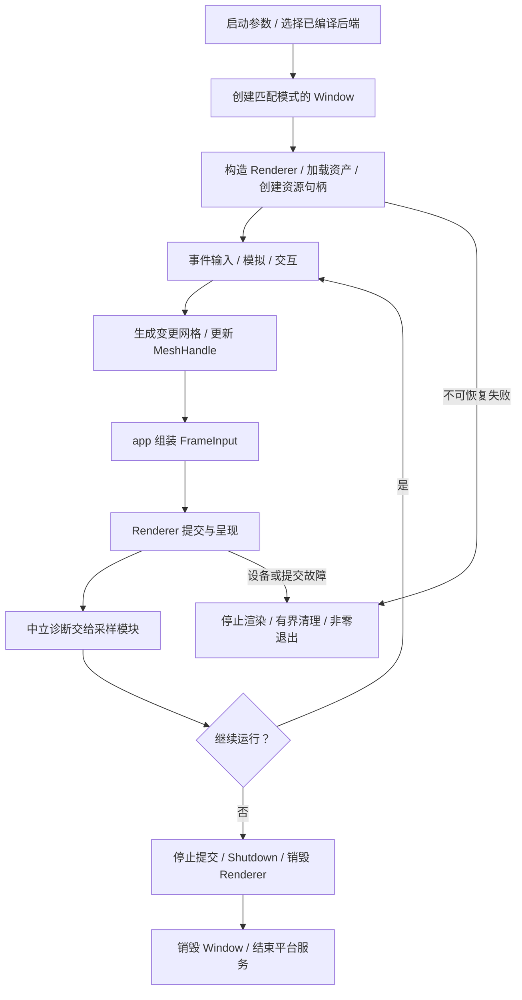
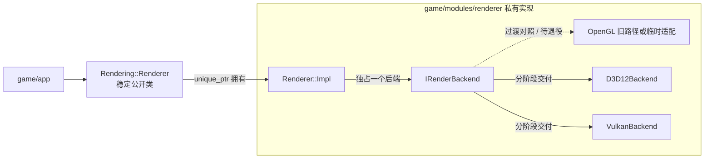

# M3-T3 渲染器重构：PImpl、现代后端接管与 OpenGL 退役

关联规划：[项目范围与 M3 任务](project-scope.md)。前置边界：[M3-T0 模块软硬边界](M3-T0-模块软硬边界.md)。世界模块契约：[M3-T1 世界模块重构](M3-T1-世界模块重构.md)。关联类 / 协作者：候选 `Rendering::Renderer`、私有 `Renderer::Impl` / `IRenderBackend`、`Platform::Window`、T1 的 CPU 场景类型、应用编排与采样模块。

R1 交接核对入口：[T3 CPU 契约清单](M3-T1-T3-CPU契约清单.md)。已交付的 World/网格语义与候选纹理数组、中立相机参数分别列示，后两者不得按 T1 已冻结接口处理。

2026-10-07 平台规划变更：用户已确认 SDL3 前置迁移的方案，见 [T2 正式计划的已确定决策](M3-T2-SDL3迁移.md#已确定的决策)；本渲染器草稿由原 T2 后移为 T3，应用/平台/模拟与 ECS/内存计划为 T4/T5。先完成 T2 迁移及验收，再冻结 T3 正式 spec，不再保留先渲染、后迁移的顺序分支。已选 D03/A：T2 承担 GL、无 GL 原生窗口和 Vulkan 三种创建模式及真实桥接探针，不将此视作 D3D12/Vulkan renderer 实现。窗口/像素/私有桥接能力须按 T2 实验及验收证据冻结；T2 正式化不改变本文件的草稿状态。以下 GLFW 仅作历史实现比较，不是新的生产窗口库候选。

同日架构边界确认：用户确认保持 T3 的 PImpl 多后端方向，采纳“先稳定游戏侧 Renderer v1、私有后端允许演进且按真实复用需求提取小型内部 RHI、R1 验证纹理绘制/资源更新删除/窗口呈现资源重建”三项建议。理由是先保护游戏调用方，再用真实后端验证抽象，避免提前冻结完整通用 RHI。确认仅涉及设计原则与实验要求，不表示候选签名已冻结、实验已完成或实施已授权；不额外加入 NPC/UI 表达实验。

同日目标调整：用户进一步确认，T3 首要交付改为让一个现代后端完整接管现有玩法，OpenGL 只作过渡与回归对照并逐步退役，长期聚焦 D3D12/Vulkan，不再以永久维持三个后端功能等价为目标。上文 Renderer v1、私有实现及关键实验原则继续有效，实验与验收按下文阶段划分执行。Micro voxel 仅作为下一玩法阶段 NPC/玩家实体的外表构建思路，基础方块保持原样；不进入 T3，也不扩为细体素世界、破坏或光追系统。用户随后明确选定 D01/1：D3D12 先行；D02/2：两个现代后端均完整接管后才验收 T3，OpenGL 最终退役留后续。第三方 RHI 未选定，当前不授权删除 OpenGL。

本文按 [完整功能模板](../Obsidian-功能笔记模板/templates/02-完整功能.md) 及 [D3D12Lab 功能示例](../Obsidian-功能笔记模板/examples/D3D12Lab-A2持续清屏-功能示例.md) 编写。类的成员与不变量在实施时分别维护类设计笔记，参照 [完整类模板](../Obsidian-功能笔记模板/templates/04-完整类设计.md)，不在多篇文档复制同一验收表。

本轮只更新设计。以下接口、目录和 target 均为拟实施契约，不是现有代码；所有验收未执行。用户已确认 DirectX 指 **Direct3D 12**，不包含 D3D11。T3 是 T0 结构解耦、T1 世界模块变更、T2 SDL3 迁移之后的渲染模块变更需求；生产实现全部位于 `game/modules/renderer`，测试脚手架统一位于根级 `test`。

## 当前设计

新的 PImpl 多后端设计暂无已实现版本。当前工作区仍是 OpenGL 路径，已有基础如下。

| 当前行为 / 耦合 | 源码依据 | 迁移时必须保留或移除的内容 |
| --- | --- | --- |
| `Renderer` 是命名空间，全局保存批次/shader，并通过 Application 获取 Camera | [renderer.h](https://github.com/AmoLim/SymoCraft/blob/cadc349aa752e252454a481c3199281c112998c9/include/renderer/renderer.h)、[renderer.cpp](https://github.com/AmoLim/SymoCraft/blob/cadc349aa752e252454a481c3199281c112998c9/src/renderer/renderer.cpp) | 保留方块/选择框画面，移除全局可变渲染状态及相机反向依赖 |
| Window 创建 GL 上下文、加载 GLAD、在 resize 回调直接 `glViewport`，应用负责交换缓冲 | [window.cpp](https://github.com/AmoLim/SymoCraft/blob/cadc349aa752e252454a481c3199281c112998c9/src/core/window.cpp)、[application.cpp](https://github.com/AmoLim/SymoCraft/blob/cadc349aa752e252454a481c3199281c112998c9/src/core/application.cpp) | 拆开窗口事件与图形呈现责任，不能将这条流程直接用于 D3D12/Vulkan |
| Chunk 包含批次头及绘制命令，管理器将所有有效网格写入全局批次 | [chunk.h](https://github.com/AmoLim/SymoCraft/blob/cadc349aa752e252454a481c3199281c112998c9/include/world/chunk.h)、[chunk_manager.cpp](https://github.com/AmoLim/SymoCraft/blob/cadc349aa752e252454a481c3199281c112998c9/src/world/chunk_manager.cpp) | T0 先断开图形依赖，T1 再完善 CPU 网格契约；T3 不再每帧重装全部几何 |
| Texture/Shader/GpuTimer 公开头含 GL 类型；应用自己绑定纹理、查询设备、截图与采样 | [texture.h](https://github.com/AmoLim/SymoCraft/blob/cadc349aa752e252454a481c3199281c112998c9/include/renderer/texture.h)、[gpu_timer.h](https://github.com/AmoLim/SymoCraft/blob/cadc349aa752e252454a481c3199281c112998c9/include/renderer/gpu_timer.h)、[性能说明](../legacy/architecture/performance-observation.md) | 类型和 API 调用进入后端私有实现，中立统计继续可用 |
| 根构建已分 game 与 benchmark，但游戏大目标仍编译多数模块源码，使用宽泛 include/vendor 路径 | [根构建](https://github.com/AmoLim/SymoCraft/blob/cadc349aa752e252454a481c3199281c112998c9/CMakeLists.txt)、[游戏构建](https://github.com/AmoLim/SymoCraft/blob/cadc349aa752e252454a481c3199281c112998c9/game/CMakeLists.txt)、[工具构建](https://github.com/AmoLim/SymoCraft/blob/cadc349aa752e252454a481c3199281c112998c9/tools/benchmark/CMakeLists.txt) | 保留工具独立性，进一步建立模块和后端 target 边界 |

已有验证版本 / 证据：[M2-T2](../milestones/m2-t2/README.md)、[M2-T3](../milestones/m2-t3/README.md) 记录的是旧 OpenGL 路径的局部正确性、采样及限制，不是三后端验收。以上源码和构建链接固定到 T0 实施前的 `cadc349` 快照，而不是迁移后的实现；跨模块反向依赖、公开原生类型和目录归属由 T0 先处理，不能作为进入 T3 时仍允许存在的耦合。本次没有重新执行游戏。

## 本次变更

### 目标与流程

目标：调用者只依赖稳定的 `Rendering::Renderer` 与 CPU 数据契约，先由一个现代后端完整承接当前固定方块世界和玩家操作，再按阶段推进第二现代后端与 OpenGL 退役。窗口交接、资源、命令、同步及呈现均有真实私有实现；不以清屏实验代替玩法接管，也不为维持 OpenGL 等价路线延后首个现代后端。

| 项目 | 本轮约定 |
| --- | --- |
| 前提 | M3-T0 已完成全部模块目录/CMake 解耦及现有 OpenGL 迁移；M3-T1 已完成世界模块变更，交付确定的 `MeshData`、纹理层语义及真实测试；M3-T2 SDL3 迁移已验收；完整纹理数组与中立相机输入由 T3-R1 冻结，不能算作 T1 已交付；M2 验收状态独立保留 |
| 平台 | Windows x64、C++20、MSVC；进入本任务前须完成 T2 SDL3 迁移验收，不同时重写渲染后端与替换窗口库；按已选 D03/A 核对 T2 三种创建模式及真实桥接证据，不以计划正式化推定能力已成立 |
| 后端 | 已选 D3D12 先行，再接入 Vulkan；两个现代后端均完整接管才申请 T3 验收。OpenGL 4.6 只承担旧玩法回归与必要过渡，不承担后续新增渲染特性的完整移植，最终退役留后续；显式检查能力，不因硬件型号推定支持 |
| 选择方式 | 拟新增 `--renderer`，只允许选择当前已交付并编入的后端；一次进程只选择一个，必须在创建窗口前决定。旧 OpenGL 对照包不改身份；现代接管验收后将默认切到已确认的现代后端，未交付/未编入或不支持的后端具名拒绝，不静默回退 OpenGL |
| 必做画面 | 当前固定体素世界、纹理数组、深度测试/背面剔除、既有 alpha 裁剪、选择框、相机及编辑后的网格更新 |
| 必做工程能力 | 单后端/组合构建、窗口缩放/暂停恢复、资源生命周期、故障诊断、截图、GPU 计时与原有基准流程 |
| 不包含 | D3D11、运行中后端热切换、动态 DLL 插件 ABI、多窗口/多 GPU、渲染线程、完整通用 RHI 或对游戏公开的底层 GPU 编程接口、通用 Render Graph、光追、新光照/透明排序算法、流式世界；NPC/玩家 micro voxel 外表、细体素地形或破坏系统 |

### 接管阶段与 OpenGL 退役边界

| 阶段 | 已确定的方向 | 范围与通过边界 |
| --- | --- | --- |
| 首个现代后端接管 | 已选 D3D12，为 T3 的优先交付 | 现有基础方块、纹理、选框、移动/跳跃、放置/破坏、窗口恢复和正常/故障退出均在 D3D12 成立，完成下文 A01–A19 的适用验收；只是阶段性交付，不使整个 T3 通过 |
| 第二现代后端扩展 | 已确定在 T3 内接入 Vulkan | 复用游戏侧 Renderer v1，重跑关键实验并完成 Vulkan 整组验收；两个现代后端及整合验收都有证据后才申请 T3 通过，不继承 D3D12 成绩 |
| OpenGL 最终退役 | 停止新增特性后逐步退出生产构建与发布 | 接替后端、必验机器/场景、部署、基准及失败处理有证据，再单独确认退役。清除活动 target/链接、调用、参数选项和 GL 专属发布资产/运行依赖；保留历史证据及必要可复现对照，不先删回退依据 |
| NPC/玩家外表 | 下一玩法阶段采用 micro voxel 作为外表构建思路 | 另定实体外表资产、实例/姿态和渲染路径，不改基础方块数据与玩法；不作为本轮接管或 OpenGL 退役的前置功能 |

OpenGL 对照可采用冻结旧包或隔离的旧路径，仅做必要兼容与回归。不强制先把整个旧 OpenGL 实现迁入新 PImpl 门面；若存在临时适配，记录责任、依赖及退出条件，不把双份游戏编排变成长期架构。尚未移除 OpenGL 时，仍须遵守其上下文与资源清理约束；最终退役不自动删除 T2 已确认的平台创建模式，平台能力收缩另行说明。

### 已确定的阶段决策

确认日期：2026-10-07。用户在本聊天选择 D01/1、D02/2；下表保留三个候选及附录对比作为决策历史，不再将两项列为待选。选择只确定实施方向与范围，不等于 T3 实施授权或验收通过。第三方 RHI 是否采用仍需独立选型，不通过本表自动接入 NVRHI。

#### D01 先行现代后端的确定方式

| 最终敲定方案 | 候选方案1 | 候选方案2 | 候选方案3 |
| --- | --- | --- | --- |
| 已选方案1：D3D12 先行；2026-10-07 用户确认。[[M3-T3-渲染器重构#D01 先行现代后端方案对比\|方案对比]] | D3D12 先行（已选）：直接围绕 Windows 目标完成现有玩法接管 | Vulkan 先行：先完成 Vulkan 接管，再扩展 D3D12 | 先用相同夹具评估两个现代后端，再按设备、工具链和实验结果确定一个先行；这是选型流程，不是第三种 API |

#### D02 T3 整体完成门槛

| 最终敲定方案 | 候选方案1 | 候选方案2 | 候选方案3 |
| --- | --- | --- | --- |
| 已选方案2：双现代后端接管后验收，GL 最终退役留后续；2026-10-07 用户确认。[[M3-T3-渲染器重构#D02 完成门槛方案对比\|方案对比]] | 一个现代后端完整接管即可申请 T3 验收；第二后端与最终退役留后续 | 两个现代后端都完整接管后申请 T3 验收（已选）；OpenGL 最终退役留后续 | 两个现代后端都完整接管，且 OpenGL 已退出生产构建/发布后，才申请 T3 验收 |

决策影响：先集中完成 D3D12，保留旧 GL 对照以便定位迁移问题，再由 Vulkan 验证同一游戏侧契约的双 API 复用；完整 GL 清理不阻塞 T3，但不得宣称已退役。T3 正式 spec 仍须在 T2 验收后按 R1 实验冻结；GL 最终退役的后续节点编号、清理清单及授权届时单独确认。



内容/参数错误按接口契约拒绝；不可恢复失败不隐式切换后端。正常及错误退出都不得在 Renderer 仍借用窗口时先销毁 Window。

### PImpl、后端接口与稳定承诺



PImpl 隐藏布局和编译依赖；它本身不是运行时后端分派机制。候选方案在 Impl 内组合私有后端接口，由工厂按启动配置创建一个实现。游戏不继承后端接口、不包含工厂头、不按后端写绘制分支。与 PImpl 的一般用途一致，公开头不随实现成员变化而变动，参见 [C++ Core Guidelines I.27](https://isocpp.github.io/CppCoreGuidelines/CppCoreGuidelines#Ri-pimpl)。

- `Renderer` 只含拥有 Impl 的指针；构造和析构定义在看得到完整 Impl 的 `.cpp`。禁止复制和移动，避免窗口借用及内部回调绑定在移动后失效。
- `IRenderBackend`、工厂和后端具体类只在私有目录；不把它们变成需要游戏实现的扩展点。内部接口可以随实现演进，变更时同步真实后端与私有契约测试，不改变已成立的公开行为。
- 门面只做公共校验、句柄/状态管理与委托；渲染算法属于 renderer 模块内部，不要求全部写在公开门面中。不照抄 OpenGL 的 Bind/Unbind/UploadUniform 为通用接口，也不建立一套覆盖全部 GPU API 的通用抽象层。
- 优先稳定游戏侧 `Rendering::Renderer` v1，让游戏/模拟通过同一套头文件、签名和行为使用已交付的现代后端，而不是直接录制底层 GPU 命令。先行接管只证明已实现后端成立，第二后端须单独验证；私有后端接口不作同等级的稳定承诺，旧游戏调用迁移在接管阶段完成。
- 只有多个后端实际重复实现同一渲染算法、且能够明确分离算法与 API 操作时，才提取足够小的内部 RHI：公共算法留在 renderer，API 资源/命令实现留在后端。提取前记录重复实现、职责、依赖及测试依据，不凭将来可能需要预建空层。
- 内部 RHI 如需形成接口，仅供 renderer 内部及其后端/测试使用，不作为游戏扩展点，不自动新增公开 RHI 模块或承诺覆盖所有 GPU 能力。各后端仍可采用不同的资源、上传和同步策略，不为共用算法强迫它们采用相同内部实现。
- R1 在完成下文关键契约实验后冻结游戏侧公开头清单和 v1 行为；冻结表示受控版本基线，不表示永远不能新增能力，也不冻结全部私有资源/命令/绑定模型。不承诺跨 MSVC/STL 版本 ABI 或二进制插件兼容。
- 后端实现若发现能力差异，先走能力报告或明确拒绝。确需改变公开语义或作破坏性变更时，先更新设计并经用户确认，再迁移调用方及测试；不能偷偷加原生句柄逃生口或以“私有实现演进”绕过公开契约。

### 公开数据与接口契约

以下为接口设计，不是可直接纳入构建的完整头文件。数据类型按 T1 契约落地，API 原生类型不得出现在公开签名、成员或模板实参中。

| 类型 | 内容 / 生命周期 |
| --- | --- |
| `RendererConfig` | `Backend`、VSync、请求采样数、验证开关、shader 资产根与等待超时；初始化后不修改后端 |
| `MeshData` / `TextureArrayData` | CPU 自有容器；网格含位置、UV、纹理层及现有顶点属性，纹理含格式/尺寸/层数/像素；没有 GLuint、VkBuffer 或 D3D12 view |
| `MeshHandle` / `TextureArrayHandle` | 带 renderer 身份和代数的不可伪造业务句柄；不代表 GPU 指针，不跨 Renderer/进程/后端使用 |
| `MeshDraw` | MeshHandle、纹理数组句柄和对象变换；不携带 Chunk 指针、EntityId 或后端命令 |
| `FrameInput` | 唯一递增 frame ID、相机位姿与投影参数、只读 draw 列表、可选选择框、截图请求；输入借用仅持续到 `Render` 返回 |
| `FrameResult` | Presented / Skipped 及原因、CPU/上传/绘制统计、可选自有 RGBA8 截图；返回不等于 GPU 已完成全部工作 |
| `RendererInfo` / `GpuFrameSample` | 实际后端、设备/驱动、实际 framebuffer/采样数/呈现模式、能力；异步 GPU 样本携带来源 frame ID、有效性及缺失原因 |
| `RenderError` | 继承 `std::runtime_error`，携带公共错误类别、后端名、操作、文字化原生错误码及诊断；不将 HRESULT/VkResult 类型泄露给调用方 |

候选门面形状：

```cpp
namespace SymoCraft::Platform { class Window; }

namespace SymoCraft::Rendering {
class Renderer final {
public:
    Renderer(Platform::Window& window, const RendererConfig& config);
    ~Renderer() noexcept;
    Renderer(const Renderer&) = delete;
    Renderer& operator=(const Renderer&) = delete;
    Renderer(Renderer&&) = delete;
    Renderer& operator=(Renderer&&) = delete;

    MeshHandle CreateMesh(const MeshData& data);
    void UpdateMesh(MeshHandle handle, const MeshData& data);
    void DestroyMesh(MeshHandle handle);
    TextureArrayHandle CreateTextureArray(const TextureArrayData& data);
    void DestroyTextureArray(TextureArrayHandle handle);

    FrameResult Render(const FrameInput& frame);
    void Resize(Extent2D framebuffer_extent);
    void SetVSync(bool enabled);
    RendererInfo GetInfo() const;
    std::vector<GpuFrameSample> PollGpuSamples();
    void Shutdown();

private:
    class Impl;
    std::unique_ptr<Impl> impl_;
};
}
```

| 接口组 | 行为与失败后的约定 |
| --- | --- |
| 构造 / `GetInfo` | 借用有效 Window，拥有全部渲染状态；构造失败不发布半初始化对象，已获取资源由内部 RAII 清理；Info 为值快照，不返回设备裸指针 |
| Create / Update | 返回前拥有必要的 CPU 数据/暂存，不保留调用者容器地址；GPU 上传可延后，但下一次使用该句柄的 Render 必须建立可见性；参数/可恢复分配失败不覆盖旧网格 |
| 空网格更新 | 合法，下一次 Render 不再绘制旧几何；逻辑替换与旧 GPU 资源的延迟释放分开处理 |
| Destroy | 逻辑失效立即生效；原生资源等最后使用完成后回收。非法、过期、跨 Renderer 或重复销毁句柄明确拒绝；正常 Shutdown 自身幂等 |
| `Render` | 校验全帧输入后再提交，后端负责绘制和呈现；没有额外的应用层 SwapBuffers/Present；不会保存输入 span 或 ECS/世界引用 |
| `Resize` / `SetVSync` | 主线程在帧边界调用，重复相同请求无副作用；零尺寸进入暂停，不创建零尺寸交换链；能力不支持的呈现模式明确报告实际选择 |
| `PollGpuSamples` | 只返回已就绪结果，不为读统计等待 GPU；未就绪与不支持都不能写成耗时 0 |
| `Shutdown` / 析构 | 正常 Shutdown 在窗口仍有效时停止提交、等待必要工作、回收并进入 Stopped；失败报告错误，不伪装正常结束。析构 `noexcept`，执行有界兜底清理并记录问题，不替代正常显式关闭 |

在资源更新返回后才出现的设备/提交失败属于渲染器故障，不承诺继续用旧资源正常渲染。句柄校验不能只存在于 Debug 断言；资源句柄不是纹理层索引，方块材料 ID 不因切后端改变。

### 软边界：目录与责任

沿用 T0 已确认的生产/测试归属，以下是 T3 的目标细分，不在此次文档任务中实际创建。`game/` 包含全部游戏生产模块，不再仅表示入口；只有 `game/app/` 是应用编排。

```text
game/modules/scene/                    # T0 提取、T1 完善的共享 CPU 数据
game/modules/platform/
  CMakeLists.txt
  include/symocraft/platform/          # Window、事件与输入公开契约
  src/                                # 所选窗口库/Win32 和私有图形桥接
game/modules/renderer/
  CMakeLists.txt
  include/symocraft/renderer/          # renderer.h、types.h、error.h
  src/renderer.cpp                    # PImpl 门面定义
  src/renderer_impl.h                 # 私有状态/句柄管理
  src/backend/                       # 私有接口与工厂
  backends/opengl/{CMakeLists.txt,src/} # 仅实际需要的过渡实现，退役时退出
  backends/d3d12/{CMakeLists.txt,src/}  # 按确定的先行/扩展阶段落地
  backends/vulkan/{CMakeLists.txt,src/} # 按确定的先行/扩展阶段落地
test/unit/renderer/                   # 门面/资源/后端局部契约测试
test/integration/renderer/            # 已交付现代后端、过渡回归和发布验证
test/support/renderer/                # mock、故障注入和必要 fixture
assets/shaders/{opengl,hlsl}/          # 运行 GLSL / 构建期 HLSL 来源
game/app/                            # 仅编排，不写 GL/D3D12/Vulkan 调用
tools/benchmark/                     # 保留独立构建和协议
```

T0 已将 `Batch`、GL ShaderProgram/Texture/GpuTimer 及散落图形操作隔离到 renderer/平台桥接；T3 接管时使旧状态退出现代生产调用，保留必要旧包/隔离路径作对照，不强迫先重做完整 OpenGL 后端，也不要求“每个 API 都继承”旧资源类。T0 不再公开全局 `chunk_batch`；现代门面不回用旧全局状态，GL 清理按退役门槛执行。CPU 文件读取与图片解码继续由 assets 提供，解码器不得顺便创建 GPU 纹理；尚未实施的后端不创建空 target 冒充交付。

### 硬边界：CMake target 与配置

| target | 责任 / 编译依赖 |
| --- | --- |
| `symocraft_renderer_api`（INTERFACE） | 唯一公开 include 根、C++20 和公开 CPU 类型依赖；不传播任何图形 SDK/平台宏 |
| `symocraft_renderer`（STATIC） | PUBLIC renderer_api；PRIVATE 已启用后端、窄平台桥接及资源读取实现；定义 Impl，最终游戏只链接此门面 |
| `symocraft_renderer_backend_contract`（内部 INTERFACE） | 只向门面/后端开放私有接口目录及公共数据契约，不作为游戏依赖 |
| `symocraft_renderer_opengl`（如需过渡实现） | PRIVATE backend_contract、GLAD、平台桥接；GL 类型不向消费者传播，不是必须先重建的生产后端；退役后退出活动构建 |
| `symocraft_renderer_d3d12` | PRIVATE backend_contract、平台桥接、D3D12/DXGI 系统库；COM/descriptor/root signature 仅内部 |
| `symocraft_renderer_vulkan` | PRIVATE backend_contract、平台桥接、Vulkan 头/加载实现；Vk 类型与宏仅内部 |
| 平台内部 graphics bridge | 仅门面/后端可借用窗口的原生能力；不成为 platform 公开 include 路径，不反向依赖 renderer |

在 T0 已有 `symocraft_renderer` 的基础上增加后端内部子 target，不重做全项目模块解耦。后端依赖私有契约而不是门面实现，避免 renderer -> backend -> renderer 的环。所有生产源码归一个实现 target；根级 test 中的测试链接真实 target，不再重复编译生产 `.cpp` 并定义大量替身以掩盖实际依赖。renderer/后端目录内不另建测试树，生产 target 不依赖 `test/support`。

- 拟按实际交付增加 `SYMOCRAFT_RENDER_OPENGL`、`SYMOCRAFT_RENDER_D3D12`、`SYMOCRAFT_RENDER_VULKAN`；接管后的默认构建只启用已确认的现代后端，OpenGL 过渡可选，第二现代后端尚未交付时不默认启用或建立空 target。游戏构建开启但没有可用后端时配置失败；无游戏的 CPU/工具配置允许全部关闭。
- 沿用 T0 的根级 test 入口和 CPU-only 配置，不把 CPU 核心测试挂在必须构建游戏/renderer 的分支内；它不寻找图形 SDK、不创建窗口。`BUILD_TESTING=OFF` 不引入测试/support 目标或测试框架，benchmark 单独配置入口继续有效。
- 只有启用对应后端才查找其 SDK、shader 编译器和依赖；缺失时具名失败，不静默禁用。单后端包只部署该后端所需 shader 与合法运行依赖。
- Vulkan loader 仅在选中 Vulkan 时按 T2 冻结的平台/后端桥接路径惰性加载，所有权与卸载顺序遵守窗口桥接契约；按已选 D03/A，T2 验收包含真实 Vulkan instance/surface 与 loader 寿命验证，T3 仍须验证完整后端资源清理。不让组合包因缺少 `vulkan-1.dll` 而在进入参数解析前失败；使用函数指针加载所需入口，加载宏私有。未选 Vulkan 时 OpenGL/D3D12 不受其运行时缺失影响。
- shader 编译使用有输入/输出依赖的构建规则，输出进入构建目录，安装时复制；修改共享 shader 依赖会重编译，运行时不要求用户机器装 SDK/DXC。
- 禁止根级 `include_directories`、跨模块 `../src` include、把整个仓库 include/vendor PUBLIC 导出，以及业务目标依赖任一后端 target。需要共享的头必须移动到已评审的数据契约。
- `PRIVATE` 不会消除静态库最终链接所需的依赖。验收既检查使用要求，也检查真实 link、安装后的依赖和增量编译，而不只检查 target 名称。参见 [CMake 构建模型](https://cmake.org/cmake/help/v3.22/manual/cmake-buildsystem.7.html)。

### 窗口与图形后端接入

| 后端 | 窗口/设备与呈现 | 资源与命令责任（GL 仅约束实际保留路径） |
| --- | --- | --- |
| OpenGL（过渡回归） | 旧包或保留路径使用 GL 4.6 Core 上下文；若有临时适配，只经私有桥接操作上下文/呈现 | 保留路径中的 VAO/VBO、纹理数组、GLSL、query 等仍正确清理；全部 GL 调用在正确上下文线程。此行不是新增完整 OpenGL 门面实现的前置要求 |
| D3D12 | 平台创建无 GL 上下文窗口，后端私有借用 HWND；创建 factory/adapter/device/queue、flip-model swapchain、RTV/DSV | 根签名、PSO、descriptor heaps、默认/上传资源、command allocator/list、resource barriers、fence/event、深度和纹理/选择框管线 |
| Vulkan | 平台创建无 GL 上下文窗口；加载 instance/device 入口，取得平台必需扩展并创建 surface；选择 graphics/present 队列及 swapchain | buffer/image/memory/view、descriptor、SPIR-V pipeline、command pool/buffer、layout/barrier、fence/semaphore、深度资源和呈现重建 |

窗口公开接口沿用 T0 的事件、尺寸、输入和寿命边界；T3 消费前置 T2 经实验与验收成立的 SDL3 契约。按已选 D03/A，OpenGL-context、无 GL 原生窗口及 Vulkan 创建模式由 T2 准备与验证，T3 再核对其契约并实现完整 renderer 接入；计划存在不代表这些模式已验证。原生 HWND、窗口库句柄、surface 创建入口只通过私有桥接提供，不能用公开 `void*` 让游戏自行强转。SDL3 的 Vulkan 窗口有专用 flag/loader 寿命，不能把 GLFW 的 no-client-API 语义直接照搬。

resize/focus 事件只记录事实，不提交图形命令；应用在帧边界把实际 framebuffer 像素尺寸交给 Renderer。T0 已隔离 Window 中的 `glViewport` 与图形呈现操作，T3 将呈现统一收进 `Renderer::Render`；非 GL 窗口不能走旧 OpenGL 交换缓冲流程。Vulkan surface 由后端负责销毁，寿命必须短于窗口与 instance；使用 SDL3 自动加载路径时，完整 Vulkan 资源及 instance 必须在窗口销毁/loader 卸载前清理，见 [SDL3 窗口寿命](https://wiki.libsdl.org/SDL3/SDL_CreateWindow)。

D3D12/Vulkan 在各自交付阶段的 shader、内存、队列及同步均须真实实现，不允许把 OpenGL 数据结构简单改名。候选能力基线为 D3D12 feature level 12_0 / Shader Model 6.0、Vulkan 1.2 + 必需 surface/swapchain 扩展；R1 先在两台目标机器核实 D3D12 的实际能力、SDK/编译器版本，Vulkan 接入前另行核实；若不满足则明确调整设计或报告受阻，不静默使用软件设备。不要求在 D3D12 接管前完整实现 Vulkan，但 Vulkan 仍是 T3 整体通过的必做范围。

### Shader、坐标与画面一致性

| 契约 | 约定 |
| --- | --- |
| 空间 | 沿用世界坐标、Y 向上；相机采用统一右手视图约定。调用者提交位姿和 FOV/near/far，不传 OpenGL 专用投影矩阵 |
| clip/depth/绕序 | 后端内部处理裁剪空间深度、Y 方向、viewport 与正面绕序差异；不得通过每个 target 不同的全局 GLM 宏改变共享类型/数学语义 |
| 顶点与常量布局 | 公共类型表达 CPU 语义；后端显式打包 GPU 布局，核对整数纹理层、偏移、对齐、矩阵存储/乘法和 binding；不能假定同一 C++ 内存布局可直接当作所有 API 的常量缓冲 |
| 纹理 | 统一层编号、UV 方向、像素通道、颜色空间及采样规则；CPU 解码后只有一次明确方向归一化，不在每层重复翻转 |
| 既有材质 | 保留当前 `alpha < 0.01` 丢弃及深度/剔除语义；水/树叶的既有局限单独记录，不借后端迁移静默引入混合排序或改变材质规则 |
| 采样与呈现 | 记录请求与实际 MSAA、framebuffer 格式、VSync/present mode；跨后端对照必须使用相同实际设置，不以静默降级制造性能差异 |
| 选择框与截图 | 相同目标、尺寸和视觉语义；截图输出自有、统一方向的 RGBA8 数据，由应用/资产工具写文件，不能要求上层调用 `glReadPixels` |

OpenGL 对照保留已有 GLSL，不为未来特性重写；现代后端先落地选中 API 所需的 HLSL 编译产物，第二后端交付时复用同一套 HLSL 源分别生成 DXIL/SPIR-V，差异限于私有编译配置与 binding 映射。DXC 的双输出能力有官方支持，但项目的布局与编译参数仍须实际验证，参见 [DirectXShaderCompiler](https://github.com/microsoft/DirectXShaderCompiler)。未交付后端不成为当前构建/发布所需的 shader 依赖。

资源清单按后端分组；`--check-assets` 对选中后端检查文件，不初始化 GPU，也不冒充驱动 shader/PSO 验证。非法后端参数沿用参数错误约定，缺文件沿用资源预检失败约定，驱动/初始化故障沿用运行失败约定；错误中必须包含后端和资产位置。旧 shader 热重载 API 不直接成为公共必选能力；需要时另定事务替换契约。

### 所有权、同步与失败处理

| 编号 | 公共约束 | 成立边界 |
| --- | --- | --- |
| R-I1 | 应用拥有 Window 与 Renderer；Renderer 借用 Window，不拥有世界/ECS/输入；借用窗口始终有效 | 构造至 Renderer 销毁；先 Renderer 后 Window |
| R-I2 | 一实例一后端；公开调用在创建线程串行进行；不得从窗口回调重入 | 所有公开操作；后台网格仅交付 CPU 结果 |
| R-I3 | 输入引用/span 不跨调用保存；已发布句柄只指向本实例当前代资源 | 每个公开操作返回后 |
| R-I4 | 逻辑删除/更新不等于可以立即回收或覆写 GPU 仍使用的资源 | 所有上传、帧资源复用、resize、销毁与退出 |
| R-I5 | 设备故障后不再接受新的提交；零尺寸只暂停，不视为设备故障 | `Failed` 与 `Suspended` 状态 |
| R-I6 | Ready / Suspended / Failed / Stopped 是私有生命周期状态；Stopped 的 Shutdown 幂等，其余资源/绘制调用拒绝 | 构造成功至销毁；GetInfo 可读取最后快照 |

正常状态流：构造成功 -> Ready；零尺寸 -> Suspended；正尺寸重建成功 -> Ready；设备/提交故障 -> Failed；正常关闭 -> Stopped。构造失败没有可用对象。资源内容校验失败不自动污染整个 renderer；原生设备丢失则不承诺原地恢复。

- 网格按版本/变更创建或更新；世界静止时不重复上传已有几何。每帧 draw 列表仍可变化，这不同于每帧重传所有顶点。GPU 容量、暂存与 CPU 副本的占用必须可计量。
- D3D12 在 fence 完成前不能复用对应 allocator、上传区、descriptor 或被引用资源；转换到正确状态后才能访问/呈现。参见 [Microsoft 的 fence 资源生命周期说明](https://learn.microsoft.com/en-us/windows/win32/direct3d12/fence-based-resource-management)。
- Vulkan 必须跟踪帧资源与交换链图像的使用完成，正确配对 acquire/submit/present 及信号量；acquire 返回需要重建时不能留下已 reset 却永远无人 signal 的 fence。resize/out-of-date/suboptimal 与设备丢失分别处理，参见 [Khronos 交换链重建说明](https://docs.vulkan.org/tutorial/latest/03_Drawing_a_triangle/04_Swap_chain_recreation.html)。
- 各已交付后端可先采用保守、正确的有限帧资源策略，但不能照抄清屏示例的致命退出方式而丢失项目已有诊断/清理；同步等待须有上限及超时记录，设备失效不能无限等待。
- 内容更新失败先保留旧资源；已提交工作发生不可恢复故障则停止后续帧。清理失败不覆盖原始错误，不把未完成 fence 当成成功回收的证据。
- 用 mock 验证失败顺序，D3D12/Vulkan 分别用真实 Debug Layer / Vulkan validation 验证驱动调用；保留 GL 路径的受影响回归使用相应 debug 输出。Release 的空诊断日志不等于执行了相同验证。

### 采样与现有工具兼容

GPU query/readback 实现留在各后端，telemetry 只接收中立结果；公共接口不再接受现有含 GLuint 的 `GpuTimer*`。上传可能发生在 Create/Update 或帧内，统计必须覆盖真实工作并按 startup/frame 明确归属，不能通过移动函数让 `upload_bytes` 或 CPU 时间消失。

`Render` 内部承担呈现后，继续分别记录 CPU 准备/提交、上传和 present 等待；GPU 绘制区间与旧 M2-T3 对齐，无法完全对齐的成本单独列出，不冒称同一指标。延迟结果按 frame ID 回填，不等待每一帧查询；结束时缺失样本保留原因。

导出增加实际 `renderer_backend`、adapter、API/driver、shader/生成版本、实际图像/呈现配置；原 `gl_*` 字段只用于 OpenGL，不能装入 D3D12/Vulkan 数据。文件协议需要变更时加版本兼容或显式拒绝，不静默破坏 `tools/benchmark` 的旧报告读取。设备显存与进程显存分开，缺指标不补 0。

截图请求允许显式 readback/等待，但在正式性能采样区间之外执行并标记。M3 测量用于发现回归及记录新增后端成本，不宣称已满足 M4 的速度目标。

### 分步实施与冻结点

| 子步骤 | 交付 | 进入下一步的条件 |
| --- | --- | --- |
| R1 契约与最小实验 | 按已选 D01/1、D02/2，核实 T0/T1/T2 交接、D3D12 能力、工具链和坐标；完成下文关键实验后冻结游戏侧 Renderer v1 和当前 target 图 | 两台目标机器上有 D3D12 纹理绘制、资源更新/删除、呈现资源重建的真实依据；公共消费者无需 SDK，不以清屏或旧 GL 成绩替代；实验不计功能完成 |
| R2 门面与先行现代后端接管 | 实现 PImpl、句柄、选中现代后端的设备/呈现/上传/shader/同步/诊断；将现有游戏调用迁到新门面，保留必要 GL 对照 | 当前完整方块世界及玩法可运行，没有双份 Present；不以完整 GL 门面重写作为前置，也不加入实体 micro voxel |
| R3 D3D12 接管验收与默认切换 | 在双机完成 D3D12 A01–A19 的适用验收、构建/发布/基准及失败清理；明确旧路径去向 | 用户批准接管后默认切到 D3D12；此步只是阶段性交付，尚不能申请整个 T3 通过 |
| R4 Vulkan 接管与双现代后端整体验收 | 落实 Vulkan 资源/命令/呈现，重跑关键实验与双机整组验收；整合现代单/双后端构建、发布资产、公共消费者及旧路径隔离证据 | D3D12/Vulkan 都完成现有玩法接管，A01–A19 适用项均有各自证据，公开 v1 经两后端验证后才申请 T3 通过 |
| 后续 R5 OpenGL 最终退役 | T3 后另立节点，退出 GL 活动构建/调用/发布依赖并验证现代包、CPU/工具、资源及基准；保留历史对照证据 | 非本次 T3 的通过条件；后续节点编号、清理清单及实施授权单独确认，不为提前通过而隐藏未完成项 |

#### R1 关键契约实验与冻结门槛

以下是冻结前的最小实验入口，不是另一份 T3 整体验收表。沿用台式机与 Y9000P 的既定硬件范围，先对选中现代后端分别记录真实结果；第二后端接入前重跑同组实验。OpenGL 只按实际保留路径做必要回归，不要求为旧 GL 新建完整实验路线。T2 桥接探针、清屏、mock 或旧 GL 成绩不能替代现代后端实验。实验可用最小夹具和临时适配，不要求先完成生产 Renderer 或完整世界渲染；实验代码归根级 `test`，不成为游戏生产依赖。

| 状态 | 实验 | 冻结前需要确认的行为 | 对应整体验收 |
| --- | --- | --- | --- |
| [ ] | R1-E01 实际纹理绘制 | 最小网格实际采样至少两个可区分的纹理层；核对 UV/像素方向、层号、颜色空间和 GPU 数据布局，保留截图及诊断，确认候选 CPU 输入可在选中现代后端正确表达；第二后端接入前单独复核 | A06、A09；不替代完整场景和整项验收 |
| [ ] | R1-E02 资源更新与删除 | 创建/更新返回后不保留调用者 CPU 容器地址；更新后下一次绘制使用已接受内容，空网格清除旧画面；已提交帧可能仍在执行时更新/删除，不覆写在途数据或过早释放原生资源；逻辑失效与实际回收分开验证，过期句柄被拒绝 | A08–A10、A15；不替代完整失败注入和容量压力验收 |
| [ ] | R1-E03 窗口呈现资源重建 | 缩放、零像素尺寸及恢复时，交换链/尺寸相关资源按实际像素重建，恢复后纹理网格继续正确显示，无零尺寸提交忙循环、死锁或失效引用；此处不是销毁/热重建 Window 对象 | A11、A15；不替代完整窗口/退出回归 |

记录每项实验的版本、实际后端/设备、窗口模式、输入、操作顺序、诊断和结果；截图用于画面判断，提交/完成记录及诊断用于资源寿命判断，不能仅凭“画面正常”宣称同步正确。未执行或失败的项目明确记为未完成/受阻，不能据此冻结公开 v1。实验暴露的输入布局、所有权或失败语义差异须先解决或明确收窄契约并经用户确认，再进入 R2；收窄不能静默减少既定验收范围。

R1 实验通过只证明当前候选契约在已实验后端可行，不证明生产门面、第二后端、A01–A19 或整个 M3-T3 已完成。R2–R4 以真实生产 target 和统一游戏调用方执行 T3 验收，后续 R5 的最终退役另立节点；需要调整 v1 时遵守上文受控变更规则。

已确定：D3D12 先行，随后 Vulkan，两者完整接管后申请 T3 验收；GL 最终退役留后续。仍需核实 SDK、实际设备能力、shader binding/布局和窗口桥接；第三方 RHI、下一阶段实体外表表示和 GL 具体删除清单不在本次确认中自动敲定。没有实测前保留草稿状态，能力下调或验收缩减仍需单独确认。

### 验收案例

所有状态初始为 `[ ]`。下表首先用于先行现代后端的完整接管验收，涉及真实运行的场景在台式机与 Y9000P 分别记录；第二现代后端交付时单独重跑。已保留的 GL 路径仅做受影响项目的回归，不新增永久三后端等价要求。构建组合以当前实际交付后端为准，尚未交付的后端明确标为后续，不假称测试通过；不能用 mock、软件适配器或另一后端代替真实结果。先行后端通过与整个 T3 通过按 D02 分开判定，环境不具备时写未执行/受阻。

| 状态 | 场景 | 预期行为 |
| --- | --- | --- |
| [ ] | A01 仅公开头的独立消费者 | 不包含 GLAD/GLFW/SDL3/Windows/D3D12/Vulkan 私有头即可编译；公开签名相同；内部头/后端类型越界包含被边界检查拒绝 |
| [ ] | A02 T0 目录、CPU-only 与 benchmark-only 配置 | 游戏/renderer 生产代码在 game，测试在 root test；生产目标不依赖 test/support，关闭测试不引入脚手架；CPU/工具配置不发现或链接图形 SDK，独立入口可构建运行 |
| [ ] | A03 Debug/Release 后端构建矩阵 | 先验证当前现代后端的单后端包；第二后端交付后验证两种现代单后端及双后端组合。GL 过渡组合仅在实际保留时测试，退役后现代包无 GL 活动依赖；关闭/未交付后端不要求其 SDK 或资产，游戏开启但全关闭明确失败 |
| [ ] | A04 实现依赖与增量构建 | 无 target 环、无全局 include 泄漏；修改后端私有头不重编译 world/模拟/游戏调用者；公共契约变化会重编译真实消费者 |
| [ ] | A05 后端选择与不支持设备 | 实际设备/后端与请求一致；未编入后端、缺运行时或能力不足具名失败，无静默 fallback；组合包未选 Vulkan 时缺其 loader 仍可运行其他后端 |
| [ ] | A06 单立方体、纹理层和选择框 | 当前现代后端保留现有方块的面朝向、UV、层号、深度遮挡、alpha 裁剪及选框语义，无镜像/倒置/错层；第二后端单独核对相同契约，不接受只有三角形截图 |
| [ ] | A07 固定完整世界与相机 | 相同 seed/摘要/出生位姿的世界可见，转向/移动/缩放正确；记录真实分辨率、采样数和呈现模式，画面差异有解释 |
| [ ] | A08 静止、连续编辑与空网格 | 首次上传后静止不重复上传区块几何；只更新受影响网格；清空不残留旧画面；正负坐标及四块交点无裂缝/错块 |
| [ ] | A09 资源边界与 CPU 输入寿命 | 创建/更新返回后修改或销毁原 CPU 容器不影响已接受资源；越界纹理层、无效索引/长度、过期/跨实例句柄被拒绝 |
| [ ] | A10 GPU 在途更新/删除/容量增长 | 不覆写仍使用的资源；错误路径不发布半成品；延迟释放最终完成，峰值/回收数据可解释；校验模式无未处理同步错误 |
| [ ] | A11 Resize、最小化与恢复 | 连续缩放和最小化至少 10 秒再恢复均正常；零尺寸无 acquire/Present 忙循环；过期交换链重建无死锁，实际 framebuffer 与相机比例正确 |
| [ ] | A12 VSync 与采样设置 | 开关行为及实际模式可查询；不支持时明确记录，不静默把开启 VSync 的帧率当成关闭后的性能结果 |
| [ ] | A13 缺 shader / 坏 shader 或纹理 / 分配失败 | 在隔离包具名报告选中后端/资源，失败清理；可恢复更新失败保留旧资源；原资产不改动 |
| [ ] | A14 设备丢失、提交失败与等待超时 | 停止新提交，诊断保留原始错误，有限时间退出；不无限等待、不假装恢复；注入测试与真实触发分开记 |
| [ ] | A15 正常退出与构造失败 | Esc/关闭按钮、部分初始化失败、重复 Shutdown 均遵守 R-I1 至 R-I6；图形先于窗口清理，重复启动无未解释资源增长 |
| [ ] | A16 当前交付后端的诊断工具 | 先行现代后端启用对应 D3D12 Debug Layer 或 Vulkan validation 并留证；第二后端交付时单独验证。GL 仅保留路径有相应诊断要求；无未解决的资源/同步错误，不可用时明确受阻而非静默关闭 |
| [ ] | A17 截图与异步 GPU 样本 | 截图非空且方向/内容正确；样本关联原始 frame ID；未就绪/不支持有缺失标志，不为查询阻塞每帧 |
| [ ] | A18 基准协议与发布目录 | 现代后端沿用原有采样语义并具名记录，不冒充 gl 数据，旧 GL 结果可读且身份不变；从无关 CWD 运行安装包，shader/运行依赖完整，测试机器不要求开发 SDK；退役后现代包不再依赖 GL 专属资源 |
| [ ] | A19 双机玩法回归 | 两台机器分别完成当前现代后端的适用 14 项玩法及至少 15 分钟连续操作，记录正常退出；第二现代后端另留同组证据，GL 对照不替代现代实测；这不是 60 分钟稳定性或 M4 性能通过 |

环境 / 运行入口：沿用项目的 Windows x64 Debug/Release 构建与固定场景，新增后端选项、CPU-only 配置及集成入口在实施时接入并记录实际命令。现有 [玩法清单](../testing/gameplay-smoke.md)、[固定场景](../project/benchmark/testing/reproducible-scenes.md)、[采样指南](../project/benchmark/testing/performance-baseline.md) 是回归基础。

验证版本 / 结果与证据：**无，本次未执行。** 实施时按 A01-A19 保存提交/工作区输入、构建配置、backend/adapter/driver、退出码、诊断、截图、原始数据和失败复测记录。截图对比预先确定参考图与容差，允许注明的栅格化边缘差异，不允许丢几何、错材质或颠倒坐标。

实现落点：生产实现为 `game/modules/renderer/` 及必要的 `game/modules/platform/` 私有桥接，测试为根级 `test` 的对应子目录；T0 完成目录与构建迁移，T3 在其上实施模块变更。当前文档不是验收报告；实际通过后将成立契约和证据合并至“当前设计”，关联类笔记同步更新，“本次变更”恢复为无。

## 后续考虑

| 触发条件 | 再考虑的变化 |
| --- | --- |
| D3D12 接管经用户验收 | 在 T3 内继续 Vulkan 接管；GL 最终退役另立后续节点，保留接管证据，不直接继承为双后端完成 |
| 下一玩法阶段开始 NPC/玩家实体外表设计 | 以 micro voxel 作为外表资产构建思路，另定数据/实例/姿态和渲染方案；基础方块仍用当前表示，不自动引入体素射线遍历、细体素破坏或光追 |
| 多个后端实际重复实现同一渲染算法，且分离收益有具体依据 | 按上文条件提取小型内部 RHI，让公共算法留在 renderer；接口保持内部可演进，不扩大为完整通用 RHI 或游戏公开接口 |
| M3 后基线显示上传、同步或 draw 调用成为主要瓶颈 | M4 分别评估帧并行、资源池、批次/间接绘制，不为复用接口强迫所有后端采用同一内部策略 |
| 场景需要新增 pass 或材质体系 | 先扩展功能契约和数据描述，再决定是否需要 Render Graph；不先造空框架 |
| 真正需要运行中切后端或插件分发 | 另立窗口重建、CPU 资产留存、资源重建及 ABI/版本设计，不把 PImpl 当作已经解决 |
| 需要设备故障后继续游戏 | 设计完整重建/恢复协议，取代本轮的故障退出约定 |
| 需要 shader 热重载、透明排序或新渲染特性 | 单独定义失败回滚/视觉契约，避免与现代后端接管、GL 退役及 M4 测量混为一次变更 |

## 附录：阶段决策方案对比

本附录保留决策时的三个候选对比；已选 D01/1、D02/2，以正文为准，其余方案未采纳。所有实现均未执行，成本和风险是定性预估，不代表实测性能或实施授权。

### D01 先行现代后端方案对比

| 候选 | 适用侧重 | 功能与架构影响 | 实现/迁移成本与运行开销 | 风险与验证方式 |
| --- | --- | --- | --- | --- |
| 1：D3D12 先行（已选） | 以当前 Windows 工程先完成一条接管路径 | 先落实 D3D12 门面/呈现/资源，再在 T3 内接入 Vulkan；CPU 世界契约不变 | 集中完成一个后端，仍须理解 descriptor/fence 等责任；运行开销待测 | 检查双机实际能力、shader 布局、在途资源和部署，再执行 A01–A19 |
| 2：Vulkan 先行 | 希望先以 Vulkan 资源/命令模型验证抽象 | 先落实 Vulkan 门面与 SDL3 surface，D3D12 留扩展；CPU 世界契约不变 | 集中完成一个后端，先承担 loader/队列/交换链适配；运行开销待测 | 检查双机能力/扩展、loader 寿命、同步及重建，再执行 A01–A19 |
| 3：同夹具双后端实验后选择 | 尚不希望先按 API 名称确定路线 | R1 比较同样输入与操作后再选一个，不表示并行完整实现两个 renderer | 多一套选型实验，推迟最终先行选择；实验结果不能直接推定完整游戏成本 | 固定同一机器/输入，比较可行性、诊断、工具链、接入难点及实测开销，记录选择理由后仍执行接管验收 |

### D02 完成门槛方案对比

| 候选 | T3 必须交付 | 后续任务 | 对排期与架构的影响 | 风险与验证方式 |
| --- | --- | --- | --- | --- |
| 1：单现代接管先验收 | R1–R3、一个完整现代后端、双机现有玩法/部署/失败验收 | 第二现代后端与 GL 最终退役另定后续节点 | 最早形成可用现代主路径；v1 仍需在第二后端接入时复核，长期双后端目标不取消 | 不得把第二后端和退役标为通过；后续归属与退出条件显式留档 |
| 2：双现代接管后验收（已选） | R1–R4、两个现代后端分别完整验收 | GL 最终退役另定节点 | 在 T3 内验证公开 v1 的双 API 复用，T3 工作量较方案1大 | 两后端单独留证，GL 对照不参与新增特性；保留旧路径不等于已退役 |
| 3：双现代接管并退役后验收 | R1–R5、两个现代后端验收、GL 活动依赖与发布路径清理 | 后续渲染特性与实体外表 | T3 形成最终生产后端结构，节点范围与回归最大；不得先删旧基线 | 验证无 GL 活动依赖、现代单/双后端包与 CPU/工具配置，并保留历史证据 |
