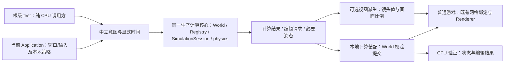
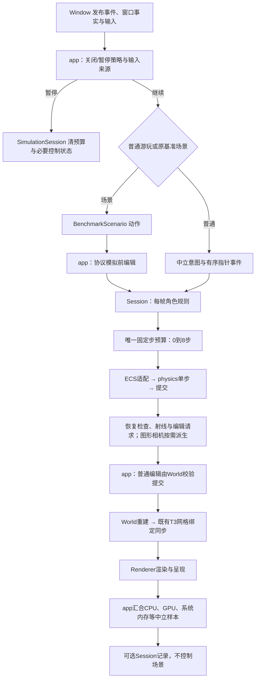

# M3-T4 草稿：完成应用、平台与模拟模块接口

关联规划：[project-scope](project-scope.md)。前置契约：[T0 模块边界](M3-T0-模块软硬边界.md)、[T1 世界模块](M3-T1-世界模块重构.md)、[T2 SDL3 迁移](M3-T2-SDL3迁移.md)、[T3 渲染器](M3-T3-渲染器重构.md)。设计来源：[对象与数据导向架构初稿](project-architecture/面向对象与数据导向架构设计初稿.md)。按 [完整功能模板](../Obsidian-功能笔记模板/templates/02-完整功能.md) 编写；对象的详细成员、不变量及函数契约在实施时维护对应类/数据/系统笔记，不复制多份验收表。

**阅读顺序：** 先看 [[M3-T4-draft#已确认事项|已确认事项]] 与 [[M3-T4-draft#方案决策表|方案决策表]]，再看 [[M3-T4-draft#职责与模块边界|职责边界]]、[[M3-T4-draft#可独立推进的计算核心与单机组合|计算核心与单机组合]]、[[M3-T4-draft#物理板块的方案2到方案3迁移|物理迁移]] 和 [[M3-T4-draft#验收案例|验收案例]]。需要后文对比的决策格均有独立跳转入口。

本文件是 **T4 候选设计，不是正式实施契约或验收报告**。本轮只记录已选物理路线、拟定接口和待选方案，不修改源码/CMake，不执行实验，不授权 T4 实施。名称和入口形状均为候选；不能据此认为相关对象、target 或公开 v1 已存在。

2026-10-08 补充确认：T4 建立可独立推进的计算核心，保留当前单机组合；真正拆进程留到后续专项阶段。依据 [[project-scope#长期架构：独立计算服务与渲染客户端|长期架构]] 补充本草稿的接口边界及 CPU 验收，不变更已填方案、不重写既有玩法时序，也不授权计算服务或通信实现。

同日最新硬件范围确认：M3 功能/兼容验收只限定本机 RTX 5070 Ti，T2/T3/T4 同步调整；其他 GPU 或第二机器不作为当前节点前置。本机适用项目完成且经用户批准后即可推进，不因缺少另一设备结果阻塞。指定 Y9000P 中端与 GTX 1650 低端整机性能验证仍为下一玩法阶段功能开发前门槛，见 [[project-scope#M3 本机 RTX 5070 Ti 验收与下一玩法阶段性能门槛|当前验收范围与后续性能门槛]]。历史基准与现有未执行状态不变，不扩大物理/计算核心或探针决策范围。

2026-10-08 状态核对：生产平台已使用 SDL3，T2 S1/S2 已完成、S3 实施与验证中，节点状态以 [T2 记录](../milestones/m3-t2/README.md) 为准；独立 D3D12 前置实验已获授权，见 [T3 R1 记录](../milestones/m3-t3/README.md)。T4 设计不阻断或撤销这些授权，也不从局部结果推定 T2/T3 已通过。T4 生产迁移仍按前序验收、本文正式化和独立实施授权推进。

## 当前设计

新的 Application/Runtime/SimulationSession 组合设计及独立物理 target 暂无已实现版本。下表描述本次读取的活动源码，不覆盖其他任务正在推进的阶段状态。

| 已有行为 | 尚需收束的责任 | 源码与权威入口 |
| --- | --- | --- |
| app 使用 Init/Run/Free，已有异常上报和关闭顺序 | 窗口、Registry、相机、玩家 ID、冷却等仍在 namespace 静态状态；运行循环混合输入、场景、模拟和观测 | [application.cpp](../../game/app/src/application.cpp)、[app 编排](../project/architecture/app/App-运行编排-功能.md) |
| Window 为不可复制 PImpl，私有实现已接入 SDL3 和三种窗口模式 | 静态 Init/Free、裸拥有指针 Create、可写 width/height；平台寿命与窗口事实需有受控对象接口 | [window.h](../../game/modules/platform/include/symocraft/platform/window.h)、[Window](../project/architecture/platform/Window-类设计.md) |
| 输入有按住态、短按锁存、有序指针事件和恢复处理 | 采集/发布/消费寿命、普通输入与场景输入的隔离责任仍须与 T2 成立契约核对 | [输入状态](../../game/modules/platform/src/input_state.h)、[T2 输入记录](../milestones/m3-t2/README.md#s3-输入与窗口行为) |
| Physics::Update 已使用显式 Registry/world，120 Hz、最多 8 个子步 | 单个入口混合共享预算、ECS 遍历、积分、世界查询与碰撞；重力和预算为静态状态 | [physics_system.cpp](../../game/modules/simulation/src/physics_system.cpp)、[模拟系统](../project/architecture/simulation/Simulation-系统设计.md) |
| PlayerMath 已有 AABB、接地、体素射线与查询回调 | 通用碰撞数学与玩家移动规则混在同一公开头；没有独立物理数据/构建边界 | [player_math.h](../../game/modules/simulation/include/symocraft/simulation/player_math.h) |
| telemetry 已使用 SessionConfig 与 Data::Value，保存 CPU/GPU/内存样本并导出 | metadata/startup/completed 仍可直接写；封闭、完成事实与导出责任需要明确；是否采样与是否运行基准路线仍耦合 | [performance.h](../../game/modules/telemetry/include/symocraft/telemetry/performance.h)、[Session](../project/architecture/telemetry/Session-类设计.md) |

现有 simulation 单测覆盖数学、输入、相机与延迟编辑请求；独立单步积分/碰撞主循环和多会话隔离仍需补齐。现有阶段报告是各自结果来源，本次没有重新执行测试。

### 公开接口预期行为

本表仅索引已有入口，完整现状契约见链接；不是将旧签名冻结为 T4 v1。

| 入口 | 当前调用方 | 已有行为与限制 | 权威入口 |
| --- | --- | --- | --- |
| Application::Init/Run/Free | main | 静态运行状态，初始化/运行/清理分开，不能假定同实例支持反复开局 | [Application](../project/architecture/app/Application-类设计.md) |
| Window::Init/Create、PollInt/CaptureInput、Destroy/Free | app/平台测试 | 主线程平台与窗口；输入当前为借用，窗口模式及私有桥接消费 T2 契约 | [Window](../project/architecture/platform/Window-类设计.md)、[平台桥接](../project/architecture/platform/Platform-namespace-API.md) |
| Physics::Update/ResetTiming/RayCastStatic | app/交互 | 共享固定步预算；运动与射线读取指定 world，异常不保证整体回滚 | [Simulation 系统](../project/architecture/simulation/Simulation-系统设计.md#公开接口预期行为) |
| ApplyInput、Character::Player::Update、DoRayCast | app | 每帧规则、相机和编辑请求；交互返回请求，不直接提交世界编辑 | [Simulation 系统](../project/architecture/simulation/Simulation-系统设计.md#公开接口预期行为) |
| Performance::Session::Add/SetGpu/Invalidate/Export | app/main | 中立记录和导出；当前 Export 混合完成判定，未形成显式 Seal 契约 | [Session](../project/architecture/telemetry/Session-类设计.md) |

### 私有函数预期行为

| 入口 | 当前内部责任 | 本次处理方向 | 权威入口 |
| --- | --- | --- | --- |
| PrepareWorld/MapInput/UpdateInteraction | app 装配、输入映射、编辑提交 | 保留组合根责任；控制状态移入会话，不向底层传 Application | [app 编排](../project/architecture/app/App-运行编排-功能.md) |
| IsSolidVoxel | 将 World 方块及定义解释为可碰撞性 | 移入 simulation 世界碰撞适配，不放进独立 physics 核心 | [物理实现](../../game/modules/simulation/src/physics_system.cpp) |
| ResolveStaticCollision 及碰撞数学 helper | 静态方块碰撞与接地 | 按最小物理数据提取并测试，先保留算法及扫描顺序 | [Simulation 私有入口](../project/architecture/simulation/Simulation-系统设计.md#私有函数预期行为) |
| SDL 事件处理与窗口事实同步 | 私有平台状态更新与输入发布 | 保持 T2 实际行为，不直接推进 simulation/ECS | [窗口实现](../../game/modules/platform/src/window.cpp) |

## 本次变更

### 目标与范围

目标：以明确对象管理会话、资源和不变量，以简单数据和函数表达输入、组件及计算；让 app 只负责组合和帧编排，平台只发布事实，simulation 只推进规则，physics 核心只执行运动/碰撞，telemetry 只整理样本。在当前单机组合中分清计算与呈现，使相同生产计算核心能够由纯 CPU 调用方显式推进，不以窗口或渲染帧作为运行前提。

| 交付范围 | 必须成立的边界 |
| --- | --- |
| 应用接口 | game/app 私有 Application 实例拥有运行对象，无活动 namespace 全局玩法状态；创建、运行和关闭有可验证行为 |
| 平台接口 | 一个活动 Runtime 配对平台寿命，Window 独占原生资源并返回中立尺寸/输入；原生能力仅走 T2/T3 私有桥接 |
| 模拟接口 | SimulationSession 绑定稳定 World/Registry，拥有唯一固定步预算、Controller 与镜头值；输出自有选择、编辑请求及必要姿态/统计，图形相机描述单独派生 |
| 可独立推进的计算核心 | 同一生产 simulation/physics/World/ECS 组合接受中立意图和显式时间；纯 CPU 调用方无需创建 Runtime/Window/Renderer，仍能推进必要世界与实体状态 |
| 独立物理板块 | 当前采用方案2：simulation 下独立目录和 CPU target；核心不认识 ECS、World、窗口或 renderer |
| 观测接口 | Session 封闭/导出受控，运行场景与样本记录职责分开；额外探针档位及裁剪范围按 D06 敲定 |
| 跨阶段交接 | 保留 T1 世界/网格语义、T2 输入/窗口行为和 T3 Renderer v1；方案3迁移时间按 D02 确认 |

不包含：通用 Engine/服务定位器、事件总线、运行中切换世界/图形后端、输入回放产品功能、全玩法固定步重写、相机插值、并行物理、新 ECS/SoA、完整刚体动力学、实体间碰撞、旋转形状、CCD、NPC AI、村落演化、micro voxel 碰撞、细体素世界、第三方物理库或第三方 RHI 接入。独立计算服务/渲染客户端产品、拆进程、IPC/网络/共享内存、跨进程协议冻结、重连/预测/部署也不进入 T4；只形成实际计算边界及测试入口，不创建空模块或通用服务框架。

### 已确认事项

| 来源             | 已确定方向                                  | 不在本轮重新选择的内容                                  |
| -------------- | -------------------------------------- | -------------------------------------------- |
| 2026-10-08 本聊天 | 当前选物理方案2，逐步迁至方案3                       | 不再退回仅分文件夹；也不跳过内部独立 target 阶段直接宣布正式模块完成       |
| 架构初稿 Q1/Q2     | 按状态/资源/不变量决定对象；当前不加 Engine/GameSession | 不全工程类化，不以 T4 重开顶层引擎框架                        |
| 架构初稿 Q4        | 精简仅复制玩家状态的相机实体；Camera 管镜头，位姿从玩家组件派生    | 保持现有镜头/控制语义，不新增独立可写相机姿态或第三人称系统               |
| 架构初稿 Q9        | 不立即统一 SoA、并行或替换 ECS                    | 组件继续满足当前存储约束，正确性审计仍归 T5                      |
| 已审核探针方向        | 深度采集显式启用，Session 是观察者，不拥有被测系统          | 不采用 DLL/代码注入，不将深度分析常驻所有普通运行；具体 T4 交付档位仍待 D06 |
| T1/T2/T3 既有决策  | 现有世界契约、SDL3 与输入手感、D3D12 先行及双现代验收       | 不重选窗口库，不扩大公开 RHI，不提前将 GL 最终退役并入 T4           |
| 2026-10-08 本聊天与长期规划 | T4 先建立可独立推进的计算核心，保留单机组合；长期渐进形成 dedicated compute server + render client | 本阶段不拆进程，不把窗口状态变成计算核心的运行前提，不重新选择物理路线或引入服务器框架 |
| 2026-10-08 最新本机验收范围 | T2/T3/T4 当前功能/兼容只在本机 RTX 5070 Ti 验收；中低端整机性能验证仍前置于下一玩法功能开发 | 不等待其他 GPU/第二机器，不称双机通过，不改变历史结果、60 FPS 中端目标或待确认低端预算 |

审核来源见 [[面向对象与数据导向架构设计初稿#审核清单|原决策清单]] 与 [[面向对象与数据导向架构设计初稿#R03 性能探针与观察者边界|探针意见答复]]。物理方案的历史比较和最终路线见下表 D01。

### 方案决策表

**填写规则：** D01 已确认；D02–D07 的“最终敲定方案”由用户填写。推荐不等于批准。每项提供三个可行候选，附录成本为定性估计，运行开销待测；不虚构测量结论。表内 At Links 分隔符已转义。

#### D01 物理组织路线

| 最终敲定方案 | 候选方案1 | 候选方案2 | 候选方案3 |
| --- | --- | --- | --- |
| 已确定：当前方案2，逐步迁方案3；2026-10-08 用户确认。[[M3-T4-draft#D01 物理组织路线对比\|方案对比]] | simulation 内仅分文件夹，共用原 target；未采用 | simulation 下独立物理板块与 CPU target；当前采用 | game/modules/physics 正式模块；作为后续迁移目标，不直接跳过方案2 |

#### D02 正式 physics 模块的迁移节点

| 最终敲定方案                                | 候选方案1                              | 候选方案2                                      | 候选方案3                                   |
| ------------------------------------- | ---------------------------------- | ------------------------------------------ | --------------------------------------- |
| 2[[M3-T4-draft#D02 正式模块迁移节点对比\|方案对比]] | T4 内：先完成方案2并验证，再搬至正式模块；方案3纳入 T4 必验 | T4 交付方案2；T5 审计后另立迁移节点，在 NPC 物理复用前完成方案3（推荐） | T4 交付方案2；在下一玩法阶段引入第二类实体运动时，先完成方案3再扩展调用方 |

#### D03 只读碰撞查询的绑定方式

| 最终敲定方案                              | 候选方案1                     | 候选方案2                | 候选方案3                                |
| ----------------------------------- | ------------------------- | -------------------- | ------------------------------------ |
| 1[[M3-T4-draft#D03 碰撞查询绑定对比\|方案对比]] | 借用上下文与函数指针的窄查询值（推荐）；只同步使用 | 模板查询回调；调用侧实例化，不引入虚接口 | 窄只读虚接口；world 适配实现接口，不将完整 World 暴露给核心 |

#### D04 运动数据交接与失败保证

| 最终敲定方案                                 | 候选方案1                            | 候选方案2                               | 候选方案3                            |
| -------------------------------------- | -------------------------------- | ----------------------------------- | -------------------------------- |
| 1[[M3-T4-draft#D04 数据交接与失败保证对比\|方案对比]] | 每实体小型值输入与结果，成功后提交该实体（推荐）；不承诺整步回滚 | 借用明确的 inout 运动数据，原地计算；失败可能部分写入，终止会话 | 整个物理子步用暂存批次计算，全成功再提交；多子步/整帧不自动回滚 |

#### D05 普通输入与基准输入的隔离责任

| 最终敲定方案                              | 候选方案1                                | 候选方案2                                     | 候选方案3                                 |
| ----------------------------------- | ------------------------------------ | ----------------------------------------- | ------------------------------------- |
| 1[[M3-T4-draft#D05 输入隔离责任对比\|方案对比]] | platform 发布事实，app 按运行配置筛选并选择输入来源（推荐） | platform 保留中立采集 profile，app 选择消费普通输入或场景意图 | T4 暂保留 T2 当前筛选实现，只分离 app/会话；策略收束另立后续项 |

#### D06 T4 性能观察的交付深度

| 最终敲定方案                                 | 候选方案1                                       | 候选方案2                                      | 候选方案3                                     |
| -------------------------------------- | ------------------------------------------- | ------------------------------------------ | ----------------------------------------- |
| 1 [[M3-T4-draft#D06 性能观察交付深度对比\|方案对比]] | 本次完成 Session 封闭与场景分离，保持现有启动行为；额外档位/裁剪后续（推荐） | 同时完成启动式 Off/Basic/Deep 装配；默认档位、频率和容量在正式化前定 | 同时交付裁剪轻量包与可分析 Release 包，启动能力具名检查；增加包/构建矩阵 |

#### D07 输入记录的跨边界交接

| 最终敲定方案                               | 候选方案1                          | 候选方案2                            | 候选方案3                     |
| ------------------------------------ | ------------------------------ | -------------------------------- | ------------------------- |
| 1。[[M3-T4-draft#D07 输入交接方式对比\|方案对比]] | 复用/转移自有 InputFrame（推荐）；不强制逐帧分配 | 同步借用只读视图；明确下次采集/Reset/Destroy 失效 | 复制自有快照；消费者最独立，需测事件容器复制及分配 |

**尚待收口的范围：** D02 决定方案3是否为 T4 门槛；D05/06 决定平台策略与探针的本阶段深度。其他项确定输入/查询/失败契约。未填写前不能宣布本文正式化或实施就绪；既定方案2与方案3方向不会因待选项取消。

### 职责与模块边界

| 对象 / 能力                  | 功能与作用                      | 负责 / 不负责                                                | 输入、输出与所有权                                                                                     |
| ------------------------ | -------------------------- | ------------------------------------------------------- | --------------------------------------------------------------------------------------------- |
| app 私有 Application       | 装配当前单机运行，连接模块并编排帧          | 拥有运行配置与各对象，施加本地暂停策略并提交既有编辑；不计算碰撞，不直接写 Session 容器，不供底层回读 | 启动配置→RunResult；独占 Runtime/Window、World/Registry/会话、既有 Renderer/Bindings及可选观测/场景；此组合不构成永久同进程限制 |
| Platform::Runtime        | 配对平台库初始化与终止                | 一个活动主线程 runtime；不决定玩法和后端，不释放外部持有的平台子系统责任                | 配置→平台可用范围；拥有自己取得的 SDL 初始化责任，所有 Window 先结束                                                     |
| Window                   | 管一扇窗口、输入缓冲和窗口事实            | 不修改 ECS，不执行 GPU 绘制；保留 T2 三模式/私有桥接                       | WindowConfig→窗口/尺寸/输入；独占原生资源，借用 Runtime，原生类型私有                                                |
| SimulationSession        | 管一份世界/Registry 的模拟会话       | 唯一固定步预算、暂停恢复、控制器、镜头值及玩家恢复规则；不轮询窗口或写 GPU，推进不依赖画面比例       | 意图/显式时间→选择/编辑请求及必要姿态/中立统计；图形相机另行派生；World/Registry 为非拥有借用                                      |
| Controller / 角色规则        | 意图转运动规则及交互请求               | 管选材、冷却和一次性输入消费；不承担物理步预算或直接提交世界编辑                        | 中立意图/角色数据→运动修改与请求；不缓存组件地址                                                                     |
| 物理核心                     | 单步运动及静态方块碰撞/空间查询           | 不遍历 ECS，不认识 World，不生成网格、编辑世界或控制角色                       | 运动值/形状/配置/只读查询→运动结果；输入与查询只在本次调用有效                                                             |
| simulation 的 ECS/世界适配    | 把存储和方块语义连接到核心              | 按步取数据、提交结果、解释可碰撞性；不把具体对象交给核心                            | 借用本步 Registry/world；无另一套长期权威运动存储                                                              |
| Camera 镜头值               | 保存 FOV/裁剪范围，按需派生中立相机描述     | 玩家组件是位姿权威；无仅用于复制玩家姿态的相机实体，图形描述不是推进世界的前提                 | 镜头配置/玩家姿态/像素比例→T3 成立的相机输入；玩法朝向/射线不依赖 GPU 投影                                                   |
| app 私有 BenchmarkScenario | 管既有 static/walk/edit 路线与游标 | 产生场景动作；不采样统计，不轮询窗口，不启动另一个进程                             | 时间/必要状态值→意图/模拟前编辑请求；不拥有被测 World/Registry                                                      |
| Performance::Session     | 收样本、关联 GPU、标无效原因、封闭并导出     | 不发 query、等待 fence、截图、采内存、控制角色或启动游戏                      | 中立样本/配置/元数据→原记录与摘要；拥有记录，不保留运行对象指针                                                             |

Runtime/Application/Window 是资源或组合所有者；Session/Controller 管状态；组件、相机描述和物理结果保持简单数据。数学、序列化和无隐藏状态的单步求解可继续是函数。物理如确有配置/复用工作区才建立轻量实例；不虚构 PhysicsWorld、统一 System 基类或逐实体虚函数层。

资源根若需从当前隐式定位改为显式上下文，可配套已审核的小型 AssetLocator；保留路径约束及独立工作目录运行，不扩为缓存/资源管理器，不把 assets 重构变成物理提取前置。

### 可独立推进的计算核心与单机组合

“计算核心”是已有 simulation/physics/World/ECS 的职责组合，不是新增 compute 模块、另一个物理世界或通用 Engine。T4 交付的是 **同进程逻辑拆分与无窗口推进验证**：普通游戏继续由 Application 同时装配计算侧与呈现侧；根级 test 的 CPU 调用方直接消费相同生产 target，不重新实现算法或要求产品提供专用服务器启动项。

| 审核重点 | T4 必须形成的边界 | 保留的现状与后续限制 |
| --- | --- | --- |
| 装配与推进 | 玩法必需的数据加载、World/Registry/会话可在无 Runtime/Window/Renderer 的条件下成立；时间由调用方显式提供，不从窗口或 GPU 取时间 | 生产 Application 仍保留现有单机启动/关闭路径；无窗口不等于无玩法资产，不要求新增服务器可执行程序 |
| 演化与视图 | Advance 消费中立意图/时间并产生计算结果；FOV/画面比例/投影仅参与按需视图派生，不是推进必需输入 | 镜头值可仍按原设计由会话持有；影响移动、瞄准和交互射线的朝向仍是玩法数据，不新增第二份可写位姿权威 |
| 调度与暂停 | 会话接受显式推进、暂停和恢复；窗口事实先由本地 app 转成策略，不在核心内检测失焦、最小化或等待呈现 | 本地每帧调用一次、角色规则一次、120 Hz 物理最多 8 步及恢复 dt=0 保持；独立服务时钟、AI 频率与后台续算另定，不在 T4 改成全玩法固定步 |
| 编辑与权威 | 意图/交互产生请求，由当前本地计算装配调用 World 校验提交；CPU 调用方能复现同样顺序，无需 GPU 网格绑定 | 普通编辑仍由 app 在模拟后提交，benchmark edit 仍在模拟前；后续迁至计算服务的校验/提交职责，不意味着当前就移入 Advance 或新增命令总线 |
| 数据与寿命 | 需要持有的输出采用自有中立值，按当前会话/实体有效期使用；内部 World/Registry/查询借用不泄漏到外部显示结果 | D03 已填绑定方式与 D07 候选交接规则不因该方向改选；不复制完整 World/Registry，不将进程内 ID 宣称为重连/持久化身份，不提前冻结 wire protocol |
| 显示副本与观测 | 计算侧是唯一玩法状态裁决者；按需读取的姿态/选择/摘要不是第二份可写权威，纯 CPU 诊断可独立于 GPU 样本成立 | 不在 T4 实现客户端复制或每步全量快照；现有 CPU/GPU 性能协议继续保持，跨进程指标关联后续另定 |

职责关系如下；图中只表示 T4 的本地调用，不表示已经拆进程、启用后台线程或建立通信协议。



CPU 推进入口的场景驱动与诊断放在根级 test，实际计算和中立视图派生仍由生产实现提供。未生成图形相机或未提交 GPU 不影响必要状态推进；未来服务器内部的 World/physics 查询仍是进程内同步调用，不把每次碰撞查询改成 RPC。跨进程身份、状态发布、通信、背压、重连及各进程生命周期留专项 spec，届时提供 3–4 个可行选型，不由本草稿默认决定。

### 物理板块的方案2到方案3迁移

#### 可行性与必须保留的行为

可行性判断：现有碰撞只需要运动/形状数据与“该格是否可碰撞”，已有查询回调可复用；主要工作是拆调度、存储适配和数据契约，不需要先引入通用物理库。结构工作可逐步验证，行为回归是主要风险，不据此估算 FPS 提升。

- FixedStepBudget 从物理全局状态移到 SimulationSession；保留 120 Hz、最多 8 步、现有长帧裁剪及暂停重置。核心一次只执行一个明确固定步，不第二次 Consume。
- 保留现有“位置推进→加速度→重力→速度限制→碰撞/接地”的顺序、碰撞扫描/平局处理、接地容差和 sensor 语义；不顺便换积分器、轴顺序或增加扫掠碰撞。
- 角色规则在每次会话推进中执行一次；当前单机 app 每帧调用一次，物理执行零到多个子步。有序指针事件、跳跃消费、冷却和普通编辑不在每个子步重复；CPU 调用方按相同输入/时间序列复现，不要求存在渲染帧。零步跳跃先留行为基线，输入缓冲另行确认。
- 世界适配保留当前有限世界的 OutsideWorld/高度越界为非碰撞格；未定义方块仍报错，不吞成空气。未来“未加载区块”另选策略，T4 不虚构流式能力。
- 射线结果是值，不带 draw 开关；方块选中、库存、放置保护和 World::EditRequest 仍由 simulation 交互/世界执行负责。

#### 最小数据契约

| 候选数据 | 语义与有效期 | 不进入契约的内容 |
| --- | --- | --- |
| BodyState | 位置、速度、加速度、重力/sensor/接地状态；有限数值，长期权威仍在当前组件 | EntityId、Registry/World 指针、相机朝向、GPU 句柄 |
| AabbShape | 正尺寸与局部偏移；世界轴对齐，坐标单位沿用现有世界 | 旋转刚体/网格形状、从完整 Transform 静默采用缩放 |
| PhysicsSettings / 固定步时长 | 重力、各轴速度上限、现有容差及一个固定步；先保持当前值 | 真实帧累计、窗口时间源、全局可写配置 |
| TerrainCollisionQuery | 单位格→可碰撞性，绑定机制按 D03；只读、同步借用，不保存上下文 | Chunk/BlockDefinition 的完整结构、世界编辑与生成入口 |
| StepResult | 新运动状态与接地事实；失败提交保证按 D04 | 整帧事务、自动实体生命周期、持久资源 |
| RayHit | 命中、格坐标、法线、距离；保持当前边界和无命中语义 | 渲染、选择框资源和方块编辑副作用 |

ECS 适配只暂时读取/提交必要运动值，不复制整个世界或 Registry，不长期持有 span/组件地址。组件继续满足当前 standard-layout/trivial 存储约束，资源不塞进组件。BodyState 是计算契约，不是新建第二个物理世界。

#### 软边界与硬边界

以下均为候选落点，不在本轮创建目录或 target：

```text
game/modules/simulation/
  CMakeLists.txt
  include/symocraft/simulation/       # 会话、意图、结果等对 app 的契约
  src/                               # 角色/交互/镜头与 ECS/World 适配
  physics/
    CMakeLists.txt                    # 方案2阶段定义 symocraft_physics
    include/symocraft/physics/        # 独立数据/单步/查询契约
    src/                             # 积分、碰撞和空间查询实现
game/app/src/                        # Application、场景和输入策略，均私有
test/unit/physics/                   # 无 ECS/World/窗口的真实核心测试
test/unit/simulation/                # 会话/适配/角色与交互测试
test/integration/                    # 真实组合、平台、部署及回归
```

| target | 依赖与可见范围 | 必须验证 |
| --- | --- | --- |
| symocraft_physics | 仅标准库与 foundation 数学契约；独立 include 根，不获得 simulation 的 include/src 根 | 不直接或传递依赖 ecs/world/scene/platform/renderer/assets/telemetry/app 或图形 SDK；独立消费者能编译运行 |
| symocraft_simulation | 单向消费 physics；ECS/World 适配在自身 src；物理契约优先不向 app 传播 | 公开会话头不泄漏物理实现/原生平台；不得 physics→simulation 形成环；会话 CPU 消费者不直接或传递链接 platform/renderer/app 或图形 SDK |
| platform / telemetry | 保留 T0 的正式 target，只完善本阶段契约与实现 | simulation/physics/telemetry 的 CPU 路径无窗口/GPU；telemetry 不依赖 app/renderer |
| game/app 目标 | 链接正式模块，私有装配运行对象 | 底层不反向链接 app；生产不依赖 test/support，测试链接真实生产实现 |

从第一天采用稳定的 `symocraft_physics` target、`symocraft/physics/...` 头路径与 `SymoCraft::Physics` 命名空间；方案2的公开头只给声明的 simulation/测试消费者使用，不先宣称第十个正式生产模块已成立。若公开会话签名确需某个 physics 数据类型，正式化时逐项说明传播理由与 PUBLIC 依赖，不能导出整个 simulation 私有目录。

迁方案3时将上述 physics 子树及 target 定义所有者移到 `game/modules/physics/`，保留 include/namespace/target 与行为；依赖方向不变。更新模块清单、根构建组织、边界检查和实际架构索引，不修改 T0 历史报告，也不复制两套物理实现。

#### 迁到正式模块的退出条件

| 条件 | 所需证据 |
| --- | --- |
| 真正独立 | 核心独立 Debug/Release 构建与消费者通过，禁止依赖/include 负向检查成立 |
| 调度和状态已隔离 | 两份 CPU 会话交错推进不共享余数/冷却，旧全局预算和活动直连入口已撤掉 |
| 查询/存储适配单向 | World/ECS 适配不进入核心，借用只同步使用，无反向 target 环 |
| 行为有基线 | 单步、碰撞、查询及现有玩法/协议回归有结果；失败保证按 D04 留证 |
| 迁移可核对 | 单一实现、消费者头与 target 不变，发布/CPU/工具矩阵和正式模块文档同步 |

已确认“最终迁方案3”，未确认截止点。D02 未敲定前，T4 的最小候选交付按方案2编写；不擅自要求方案3已完成，也不把待定时间解释成永久不迁移。

### 候选接口与调用行为

下表定义拟审核的可观察行为，不是完整头文件。先冻结数据语义与失败边界，再定签名；输入/相机使用前序已成立的数据契约，不另造第二套 Renderer API。

| 候选入口 | 调用方 / 输入输出 | 前提、所有权与失败后的状态 |
| --- | --- | --- |
| Application 创建 / 装配 / Run / Shutdown | main 提供自有 app 配置，Run 返回自有退出/完成结果 | 先建立组合根/可选记录，再显式装配；成功才进入可运行状态，失败保留诊断及可关闭的 owner；一实例一次 Run、主线程非重入，Shutdown 幂等，析构不抛异常；不向模块传 StartupOptions |
| Runtime 创建 / 关闭 | app 拥有平台运行范围，Window 借用它 | 一个活动 runtime/窗口的既有范围；只释放自身初始化责任，不终止外部 SDL owner；有活窗口时不能先结束 runtime |
| Window 受控创建 / FramebufferSize / 输入交接 | 返回明确独占 owner、中立尺寸与输入；交接方式按 D07 | 隐藏可写 width/height 与原生类型；保留 T2 窗口事实/短按/held/Wait 行为，D05决定隔离层 |
| SimulationSession 创建 / Advance | 绑定本会话 World/Registry，消费中立意图/显式时间，返回选择/编辑请求及必要姿态/统计；画面比例不是必需输入 | 每次 Advance 串行，引用不跨规定失效点，需保留的结果自有；不在此提交普通 World 编辑或呈现；无窗口/图形描述也可推进，不可恢复模拟错误进入 Failed 并停止推进 |
| 按需图形相机派生 | 使用已有镜头值、玩家姿态与有效像素比例，返回 T3 成立的自有相机描述 | 纯计算调用方可不调用；不推进规则/预算或增加可写相机实体，非法视图参数具名报告且不改动已成立的模拟结果；保持本地相机/射线与编辑时序 |
| SimulationSession Pause / Resume / 玩家恢复 | 本地 app 或 CPU 调用方传显式暂停/恢复，会话收束预算及必要控制状态 | 恢复帧不追赶暂停时间；核心不自行解释窗口状态；重生沿用安全出生点行为，不承诺重新创建整个会话 |
| 物理单步 / 射线查询 | simulation 适配传运动/形状/查询，得到中立结果 | 核心不累计时间，不保存借用；数值/形状/查询错误具名报告；写入边界按 D04，不冒称整帧回滚 |
| Controller 输入 / 交互 | 每帧意图及有序事件，产生运动规则/选择/编辑请求 | 指针只一条消费路径；选材与放置冷却为实例状态；放置拒绝的原冷却语义保留 |
| BenchmarkScenario 推进 | app 传实际时间和必要状态值，得到意图/模拟前编辑动作 | 不由 Session 指针隐式启停；编辑时间/顺序、预条件和 workload版本保持原协议 |
| Session Add / 关联 GPU / 标注无效 / Seal / Export | app 传样本与具名最终事实；Session 输出原记录与摘要 | Recording→Sealed→Exported；Seal后拒绝新样本，重复导出/失败重试规则在正式化时明确；无效数据可保存，不伪装成功 |

Session 的 metadata/startup/completed 改为受控记录/完成入口，保留 Data::Value 冷路径契约，不重新公开 YAML::Node。统计函数只处理指定数据，不排序原始帧容器破坏 GPU 关联；帧号、迟到/缺失 GPU 与记录上限的规则需写入类笔记。完整 Seal 并不承诺强制等 GPU，也不承诺外部文件写入一定成功。

### 帧顺序与观测交接

本节描述 **保留的单机组合流程**，不是计算核心必须拥有的窗口/呈现循环。CPU 调用方按相同意图、时间及编辑顺序推进；不走窗口和 GPU 路径，也不将下图解释为未来服务端必须跟随客户端帧率。



普通交互的相机/射线在模拟之后，编辑再提交 World；benchmark edit 按旧协议在模拟前执行。不会因整理接口把两者统一到错误阶段。renderer 的持久网格/句柄同步由 T3 已交付实现承担，T4只将其纳入 Application 生命周期和组合测试，不重写 GPU 实现。

窗口消息只记录事实，不从回调调用 Advance、修改 ECS 或提交 GPU。主循环在帧边界处理尺寸与恢复；关闭请求不继续新模拟/渲染。Benchmark 的 allow-unfocused、Escape跨失焦锁存、不可绘制处理和真实尺寸继续按 T2/冻结协议成立，不能套用普通游玩的失焦暂停策略。

性能记录与场景独立：普通游玩可以记录，场景可以不创建完整记录；是否新增命令以及档位按 D06 定。GPU query/截图由 renderer执行，系统内存由 platform采集，app关联后交 Session；外部 benchmark 仍在进程外读文件，不被游戏反向链接。观测开销、容量/频率、满额策略需测量和显式记录，不承诺零负载。

无窗口 CPU 验证使用具名状态/诊断证据，不伪装成已冻结的 static/walk/edit GPU 成绩；没有 GPU 不构成 CPU 推进失败，也不把 GPU 样本补成 0。T4 不新增服务端性能文件协议或跨机器时钟关联要求，D06 的既有候选范围不因此扩大。

### 所有权、RAII与失败约束

| 编号 | 不变量与成立边界 |
| --- | --- |
| T4-I01 | Running 时 World/Registry 覆盖 SimulationSession、Window 覆盖 Renderer、Runtime 覆盖 Window；所有帧入口与出口成立 |
| T4-I02 | 一个会话只消费一份固定步预算，物理单步不读取帧时间；Advance返回及暂停/恢复后成立 |
| T4-I03 | 运动权威数据只有一份，适配不跨帧缓存组件地址，不在遍历时结构修改；所有系统执行期间成立 |
| T4-I04 | 有序指针事件与汇总输入不能双重应用，一次性输入不因多子步重复；输入消费后成立 |
| T4-I05 | physics只依赖中立数据/查询；Performance::Session不保留运行对象指针，SimulationSession仅按契约借用World/Registry；公开头与真实链接都成立 |
| T4-I06 | 参数/查询/存储错误不偷偷当空气或成功；按D04记录已提交范围，Failed会话不继续推进；失败出口成立 |
| T4-I07 | Session封闭后无新增记录，无效与缺失原因不丢；完成、关闭和导出结果分别判定 |
| T4-I08 | 不可恢复错误先停止提交，再有界清理；次要清理失败不覆盖首个错误，不靠Release断言维持安全 |
| T4-I09 | 计算会话由中立意图/显式时间推进，不依赖 Runtime/Window/Renderer、宽高比或 GPU 样本；纯 CPU 与普通组合调用都成立 |
| T4-I10 | 必须持有的显示/诊断结果不包含借用组件地址、World/Registry 指针或 GPU 句柄；同进程借用仅按 D03/D07 等内部契约使用，副本不成为第二份可写权威 |

| 对象 | 明确RAII/状态责任 | 复制、移动与析构 |
| --- | --- | --- |
| Application | 组合成员立即接管已取得对象；不靠“全部初始化成功”标志清理 | 不复制/移动；显式Shutdown报错，析构noexcept兜底 |
| Runtime / Window | 自身平台初始化责任、窗口、事件缓冲及回调关联 | 不复制/移动；窗口先于runtime；Renderer先于Window，原生清理保留T2契约 |
| World / Registry / Renderer | 沿用各自现有或前序成立的资源契约 | 不在T4重新实现其所有权；Registry深度正确性仍归T5 |
| SimulationSession / Controller | 预算、冷却及控制状态按值拥有，World/Registry借用 | 默认不复制/移动；无资源时Rule of Zero，不在析构删除实体或推进世界 |
| 物理配置/工作区 | 配置按值、确需工作区时用自有容器管理，无共享静态缓存 | 无资源求解不造Init/Shutdown；实例复制/移动按实际成员在类笔记明确 |
| Session / Scenario / 镜头值 | 样本、游标和镜头值自有；不删除被测/借用对象 | 值优先Rule of Zero；Session不在析构Export或宣布完成，资源句柄不按字节复制 |

候选创建顺序：解析/CPU资源预检→建立Application组合根及可选记录→显式装配Runtime→Window→Renderer→World/Registry→SimulationSession→既有绑定与可选场景。测量若覆盖启动，在资源装配前建立独立Session；启动失败保留它至最终关闭/封闭/导出，不能因尚未Ready或完整资源构造失败就丢掉失败运行记录。CPU世界摘要、物理单测和独立工具不经过窗口路径。

上述顺序只约束普通游戏装配。CPU 会话验证直接加载必要玩法数据并装配 World/Registry→SimulationSession，借用对象覆盖会话寿命；退出时先停止推进、结束会话，再释放 World/Registry，不创建空窗口或假 Renderer 补齐依赖。T4 不增加跨进程资源所有权或服务器关闭保证。

候选关闭顺序：停止场景/模拟/新采样→交接已就绪GPU样本→释放既有图形绑定并显式关闭Renderer→销毁会话/World/Registry及Renderer对象→显式销毁Window→显式结束Runtime→汇入全部关闭结果并Seal→显式Export。停止采样不等于已封闭；Performance::Session保持可接收最终事实，直到图形、窗口及平台关闭结果都确定，随后才拒绝写入。记录对象存活至导出结束；不得仅因bindings容器销毁就认为GPU资源已回收，或在Seal后忽略Window/Runtime的关闭失败。

当前Registry没有完整构造事务保证。一会话绑定专属Registry；装配失败不发布会话，销毁其专属装配范围，不宣称在任意共享Registry上精确回滚/重试创建。D04推荐方案只保证失败实体不提交，之前实体/子步及本帧角色规则不自动撤销；不可恢复错误停止会话并留诊断。若发现现有ECS资源或索引缺陷阻断本阶段，先最小修复/说明，不以T5尚未开始掩盖已复现问题，也不顺带换库。

### 分步实施与冻结点

阶段启动时在 `docs/milestones/m3-t4/` 建立固定 `manul-verification.md` 并由阶段 README 链接；随 S01–S07 推进更新当前人工操作、预期结果、checkbox 与版本/证据，尚未交付项单列而非当前必做。具体规则见 [Milestone 人工核查入口](project-scope.md#milestone-人工核查入口)。本次尚未启动 T4，不预建空阶段目录或勾选验收。

| 子步骤 | 交付 | 进入下一步的条件 |
| --- | --- | --- |
| T4-S01 交接与正式化 | 核对前序实际状态，填写D02–D07，锁定当前规则/调度/协议与target图，形成正式版本 | T2/T3必需契约及验收已成立；用户审核正式spec并独立授权；不由本draft推定 |
| T4-S02 应用与平台生命周期 | Application实例、Runtime/Window受控所有权与中立事实，沿用已验收桥接 | 部分启动失败、重复关闭、回调寿命及真实窗口回归成立，无新反向依赖 |
| T4-S03 模拟会话与镜头 | 收束预算、Controller/冷却、Pause/Resume/玩家恢复；分离必需演化输入与可选图形相机派生，精简派生相机实体 | 零/多步、输入一次消费、双CPU会话隔离和相机/交互回归成立；无窗口/画面比例仍可用显式输入与时间推进 |
| T4-S04 物理方案2 | 独立symocraft_physics，运动/查询契约、ECS/World适配、真实单步测试 | 禁止依赖、独立消费者及算法基线通过；撤掉旧全局预算和活动直连路径 |
| T4-S05 观测与场景分离 | Session受控记录/Seal/Export、独立Scenario及D05/06选定能力 | 样本关联、无效原因、封闭/导出失败及原文件协议可验证；没有Session指针控制玩法 |
| T4-S06 组合与交付 | 模块/类笔记、头清单、CPU/工具矩阵、无窗口与本地组合计算对照、现代后端本机RTX5070Ti组合回归 | 下方A01–A22适用项及A24–A26有证据；D02选择T4内时还须先完成S07/A23，之后才申请T4整体批准并进入T5；其他选择则后续项具名留档 |
| T4-S07或后续节点：方案3 | 满足退出条件后搬至正式physics模块并更新真实模块边界 | 归属按D02决定；选择T4内时须完成A23，选择后续时另定节点，不标为已完成 |

T3中为接管游戏所需的最小app适配不自动等于完整T4。每步只迁移已需调用链；兼容包装只允许短期过渡，正式候选中不同时保留两份预算、两个相机权威状态或两套物理算法。测试辅助留根级test，不生成模块内第二套测试树。

### 验收案例

状态均为未执行。正式化时依D02/D05/D06明确适用范围：不能把尚未实施、缺环境或失败写作通过；纯CPU测试不替代真实SDL或现代后端组合验证。

| 状态 | 编号与场景 | 预期行为 |
| --- | --- | --- |
| [ ] | A01 模块与公开头 | app私有；底层不依赖Application/StartupOptions，公开头无SDL/图形SDK/兄弟私有头，target图无环 |
| [ ] | A02 独立物理消费者 | Debug/Release单独编译运行physics，不创建World/Registry/窗口；禁止依赖/include负向检查成立 |
| [ ] | A03 CPU-only/工具/关闭测试矩阵 | simulation/physics/telemetry CPU测试与独立benchmark成立；关闭测试不引入fixture/故障程序，不重复编译生产cpp |
| [ ] | A04 部分装配失败 | CPU配置、Runtime、窗口、Renderer、世界、会话各阶段注入失败，已取得资源清理，首个错误保留；mock与真实结果分开 |
| [ ] | A05 正常及重复关闭 | Shutdown幂等，Renderer先于Window、Window先于Runtime；回调无失效引用，重复启动独立进程无未解释增长 |
| [ ] | A06 输入交接与单次消费 | 有序指针逐事件裁剪、短按/held语义、无汇总重复；按D07检查借用失效或自有缓冲复用，Wait不吞关闭/输入 |
| [ ] | A07 两份CPU会话 | 不同World/Registry交错推进，预算、选材、冷却不共享；不据此承诺多窗口/同Registry多会话 |
| [ ] | A08 零步/多步/长帧 | 保留120Hz、最多8步和原裁剪；角色每帧一次，核心每子步一次，零步输入行为有旧新对照 |
| [ ] | A09 暂停恢复与窗口事实 | 普通失焦/最小化按前序策略，恢复dt=0不瞬移；真实像素/尺寸与renderer相机比例一致，不混Benchmark协议 |
| [ ] | A10 单步积分与sensor | 位置/加速度/重力/限速顺序不变，sensor跳过碰撞并清接地，无误把帧间隔当固定步 |
| [ ] | A11 地面/墙面/墙角/低顶 | 真实核心夹具验证纠正、速度清理、落地/接地；保留已有算法局限，不宣称高速穿透自动修复 |
| [ ] | A12 支撑移除/负坐标/区块边界 | 同一world适配读取当前碰撞规则，支撑移除后失去接地；域外语义明确，不强依赖渲染或网格重建 |
| [ ] | A13 物理/射线参数与查询失败 | 非有限/非法形状/查询错误有明确结果；未定义方块不当空气；射线边界/法线/无命中保持 |
| [ ] | A14 D04写入失败边界 | 注入指定实体/查询失败，核对未提交及已提交范围；Failed不继续推进，不冒称整帧事务 |
| [ ] | A15 调试模式与安全出生点恢复 | 切sensor/重力、掉出世界后恢复，速度/接地/跳跃/预算按原规则复位，没有全局余数残留 |
| [ ] | A16 镜头与普通编辑 | 无重复相机实体权威，镜头/选框/库存/放置保护不变；普通编辑在模拟后提交，拒绝冷却语义保留 |
| [ ] | A17 场景与观测独立 | 普通运行记录不自动走路线；场景不靠Session是否存在启停；static/walk/edit动作、顺序和预条件不变 |
| [ ] | A18 记录/迟到GPU/缺失/封闭 | frame ID正确关联，缺失有原因不写0；Seal后拒绝写入，无效运行仍可导出，原帧顺序不被统计排序破坏 |
| [ ] | A19 关闭/导出失败 | 完成事实、正常关闭、有效性、导出成功分开；退出码保持原约定，保存失败不报成功；复现状态文件失败时定位留证 |
| [ ] | A20 D05/D06所选模式 | 输入隔离保留Benchmark Escape/allow-unfocused；新增档位或裁剪仅按已选范围验证，未编译能力具名拒绝 |
| [ ] | A21 文件协议与工作目录 | 新旧结果可读、元数据/seed/摘要/workload/CPU-GPU-present口径不漂移，安装包从无关及空格/中文路径启动；不覆盖冻结原记录 |
| [ ] | A22 本机RTX5070Ti现代后端组合 | D3D12/Vulkan各自在本机RTX5070Ti验证同一调用方的14项适用玩法及至少15分钟；留真实adapter/driver/候选版本，缺能力具名受阻，不静默回退；保留GL只做受影响回归，不扩成永久三后端矩阵，不等待其他GPU或第二机器，也不称Y9000P整机已验收 |
| [ ] | A23 正式physics迁移 | 仅在D02选择T4内时为T4必验；目录/模块清单/构建所有者更新，target/include/行为不变，独立及组合矩阵重跑；否则具名后续 |
| [ ] | A24 无窗口真实会话推进 | 根级test链接真实simulation/physics/World/ECS生产target，加载必要玩法数据，按显式意图/时间推进运动、交互请求及World校验提交；不创建Runtime/Window/Renderer，不调用图形相机派生，公开头与链接闭包无相应反向依赖 |
| [ ] | A25 计算与本地组合对照 | 同版本、同配置/初始状态及同一意图/时间/编辑顺序，CPU路径与普通本地装配得到一致的必要运动、接地、交互及World编辑结果；同序列增加/省略视图派生与呈现不改变计算结果，不据此承诺跨平台确定性或任意dt结果相同 |
| [ ] | A26 数据寿命与策略分离 | 需保留的结果自有，下一次推进不静默改写旧结果；核心只消费显式暂停/恢复，不读取窗口状态，当前普通失焦恢复仍按A09；非法画面比例仅使视图派生失败，不阻断纯CPU推进或污染已成立状态 |

环境/入口：Windows x64、现有MSVC/C++20和CMake约束；根级test使用真实生产target，必要的纯CPU隔离入口实施时记录实际命令。真实玩法沿用 [14项清单](../testing/gameplay-smoke.md) 与 [固定场景](../project/benchmark/testing/reproducible-scenes.md)。当前图形必验只限定本机RTX5070Ti，两个现代后端分别运行并核对真实硬件能力；CPU会话验证不扩成重复图形矩阵，系统设备清单不作运行证明。其他GPU或第二机器不阻塞T4；中低端整机验证的后续门槛见关联scope。

性能与证据：保留 [20261005冻结协议](../project/benchmark/exp/Benchmark-基准冻结-20261005.md)。本阶段留相同场景的正确性、成本/观测开销及回归依据，本机RTX5070Ti使用同条件前后版本及预先确认预算，不借用另一整机的成绩，也不隐降世界/画面负载；正式测量轮数/预算沿用已批准前序协议或另确认，不补造新阈值，不据结构提取宣称M4达标。中低端整机性能验证另在下一玩法功能开始实施前完成，旧冻结记录不替代届时候选版本验证。现有status文件替换等问题以实际记录定位，不认为对象化自动修好。

验证版本/结果：**无，本次未执行T4。** 实施时记录源码/包身份、配置、后端/设备、输入顺序、错误/关闭结果、原记录与复测。树叶剔除与视角突变等既有延期问题不自动改为本阶段前置；新复现的严重正确性问题仍需处理。

### 正式化与完成条件

正式化前：填完D02–D07，逐项锁定职责/入口及失败保证，核对T2/T3成立契约与接口消费者，确定探针范围/参数及方案3归属，确认演化/视图分离的最小入口与A24–A26对照范围；再形成正式M3-T4版本。正式化时把本文全文与用户填写的决策归档至正式版本附录，不继续维护独立draft，按用户已有归档规则处理。

完成条件：选定范围内的对象/底层实现和独立物理方案2成立，旧活动全局状态/重复实现已退出，A01–A22适用项及A24–A26有真实证据且用户验收；同一计算核心可无窗口推进，当前单机组合及玩法基线保持。D02选择T4内迁移时A23同时必做；选择后续时必须明确后续节点/进入条件，不宣称方案3已交付。T5仍独立审计ECS/内存，不由T4通过推定；GL最终退役与实际拆进程仍属后续节点。

## 后续考虑

| 触发条件 | 后续变化与限制 |
| --- | --- |
| D02确定的正式模块迁移节点到达 | 完成方案3及A23同类验证，单独取得实施/节点批准，不夹带物理算法重写 |
| NPC需要共用运动与碰撞 | 普通意图与AI意图共用角色运动/物理；寻路、实体碰撞和数量预算另立spec，不把外表细节当碰撞网格 |
| 实测出现高速穿透/复杂接触问题 | 单独比较扫掠/CCD、角色控制器或成熟物理库，记录行为变化与验证；不将本draft当作库选型 |
| 物理访问或查询成为瓶颈 | 测量后评估批处理/缓存/AoS-SoA；世界编辑版本、失效和借用规则先定义，不先并行查询可变world |
| 需要同进程重开/多会话运行 | 另定GameSession、实体清理、身份与旧句柄失效；当前CPU隔离测试不代表该产品能力已支持 |
| 需要运行中启停深度探针 | 另定启动/停止、迟到样本、容量及资源关闭协议；启动式装配不等于热注入或零开销 |
| 独立计算入口与多实体场景需要产品化 | 复用T4计算核心，另定无窗口运行产品入口、模拟时钟/预算及演化证据；不由CPU测试推定NPC/AI/村落已实现 |
| 计算服务与渲染客户端实际拆进程 | 按长期规划另立专项spec，选择本机IPC/按需跨机适配、命令与状态协议、身份/版本/背压/重同步及两侧生命周期；届时迁权威装配，不把物理查询远程化，不重写Renderer公开接口 |
| 下一玩法阶段拟开始功能开发 | 先完成指定Y9000P中端及GTX1650低端候选版本性能验证、预算判定与用户进入结论；本机功能/兼容结果及T4通过不解除该门槛，不将M4全部优化或M5/M6整体提前 |

## 附录：方案对比

对比是决策依据，不是基准结果。D01已选；其他最终选择以正文填写为准。运行开销均待实际场景测量。

### D01 物理组织路线对比

| 候选 | 适用与架构影响 | 实现/迁移成本与开销 | 风险与验证 |
| --- | --- | --- | --- |
| 1 仅目录 | 快速整理文件，不改变正式模块/target | 最小改动；没有独立边界收益 | 依赖易回流，无法证明独立消费；未采用 |
| 2 内部独立target（当前已选） | 先形成中立核心，适配留simulation，为方案3准备 | 需要数据/查询及调度拆分；不必产生额外长期存储 | 独立编译、禁止依赖、单步及组合测试，不能只改target名字 |
| 3 正式模块（后续已选） | 成为正式生产模块，后续角色可经simulation复用 | 前述独立后主要搬树与更新组织/检查；仍需回归，非零成本 | 单实现、include/target稳定，模块清单与真实依赖同步；不能跳过方案2 |

### D02 正式模块迁移节点对比

| 候选 | T4与后续范围 | 实现/迁移代价 | 风险与验证 |
| --- | --- | --- | --- |
| 1 T4内完成 | T4先独立再正式搬迁，A23为门槛 | 一个阶段完成最终结构，T4范围更大 | 所有退出条件成立后再搬，重跑独立/组合矩阵 |
| 2 T5后独立节点（推荐） | T4交付独立核心，ECS审计后、NPC复用前完成正式迁移 | 延后一次目录迁移，能结合T5验证适配寿命 | 明确节点/批准，不让“后续”变成无限兼容层；目标不取消 |
| 3 下一玩法阶段入口 | 先保留方案2，在第二类实体接入前迁模块 | 按真实消费者触发迁移，需在玩法阶段排入前置步骤 | 不同时重写AI和物理核心；先搬迁验收再增加角色规则 |

### D03 碰撞查询绑定对比

| 候选             | 适用与架构影响                 | 实现/运行代价                      | 风险与验证                       |
| -------------- | ----------------------- | ---------------------------- | --------------------------- |
| 1 上下文+函数指针（推荐） | 固定窄契约，核心可编译在cpp，适配仅借用绑定 | 一层间接查询调用，不必堆分配；实际开销待测        | 绑定类型/寿命及空绑定验证，调用结束不留上下文     |
| 2 模板回调         | 保持现有数学写法，利于静态绑定         | 可能内联，但实例化进入调用侧、增加头/编译耦合；收益待测 | 只暴露必要算法，检查公开头无具体World/ECS依赖 |
| 3 只读虚接口        | 跨实现查询契约较直观，测试可用小型实现     | 一层虚调用，适配对象仍可栈上；无性能优劣结论       | 对象寿命、重入/写入限制和查询失败诊断可验证      |

### D04 数据交接与失败保证对比

| 候选 | 状态与失败语义 | 实现/运行代价 | 风险与验证 |
| --- | --- | --- | --- |
| 1 单实体值输入/结果（推荐） | 计算成功后提交该实体；失败不提交它，不回滚先前实体/子步 | 复制少量运动值，无整世界快照；需适配转换 | 故障点核对提交范围，结果校验后写回，避免第二份长期权威 |
| 2 同步inout | 核心原地改变明确数据；失败可能留部分结果，停止会话 | 转换/暂存可少，失效与别名规则更严格 | 不缓存借用，查询抛错时不能重试假装未执行 |
| 3 子步暂存批次 | 整个子步成功再提交，前序子步仍已成立 | 暂存和批次校验较多，CPU/内存成本待测 | 验证暂存失败无写回，提交段必须有明确无失败保证；不默许整帧事务 |

### D05 输入隔离责任对比

| 候选            | 功能与边界影响                    | 实现/迁移代价             | 风险与验证                                         |
| ------------- | -------------------------- | ------------------- | --------------------------------------------- |
| 1 app策略（推荐）   | 平台发布事实，app按普通/场景运行策略选消费    | 需要迁当前筛选规则，职责最集中于组合根 | 保留Escape失焦锁存、held/重同步及Benchmark端到端行为，不能仅删筛选代码 |
| 2 平台采集profile | 平台按中立profile采集，app决定是否使用场景 | 改动相对小，平台仍需维护采集模式    | profile不携带Session/玩法对象，不将模式误当场景启停             |
| 3 本阶段保持T2实现   | 先稳定对象生命周期与会话，输入策略留后续       | 最小平台行为改动，留下明确职责收束项  | 在正式spec写明保留范围与退出条件，不宣称策略已完全迁出                 |

### D06 性能观察交付深度对比

| 候选 | 本阶段能力 | 实现/运行代价 | 风险与验证 |
| --- | --- | --- | --- |
| 1 最小分离（推荐） | 封闭/导出与场景独立，沿用现有命令和采样能力 | 主要整理所有权与状态，额外档位后续；不开完整记录时不创建该Session | 验证普通记录/独立场景和旧协议，不能宣称Off/Basic/Deep已交付 |
| 2 启动三档 | 启动时按Off/Basic/Deep装配收集器，不运行时热切换 | 需定义默认、采样频率/容量/满额策略并测成本 | 深度数据只显式启用，轻档不保存全部raw记录；Benchmark保持批准协议 |
| 3 能力裁剪包 | 轻量发布包与可分析Release包，启动检查能力 | 增加构建/部署/许可矩阵；裁剪收益须实测 | 不同包身份可追溯，未编能力具名拒绝，不宣称可分析包成绩等于轻量包 |

### D07 输入交接方式对比

| 候选 | 生命周期与适用 | 实现/运行代价 | 风险与验证 |
| --- | --- | --- | --- |
| 1 复用/转移自有记录（推荐） | app/会话取得稳定本帧记录，平台回收空缓冲 | 需要明确交换/归还时点，可复用容量，不保证零分配 | 单次消费与缓冲复用不改变事件顺序，旧记录不指向新采集数据 |
| 2 同步只读借用 | 同一帧串行立即消费，最接近现有Input() | 少复制，调用顺序/失效约束严格 | 下次采集/Reset/Destroy后不可用，不跨回调/帧保存，不用失效解引用作验收 |
| 3 复制自有快照 | 消费者隔离最直观，测试易持有 | 每帧事件复制/潜在分配需测，键值复制成本与事件规模分开看 | 深拷贝拥有事件，容量压力与分配失败有结果，不凭便利忽略热路径成本 |
