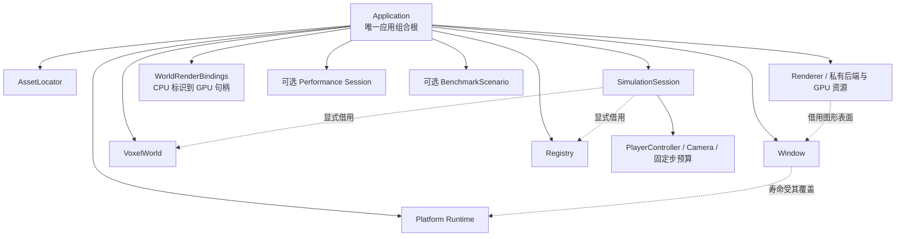
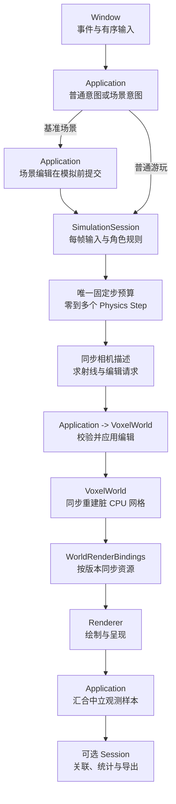
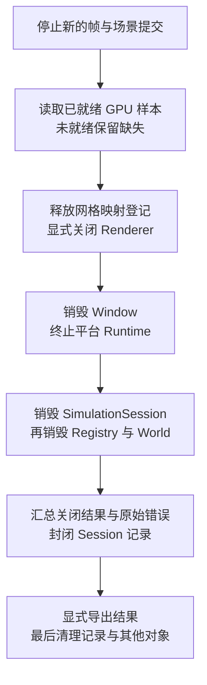

# 面向对象与数据导向架构设计初稿

> 本文保留尚未写入阶段 spec 的架构设计，包括其他模块已审核但尚未归入阶段 spec 的内容。T1 的 world 设计已按已填决策形成 [[M3-T1-世界模块重构|M3-T1 正式 Spec]]，原草稿和意见完整归档在其附录，不再独立存在；本文不重复保存。本初稿仍供审核，不是其他模块的实施授权，不改变既有阶段验收结论。

关联依据：[项目范围](../project-scope.md)、[T0 模块边界](../M3-T0-模块软硬边界.md)、[T3 渲染器设计](../M3-T3-渲染器重构.md)、[当前实际架构](../../project/architecture/Overview.md)。文档组织参考 [完整类模板](../../Obsidian-功能笔记模板/templates/04-完整类设计.md)、[数据与存储模板](../../Obsidian-功能笔记模板/templates/07-数据与存储设计.md)、[系统与数据流模板](../../Obsidian-功能笔记模板/templates/08-系统与数据流设计.md)，采用“当前设计 / 本次变更 / 后续考虑”；跨类初稿不虚构一个统一基类或 `class_name`。

2026-10-07 规划更新：用户已确认 SDL3 前置迁移的方案，当前入口为 [T2 正式计划](../M3-T2-SDL3迁移.md#已确定的决策)，原 draft 完整保留于其 [归档附录](../M3-T2-SDL3迁移.md#附录归档)。原 T2 渲染器重构改为 T3，插入前的应用/平台/模拟与 ECS/内存计划分别为 T4/T5。当前顺序固定为 T2 SDL3 迁移验收后再冻结 T3 渲染器 spec，T3 本身仍是草稿；正式化不授权准备或实施。下方活动建议按新编号引用；窗口库选型附录保留 2026-10-06 的旧编号与分析结论，仅供历史比较，不覆盖已确认的前置迁移方案。

**审核摘要：** 本文继续讨论其余模块与跨阶段组合中的 OOP/DOD 边界，不以“对象化”暗示全工程类化。T1 的 world 专项内容请直接审核 [[M3-T1-世界模块重构#目标与范围|已明确范围]]、[[M3-T1-世界模块重构#已确定的决策|已确定决策]] 与 [[M3-T1-世界模块重构#归档 - 附录：候选方案对比|方案对比]]。原 A04–A06、R01/R08 与 T1 专项审核表已迁走，其余编号保持不变，便于已有链接与意见对照。

## 阅读导航

新增审核入口：[术语与使用原则](#术语与使用原则)、[项目中的数据导向处理](#项目中的数据导向处理)、[明确不接受的做法](#明确不接受的做法)、[OOP 与 DOD 的职责边界](#oop-与-dod-的职责边界)、[布局与优化的取舍](#布局与优化的取舍)、[RAII 责任清单](#raii-责任清单)。

| 想审核什么         | 阅读位置                                                                                                                                          |
| ------------- | --------------------------------------------------------------------------------------------------------------------------------------------- |
| 为什么对象化，哪些地方不改 | [设计取向](#设计取向)、[保留简单的能力](#保留简单的能力)                                                                                                             |
| 拟有哪些类，各自归谁    | [候选总览](#候选总览)、[对象所有权](#对象所有权)                                                                                                                 |
| 应用、资源路径、窗口    | [A01 Application](#a01-application)、[A02 AssetLocator](#a02-assetlocator)、[A03 Runtime 与 Window](#a03-runtime-与-window)                       |
| 已迁出的 T1 世界设计 | [[M3-T1-世界模块重构#世界对象与数据所有权\|对象与数据]]、[[M3-T1-世界模块重构#已确定的决策\|决策表]]、[[M3-T1-世界模块重构#归档 - 已填写的T1审核意见归档\|原审核意见]] |
| ECS、模拟、玩家与相机  | [A07 Registry](#a07-registry)、[A08 SimulationSession](#a08-simulationsession)、[A09 PlayerController 与 Camera](#a09-playercontroller-与-camera) |
| 渲染资源及世界到绘制的连接 | [A10 Renderer](#a10-renderer)、[A11 WorldRenderBindings](#a11-worldrenderbindings)                                                             |
| 性能探针和基准场景     | [A12 Session](#a12-session)、[A13 BenchmarkScenario](#a13-benchmarkscenario)                                                                   |
| 风险、阶段归属及待决事项  | [生命周期与错误](#生命周期与错误)、[阶段建议](#阶段建议)、[审核清单](#审核清单)                                                                                               |

## 当前设计

T0 已建立模块目录、真实 CMake target、公开/私有接口和单向依赖。本文讨论的是这些边界内的对象设计，不以仍存在命名空间函数为理由否定 T0。

| 当前能力    | 实际形态与数据组织                                                                  | 尚未解决的设计问题                                            |
| ------- | -------------------------------------------------------------------------- | ---------------------------------------------------- |
| ECS 与模拟 | 按组件类型的紧凑字节存储与稀疏索引；系统查询组件；已有 Camera 与 FixedStepBudget                       | View 仍扫描实体槽；不能称为完整 archetype 或字段 SoA；物理预算和冷却状态分散     |
| 平台      | Window 已是不可复制的 PImpl 类，拥有有序事件缓冲和按键快照                                       | 平台初始化仍需手工配对；窗口事实可被公开字段改写                             |
| 渲染      | namespace 门面；Batch 类拥有连续顶点，GpuTimer 类拥有固定 query 槽位                         | 尚未收束到 Renderer 实例；当前只有 OpenGL，网格仍逐帧打包上传              |
| 性能观测    | `Performance::Session` 拥有帧/内存记录数组和导出目录；统计提取数值列并排序副本                        | 控制状态公开；采集是否启用与自动基准场景仍耦合                              |
| 资源与基础能力 | 图片拥有连续像素，Data::Value 拥有通用元数据；读取、路径、数学等使用函数                                 | 不应为追求类的数量而全部改成管理器，也不应把通用元数据容器搬进热循环                   |
| 应用      | app 私有 namespace 持有静态运行对象并编排                                               | 创建、部分失败、退出次序尚未由应用实例统一约束；不是大量同类对象的处理循环                |

上述是 2026-10-05 工作区观察，依据：[物理步进](../../../game/modules/simulation/src/physics_system.cpp)、[窗口](../../../game/modules/platform/include/symocraft/platform/window.h)、[渲染状态](../../../game/modules/renderer/src/renderer.cpp)、[性能会话](../../../game/modules/telemetry/include/symocraft/telemetry/performance.h)、[应用编排](../../../game/app/src/application.cpp)。当前验证证据仍以 [T0 报告](../../milestones/m3-t0/README.md) 为准，不据此声明候选类已实现。world 的源码基线已迁至 [[M3-T1-世界模块重构#当前设计|T1 当前设计]]。

## 本次变更

### 设计取向

**建议采用“对象负责所有权、生命周期与不变量，数据组织批量运行状态与交换契约，显式函数或系统执行变换”的混合设计。** 数据不限于跨模块传递，也用于模块内部存储和热循环；函数可以修改明确传入的组件，不必是假装无副作用的纯函数。OOP 与数据导向不互斥，类方法遍历连续数组也可以是数据导向处理。

| 参考 | 借鉴的原则 | 本项目不照搬的机制 |
| --- | --- | --- |
| [Unreal Engine Subsystems](https://dev.epicgames.com/documentation/en-us/unreal-engine/programming-subsystems-in-unreal-engine) | 子系统有明确的创建者和生命周期范围 | 不引入 UObject、自动发现、反射或可全局获取的服务体系 |
| [Unity Entities 组件](https://docs.unity3d.com/Packages/com.unity.entities@1.3/manual/concepts-components.html) | 组件以数据为主，规则由系统处理 | 不把每个实体变成继承式 GameObject，也不复制其 archetype 存储实现 |
| [Unity Entities 存储](https://docs.unity3d.com/Packages/com.unity.entities@1.3/manual/concepts-archetypes.html)、[系统](https://docs.unity3d.com/Packages/com.unity.entities@1.3/manual/concepts-systems.html) | 按访问需求组织组件集合，系统变换组件；系统仍有创建/更新/销毁边界 | 不从“使用 ECS”推定当前项目已有同样布局、调度器或性能 |
| [Filament Engine 资源管理](https://github.com/google/filament/blob/main/filament/include/filament/Engine.h) | 渲染实例跟踪资源，资源与实例的销毁关系明确 | 不增加公共 Engine/RenderDevice 层级，不复制其渲染线程或原生句柄接口 |
| [C++ Core Guidelines C.2/C.4](https://isocpp.github.io/CppCoreGuidelines/CppCoreGuidelines#Rc-struct)、[R.1](https://isocpp.github.io/CppCoreGuidelines/CppCoreGuidelines#Rr-raii) | 用类维护不变量，用 RAII 配对资源；无需访问对象表示的助手可以保留函数 | 不强制所有函数成为方法，不默认引入 shared_ptr、虚函数或 PImpl |

参考核对日期：2026-10-05。以下方案是结合这些原则与当前工程做出的设计建议，不代表各参考引擎采用完全相同的类结构，也不引入它们作为项目依赖。

本稿遵守六条约束：

1. 文件和 target 归属沿用 T0；一个类不是一个新模块，也不自动需要一个新 target。
2. 默认使用具体类与组合。只在渲染后端已有多种实现的地方使用私有多态契约。
3. 每份可变状态只有一个权威所有者；缓存必须说明来源和失效条件。
4. 借用对象不得比所有者活得更久；不可用一个全局 Context 或服务定位器掩盖借用关系。
5. 先保持玩法、确定性、测量语义与失败行为，再优化内部实现；对象化本身不是性能达标证明。
6. 跨模块使用具名、类型明确的值/视图/句柄；内部布局可演进，但数据导向不能绕过 T0 的软硬边界。

### 术语与使用原则

已确认本项目讨论的是游戏引擎语境下的 **DOD（Data-Oriented Design，数据导向设计）**。本稿统一使用 DOD，“数据导向”均指围绕实际数据访问、存储布局和批量变换进行设计，不引入通用不可变数据编程作为另一套范式要求。

| 名称         | 本稿采用的含义                           | 对项目的影响                                  |
| ---------- | --------------------------------- | --------------------------------------- |
| OOP，面向对象   | 用明确对象封装需要共同维护的状态、资源和不变量           | 默认具体类、组合和 RAII，不等于深继承、逐实体虚函数或全部堆分配      |
| DOD，数据导向设计 | 游戏引擎语境下，根据实际读写、规模、频率和处理顺序组织数据     | 重点用于方块、网格、组件、绘制及样本的批量处理；与对象所有权和 RAII 配合使用 |

按组件集合组织存储与系统处理的参考实例见 [Unity Entities](https://docs.unity3d.com/Packages/com.unity.entities@1.3/manual/concepts-archetypes.html)。这里借鉴数据组织与处理原则，不要求本工程引入该框架。

**三个不能混同的判断：** `struct + namespace 函数` 不自动等于数据导向；`class + vector` 不自动等于低效 OOP；数据导向不自动等于 ECS、SoA、SIMD、并行或全部不可变。

发布后的运行配置和封闭记录保持只读，是各自的生命周期与一致性约束，不是 DOD 要求全部数据不可变。正在模拟的组件和尚待 GPU 回填的记录，允许由唯一所有者在明确阶段原地修改；不以数据导向为理由逐帧深拷贝整个世界、网格或图片。world 的定义/方块约束见 [[M3-T1-世界模块重构#世界对象与数据所有权|T1 对象与数据]]。

### 项目中的数据导向处理

下表是结合源码的设计判断，不是已经测得的性能结论。“保留”指维持现有简单表示，“候选”指具体优化仍需证据与审核。

| 位置与数据                                               | 为什么适合                                 | 推荐边界与当前取舍                                                         | 审核意见                                                                                                             |
| --------------------------------------------------- | ------------------------------------- | ----------------------------------------------------------------- | ---------------------------------------------------------------------------------------------------------------- |
| ecs/simulation：Transform、RigidBody、HitBox、Character | 系统按组件组合应用同一规则，行为不需分散到每实体的虚函数          | Registry 拥有组件，系统显式变换；Session 管预算和顺序。当前玩家数量小，保留现有存储，不把全新 ECS 当必做优化 | Pass  [[面向对象与数据导向架构设计初稿#R02 Pawn活跃度与混合模拟\|答复 R02]] Pawn活跃度等不必作为m3交付项                                          |
| scene/renderer：顶点、纹理像素、draw 记录与上传批次                 | CPU/GPU 都消费成批格式化数据，适合连续传递与缓冲复用        | scene 提供中立值/视图，Renderer 管句柄和资源；先保留现有格式，布局变化不能代替按版本更新与在途同步         | pass                                                                                                             |
| renderer：资源槽、frame ID 与 GPU query 结果                | 句柄查找、已就绪结果读取和延迟回收可以按记录批量处理            | 私有表由 Renderer/后端维护；当前 GpuTimer 的固定槽就是“对象 + 批数据”的已有例子              | Pass                                                                                                             |
| telemetry：Frame、Memory、有效性标注、数值列                    | 追加记录、按帧关联、过滤和分位数是数据集合上的变换             | Session 管记录与封闭；统计在记录停止更新后处理数值副本，不排序原始帧数组破坏 GPU 关联                 | telemetry考虑做成性能探针式的，深度性能收集与分析不需要存在于普通游戏进程中，通过显式启动项开启，根据答复三进行pass   [[面向对象与数据导向架构设计初稿#R03 性能探针与观察者边界\|答复 R03]] |
| platform/simulation：有序输入、按键快照、玩家意图与编辑请求             | 数据可独立传递、检查和回放测试，无须携带原生窗口或世界指针         | Window/Controller 管采集与消费状态；保留事件顺序。回放能力仅是表示上的可能性，不是本轮新增功能          | Pass                                                                                                             |
| assets：读取的字节与图片像素 | 字节和像素天然是数据批次 | AssetLocator 管路径约束；读取/解码保留函数，图片保留自有值类型，不扩成逐像素对象 | Pass |
| foundation/app：配置、元数据、完成结果和文件协议                     | 明确数据形状利于校验、测试与序列化，不依赖整个应用实例           | 冷路径可用 Data::Value；运行热路径转换成具名类型和 ID，不按格/顶点构造通用动态 map 或 YAML 节点     | pass                                                                                                             |

实际表示依据：[区块存储](../../../game/modules/world/src/chunk.h)、[地形与网格循环](../../../game/modules/world/src/chunk.cpp)、[组件容器](../../../game/modules/ecs/src/component_container.h)、[物理系统](../../../game/modules/simulation/src/physics_system.cpp)、[顶点契约](../../../game/modules/scene/include/symocraft/scene/mesh.h)、[Batch](../../../game/modules/renderer/src/batch.hpp)、[GPU query 槽](../../../game/modules/renderer/include/symocraft/renderer/gpu_timer.h)、[样本与统计](../../../game/modules/telemetry/src/performance.cpp)、[图片](../../../game/modules/assets/include/symocraft/assets/image.h)。

### 明确不接受的做法

“明确不行”不是说某个模块理论上不能用数据表示。状态机、资源表和生命周期也可以数据化，但仍要有人维护受控入口、阶段和释放协议。本稿选择对象/RAII 承担这些责任，不接受下面这些替代方式。

| 不接受的位置 / 做法                                                  | 原因                                               | 正确边界                                              | 审核意见                                      |
| ------------------------------------------------------------ | ------------------------------------------------ | ------------------------------------------------- | ----------------------------------------- |
| Application、Runtime、Window、Renderer 变成可全局写的裸状态/句柄表，去掉负责清理的对象 | 数组不会自动配对初始化、处理部分失败、维持窗口/设备销毁次序                   | 表可以私有数据化，但其所有者和清理协议必须明确，不能退回隐式全局服务                | agree                                     |
| 外部系统取得可写方块/资源/Session 容器，绕过编辑、句柄校验或 Seal                     | 会遗漏邻块脏标记、版本发布、帧关联和封闭状态；局部字段正确不代表整体有效             | 对外用受控入口；仅在内部指定阶段给算法必要的读写范围                        | agree，稳定容器的读写的外部接口   [[面向对象与数据导向架构设计初稿#R04 容器读写的稳定接口\|答复 R04]] |
| 原生资源对象、回调关联对象或非平凡组件被当作字节随意复制/搬迁                              | 会导致重复释放、析构遗漏或回调悬空；当前 ECS 要求标准布局且 trivial         | 资源由 RAII 所有者管理，组件存值/ID/句柄；容器变化需遵守真实类型与地址稳定性要求     | agree，注意"Rule 5" "Rule 0"明确各个资源的拷贝、移动语义   [[面向对象与数据导向架构设计初稿#R05 资源拷贝与移动语义\|答复 R05]] |
| GPU 使用中的 buffer/query 被“CPU 处理完了”就覆盖或释放                      | CPU 函数返回或析构不代表 GPU 完成；布局与同步是两个问题                 | 后端保留 fence/完成状态、query 有效期和延迟回收规则，不能由 telemetry 代替 | agree，明确telemetry只是性能观察者   [[面向对象与数据导向架构设计初稿#R03 性能探针与观察者边界\|答复 R03]] |
| 为统计排序原始帧，或为批处理重排输入、植被写入和固定步                                  | GPU 当前按帧索引回填；事件有序；植被跨块重叠有 last-write-wins；规则频率不同 | 排序统计副本；保持既有输入和阶段顺序。并行化必须先定义读写冲突与确定性               | agree，但有疑问：这里的统计是谁要消费？是telemetry吗？在附录回答一下   [[面向对象与数据导向架构设计初稿#R06 统计的生产者与消费者\|答复 R06]] |
| renderer 直接查询 Chunk/Registry，或把 SDK/YAML 类型作为所有模块的统一运行数据     | 破坏 T0 单向依赖和中立契约，并把内部表示锁进外部接口                     | world/scene 提供 CPU 数据，app 连接模块；SDK、解析器和容器策略保持私有   | agree                                     |
| 为 OOP 给每个方块/顶点/样本加堆对象和虚函数，或为 DOD 强制全量复制/SoA                  | 前者把同类热数据拆散，后者可能增加转换、分配和复制；都没有针对访问模式              | 数据保持简单，按实际读写决定布局；没有基准证据不承诺更快或更低负载                 | agree                                     |

GPU 同步原则可对照 [D3D12 fence 资源管理](https://learn.microsoft.com/en-us/windows/win32/direct3d12/fence-based-resource-management)。这支持保留在途资源契约，不是声称 RAII 独自解决 GPU 同步。窗口地址约束见 [原生回调关联](../../../game/modules/platform/src/window.cpp)，组件类型约束见 [Registry](../../../game/modules/ecs/include/symocraft/ecs/registry.h)。（Amo-Note:注意GPU同步规则每个图形api都有各自的实现，注意renderer作为pimpl的外部接口的稳定）

### OOP 与 DOD 的职责边界

**一句话界线：谁拥有和何时允许变化，由对象及其契约负责；大量数据怎样被组织和变换，由数据表示与算法负责。** 数据导向代码可以放在类方法或私有自由函数中，不以语法形式分阵营。
（Amo-Note：提供的docs需要有明显的）

| 管理者                                       | 数据导向部分                     | 对象必须守住的边界                                   | 审核意见 |
| ----------------------------------------- | -------------------------- | ------------------------------------------- | ---- |
| Registry                                  | 组件集合、ID/索引映射与查询            | 实体代数、实例归属、结构变化、引用失效与分配失败                    |      |
| SimulationSession / Controller            | 意图值、组件系统与单步算法              | 固定步余数、冷却、一次性输入消费、每帧/每子步顺序                   |      |
| Renderer / 私有后端                           | 顶点/draw/上传批次、资源槽和 query 结果 | 原生资源、句柄归属、在途同步、失败清理与 shutdown               |      |
| WorldRenderBindings                       | 网格标识/版本到句柄的映射和 draw 数组     | 固定 World/Renderer 配对、仅接受成功版本、不越权拥有原生 GPU 资源 |      |
| Window / Runtime / AssetLocator           | 事件、快照、路径值与资产数据             | 平台寿命、回调地址、缓冲有效期和路径解析约束                      |      |
| Session / BenchmarkScenario / Application | 样本、统计、场景动作与模块交换值           | 各自记录/场景/应用生命周期，不能互相接管被测模块                   |      |

该图不强制每个算法都建立临时副本或事务：物理系统可以在受控阶段原地修改组件；CPU 网格则沿用“临时完整构建后发布”的候选保证。不同处理应记录自己的失败语义。

| 候选约束 | 可检查条件 | 成立边界 |
| --- | --- | --- |
| HD-I1 | 批处理所写数据有唯一权威所有者，字段写入不绕过相关 W/EC/S/T 不变量 | 批处理返回及对外发布时 |
| HD-I2 | 借用视图不跨越回调结束、扩容/删除、重建或销毁等已规定的失效点 | 每次访问与模块交接时；GPU 提交另遵循 T3 所有权要求 |
| HD-I3 | 每帧规则、固定子步、基准预编辑与普通后编辑仍按既有阶段发生 | 一帧结束；关联 PC-I1 与既有帧流程 |
| HD-I4 | 统计只排序提取的数值副本，原始帧关联不变，缺失数据不补 0 | GPU 回填与统计导出时；关联 T-I1 |
| HD-I5 | 数据布局变化不直接改变公开顶点/文件格式、生成摘要或资源接受版本语义 | 转换、发布和回归对照时；world 的 GE-I1 见 [[M3-T1-世界模块重构#状态、RAII与失败保证\|T1 不变量]]，本稿关联 BR-I1 |
| HD-I6 | 当前串行处理不因数组或锁的存在被宣称为线程安全；并发前先明确输入寿命和读写冲突 | 设计审核与执行入口；当前不新增并发保证 |

后续类笔记记录所有权、资源和不变量；数据笔记记录表示、身份和有效期；系统笔记记录读写集、处理频率和提交顺序。三类笔记互相引用，不复制一份可互相漂移的完整契约。

### 布局与优化的取舍

AoS 表示“连续记录，每条含多个字段”，SoA 表示“按字段分成连续数组”。**两者都是数据布局，不是 OOP 与 DOD 的分界。** 必须先知道算法读哪些字段、以何种顺序读取，再决定是否调整。

| 当前表示 | 本稿选择 | 重新考虑的条件 |
| --- | --- | --- |
| 28 字节 `BlockVertex3D` AoS 和 MeshView | 保留当前完整顶点契约；按完整记录传递是合理起点 | 特定后端/处理确实需要不同表示时，先做私有转换并验证成本；公共契约变更另行审核 |
| 按组件类型存储的当前 ECS | 保留组件值和显式系统；T5 先审计 ID、索引、类型及失败正确性 | 大量活跃实体和真实查询成本出现后，再比较改良 View、字段 SoA 或替换存储；不默认引入 archetype/Job System |
| `vector<Frame>` / `vector<Memory>` | 记录阶段按条追加/关联，停止更新后提取数值列统计 | 测得采样成本或容量不满足协议时再改变表示；reserve 不是容量上限，也不改变分位数/缺失语义 |
| Batch 连续顶点与逐帧打包上传 | 数据仍批量处理；T3 已规划通过稳定句柄和网格版本减少不必要更新 | 仅改 AoS/SoA 不会消除全帧复制/上传；具体优化收益以同条件测量为准，不新增 M3 性能承诺 |

推荐顺序：**先明确对象与数据契约 -> 保持当前简单布局完成 M3 正确性 -> 在已有基准中定位成本 -> 单独批准有证据的布局/批处理优化。** 无性能证据时也可以依据所有权和可读性改善结构，但不能把这种改善报告成帧率收益。

### 候选总览

“新增”表示本稿建议新增，“完善”表示已有对象继续使用，“条件性”表示有实际需要才采用。名字均省略 `SymoCraft::` 前缀；候选命名不是本轮重命名指令。

| 对象 / 能力                          | 状态          | 所属模块       | 对象化的实际理由                 | 详细设计    | 审核意见                                                                          |
| -------------------------------- | ----------- | ---------- | ------------------------ | ------- | ----------------------------------------------------------------------------- |
| `App::Application`               | 新增          | app 私有     | 拥有运行对象，约束创建、退出和失败清理      | A01     | 大体pass                                                                        |
| `Assets::AssetLocator`           | 新增候选        | assets     | 保存明确资源根，维护路径解析不变量        | A02     | pass，小量的对象   [[面向对象与数据导向架构设计初稿#R07 AssetLocator候选方案对比\|答复 R07]]            |
| `Platform::Runtime`              | 新增          | platform   | 配对进程级平台初始化/终止            | A03     |                                                                               |
| `Platform::Window`               | 完善现有 Window | platform   | 拥有窗口、事件状态和输入记录           | A03     |                                                                               |
| `ECS::Registry`                  | 完善          | ecs        | 已拥有实体和组件存储，需补足正确性契约      | A07     |                                                                               |
| `Simulation::SimulationSession`  | 新增          | simulation | 拥有本次玩法会话的固定步和控制状态        | A08     |                                                                               |
| `Simulation::PlayerController`   | 新增对象        | simulation | 拥有选块、冷却及一次性输入消费状态        | A09     |                                                                               |
| `Simulation::Camera`             | 完善现有概念      | simulation | 管理镜头参数及其有效范围，不重复拥有玩家姿态   | A09     |                                                                               |
| `Rendering::Renderer` / 私有后端与资源类 | 已规划、未实施     | renderer   | GPU 资源、后端状态、同步及呈现有明确所有者  | A10     |                                                                               |
| `App::WorldRenderBindings`       | 新增私有协作者     | app        | 保存世界网格标识与 renderer 句柄的映射 | A11     |                                                                               |
| `Performance::Session`           | 完善          | telemetry  | 拥有记录、关联、有效性和导出生命周期       | A12     |                                                                               |
| `App::BenchmarkScenario`         | 新增私有协作者     | app        | 拥有固定路线方向、编辑游标和场景阶段       | A13     |                                                                               |
| `Logger` / `AllocationTracker`   | 条件性，不先实施    | foundation | 仅当保留的实现确实需要独立配置、资源或追踪会话  | 保留简单的能力 |                                                                               |

`Platform::Window` 是 T3 的候选名字，现有类为 `SymoCraft::Window`。Camera 的名字也可沿用；审核重点是职责和所有权，不是统一改 namespace。

### 对象所有权

实线表示“拥有”，虚线表示“借用”。这是对象图，不是新的 CMake 依赖图；下层模块仍不能依赖 app。

GPU 资源属于 Renderer；Bindings 只保存不透明句柄和同步版本。Session 只保存样本与元数据，不保存上述对象指针。图中 World 只保留 app/模拟的组合关系，其内部所有权与构建协作者见 [[M3-T1-世界模块重构#世界对象与数据所有权|T1 对象与数据]]。

采用三个逻辑生命周期：应用运行范围、世界/玩法会话范围、性能记录范围。**逻辑范围不强制对应一个新类**，因此本稿不先建立 Engine、GameSession、ServiceContainer 或统一 System 基类。

### RAII 责任清单

**要求是“每份实际拥有的资源都有可靠 RAII 所有者”，不是“每个类必须手写析构函数”。** RAII 将资源释放绑定到所有者的生命周期，使正常退出和异常路径都能清理；Rule of Zero 指优先让成员完成这些工作，不重复编写 copy/move/destructor。它不禁止因身份/借用约束删除复制或移动，也不要求在析构中完成所有业务操作。[C++ Core Guidelines R.1](https://isocpp.github.io/CppCoreGuidelines/CppCoreGuidelines#Rr-raii)

下面“必须”表示候选设计必须兑现，不代表当前实现已完整通过验证。

| 类 / 私有资源拥有者 | RAII 定性 | 获取、释放与析构边界 |
| --- | --- | --- |
| `Platform::Runtime` | 必须配对平台资源 | 初始化成功后持有进程级平台使用权；全部窗口销毁后终止平台。构造失败不能误终止其他活动实例 |
| `Platform::Window` / Impl | 必须配对原生窗口 | 创建成功即纳入独占包装；销毁前停止关联回调，保持创建线程与 Runtime 有效。Renderer 及其后端图形表面已关闭/销毁后，再销毁原生窗口；Vulkan surface 属于后端 |
| `Rendering::Renderer` / Impl / 私有后端 | 必须组合管理图形资源 | 拥有后端、资源表和帧上下文；正常显式 Shutdown 报告错误，析构不抛异常并按 T3 兜底，不能只依赖手工 Free |
| 私有 buffer、texture、shader/pipeline、swapchain、query 和暂存资源拥有者 | 必须配对每项原生资源 | 创建后立即进入成员包装或局部 guard；禁止浅拷贝所有权。逻辑销毁与原生释放分开，后者服从在途完成/后端关闭契约 |
| `ECS::Registry` / 私有 Storage / ComponentContainer | 必须补齐内部内存所有权 | 外层已有 unique_ptr，不代表裸分配全部安全；各存储块需独占 RAII 包装，部分注册/分配失败也能回收。不能只给当前浅拷贝容器补析构 |
| `App::Application` | 组合式 RAII | 用自有值/unique_ptr 成员获得子对象；声明次序与显式关闭次序覆盖借用关系。析构不重新复制一套逐资源 Free 流程 |
| `AssetLocator`、`Assets::Image`、scene 网格/纹理值 | 成员 RAII，优先 Rule of Zero | path/vector 等管理自有内存；Image 解码临时缓冲沿用带 stbi_image_free 的 unique_ptr，返回像素已属 vector，不再次手动释放 |
| `Performance::Session` | 成员 RAII + 显式业务提交 | 记录内存自动释放；临时文件流在局部作用域关闭。析构不 Seal/Export、不宣布 completed，不删除已发布记录或失败证据 |
| `App::WorldRenderBindings` | 仅映射内存 RAII，不是 GPU owner | 映射和身份值自动释放；资源登记通过有效 renderer 显式 Release，最终由 Renderer 兜底。析构不得盲调已失效 renderer |
| `SimulationSession`、`PlayerController`、`Camera`、`BenchmarkScenario` | 状态/组合成员自动清理，无需资源型自定义析构 | 预算、冷却、镜头和游标按值销毁；World/Registry 是借用，不删除、不在析构推进场景或修改实体。成员若将来持有资源再补对应 owner |
| 条件性 `Logger` / `AllocationTracker` | 按实际所有权决定 | Logger 若拥有文件句柄必须 RAII；Tracker 管追踪记录不等于拥有被追踪的全部业务内存，不能析构时替其他模块 free |

**实现时必须写清的五个边界：**

1. 构造中途抛出时，尚未完成构造的完整对象不会执行自身析构，只有已完成的成员和局部对象清理。因此 native 句柄获取后应立即交给资源包装，不能等“全部初始化成功”再挂到所有者。
2. GPU RAII 不等于析构立即调用原生 Destroy。资源包装与后端延迟回收共同维持在途工作；OpenGL 还需要有效 context 和正确线程。正常 Shutdown 和异常析构分别遵循 T3 的报错/有界清理规则，不能无限等 fence，也不能假设 CPU owner 消失就代表 GPU 完成。
3. WorldRenderBindings 的 Sync 在 Create 成功、映射插入分配失败时，用当前调用作用域内的 guard 撤回尚未登记的逻辑句柄，或明确可靠恢复方案。清理失败仍由活着的 Renderer 跟踪并在 Shutdown 兜底；不能仅销毁 map 就认为新建资源已回收，也不能让清理异常覆盖原始错误。
4. ComponentContainer 的当前裸指针存在浅拷贝插入/搬运路径；补析构必须同时消除复制所有权并定义安全移动或改用自有成员，否则双重释放。RAII 也不能自动保证多张表扩容后的索引一致，失败事务仍需 T5 明确验证。
5. Seal、Export、Release 和 Shutdown 是有业务结果的显式操作；析构仅执行适合其所有权的无异常兜底。不可在析构中偷偷导出、报告成功、销毁借用对象或改变玩法状态。

当前核对依据：[Registry 注册与 Free](../../../game/modules/ecs/src/registry.cpp)、[组件存储](../../../game/modules/ecs/src/component_container.h)、[裸分配实现](../../../game/modules/ecs/src/internal.cpp)、[图片与读取的局部 RAII](../../../game/modules/assets/src/image.cpp)。本稿不直接改写这些实现；“已有局部 RAII”也不是所有异常路径已安全的验收结论。world 的专项责任已迁至 [[M3-T1-世界模块重构#状态、RAII与失败保证|T1 RAII 与失败保证]]。

### A01 Application

**直白作用：** 决定各模块何时创建、如何连接、怎样退出。放在 `game/app` 私有实现，不成为底层模块可依赖的库。

| 候选成员                               | 初值 / 所有权           | 用途                                                | 意见                                                 |
| ---------------------------------- | ------------------ | ------------------------------------------------- | -------------------------------------------------- |
| `config_`、`state_`                 | 自有启动配置；创建后进入 Ready | 配置是 app 类型；状态为 Ready / Running / Stopped / Failed |                                                    |
| `assets_`、`platform_`、`window_`    | 自有对象；按依赖次序创建       | 运行基础，不向下层传递完整 Application                         |                                                    |
| `world_`、`registry_`、`simulation_` | 独占拥有；后者借用前两者       | 世界和组件与本会话配套，不允许偷偷替换其中一个                           |                                                    |
| `renderer_`、`render_bindings_`     | 独占拥有               | 图形资源与世界到图形的同步关系                                   |                                                    |
| `measurement_`、`scenario_`         | 可选独占对象             | 是否记录与是否自动运行场景分开决定                                 | pass  [[面向对象与数据导向架构设计初稿#R09 构建开关与启动开关\|答复 R09]] |

| 候选接口 | 行为 | 前提 / 失败边界 |
| --- | --- | --- |
| 构造或 `Create(config)` | 完成预检与对象装配，成功才发布可用实例 | 启动失败用现有异常体系上报；已创建对象自动释放 |
| `Run()` | 编排帧循环，返回自有 `RunResult` | 一个应用实例只运行一次；不在此承诺重复开局 |
| `Shutdown()` | 显式结束，报告必要的图形关闭错误 | 正常关闭幂等；析构只做不抛异常的兜底 |

不变量 A-I1：Running 时，`simulation_` 借用的 World/Registry 和 `renderer_` 借用的 Window 仍有效；成立于每次帧入口与出口。

生命周期：Application 不可复制/移动，主线程使用。值成员和 `unique_ptr` 都可表达独占所有权；不为获得“现代感”统一堆分配。初始化阶段的资源由各自对象负责，不能只靠一个“全部初始化成功”的布尔标志清理部分资源。

### A02 AssetLocator

**直白作用：** 记住“这次运行的资源根在哪”，并安全解析相对资源名。它不是资源缓存或 GPU 资源管理器。

| 候选成员 | 初值 / 所有权 | 用途 |
| --- | --- | --- |
| `root_` | 自有绝对资源根；构造时规范化 | 日常运行由可执行目录推导；测试可显式提供隔离目录 |

接口：`Resolve(relative) -> path`；路径非法或解析越界时报告错误。保留当前对根路径、父级穿越、流名称和符号链接逃逸的检查；这是资源定位约束，不声明为对抗恶意并发文件替换的安全沙箱。

不变量 AS-I1：公开解析结果位于 `root_` 约定范围内，解析不依赖当前工作目录；成立于每次 Resolve 返回。

生命周期：由 Application 拥有，逻辑不可变；可复制/移动自己的路径值，不保留别人传入的 `string_view`。`ReadBytes`、`DecodeImage` 继续是函数，`Image` 继续拥有像素的值类型。

现有必需资源列表包含 OpenGL shader。候选设计将“选定后端需要哪些资源”的清单交给 app/renderer，assets 只负责通用定位和读取；不能使未启用的 D3D12/Vulkan 后端也强制要求其资产。

### A03 Runtime 与 Window

**直白作用：** Runtime 管平台库的开始/结束；Window 管一扇窗口及其事件。平台不决定玩家怎么走，也不决定是否运行基准路线。

| 对象与候选成员 | 所有权 / 初值 | 责任 |
| --- | --- | --- |
| Runtime 的 `initialized_`、创建线程记录 | 平台初始化成功后有效 | 对称执行平台初始化与终止 |
| Window 的 `impl_` | 独占原生窗口和回调关联状态 | GLFW/Win32 类型仍只在私有实现与受限图形桥接内 |
| Window 的 `extent_`、`focused_`、`input_` | 从操作系统采集的事实 | 对外返回快照或只读值，不允许调用者直接改字段 |

| 候选接口 | 行为 | 前提 / 边界 |
| --- | --- | --- |
| `Runtime()` / 析构 | 初始化 / 终止平台 | 同一主线程；本稿只采用一个活动 Runtime |
| `Window(runtime, config)` 或受控工厂 | 成功创建窗口才交出独占对象 | 返回值不再是未说明所有权的裸指针 |
| `PollEvents()`、`TakeInput()`、`FramebufferSize()` | 产生中立事件、有序输入和值尺寸 | 输入若用借用视图，下次采集/重置即失效；优先返回易理解的自有快照 |

不变量 P-I1：`impl_` 有效时 Runtime 仍存活，回调只引用本窗口的有效状态；成立于事件调用和销毁边界。

生命周期：Runtime/Window 都不可复制/移动，图形对象先于 Window 销毁，全部窗口先于 Runtime 销毁。平台库初始化是进程级资源，不能把 RAII 包装误解为多个 Application 可同时独立初始化/终止它。

自有输入快照可以转移或复用事件缓冲，不要求为对象化逐帧复制 vector 或新增堆分配；无论实现采用哪种方式，都要保持有序事件的消费与失效规则。

app 根据选定后端设置 OpenGL-context 或 no-client-API 窗口配置，platform 不猜测 renderer。`benchmark_window` 不再兼任“禁用普通输入”的控制开关；Window 采集事实，app 决定消费普通输入还是场景意图。此处也不要求新增全局事件总线。

### A07 Registry

**直白作用：** 保存实体和组件。它已经是对象，本次设计重点是补足安全契约，不是再造实体管理层。

| 现有 / 候选成员 | 所有权 | 设计方向 |
| --- | --- | --- |
| `storage_` | Registry 独占 | 实体槽位、代数、组件容器仍是私有实现 |
| 组件类型标识 | 静态类型元数据或受控注册表 | 审计其生成和注册规则；不能拿它隐式保存世界/玩家状态 |

接口沿用 Create/Destroy/Has/Get/View 等存储能力，并明确无效 ID、引用失效和结构变更规则。不同 Registry 的 ID 不应被默认为可互用；必须通过身份校验或显式绑定的消费者契约防止误用，最终方案由 T5 验证决定。

不变量 EC-I1：对外可见的实体 ID 与本 Registry 活跃槽位/代数对应，组件增删后内部索引一致；成立于各公开存储操作返回，包括 Release 构建配置。释放存储后旧借用全部失效。

生命周期：Application 拥有 Registry，SimulationSession 先于它销毁。默认不复制/移动；任何移除、压缩或扩容可能使组件引用失效，系统不得缓存组件地址到下一次更新。`Transform/RigidBody/Character` 等组件保持当前存储允许的数据形式，不新增资源析构或虚函数；复杂资源通过明确的外部所有者管理。这是当前标准布局且 trivial 的存储约束，不是断言所有 ECS 都不能保存复杂对象。

本稿不指定替换 ECS，也不假定旧容器已满足事务回滚、析构和分配失败保证。发现缺陷按 T5 修复或单独审核替换方案，不能在类设计中直接写成已支持。

### A08 SimulationSession

**直白作用：** 让“这一份世界中的这一个玩家”按明确次序推进规则，而不是多个 namespace 共用一套步进余数。

| 候选成员 | 初值 / 所有权 | 用途 |
| --- | --- | --- |
| `registry_`、`world_` | 非拥有引用，构造时绑定 | 本会话唯一配套的组件和世界；不从 Application 取回 |
| `step_budget_` | 自有 FixedStepBudget，余数为 0 | 固定步累计与追赶上限的唯一所有者 |
| `player_` | 本 Registry 的实体 ID | 不缓存组件地址；每次操作重新检查和查询 |
| `controller_`、`camera_` | 自有控制状态与镜头对象 | 见 A09，不重复保存组件内的权威姿态 |
| `paused_` | 初始 false | 暂停/恢复时清理步进与一次性输入的明确策略 |

| 候选接口 | 行为 | 前提 / 边界 |
| --- | --- | --- |
| 构造 / 受控创建 | 建立玩家与控制对象，绑定 world/registry | 暂按一会话一 Registry；构造失败由 app 清理专属 Registry，不假定已有局部实体事务 |
| `Advance(intent, timing) -> SimulationResult` | 每帧输入/规则处理，再执行零到多个固定物理步，最后同步相机并求交互 | timing 区分真实帧间隔和模拟时间；返回自有相机/选择/编辑请求 |
| `Pause()`、`Resume()` | 更新会话状态，重置必要余数/输入 | 暂停不积累待追赶的长时间；不在恢复帧制造大幅位移 |

不变量 S-I1：只有 `step_budget_` 决定物理步数，物理执行函数只处理一个固定步；成立于每次 Advance 返回。不能在 Session 和 Physics 内各 Consume 一次。

不变量 S-I2：`registry_` 与 `world_` 地址及身份在会话寿命内不变；玩家引用按调用获取；成立于全部公开操作。

生命周期：会话不可复制/移动，主线程非重入。Application 不得在其存活时 Clear/替换 Registry 或重建 World。销毁会话后再销毁专属 Registry/World；Pause/Resume 不是重新创建实体，不承诺在同一 Registry 上反复创建会话。

保留当前调度语义：Character 规则当前每帧执行，Physics 才消费固定步预算。对象化时不默认把鼠标事件、角色规则、编辑冷却都放入每个物理子步；若要统一为全固定步玩法，需单独审核行为变化和回归场景。

### A09 PlayerController 与 Camera

**直白作用：** Controller 管玩家控制过程，Camera 管镜头约束；玩家位置/朝向等权威数据仍在 Registry 的组件中。

| 对象与候选成员 | 初值 / 所有权 | 用途 |
| --- | --- | --- |
| Controller 的 `input_state_` | 自有选块状态和切换冷却 | 从现有 PlayerInputState 收束，不放回 app 静态变量 |
| Controller 的 `edit_cooldown_`、输入消费记录 | 自有，初始无待执行操作 | 放置/破坏节流及一次性请求处理；不拥有 World 或 Window |
| Camera 的 `lens_` | 自有 FOV 和裁剪面 | 参数满足视场和裁剪范围；跟随偏移仍取玩家组件，不重复保存 |

候选行为：Controller 通过显式 Registry/玩家 ID 处理意图，生成选择与编辑请求；Camera 根据玩家姿态和镜头参数生成 scene 相机描述。app 最终把编辑请求交给 VoxelWorld 校验执行，Controller 不直接持有 GPU 选择框。

不变量 PC-I1：一次指针事件只有一条消费渠道；有序事件与汇总鼠标位移不能同时应用；成立于一帧输入处理结束。

不变量 CA-I1：`lens_` 的 FOV/裁剪面有效，相机位姿来自权威组件；派生描述不回写成第二份互相竞争的姿态；成立于相机描述返回。

默认建议：精简现有 Camera 为镜头对象，直接派生相机描述，避免保留一个只为复制玩家 Transform 的额外相机实体。此项有实际迁移影响，列入审核清单；较保守替代方案是先保留现有 Camera 门面，但明确其 ECS 相机 Transform 只是受控派生数据，不允许外部随意写入。

生命周期：Controller 属于 SimulationSession，不可复制/移动；Camera 若只保存镜头值，可以复制/移动。不缓存 Registry 组件指针。零物理步时跳跃等一次性输入如何消费，先保持当前行为并留对照测试，不在本稿自动承诺输入缓冲或相机插值。

### A10 Renderer

**直白作用：** 一个渲染实例拥有一个选定后端，把中立 CPU 数据变成 GPU 资源和画面。

本稿沿用 [T3 的公开接口与生命周期](../M3-T3-渲染器重构.md#公开数据与接口契约)，不另写第二套 Renderer API 或验收表。`Rendering::Renderer` 是具体类，PImpl 及 `IRenderBackend`/工厂/原生资源均私有。2026-10-07 的最新方向为 D3D12 先行、Vulkan 随后，两个现代后端都完整接管现有玩法后才验收 T3；OpenGL 仅作过渡回归，最终退役留后续，不包含 D3D11。唯一阶段范围及候选对比见 [T3 阶段决策](../M3-T3-渲染器重构.md#已确定的阶段决策)，下文历史窗口库分析不覆盖此方向。

| 候选私有状态 / 资源 | 所有者 | 责任 |
| --- | --- | --- |
| Renderer 的 `impl_` | Renderer | 稳定门面，不把资源布局和 SDK 类型交给调用方 |
| Impl 的 `backend_`、句柄表 | Impl | 唯一后端及实例身份/代数，校验跨实例和过期资源 |
| 设备、交换链、pipeline、buffer、texture | 对应后端的 RAII 包装 | 创建/失败清理/释放均有唯一所有者 |
| 每帧上下文、暂存和延迟释放记录 | 对应后端 | CPU/GPU 在途工作与资源回收，不因 C++ 对象析构就假定 GPU 完成 |
| GPU 查询槽位及 frame ID 关联 | 对应后端 | 产生已就绪中立样本；telemetry 不操作原生 query |

不变量 AR-I1：公开句柄只标识本实例有效资源，输入容器地址不跨调用保留；成立于 Create/Update/Render 返回。本文前缀 AR 与 T3 的 R 系列区分，其余完整约束以 T3 为唯一依据。

生命周期：Renderer 不可复制/移动，借用 Window，必须先于它关闭。公开操作在创建线程串行执行；后端内部同步不等于公共 API 已线程安全。正常 Shutdown 显式报告错误，析构不抛异常并按 T3 有界兜底。

不额外设计公共 GraphicsDevice、RenderContext、RenderResourceManager 或通用 RenderGraph。后端私有资源可使用已有类和普通辅助函数，不要求每个 API 对象都继承统一 Resource 基类。PImpl 也不自动提供跨编译器/STL 的 ABI 保证。

Impl 内可以用私有连续资源槽、上传记录和 draw 批次实施数据导向。PImpl 解决公开表示隔离，不决定 AoS/SoA，也不代替 fence、query pending 和延迟释放；见 [OOP 与 DOD 的职责边界](#oop-与-dod-的职责边界)。

### A11 WorldRenderBindings

**直白作用：** 记住“世界的这份网格，已经对应渲染器中的哪个资源”。这段状态跨越两个领域，因此放在 app，不让 renderer 理解 Chunk。

| 候选成员 | 初值 / 所有权 | 用途 |
| --- | --- | --- |
| `bindings_` | 自有映射，初始空 | CPU 网格标识 -> MeshHandle、成功上传的发布版本 |
| `world_identity_` | 首次绑定时记录明确的世界实例身份 | 不将另一世界的同坐标/同版本网格误认作已同步数据 |
| `renderer_identity_` | 首次绑定时记录 | 禁止把旧 renderer 的句柄交给新实例 |

接口：`Sync(world, renderer)` 仅为新增/版本变化的网格调用 Create/Update，成功后才推进映射版本；`BuildDraws()` 返回自有连续 draw 值集合，不建立逐 draw 多态对象；`Release(renderer)` 显式释放已注册资源并清空映射。

不变量 BR-I1：`bindings_` 绑定同一 World/Renderer 组合，已同步版本只在 renderer 接受数据后更新，未成功上传的版本可重试；成立于 Sync 返回。接受数据不等于 GPU 已完成，后续设备故障仍按 T3 处理。

生命周期：Application 拥有此对象，不可复制/移动。它拥有映射和逻辑登记，不拥有 GPU 原生资源；不保存 Chunk/mesh 裸地址。Sync 拒绝换 world/renderer；实例身份可以由 app 的显式会话绑定表达，不要求 CPU 网格标识全进程唯一。

Release 在 renderer 有效时逐项执行，确认已逻辑销毁的登记立即清除，不能下次重复 Destroy。可恢复失败只保留确认仍有效的登记；结果未知或设备故障时不盲目重试，由 Renderer Shutdown 兜底。析构不无条件访问可能已销毁的 renderer。

此类是具体、私有的连接对象，不成为新模块或全项目适配框架。保持“world 不依赖 renderer，renderer 不依赖 world”；不因资源映射顺便引入动态区块卸载或剔除算法。

### A12 Session

**直白作用：** 整理探针产生的数据，拥有这一轮记录，但不拥有被测系统。

| 现有 / 候选成员 | 初值 / 所有权 | 设计方向 |
| --- | --- | --- |
| `config_`、`metadata_`、`startup_` | 自有中立配置和元数据 | 不绑定 StartupOptions，控制成员改为私有 |
| `frames_`、`memory_` | 自有记录 | 保留帧关联、采样时间和缺失原因 |
| `invalid_reasons_` | 初始空 | 有效性事实独立于生命周期，失败记录仍可导出 |
| `state_` | Recording | Recording -> Sealed -> Exported；不把 Invalid 当作无法保存数据的终态 |
| `directory_` | 自有输出位置 | 继续使用现有文件协议和原子发布方式 |

| 候选接口 | 行为 | 前提 / 失败边界 |
| --- | --- | --- |
| `Add(frame/memory)`、`SetGpu(frame_id, value)` | 接受中立样本，关联迟到结果 | 仅 Recording 接受更新；不存在/未就绪数据不是 0 |
| `RecordStartupMetric(...)`、`SetRunMetadata(...)` | 有约束地设置元数据 | 调用方不直接改 completed 或容器内部状态 |
| `Seal(completion)` | 标注最终完成/异常/缺失后封闭记录 | app 已停止采样并回填最后可就绪 GPU 样本，显式关闭结果也已确定 |
| `Export()` | 计算/发布结果并报告成功或失败 | Sealed 后执行；失败保留记录，不误报 Exported，可按文件协议重试 |

不变量 T-I1：记录按明确 frame ID/时间关联，生命周期改变不抹掉无效原因；成立于样本操作、Seal 和 Export 返回。

生命周期：Application 或顶层运行作用域独占拥有 Session，不可复制/移动；不持有 Window/Renderer/World 指针。停止采样后可以暂留 Recording，以便 app 记录 Shutdown 错误；收到最终 CompletionInfo 才 Seal，再于图形系统销毁后导出。析构不隐式执行完整导出，也不推定一轮有效或完成。

统计、CSV/YAML 编码默认保留函数；先不设计 StatisticsManager 或一组 Exporter 基类。多后端的设备信息与计时范围由 renderer -> app -> Session 明确传入；当前 v2 协议保持，不能借对象化静默改变 CPU/GPU 成本范围。

数据导向落点是记录数组、明确的关联与统计副本，不是将 Session 生命周期拆成任意可写的裸表。当前 GPU 按帧索引回填，原始记录不为统计排序；封闭后再扫描/提取所需数值列。当前帧记录有 1,000,000 条上限，内存记录未定义对应硬上限；现有 reserve 仅预留容量，完整容量/溢出策略仍待审核。

**尚待确认的探针产品行为：** 上轮讨论的 off/light/full 可以作为观测策略值，但本稿不确认启动参数、默认档位或运行中唤醒。若批准该方向，app 同时配置采集端与记录端；不能只关闭 Session 而继续高频 GPU/内存采集。完整记录还需定义容量、溢出标记和采样频率，不承诺“零负载”。

### A13 BenchmarkScenario

**直白作用：** 执行现有固定路线/编辑实验，而不是分析实验结果。对象位于 app 私有实现，进程外执行器仍在 tools/benchmark。

| 候选成员 | 初值 / 所有权 | 用途 |
| --- | --- | --- |
| `scenario_config_`、`phase_`、`elapsed_` | 自有固定场景配置，起始阶段 | 预热、采样和结束条件 |
| `walk_direction_`、`edit_cursor_` | 初始路线方向 / 0 | 现有 walk/edit 的跨帧状态 |

接口：`Advance(timing) -> ScenarioActions` 返回本帧玩家意图、编辑请求和场景阶段；`Observe(results)` 收到明确的应用结果，记录是否实际完成。固定场景算法可以继续是 world 的数据/函数，Scenario 不拥有 World/Registry/Renderer，也不启动新进程。

`elapsed_` 来自 app 的同一时序，不另建一份计时器；场景阶段与 Session 的配置映射使用同一运行约定。场景定时编辑保留原有的模拟前提交阶段，普通射线交互仍在模拟后提交，不能因接口统一就改变实验执行顺序。

不变量 B-I1：`edit_cursor_` 按当前 workload 调度语义推进，实际应用次数与计划次数分开记录；失败不能被计作成功。原路线、编辑周期、预热/采样时长和焦点口径保持。

生命周期：Application 按运行场景选择是否创建，实例不可复制/移动。是否存在 Session 不能决定是否接管输入；普通游玩也可以被观测。分离类职责不授权新增基准模式、修改退出码或重新冻结协议。

### 保留简单的能力

| 能力 | 推荐形态 | 说明 |
| --- | --- | --- |
| scene 网格、顶点、相机描述、纹理 CPU 数据 | struct / 自有容器 / 明确只读视图 | 表达数据并遵守尺寸/格式/有效期契约；现有顶点 AoS 合理，不强制 SoA 或逐字段 getter/setter |
| ECS 游戏组件与输入/交互结果 | 当前存储兼容的数据类型 | 不附带世界/窗口指针，不为 OOP 改成虚函数对象 |
| 坐标换算、射线算法、碰撞数学 | 自由函数 / 模板函数 | 世界读取必须显式传入，不隐式访问全局世界 |
| `Physics::Step`、Transform/Character 显式变换 | 无隐藏状态的函数 / 必要的系统方法 | 可以修改明确传入的组件，不要求纯函数；预算与控制状态在 Session，只为统一形式套 System 类没有收益 |
| 图片解码、字节读取、一次性进程内存查询 | 自由函数 | 查询有系统副作用，但没有跨调用状态/持久句柄时不必建类 |
| Frame、Memory、元数据、统计结果 | 自有数据 + 统计函数 | 数据有容器不等于需要 Manager；结构不变量仍由使用边界校验 |
| Files::Publish、时间换算、数学基础 | 现有函数 | 不新建 FileSystemManager/TimeManager |
| Data::Value | 保留已有拥有数据的类 | 已有真实封装，不拆回裸共享状态 |
| Logger | 条件性对象 | 仅独立日志级别、输出目标或日志文件寿命确有需要时采用；默认不建可全局查找的服务 |
| AllocationTracker | T5 条件性对象 | 若旧追踪器继续使用，明确追踪会话和记录所有权；允许按审计结果移除，不先承诺新分配器框架 |

纯计算函数只依赖输入值并无可观察副作用；系统显式修改组件或函数执行 I/O 则不是纯函数，但仍可以不拥有跨调用状态。“写在 namespace 里”不能证明上述任何性质。若旧函数仍访问可变 static、调用全局世界或依赖隐藏的计时余数，不能仅改个名字便归入本表；反过来，类方法也可以执行数据导向批处理。

### 帧流程与数据交换

下面主链描述普通交互的候选职责安排，额外分支表示基准场景的模拟前编辑。不要求把所有算法放入同一个 Tick，也不改变当前角色规则与物理子步的频率。

| 交换边界 | 数据与有效期 | 不允许发生的事 |
| --- | --- | --- |
| platform -> app -> simulation | 输入事实转成自有意图；有序事件只消费一次 | simulation 读取 GLFW，或 Window 直接修改 ECS |
| simulation -> app -> world | 自有选择和编辑请求 | Controller 保存 Chunk 指针或直接画选择框 |
| world -> app -> renderer | 网格标识/发布版本及同步 CPU 视图；提交后由 renderer 拥有必要数据 | GPU 句柄进入 world，或跨帧保存失效的 mesh span |
| simulation -> renderer | scene 相机/选块值经 app 传递 | renderer 回读 Registry/Application 相机 |
| renderer/platform/app -> telemetry | CPU/GPU/内存样本和具名测量范围 | Session 自行操作 GPU、采键、走路线或生成截图 |
| telemetry -> 外部 benchmark | 保留当前版本化文件协议 | 工具被游戏反向链接，或拿游戏对象指针取结果 |

### 生命周期与错误

建议创建次序：确定后端与运行配置 -> AssetLocator/CPU 资源预检 -> 平台 Runtime -> Window -> Renderer -> World/Registry/SimulationSession -> 网格映射与可选记录/场景。性能记录若需覆盖启动成本，可在预检前创建；纯 CPU 测试只创建所需 CPU 对象，不必经过窗口路径。

对象声明和显式关闭次序都要支持正确销毁，不能只在正常路径手写 Free。World 与 Registry 的先后不重要，但必须都覆盖 SimulationSession 的寿命；Window 必须覆盖 Renderer 的寿命。

这是正常退出顺序。停止新样本后，Session 暂留可记录最终元数据的状态；RunResult 合并显式 Shutdown 的结果后才 Seal，避免先宣布正常完成再发现关闭失败。部分初始化、设备故障或采样故障可能跳过未创建对象；app 保留最初错误，并尽力完成有界清理。正常图形关闭不能无限等 GPU，异常析构不能再抛出一个错误覆盖原始原因。

| 情况 | 候选处理原则 |
| --- | --- |
| 启动配置、资源或构造失败 | 用现有异常体系终止启动，已获得资源由 RAII 清理，不发布半初始化实例 |
| 越界编辑、无效选择等预期拒绝 | 返回具名结果，不用异常承担普通玩法分支 |
| 网格/可恢复资源更新失败 | 不发布新版本；保持可用旧结果与待更新标记；不能保证时明确进入失败状态 |
| 设备/提交不可恢复故障 | 停止渲染，由应用清理和记录；不承诺本轮自动重建设备 |
| 导出失败 | 数据留在 Sealed，不报告成功；按现有文件协议处理可重试边界 |

初稿不新增覆盖全仓库的 Result/异常框架，C++20 下也不直接依赖 C++23 `std::expected`。测试替身只通过实际需要的窄入口接入；不为测试把每个类改成公共虚接口。

### 阶段建议

以下只说明候选设计与既有任务的关系，不修改任务清单或为后续阶段增加自动授权。

| 阶段                                   | 建议承接的对象设计                                                                                 | 范围提醒                                           | 审核意见                     |
| ------------------------------------ | ----------------------------------------------------------------------------------------- | ---------------------------------------------- | ------------------------ |
| T0 已交付                               | 保留目录、target、公开头和数据流边界                                                                     | 不重新打开 T0 做全仓库类化                                |                          |
| T1 world（已形成正式 spec） | [[M3-T1-世界模块重构#目标与范围\|T1 正式范围]] | [[M3-T1-世界模块重构#已确定的决策\|已确定决策]]；本稿不重复保留 world 设计 | 原诉求与八项 pass 已归档至 [[M3-T1-世界模块重构#归档 - 已填写的T1审核意见归档\|审核记录]] |
| 新 T2 SDL3 平台迁移 | 窗口、键鼠、计时与私有图形桥接；已选方案见 [正式计划](../M3-T2-SDL3迁移.md#已确定的决策)，准备见 [进入条件](../M3-T2-SDL3迁移.md#准备步骤与进入条件) | 先迁移验收再冻结 T3；只替换平台实现，不合并 Application/SimulationSession 全面对象化 | 方案已确定，准备与实施尚未授权；验收未执行 |
| T3 renderer | 既有 Renderer/PImpl/后端资源设计，app 私有网格句柄映射，必要窗口图形模式 | T3 spec 为唯一 API/现代后端接管验收依据；消费 T2 已验收契约，不提前实施完整 T4，GL 最终退役另定后续节点 | 待实施 |
| T4 app/platform/simulation/telemetry | Application、Runtime/Window 生命周期、SimulationSession/Controller/Camera、Session 和 Scenario 分离 | AssetLocator 可在需要资源配置时配套；探针档位与相机精简须审核，不因本稿自动纳入 |                          |
| T5 ecs/foundation                    | Registry 正确性、跨实例 ID/引用规则、仍被使用的内存追踪                                                        | 不为类化更换 ECS/分配器；重要替换另行确认                        |                          |

每个阶段只迁移当期实际需要的调用链，不保留一套 namespace 全局实现和一套实例实现长期并存。T1 的最小调用适配与退出点已迁至 [[M3-T1-世界模块重构#最小迁移与跨阶段边界|T1 迁移边界]]，完整 SimulationSession 仍在 T4。

各阶段同时明确相应的数据表示、引用有效期和系统读写顺序；不以本稿将 SoA、SIMD、并行调度、全新 ECS 或不可变整世界快照变成 M3 必交付项。T3 已有持久网格/版本更新设计继续以其正式 spec 为准，数据布局优化另按实测成本审核。

### 审核后建议的验证场景

这些是设计初稿的候选验证建议，全部未执行；不复制既有 T0/T3 的正式验收结果，不把勾选当作工程 spec 已改变。

| 状态 | 场景 | 应能观察到的行为 |
| --- | --- | --- |
| [ ] | D-A03 两份模拟会话各绑定自己的 World/Registry | 固定步余数、选块/冷却与输入消费不共享；关联 S-I1/S-I2 |
| [ ] | D-A04 零/多物理步、失焦暂停和恢复 | 调度频率与现有基线一致，无重复鼠标输入或恢复瞬移；关联 PC-I1 |
| [ ] | D-A05 玩家与相机来源 | 镜头方向、位置和选择结果一致，没有互相竞争的可写姿态；关联 CA-I1 |
| [ ] | D-A06 启动阶段逐点故障及正常关闭 | 已创建对象清理完整，renderer 先于窗口，回调无失效地址；关联 A-I1/P-I1 |
| [ ] | D-A07 资源同步成功/失败和空网格 | 映射只记录已接受版本，可按约定重试；句柄测试仍执行既有 T3 案例；关联 BR-I1 |
| [ ] | D-A08 观测开关与运行场景的组合 | 普通游玩可观测，关闭记录不隐式启用/停用路线；具体档位先审核 |
| [ ] | D-A09 GPU 迟到/缺失、异常结束、导出失败 | 正确关联和保留无效原因，未就绪不写 0，失败不误报成功；关联 T-I1 |
| [ ] | D-A10 指定资源根与无关工作目录 | 路径约束保持，未选后端不强制索取它的资源；关联 AS-I1 |
| [ ] | D-A11 Registry 旧/跨实例 ID 和组件引用 | 遵守最终 T5 校验/有效期契约，不靠 Debug 断言维持正确性；关联 EC-I1 |
| [ ] | D-A12 原玩法、摘要、协议及构建边界回归 | 沿用正式 spec 与既有场景留证，不据类数量、编译成功或单测推定玩法/性能通过 |
| [ ] | D-A14 组件缓冲复用与借用 | 不跨规定失效点保存组件地址，不通过解引用失效指针验收；数据转换不改变格式。world/网格部分已迁入 T1-A08；关联 HD-I2 |
| [ ] | D-A15 输入批处理和样本列统计 | 事件消费和帧阶段不重排，GPU 仍匹配原帧，缺失原因/分位数/协议不变；关联 HD-I3/HD-I4 |
| [ ] | D-A16 条件性数据布局优化对照 | 同配置比较 CPU 各阶段、分配、上传字节及记录开销；保留基线，证据不足不宣称收益；关联 HD-I6 |
| [ ] | D-A17 RAII 部分获取失败与退出 | 在资源创建、组件注册及映射登记失败点验证已获资源回收、不双重释放，借用对象不被析构删除 |
| [ ] | D-A18 在途 GPU 与未导出 Session 离开作用域 | 图形清理遵守 T3，不因 CPU 析构提前回收；Session 不隐式导出或伪造完成，已有记录/证据不被删除 |

world 的专项候选验证已迁至 [[M3-T1-世界模块重构#验收案例|T1 候选验收]]。本文其余实际测试仍进入根级 `test` 并链接生产 target，不自动承诺多玩家、多窗口或多个图形后端同时运行。

### 审核清单

| 编号  | 待审核决定                          | 推荐方案                                          | 不采用时的替代                                  | 审核意见                |
| --- | ------------------------------ | --------------------------------------------- | ---------------------------------------- | ------------------- |
| Q1  | 是否认可以状态/资源/不变量决定类，而非要求所有函数类化   | 认可混合设计，保留数据和函数                                | 全部类化需要另外解释收益与范围，不作为当前默认                  | 认可混合设计              |
| Q2  | 应用顶层是否需要 Engine/GameSession 一层 | 先不需要，Application 明确拥有当前对象                     | 只有真实多会话/编辑器复用需求再拆                        | 先不需要，之后有editor需求在拆分 |
| Q4  | 是否精简仅复制玩家状态的相机实体               | 是，Camera 管镜头，位姿从玩家组件派生                        | 先保留受控派生相机实体，不能让两者独立写入                    | 采用推荐方案              |
| Q6  | 观测与 BenchmarkScenario 是否独立     | 类职责独立；档位/启动项另行确认                              | 保留当前命令行为作为迁移基线，不继续依赖 Session 指针隐式控制玩法    |                     |
| Q7  | 是否立即重写 Logger/内存追踪             | 不，作为 T5 条件性候选                                 | 审计后保留并对象化，或确认无调用后移除                      |                     |
| Q8  | 是否认可对象管理 + 内部批数据变换的 OOP/DOD 边界 | 是，按职责划分，不按模块二选一，也不全面类化                        | 如要求纯数据资源注册体系，需另行设计所有权/关闭协议，不能只改成全局表      |                     |
| Q9  | 是否立即统一 SoA、并行或更换 ECS           | 不，M3 先稳定契约，优化需测量与单独批准                         | 如已有明确瓶颈，先提出局部实验与兼容范围，不默认扩展 M3            | 采用推荐方案              |
| Q10 | 是否认可 RAII 与业务提交分离              | 必须拥有的资源用 RAII；值/容器优先 Rule of Zero；关闭报错/导出显式执行 | 如某析构需业务副作用，必须单独证明借用有效期、错误传播与重复执行安全，不作为默认 |                     |

审核前主要风险：跨阶段接口适配、Registry 失败语义、相机重复状态和测量范围漂移。应先确认上述决定，再将批准部分按模块拆入正式类笔记；本稿本身不回写 project-scope、T0 或 T3。

## 后续考虑

| 触发条件 | 再考虑的变化 |
| --- | --- |
| 确实需要同进程换世界/重开游戏 | 引入明确 GameSession 范围，定义实体清理、旧句柄失效和会话身份；当前不承诺 |
| CPU 网格构建成为已测瓶颈，需要并发 | 定义只读输入快照、版本、取消和过期结果处理，再选择执行器；不能直接并行调用旧全局算法 |
| 数据访问/传输被测为主要成本 | 按具体工作负载评估循环顺序、热/冷拆分、AoS/SoA 和缓冲复用；保持数据/系统契约并留基准对照 |
| 活跃实体及查询组合显著增多 | 再评估当前 View/稀疏池代价及替代存储；先确认收益足以覆盖迁移、类型与引用规则变化 |
| 要求运行中启停完整探针 | 单独定义采集资源建立/释放、未完成 GPU 样本和记录切段；不是本稿启动时装配的自然附带能力 |
| 多个真实实现或外部扩展出现 | 再评估窄接口/工厂，不提前给每个模块加公共抽象基类 |
| 本初稿获批准并实施验证 | 将已成立成员、不变量、接口和证据同步到 `docs/project/architecture` 的实际类笔记；未落地部分仍保留草稿状态 |

## 审核意见答复

答复日期：2026-10-06。本节只回应已填写意见格中的具体诉求；纯 Pass/agree、空白格及表外批注不扩写。非 T1 的原意见和答复保留，便于对照；T1 专项 R01/R08 与 R04/R05 的 world 部分已经归入 [[M3-T1-世界模块重构#归档 - 附录：迁移与审核记录|T1 迁移与审核记录]]，其余编号不变。以下方案仍供审核，不是代码实施、正式工程 spec 变更或验收通过。

### R02 Pawn活跃度与混合模拟

**答复：可以给活跃 Pawn 增加 OOP 控制门面，让不活跃 Pawn 采用较低频的批量模拟；但不建议把活跃/不活跃直接等同于两套互相转换的 OOP/DOD 数据所有权。**

活跃角色也可以由组件系统批量更新。对象适合管理控制意图、行为会话和交互状态，不必把位置、速度、生命等权威数据从 Registry 再复制一份到 Pawn 类。不活跃角色的数据也仍需由 Registry/模拟会话管理，不能成为没人维护的裸数组。

| 候选模拟等级 | 表现与控制 | 权威数据与处理 |
| --- | --- | --- |
| Full，直接参与玩法 | 玩家沿用 PlayerController；复杂角色可按需有窄对象门面 | Registry 中的组件，按必要帧/固定步系统处理；活跃状态不排斥 DOD |
| Reduced，后台但仍需推进 | 通常不建立独立表现/控制对象 | 同一角色身份与数据，筛选后按较低频率处理明确允许近似的规则 |
| Sleeping，允许完全暂停 | 不执行后台 Tick | 保留状态及恢复所需时间信息；不声称它仍在持续模拟 |

Chunk 是否已加载、是否提交绘制、Pawn 是否需完整模拟是不同维度。不可因为暂时不在屏幕内就停掉碰撞、战斗或任务相关角色；Chunk 活跃度可以影响模拟等级，但不能是唯一判据。

建议先保持同一 Registry/`EntityId`，在模拟阶段边界切换等级和可选控制门面，而不是复制出第二份 `Transform`、销毁再重建“另一种 Pawn”。若后续确需简化后台记录，应另定唯一权威状态、迁移失败和身份/引用失效协议。

切换至少要明确：本轮时间由谁消费、输入/事件是否重复、跨 Chunk 交互如何保留、恢复时怎样有界补算。Reduced 的低频近似规则必须说明允许的误差；不能把遗漏的几十秒刚体碰撞一次补成一个大物理步。

[Unity 的可启停组件](https://docs.unity3d.com/Packages/com.unity.entities@1.3/manual/components-enableable-intro.html) 展示了用数据状态影响系统处理的另一种方式；这不是说当前 Registry 已支持它。当前工程主要是玩家与相机，尚无完整 Pawn 活跃度/流式卸载机制。本建议是未来角色扩展方向，不把它追加为 M3 必交付项。

### R03 性能探针与观察者边界

**答复：认可“普通游玩轻量观测，显式启动时装配完整探针，重分析放到进程外”的方向。telemetry 始终是观察者，不拥有被测系统。**

| 运行策略候选 | 游戏进程内 | 不做的事 |
| --- | --- | --- |
| Off | 不创建完整记录 Session，不启用深度采集资源 | 不持续 GPU query、系统内存轮询或逐帧文件输出 |
| Basic | 复用已有时序/计数，维护有界的简单汇总；是否默认开启待定 | 不保留完整帧历史，不运行深度分析 |
| Deep，显式启动项开启 | app 装配记录会话，并开启必要的 renderer/platform 采集；输出中立记录 | 不自动接管玩家或启用 BenchmarkScenario |

Off/Basic/Deep 是本节的候选策略名称，不是新增了三个可用启动参数。完整探针支持普通游玩采样，也支持固定基准场景；“记录什么”与“由谁控制游戏”分别配置。

需要区分“采集”与“分析”：游戏内部阶段耗时、某帧的 GPU query、mesh/upload 字节等，仍需在产生它们的位置采集。仅由外部进程读取文件，无法替代所有内部测量。renderer 管 query/同步并产生中立 GPU 结果，platform 产生系统内存样本，app 汇合交给 Session；进程外工具负责趋势、跨轮比较和深度诊断。

完整采集能力可以只存在于可分析构建中，普通发布构建可裁剪它；未裁剪的构建也应在不开启时不建立采集资源。启动项的“注入”是受控装配，不是承诺 DLL 注入、运行中热加载或任意时刻唤醒。两层开关见 R09。

Session 不创建窗口、发 GPU 命令、等待 fence、截图或控制 Pawn。停止采样后，仅接收 app 传入的已就绪结果和最终关闭事实，再 `Seal/Export`；容量、频率、溢出和观测开销需要明确测量，不承诺零负载。统计与现有文件兼容的安排见 R06。

### R04 容器读写的稳定接口

**答复：认可稳定外部读写接口；稳定的是语义、身份和有效期，不是公开 vector/map 的地址或可写字段。**

| 边界 | 候选访问方式 | 必须维持的规则 |
| --- | --- | --- |
| ecs/simulation | 经有效 EntityId 查询；在规定模拟阶段借用必要组件 | 可以原地写组件，不要求每字段 setter；增删/扩容与遍历的允许时机、引用失效需明确 |
| renderer | 自有上传数据/限时视图、不透明资源句柄 | 不暴露 SDK/资源表；接受 CPU 数据不代表 GPU 完成 |
| telemetry | Add/SetGpu、Seal、只读统计结果 | 不直接写 records/completed；迟到结果只在允许阶段关联 |

`const` 查询必须真的限制写入；[当前 Registry](../../../game/modules/ecs/include/symocraft/ecs/registry.h) 的 `const GetComponent` 仍返回可写引用，是 T5 需要审计的问题，不在本稿宣称已解决。

批量操作可以有明确范围，不必退回逐格虚函数。是否全部成功、允许部分提交还是失败保留旧结果，要按操作单独约定；“稳定接口”不能自动获得事务性、地址稳定或线程安全，也不要求新增通用容器基类。

### R05 资源拷贝与移动语义

**答复：需要明确 Rule of Zero/Rule of Five，并为每类选择复制/移动政策；不能只补析构函数。** Rule of Zero 优先让自有成员处理特殊成员函数，不额外手写资源操作；Rule of Five 涉及析构、复制构造/赋值、移动构造/赋值五项，不是要求五项都手写实现，禁止的操作可以明确 `=delete`。[C++ Core Guidelines C.20](https://isocpp.github.io/CppCoreGuidelines/CppCoreGuidelines#Rc-zero)、[C.21](https://isocpp.github.io/CppCoreGuidelines/CppCoreGuidelines#Rc-five)

以下为候选政策，补足尚未确定处，不声明现有源码已全部符合：

| 类型 | 复制 | 移动 | 清理与理由 |
| --- | --- | --- | --- |
| Application、Runtime、Window、Renderer | 禁止 | 禁止 | 固定实例/线程/回调或借用关系；资源由自有成员和私有包装清理 |
| Registry、SimulationSession | 禁止 | 禁止 | 保持本会话绑定身份，不能以移动悄悄替换被借用的实例 |
| PlayerController、BenchmarkScenario | 禁止 | 禁止 | 沿用当前初稿的会话绑定和消费状态政策，不复制一个运行中控制过程 |
| Session、WorldRenderBindings | 禁止 | 禁止 | 记录身份/目录和 World/Renderer 配对固定；不复制另一份“同一轮”记录或资源登记 |
| AssetLocator、Image、自有 MeshData、镜头参数 | 允许 | 允许 | 值语义：复制得到独立拥有的数据，移动转移成员；移走所有者会使旧借用失效 |
| 当前支持的 ECS 组件、Frame/Memory、意图、查询/编辑结果 | 按值允许 | 按值允许 | 不添加资源型析构/虚函数；能否进入当前 ECS 仍受其类型约束检查 |
| MeshView/span、邻接借用指针、MeshHandle 等句柄值 | 允许复制借用/标识 | 允许转移借用/标识 | 不转移资源所有权，也不延长有效期；复制句柄不意味着可以重复 Destroy |
| 私有原生资源拥有者、组件存储块 | 禁止浅拷贝 | 仅安全转移时允许 | 成员 RAII 或显式五项政策；源对象不再拥有该资源、可安全析构，必要时保持地址稳定 |

值语义的“可移动”不授权移动正在被其他对象借用的实际成员，也不能写成无条件地址不变。world/定义/Chunk 的专项政策见 [[M3-T1-世界模块重构#状态、RAII与失败保证|T1 所有权与移动语义]]。

若私有 owner 明确支持 `noexcept` 移动，必须证明成员/后端登记不会抛出且不存在未处理的地址借用，不能只加 `noexcept` 关键字。GPU 包装转移也不跳过在途回收。[C.64](https://isocpp.github.io/CppCoreGuidelines/CppCoreGuidelines#Rc-move)、[C.66](https://isocpp.github.io/CppCoreGuidelines/CppCoreGuidelines#Rc-move-noexcept)

现有 ComponentContainer 的裸分配与浅拷贝插入尤其需要同时修正；新增析构而仍复制裸指针会双重释放。Image 的 vector 像素无需另写释放代码。特殊成员政策与 RAII 责任清单共同审核，Seal/Export/Shutdown 仍不由复制/析构隐式触发。

### R06 统计的生产者与消费者

**答复：当前这句话指 telemetry 对性能记录计算的统计，不是世界生成统计或 Pawn 模拟；最终消费者是外部 benchmark、报告阅读者，以及按需的游戏内轻量显示。**

| 阶段 | 当前实际负责人 | 推荐后续安排 |
| --- | --- | --- |
| 产生原始 CPU/GPU/内存事实 | app、renderer、platform | 不改变数据来源与测量范围，Deep 时启用必要采集 |
| 保存、关联和计算本轮摘要 | telemetry Session 的 Export/Statistics | 会话保持原帧顺序；最低限度兼容摘要在记录停止更新后计算 |
| 核验、跨轮比较和深入分析 | 独立 tools/benchmark 与结果消费者 | 重分析移到进程外，游戏不反向链接这些工具 |
| 简单 FPS/计数显示 | 若有该功能，由 app 消费简单中立汇总 | 不为普通 HUD 创建完整 benchmark Session |

[当前 Session](../../../game/modules/telemetry/src/performance.cpp) 导出 CSV，并将数值列的统计写入 `summary.yaml`；[外部执行器](../../../tools/benchmark/src/runner.cpp) 已读取该摘要、验证 CSV 与协议，并核对部分统计。它们不是同一进程里的相互指针调用。

“不要排序原始帧”的原因是 GPU 当前按原帧索引回填；应在采样停止、关联结束后提取数值列并排序副本。缺失 GPU 不当成 0；有效样本、预热筛选、nearest-rank 分位数和测量范围按既有协议保持。

R03 的方向不等于立即删除游戏摘要：现有 v2 执行器要求 `summary.yaml` 和完成状态，直接改成“只输出原始记录”会破坏消费方。建议保留兼容的最低摘要，把新增重分析外置；若以后连摘要也外置，需同步设计原始记录完成协议与执行器版本，不在本轮悄悄改协议。

### R07 AssetLocator候选方案对比

**答复：建议选不可变的具体 AssetLocator 值对象，不选全局资源管理器；它只拥有资源根和解析约束。**

| 方案                             | 状态与接口                           | 优点                            | 代价与结论                          |
| ------------------------------ | ------------------------------- | ----------------------------- | ------------------------------ |
| 延续当前 `Root()/Resolve()`        | 每次从当前可执行目录推导根                   | 变动最少，现有安装资产路径已适配              | 根仍隐式，指定测试根/多个独立调用方不方便；可保留为迁移基线 |
| 显式函数 `Resolve(root, relative)` | 调用者保存并传递根                       | 简单、无类层级，消除隐式根                 | 调用者需保证根已校验且始终一致；是可接受替代         |
| 不可变 AssetLocator               | 构造时拥有/校验 root，Resolve(relative) | 根配置与不变量集中，测试可独立创建多个实例；无共享可变状态 | 多一个小值对象；本稿推荐                   |
| 缓存/搜索路径/VFS 管理器                | 持久缓存、句柄、多个挂载点                   | 将来确有异步/打包加载需求时有价值             | 生命周期和失效规则明显增加；当前需求不足，不采用       |

推荐方案的候选细节：

- `root_` 是自有的规范化绝对路径；默认根仍由 `ExecutableDirectory()/assets` 推导，测试/工具可以明确给隔离根，不跟随当前工作目录变化。
- 构造/工厂先校验根配置；`Resolve` 返回自有 `path`，不保留调用者 `string_view`，不把“可解析路径”当成“文件一定存在或读取成功”。
- `Resolve` 继续拒绝空名、绝对根、父级穿越、流名称等非法输入，并检查已有链接解析后越界；保留当前限制，不宣称防住恶意并发文件替换。
- `ReadBytes/DecodeImage` 继续是处理自有数据的函数；读取错误在使用时明确报告。定位对象不缓存文件，不创建 GPU 纹理，也不暴露 YAML。
- 已选后端需要的资产清单由 app/renderer 提供；不因 assets 预检而强制每个后端都存在 OpenGL shader。

[当前路径实现](../../../game/modules/assets/src/asset_paths.cpp) 是比较基线。审核建议检查：不同工作目录结果一致、两个显式根互不影响、非法路径/链接越界被拒绝、未选后端不强制要求其资源；这些场景本轮未执行。这里补充候选方案，不改 A02 的工程实现或正式 spec。

### R09 构建开关与启动开关

**答复：可以条件编译可选能力，但不建议用 Debug 宏决定是否存在测量/基准对象；应该分开“编译进能力”和“本次运行启用能力”。**

`_Debug_` 不是 MSVC 默认提供的 Debug 宏，除非工程自行定义。MSVC 的 `_DEBUG` 由对应调试运行库编译选项定义；它不表示用户启用了性能探针，也不是跨工具链的项目能力开关。[Microsoft 预定义宏说明](https://learn.microsoft.com/en-us/cpp/preprocessor/predefined-macros?view=msvc-170)

| 轴 | 负责决定 | 推荐候选 |
| --- | --- | --- |
| 构建能力 | 是否包含深度采集/记录代码及其依赖 | 单独的项目构建选项，必要时用项目命名的能力宏；可以用于优化的 Release 构建 |
| 启动策略 | 本次是否创建 `measurement_`、启用采集与记录 | 显式观测启动配置；不开启就不建立深度采集资源 |
| 场景选择 | 是否创建 `scenario_` 并接管输入/路线 | 明确 benchmark/场景选项，和观测策略独立 |
| 调试诊断 | 断言、校验器或调试日志 | 沿用对应调试配置，不代替上面三种决定 |

只在 Debug 提供测量会导致 Release 无法按同样流程做性能基准，也会混入调试优化/运行库差异。可分析 Release 与不含深度探针的发布构建可以分开交付，但须记录实际构建身份和观测配置，不能把二者当作完全相同测量条件。

Application 中可用可选自有成员，按启动配置创建；是否将相关成员/实现条件编译掉由能力开关决定，不在底层公开头用 Debug 宏改变契约。若构建裁剪了能力却收到启用请求，启动时明确拒绝，不能静默运行一个未采到数据的“基准”。

`measurement_` 存在不代表 `scenario_` 必须存在；反过来，当前固定性能基准可以明确要求采集能力并按旧命令/协议装配两者。确切构建选项、宏和新增启动参数名待正式设计确认，本轮不增改 CMake 或启动项。

## 附录：GLFW与窗口API选型

历史分析快照：以下建议对应 2026-10-06；原 T2 渲染任务现为 T3，原 T3 应用任务现为 T4。当前用户已确认 SDL3 前置迁移的方案，入口为 [T2 正式计划](../M3-T2-SDL3迁移.md#已确定的决策)，其原 draft 见 [归档附录](../M3-T2-SDL3迁移.md#附录归档)。本附录的旧编号、“保留 GLFW”和后置迁移建议不覆盖新顺序或已选方案，API 能力及条件性改动范围仍可参考。

分析日期：2026-10-06。以下依据当前代码、既有 M3-T2 范围及官方 API 文档作选型建议；没有迁移窗口库、升级依赖或执行候选库的运行/性能对照。

### 结论与当前依据

**现阶段没有为了 OpenGL/D3D12/Vulkan 三后端而替换 GLFW 的必要。建议 M3 保留 GLFW，先完成后端中立的 Window 与私有图形桥接；若后续要做更完整的游戏平台层，SDL3 是优先评估的替代候选，而不是无条件“比 GLFW 更好”。**

本地使用 [GLFW 3.3.7 源码目标](../../../vendor/glfw/CMakeLists.txt)，[platform target](../../../game/modules/platform/CMakeLists.txt) 私有链接 GLFW。[Window 公开头](../../../game/modules/platform/include/symocraft/platform/window.h) 已隐藏 GLFW 类型，但仍有静态 Init/Free、公开尺寸与旧创建路径；[当前实现](../../../game/modules/platform/src/window.cpp) 默认建立 OpenGL 4.6 上下文，并通过私有 GraphicsBridge 提供绑定/呈现等能力。**公共类型已隔离，不等于 no-client-API/D3D12/Vulkan 窗口路径已实现。**

原 T2 的渲染器候选设计当时提出保留 GLFW，并新增 OpenGL-context/no-client-API 两种创建模式；[该草稿现已更名为 T3](../M3-T3-渲染器重构.md)，平台前提随新 T2 SDL3 迁移调整。下文保留当时的选型分析。升级 GLFW 版本属于另一项依赖变更，不能与“换成 SDL3”或本次文档调整混为一谈。

### 候选方案对比

以下“代价”和“建议”是结合项目现状的工程判断，不是库性能排名。Win32 是原生 API，Qt 是 GUI 框架，和 GLFW/SDL3 的职责宽度不同。

| 方案 | 实际适用的范围 | 相对当前的收益与代价 | 本项目建议 |
| --- | --- | --- | --- |
| 保留 GLFW | 窗口、事件、键鼠/手柄、OpenGL 上下文和 Vulkan 窗口桥接；不是完整音频/GUI 框架。[输入指南](https://www.glfw.org/docs/3.3/input_guide.html)、[Vulkan 指南](https://www.glfw.org/docs/3.3/vulkan_guide.html) | 现有输入/焦点/基准行为可作为迁移基线；只补后端桥接和生命周期，变动最小。更多平台服务需另配能力 | 当前 M3 默认方案；已有能力足够，不因函数式 C API 而替换 |
| SDL3 | 较完整的游戏平台库，覆盖窗口、输入、音频等；提供显式文本编辑事件。[官方简介](https://wiki.libsdl.org/SDL3/FrontPage)、[文本编辑事件](https://wiki.libsdl.org/SDL3/SDL_TextEditingEvent) | 多种平台服务可统一接入；需重新适配事件、键码、鼠标模式、尺寸、初始化与构建部署。能力多不代表必须启用全部子系统 | 将来确认输入法组合态、音频或更丰富平台需求后，优先评估；仅增加 D3D12/Vulkan 不构成充分替换理由 |
| 原生 Win32 | Windows 专用窗口、消息与系统集成，直接获得 HWND。[窗口创建说明](https://learn.microsoft.com/en-us/windows/win32/learnwin32/creating-a-window) | 原生消息/窗口行为可直接控制；需要自行维护输入、焦点、DPI、窗口模式和 OpenGL/WGL 路径，不只是调用 CreateWindowEx | 只有具体 Windows 集成限制或学习原生平台层的独立目标才考虑；减少一个库不等于降低总维护成本 |
| Qt 6 | 桌面 GUI/编辑器宿主，具备控件、停靠界面及自己的应用事件体系。[QDockWidget](https://doc.qt.io/qt-6/qdockwidget.html)、[QApplication](https://doc.qt.io/qt-6/qapplication.html) | 对复杂工具界面有价值；需重新设计宿主/事件循环/渲染视口交接，不是替换几个窗口函数 | 未来 editor 单独选型；不为尚未进入范围的编辑器，把当前游戏窗口整体改成 Qt |

GLFW 已支持 Unicode 字符输入、原始鼠标模式和 gamepad，不能把它描述为“不支持中文/手柄”。SDL3 的组合态文本事件是更丰富文本交互的具体评估点；目标输入法、候选窗定位和游戏 UI 仍需实测，不能只看字符回调就宣称完整体验。[GLFW 输入能力](https://www.glfw.org/docs/3.3/input_guide.html)、[SDL3 文本输入](https://wiki.libsdl.org/SDL3/SDL_StartTextInput)

### 三图形后端是否受窗口库限制

窗口库提供系统窗口与 API 所需的交接信息；**设备、shader、资源、命令、同步和交换链仍由 renderer 实现。** 下表说明可接入方式，不表示当前工程已支持这些组合。

| 后端 | GLFW 路径 | SDL3 替代路径 |
| --- | --- | --- |
| OpenGL 4.6 | 明确请求 GL 版本/上下文，经私有桥接绑定、取函数与交换缓冲；这些能力已有工程基线 | 用 OpenGL 窗口及显式 GL context；同样要检查实际版本、像素格式及呈现设置，迁移不能只换窗口创建函数。[窗口创建](https://wiki.libsdl.org/SDL3/SDL_CreateWindow) |
| D3D12 | GLFW_NO_API 窗口，私有取 HWND；D3D12 后端用 direct command queue 与 HWND 建 DXGI swapchain。GLFW 不需要提供“D3D12 上下文”。[原生 HWND](https://www.glfw.org/docs/3.3/group__native.html)、[DXGI 窗口交换链](https://learn.microsoft.com/en-us/windows/win32/api/dxgi1_2/nf-dxgi1_2-idxgifactory2-createswapchainforhwnd) | 普通无 GL/Vulkan 标记的窗口，私有读取 Win32 HWND 属性，再走同一 D3D12/DXGI 后端；不要求采用 SDL 的绘图接口。[原生窗口属性](https://wiki.libsdl.org/SDL3/SDL_GetWindowProperties) |
| Vulkan | GLFW_NO_API，查询必要 instance 扩展并创建 surface；surface 清理由后端负责，不由窗口库代替 GPU 同步。[Vulkan 交接](https://www.glfw.org/docs/3.3/vulkan_guide.html) | 使用 SDL_WINDOW_VULKAN、所需 instance 扩展及 surface 创建 API；同样需要自己的设备、队列、交换链和同步。[surface 创建](https://wiki.libsdl.org/SDL3/SDL_Vulkan_CreateSurface) |

no-client-API 窗口不能调用 OpenGL 的 MakeCurrent/SwapBuffers；仅设置 GLFW_NO_API 而保留旧创建/呈现调用链并不可行。[GLFW 无上下文窗口](https://www.glfw.org/docs/3.3/context_guide.html#context_less) 若采用原生 Win32，D3D12 HWND 桥接虽直接，保留 OpenGL 仍需维护 WGL、像素格式、扩展及上下文清理，Vulkan 也需自己的 Win32 surface 桥接。[WGL 上下文管理](https://learn.microsoft.com/en-us/windows/win32/opengl/rendering-context-functions)

选择 SDL3 作为窗口/输入实现，不等于采用 SDL_Renderer 或 SDL_GPU 替代本项目的 Renderer/PImpl/三 API 后端。这是两项不同的架构决定，本附录不提出后一项替换。

### 应先稳定的窗口边界

无论保留还是替换库，建议先审核以下契约，使未来换实现主要留在 platform 私有层：

| 边界 | 必须说明的范围 |
| --- | --- |
| 所有权与 RAII | Runtime 管初始化/终止范围，Window 独占系统窗口和回调关联状态；先关闭 Renderer 再销毁 Window，失败创建不泄漏。底层库的线程要求不得被门面隐藏为“任意线程可用” |
| 图形交接 | 明确启动时创建模式；OpenGL context 操作、HWND/Vulkan 桥接是私有协作接口，SDK 类型不进入 simulation/world/telemetry 或游戏公开接口 |
| 输入 | 项目自有按键/状态/事件；明确相对鼠标、滚轮顺序、失焦清理与一次性消费，不让库键码成为 gameplay 契约 |
| 尺寸与呈现 | 区分窗口逻辑尺寸和 framebuffer/像素尺寸；零尺寸、最小化和 resize 只记录事实，由帧边界决定重建/暂停图形提交，回调不直接调用 GPU |
| 可选依赖与观测 | CPU-only/独立 benchmark 不因窗口实现而链接图形平台；未选 Vulkan 不因其缺失而阻断其他后端。窗口等待/呈现/焦点的采样语义不能在替换时悄悄改变 |

这是稳定项目接口，不是现在就实现 GLFW/SDL/Win32 三套窗口后端，也不要求新增公共 IWindow 继承树或运行时热切换。优先让一个真实实现具备契约和验证。

### 何时替换及如何验证

**值得重新选型的触发条件：** 已确认的文本组合/平台服务需求使 SDL3 比分散补丁更省维护；可复现的窗口/输入限制在受支持版本或窄原生桥接内仍无法解决；或独立 editor/原生系统集成明确要求不同宿主。先记录具体缺口，再比较小范围适配、库升级与完整替换，不用“现代引擎都这样做”代替理由。

若批准试验，推荐顺序是：冻结现有输入/尺寸/焦点契约 -> 在独立分支或验证程序中只替换 platform 私有实现 -> 先恢复 OpenGL 基线 -> 验证 D3D12/Vulkan 交接 -> 根据玩法与部署证据决定迁移。若三后端尚未实现，后两项应记为待验证，不能以窗口创建成功宣称全链路成立。

| 候选验证范围 | 要观察什么 |
| --- | --- |
| 输入与恢复 | 同帧滚轮/鼠标顺序、锁定/释放、失焦与切回、按住键跨焦点、最小化恢复，不丢失或重复消费；SDL3 切换相对模式会清空待处理鼠标运动，迁移需显式处理。[模式语义](https://wiki.libsdl.org/SDL3/SDL_SetWindowRelativeMouseMode) |
| 像素与图形 | 不同 DPI 下像素尺寸正确，resize/零尺寸/关闭不破坏交换链与同步；OpenGL 4.6、现有 MSAA/VSync 请求及实际配置留证，不预先声称可完全匹配。[SDL3 像素尺寸](https://wiki.libsdl.org/SDL3/SDL_GetWindowSizeInPixels) |
| 基准窗口 | 保留当前显式 benchmark/allow-unfocused 行为、无边框/尺寸及 Win32 NonRudeHWND 策略或经确认的等价方案；不因换库改掉已冻结的焦点有效性口径 |
| 资源与发布 | 逐点初始化失败、重复启动退出、部分后端未编入/运行时缺失；检查 PRIVATE 依赖、CPU-only、安装资产和许可证材料，不把源码目录运行当作发布通过 |
| 性能对照 | 同设备/构建/场景/实际呈现及焦点配置比较事件处理、帧时间、启动和内存；必要时单独测输入延迟。没有数据不宣称换库提高 FPS、降低机器负载或必然增加开销 |

**阶段安排建议：** T1 不处理窗口选型；T2 沿用正式 spec 保留 GLFW 并完成三后端交接；T3 可审核 Runtime/Window 的生命周期与输入契约，但不自动承接 SDL3 迁移。实际替换需另行确认范围、依赖、回归与基准可比性，并同步修改对应正式 spec。本次只把决策依据留在初稿附录。

### 三后端完成后再替换的改动范围预估

**总体判断：若 T2 已按正式 spec 完成隔离，再把 GLFW 换成 SDL3，预计是“平台实现集中改动、三个后端接入边缘少量至中等调整、端到端验证范围较大”的独立重构，不是重新实现三套 renderer，也不是只改一个链接库名。** 后置替换的价值是已有三后端基线可作对照，能把图形接入缺陷与窗口迁移缺陷分开定位；代价是三后端窗口相关场景都要重新验证。

本节估算以 Windows x64、单窗口、启动时选后端、保留已有玩法/性能协议、只替换窗口和现有输入能力为前提；不同时加入音频、IME 界面、编辑器、多窗口或运行中换库。当前 T2 仍是待实施设计，下面是条件性范围判断，不能按尚不存在的代码给出准确文件数、行数或工期。

#### 按实现区域估算

“较大”表示该区域主体需要重新适配，“中等”表示生命周期/交接流程需要审计与调整，“小”表示主要替换入口并复用逻辑，“原则上不改”仍需回归确认。

| 区域 | 预计改动程度 | 具体改什么 / 可以保留什么 |
| --- | --- | --- |
| platform 的窗口/输入私有实现 | 较大，是主要生产代码改动 | 将初始化/终止、窗口创建销毁、事件轮询/等待、键鼠映射、相对鼠标、焦点/尺寸与 benchmark 窗口策略适配到 SDL3；保持项目自有 InputSnapshot/事件与 Window 外部语义 |
| 平台私有 GraphicsBridge | 中等 | 替换 GL context、函数获取与呈现入口，原生 HWND 获取及 Vulkan 扩展/surface 交接；明确 SDK 类型只存在于私有接口、窗口与 loader 的寿命关系 |
| OpenGL 后端接入部分 | 小至中等 | 改上下文建立/绑定、GLAD 取函数入口、交换间隔与呈现协作；已有 shader、VAO/VBO、纹理、query 与绘制算法原则上保留。SDL 的 GL context 需要显式创建/销毁，不能照搬 GLFW 的窗口-上下文一体寿命。[SDL3 GL context](https://wiki.libsdl.org/SDL3/SDL_GL_CreateContext) |
| D3D12 后端接入部分 | 通常小 | 经 SDL 私有窗口属性取得 HWND，复用已有 DXGI swapchain 创建/resize 与渲染流程；检查 DPI/尺寸、关闭次序与窗口行为，不重写 PSO、descriptor、上传及 fence 体系。[SDL3 HWND](https://wiki.libsdl.org/SDL3/SDL_GetWindowProperties) |
| Vulkan 后端接入部分 | 小至中等，loader 是风险点 | 替换必需 instance 扩展、surface 创建及与 loader 的协调；设备/队列/管线/同步逻辑原则上保留，但必须重新确认 presentation 支持与交换链。SDL 的库加载路径要与后端入口来源一致，不能把两个不同 loader 的函数与 instance 混用。[SDL3 loader 约束](https://wiki.libsdl.org/SDL3/SDL_Vulkan_LoadLibrary) |
| app 与 Runtime/Window 装配 | 小至中等，取决于是否完成 T3 | 调整创建模式与失败传播，保留事件 -> 意图 -> 模拟 -> 渲染的帧顺序；若仍有静态 Init/Free，可能还需生命周期适配。仅完成 T2 不代表 T3 的 Runtime/Window 对象化已经完成 |
| world/scene/ecs/simulation、Renderer 公开契约与 GPU 核心 | 原则上不改 | 已有 CPU 数据、世界编辑、物理/角色规则、资源句柄、shader 格式与绘制契约不因窗口库变化而改写；需要修改时先证明原因，不拿迁移顺便重构它们 |
| telemetry 与 tools/benchmark | 通常不改核心，必要时小适配 | 保持记录/统计/文件协议及子进程边界；窗口焦点、时间单位/起点、呈现范围由采集入口适配。可按既有兼容机制记录实际窗口实现，不把新增必填字段或协议升级视为自动需要 |
| 构建、安装、边界检查与文档 | 小至中等 | 更新第三方接入、platform PRIVATE 依赖、边界允许项、静态/动态部署方案、许可证材料与架构笔记；CPU-only/runner-only 仍不引入 SDL 图形平台，不删除其他 target 真正需要的依赖 |
| 根级 test 与真实运行回归 | 较大验证范围，不等于大量生产代码重写 | 适配 GLFW 专属 fixture/断言，补窗口/输入契约测试与故障路径；三后端都要实测初始化、绘制、resize/最小化、焦点恢复、正常/异常关闭及基准窗口 |

**可复用的是实现逻辑，不是旧运行中的原生对象。** 新进程用 SDL 窗口重新创建需要的 context/surface/swapchain 与图形资源；不承诺把旧 GLFW 窗口上的 GL 资源或在途 GPU 状态直接搬过去。SDL 替换也不要求把 GLFW 长期作为第二套生产窗口实现保留。

Vulkan 有一项不能忽略的适配：T2 的“无 GL 上下文”模式不表示 SDL 的 D3D12/Vulkan 窗口创建标记完全相同。SDL_WINDOW_VULKAN 会触发 Vulkan 库加载，缺可用驱动时创建会失败；需要在私有装配中区别用途，保证普通 OpenGL/D3D12 运行不误建 Vulkan 窗口，并审计加载引用与清理次序。[SDL3 窗口创建与加载行为](https://wiki.libsdl.org/SDL3/SDL_CreateWindow) 这通常可局部调整，不要求把 SDL 标记或 Vk 类型公开给游戏。

#### 哪些条件会扩大改动范围

| T2/T3 交付时的情况 | 后置替换的影响 |
| --- | --- |
| 后端只经窄桥接取原生能力，业务只消费中立输入/尺寸 | 范围最容易控制，主要集中在一个 platform 模块、私有桥接和三个后端初始化/呈现的边缘 |
| GLFWwindow/键码/计时函数或 GLFW 特有窗口标记进入 app、simulation 或公开接口 | 需要额外清理调用方与契约；PImpl 只隐藏 Renderer 成员，不能自动修复这些依赖。先列越界清单再重估 |
| T2 完成，但 Runtime/Window 的 RAII 与输入契约尚未在 T3 确定 | 平台寿命和行为适配会更大；可先完成必要契约，或明确与 T3 哪些项合并，不默认为顺便完成整个 T3 |
| 同时要求新 IME/手柄/音频、多窗口、editor 或新的帧循环 | 变成“替换 + 新能力”，测试/接口范围显著增加，应拆开估算，不能继续称为窗口实现替换 |
| 改选原生 Win32 或 Qt，而非 SDL3 | Win32 要自行维护更多平台/WGL 行为；Qt 涉及 GUI 宿主与事件循环交接。不能沿用本节 SDL3 的局部适配估算，需另做方案验证 |

因此更准确的范围摘要是：**中等规模的生产实现迁移，加上覆盖三图形后端的平台回归；world 与 GPU 核心的重写量应接近零。** 后端数量主要放大验证矩阵，而不应把窗口/输入适配复制三份。若实际审计显示需要大改世界、shader 或公开 Renderer API，说明存在边界泄漏或需求扩大，应先解释而不是直接扩大迁移。

#### 后置替换的建议交付顺序

1. 先交付并确认 GLFW 上的三个 API 后端基线，记录实际设备/构建/窗口、呈现与焦点配置；审计 GLFW 引用位置和桥接寿命，按实际文件清单细化估算。
2. 冻结 Window/输入/像素尺寸与私有图形交接契约，再独立迁移 platform；按 OpenGL -> D3D12 -> Vulkan 验证接入，期间不同时改 shader、网格算法或性能协议。
3. 在正式 spec 要求的目标机器上重新验证三后端与各自诊断，覆盖单后端/组合包、缺未选后端运行时、逐点创建失败、resize/失焦恢复和关闭；CPU/工具原有测试保持成立。
4. 按相同实际条件做窗口迁移前后性能对照，保留旧证据并记录新版本身份；先确认可比性，再判断是否需要重新采样，不能沿用旧通过结论或降低配置抵消差异。
5. 根据结果决定正式替换或撤回试验；范围、验收与实际架构文档在批准该独立任务后同步，不把本附录变成新增 M3 阶段或自动实施授权。

这个顺序比“三后端接入与换窗口库同时做”更利于归因，但并不让迁移免费。更保守的安排是在 T2 与必要的 T3 窗口契约稳定后再开独立替换任务；是否真的需要替换，仍按前文的具体需求与验证结果决定。

本稿仅保留未归入阶段 spec 的架构设计与跨阶段关系；T1 以 [世界模块重构正式 Spec](../M3-T1-世界模块重构.md) 为实施/审核契约，原 draft 仅保留在其附录。本次整理不修改源码、CMake、实际架构笔记或历史证据，没有执行构建、玩法、三后端或性能验证。
