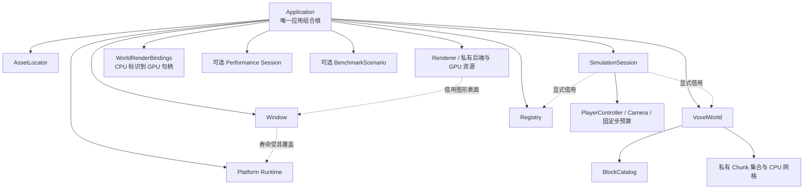
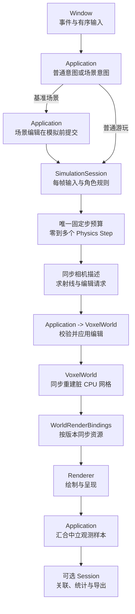
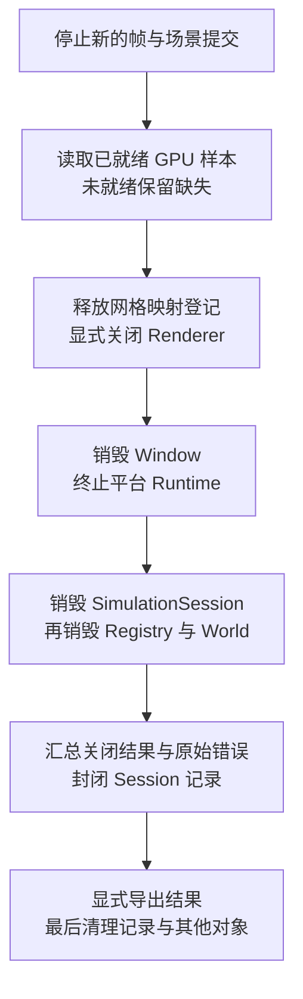

# 面向对象与数据导向架构设计初稿

> 本文供审核，不是实施授权，也不改变工程 spec、M3 任务范围或既有验收结论。所有新增类、成员和接口均为候选；本轮没有修改代码、CMake 或启动参数。

关联依据：[项目范围](../project-scope.md)、[T0 模块边界](../M3-T0-模块软硬边界.md)、[T2 渲染器设计](../M3-T2-渲染器重构.md)、[当前实际架构](../../project/architecture/Overview.md)。文档组织参考 [完整类模板](../../Obsidian-功能笔记模板/templates/04-完整类设计.md)、[数据与存储模板](../../Obsidian-功能笔记模板/templates/07-数据与存储设计.md)、[系统与数据流模板](../../Obsidian-功能笔记模板/templates/08-系统与数据流设计.md)，采用“当前设计 / 本次变更 / 后续考虑”；跨类初稿不虚构一个统一基类或 `class_name`。

**审核摘要：** 世界方块、网格、组件、绘制记录和性能样本适合数据导向处理；世界、Registry、模拟会话、窗口、渲染器和记录会话仍由明确对象管理。边界按“所有权与操作”划分，不按整个模块划成 OOP 或 DOD 阵营。本文同时讨论两种设计方式，不再以“对象化”暗示全工程类化。

## 阅读导航

新增审核入口：[术语与使用原则](#术语与使用原则)、[项目中的数据导向处理](#项目中的数据导向处理)、[明确不接受的做法](#明确不接受的做法)、[OOP 与 DOD 的职责边界](#oop-与-dod-的职责边界)、[布局与优化的取舍](#布局与优化的取舍)、[RAII 责任清单](#raii-责任清单)。

| 想审核什么         | 阅读位置                                                                                                                                          |
| ------------- | --------------------------------------------------------------------------------------------------------------------------------------------- |
| 为什么对象化，哪些地方不改 | [设计取向](#设计取向)、[保留简单的能力](#保留简单的能力)                                                                                                             |
| 拟有哪些类，各自归谁    | [候选总览](#候选总览)、[对象所有权](#对象所有权)                                                                                                                 |
| 应用、资源路径、窗口    | [A01 Application](#a01-application)、[A02 AssetLocator](#a02-assetlocator)、[A03 Runtime 与 Window](#a03-runtime-与-window)                       |
| 方块、世界、生成与网格   | [A04 BlockCatalog](#a04-blockcatalog)、[A05 VoxelWorld 与 Chunk](#a05-voxelworld-与-chunk)、[A06 Generator 与网格构建](#a06-generator-与网格构建)           |
| ECS、模拟、玩家与相机  | [A07 Registry](#a07-registry)、[A08 SimulationSession](#a08-simulationsession)、[A09 PlayerController 与 Camera](#a09-playercontroller-与-camera) |
| 渲染资源及世界到绘制的连接 | [A10 Renderer](#a10-renderer)、[A11 WorldRenderBindings](#a11-worldrenderbindings)                                                             |
| 性能探针和基准场景     | [A12 Session](#a12-session)、[A13 BenchmarkScenario](#a13-benchmarkscenario)                                                                   |
| 风险、阶段归属及待决事项  | [生命周期与错误](#生命周期与错误)、[阶段建议](#阶段建议)、[审核清单](#审核清单)                                                                                               |

## 当前设计

T0 已建立模块目录、真实 CMake target、公开/私有接口和单向依赖。本文讨论的是这些边界内的对象设计，不以仍存在命名空间函数为理由否定 T0。

| 当前能力 | 实际形态与数据组织 | 尚未解决的设计问题 |
| --- | --- | --- |
| 世界存储 | `ChunkManager` 函数操作文件级 `chunks`；Chunk 内有连续 `vector<Block>` 和顶点；方块定义是全局 map | 世界和方块规则没有明确的实例所有者；已有数组不等于不变量受控 |
| 世界生成 | `Generation::Generator` 已拥有配置、派生 seed 和噪声状态；地形/植被按区块批量处理 | `Build/Populate/BlockDigest` 等外围函数仍隐式访问当前世界；生成顺序影响结果 |
| ECS 与模拟 | 按组件类型的紧凑字节存储与稀疏索引；系统查询组件；已有 Camera 与 FixedStepBudget | View 仍扫描实体槽；不能称为完整 archetype 或字段 SoA；物理预算和冷却状态分散 |
| 平台 | Window 已是不可复制的 PImpl 类，拥有有序事件缓冲和按键快照 | 平台初始化仍需手工配对；窗口事实可被公开字段改写 |
| 渲染 | namespace 门面；Batch 类拥有连续顶点，GpuTimer 类拥有固定 query 槽位 | 尚未收束到 Renderer 实例；当前只有 OpenGL，网格仍逐帧打包上传 |
| 性能观测 | `Performance::Session` 拥有帧/内存记录数组和导出目录；统计提取数值列并排序副本 | 控制状态公开；采集是否启用与自动基准场景仍耦合 |
| 资源与基础能力 | 图片拥有连续像素，Data::Value 拥有通用元数据；读取、路径、数学等使用函数 | 不应为追求类的数量而全部改成管理器，也不应把通用元数据容器搬进热循环 |
| 应用 | app 私有 namespace 持有静态运行对象并编排 | 创建、部分失败、退出次序尚未由应用实例统一约束；不是大量同类对象的处理循环 |

上述是 2026-10-05 工作区观察，依据：[世界存储](../../../game/modules/world/src/chunk_manager.cpp)、[方块定义](../../../game/modules/world/src/block.cpp)、[生成器](../../../game/modules/world/include/symocraft/world/generation.h)、[物理步进](../../../game/modules/simulation/src/physics_system.cpp)、[窗口](../../../game/modules/platform/include/symocraft/platform/window.h)、[渲染状态](../../../game/modules/renderer/src/renderer.cpp)、[性能会话](../../../game/modules/telemetry/include/symocraft/telemetry/performance.h)、[应用编排](../../../game/app/src/application.cpp)。当前验证证据仍以 [T0 报告](../../milestones/m3-t0/README.md) 为准，不据此声明候选类已实现。

## 本次变更

### 设计取向

**建议采用“对象负责所有权、生命周期与不变量，数据组织批量运行状态与交换契约，显式函数或系统执行变换”的混合设计。** 数据不限于跨模块传递，也用于模块内部存储和热循环；函数可以修改明确传入的组件，不必是假装无副作用的纯函数。OOP 与数据导向不互斥，类方法遍历连续数组也可以是数据导向处理。

| 参考 | 借鉴的原则 | 本项目不照搬的机制 |
| --- | --- | --- |
| [Unreal Engine Subsystems](https://dev.epicgames.com/documentation/en-us/unreal-engine/programming-subsystems-in-unreal-engine) | 子系统有明确的创建者和生命周期范围 | 不引入 UObject、自动发现、反射或可全局获取的服务体系 |
| [Unity Entities 组件](https://docs.unity3d.com/Packages/com.unity.entities@1.3/manual/concepts-components.html) | 组件以数据为主，规则由系统处理 | 不把每个实体变成继承式 GameObject，也不复制其 archetype 存储实现 |
| [Unity Entities 存储](https://docs.unity3d.com/Packages/com.unity.entities@1.3/manual/concepts-archetypes.html)、[系统](https://docs.unity3d.com/Packages/com.unity.entities@1.3/manual/concepts-systems.html) | 按访问需求组织组件集合，系统变换组件；系统仍有创建/更新/销毁边界 | 不从“使用 ECS”推定当前项目已有同样布局、调度器或性能 |
| [Filament Engine 资源管理](https://github.com/google/filament/blob/main/filament/include/filament/Engine.h) | 渲染实例跟踪资源，资源与实例的销毁关系明确 | 不增加公共 Engine/RenderDevice 层级，不复制其渲染线程或原生句柄接口 |
| [C++ Core Guidelines C.2/C.4](https://isocpp.github.io/CppCoreGuidelines/CppCoreGuidelines#Rc-struct)、[R.1](https://isocpp.github.io/CppCoreGuidelines/CppCoreGuidelines#Rr-raii) | 用类维护不变量，用 RAII 配对资源；无需访问对象表示的助手可以保留函数 | 不强制所有函数成为方法，不默认引入 shared_ptr、虚函数或 PImpl |

参考核对日期：2026-10-05。以下方案是结合这些原则与当前工程做出的设计建议，不代表各参考引擎采用完全相同的类结构，也不引入它们作为项目依赖。

本稿遵守六条约束：

1. 文件和 target 归属沿用 T0；一个类不是一个新模块，也不自动需要一个新 target。
2. 默认使用具体类与组合。只在渲染后端已有多种实现的地方使用私有多态契约。
3. 每份可变状态只有一个权威所有者；缓存必须说明来源和失效条件。
4. 借用对象不得比所有者活得更久；不可用一个全局 Context 或服务定位器掩盖借用关系。
5. 先保持玩法、确定性、测量语义与失败行为，再优化内部实现；对象化本身不是性能达标证明。
6. 跨模块使用具名、类型明确的值/视图/句柄；内部布局可演进，但数据导向不能绕过 T0 的软硬边界。

### 术语与使用原则

已确认本项目讨论的是游戏引擎语境下的 **DOD（Data-Oriented Design，数据导向设计）**。本稿统一使用 DOD，“数据导向”均指围绕实际数据访问、存储布局和批量变换进行设计，不引入通用不可变数据编程作为另一套范式要求。

| 名称         | 本稿采用的含义                           | 对项目的影响                                  |
| ---------- | --------------------------------- | --------------------------------------- |
| OOP，面向对象   | 用明确对象封装需要共同维护的状态、资源和不变量           | 默认具体类、组合和 RAII，不等于深继承、逐实体虚函数或全部堆分配      |
| DOD，数据导向设计 | 游戏引擎语境下，根据实际读写、规模、频率和处理顺序组织数据     | 重点用于方块、网格、组件、绘制及样本的批量处理；与对象所有权和 RAII 配合使用 |

按组件集合组织存储与系统处理的参考实例见 [Unity Entities](https://docs.unity3d.com/Packages/com.unity.entities@1.3/manual/concepts-archetypes.html)。这里借鉴数据组织与处理原则，不要求本工程引入该框架。

**三个不能混同的判断：** `struct + namespace 函数` 不自动等于数据导向；`class + vector` 不自动等于低效 OOP；数据导向不自动等于 ECS、SoA、SIMD、并行或全部不可变。

发布后的 BlockCatalog、运行配置和封闭记录保持只读，是各自的生命周期与一致性约束，不是 DOD 要求全部数据不可变。正在模拟的组件、方块和尚待 GPU 回填的记录，允许由唯一所有者在明确阶段原地修改；不以数据导向为理由逐帧深拷贝整个世界、网格或图片。

### 项目中的数据导向处理

下表是结合源码的设计判断，不是已经测得的性能结论。“保留”指维持现有简单表示，“候选”指具体优化仍需证据与审核。

| 位置与数据                                               | 为什么适合                                 | 推荐边界与当前取舍                                                         |
| --------------------------------------------------- | ------------------------------------- | ----------------------------------------------------------------- |
| world：区块内方块、地形生成和摘要扫描                               | 同类数据体量大，常按固定坐标顺序读写；每格对象跳转会增加间接访问和管理成本 | VoxelWorld/Chunk 拥有连续方块存储，算法批量处理；保留轻量 Block 值，不变成逐格堆分配/虚函数对象      |
| world：可见面判断与 CPU 顶点输出                               | 一次构建遍历方块和邻接规则，产生大量同格式顶点               | 显式读取输入，写局部输出/工作缓冲；World 成功后发布，是否建立私有 Mesher 取决于缓冲复用需求             |
| ecs/simulation：Transform、RigidBody、HitBox、Character | 系统按组件组合应用同一规则，行为不需分散到每实体的虚函数          | Registry 拥有组件，系统显式变换；Session 管预算和顺序。当前玩家数量小，保留现有存储，不把全新 ECS 当必做优化 |
| scene/renderer：顶点、纹理像素、draw 记录与上传批次                 | CPU/GPU 都消费成批格式化数据，适合连续传递与缓冲复用        | scene 提供中立值/视图，Renderer 管句柄和资源；先保留现有格式，布局变化不能代替按版本更新与在途同步         |
| renderer：资源槽、frame ID 与 GPU query 结果                | 句柄查找、已就绪结果读取和延迟回收可以按记录批量处理            | 私有表由 Renderer/后端维护；当前 GpuTimer 的固定槽就是“对象 + 批数据”的已有例子              |
| telemetry：Frame、Memory、有效性标注、数值列                    | 追加记录、按帧关联、过滤和分位数是数据集合上的变换             | Session 管记录与封闭；统计在记录停止更新后处理数值副本，不排序原始帧数组破坏 GPU 关联                 |
| platform/simulation：有序输入、按键快照、玩家意图与编辑请求             | 数据可独立传递、检查和回放测试，无须携带原生窗口或世界指针         | Window/Controller 管采集与消费状态；保留事件顺序。回放能力仅是表示上的可能性，不是本轮新增功能          |
| world/assets：方块定义、读取的字节与图片像素                        | 定义可校验后只读，字节和像素天然是数据批次                 | BlockCatalog/AssetLocator 管配置与路径约束；读取/解码保留函数，图片保留自有值类型，不扩成逐像素对象   |
| foundation/app：配置、元数据、完成结果和文件协议                     | 明确数据形状利于校验、测试与序列化，不依赖整个应用实例           | 冷路径可用 Data::Value；运行热路径转换成具名类型和 ID，不按格/顶点构造通用动态 map 或 YAML 节点     |

**优先认识真实规模：** 当前单区块为 `16 × 16 × 256 = 65,536` 格；默认半径 10 的 `21 × 21 = 441` 个区块合计 `28,901,376` 格，包含边缘区块。这是默认完整存储规模，不是每帧都会扫描全部数据的结论，也不等于当前活跃物理实体数量。依据：[尺寸](../../../game/modules/world/include/symocraft/world/chunk_manager.h)、[默认配置](../../../game/modules/world/include/symocraft/world/generation.h)、[构建与摘要](../../../game/modules/world/src/generation.cpp)。因此世界数组访问比“把当前单玩家换成复杂实体框架”更值得优先研究。

实际表示依据：[区块存储](../../../game/modules/world/src/chunk.h)、[地形与网格循环](../../../game/modules/world/src/chunk.cpp)、[组件容器](../../../game/modules/ecs/src/component_container.h)、[物理系统](../../../game/modules/simulation/src/physics_system.cpp)、[顶点契约](../../../game/modules/scene/include/symocraft/scene/mesh.h)、[Batch](../../../game/modules/renderer/src/batch.hpp)、[GPU query 槽](../../../game/modules/renderer/include/symocraft/renderer/gpu_timer.h)、[样本与统计](../../../game/modules/telemetry/src/performance.cpp)、[图片](../../../game/modules/assets/include/symocraft/assets/image.h)。

### 明确不接受的做法

“明确不行”不是说某个模块理论上不能用数据表示。状态机、资源表和生命周期也可以数据化，但仍要有人维护受控入口、阶段和释放协议。本稿选择对象/RAII 承担这些责任，不接受下面这些替代方式。

| 不接受的位置 / 做法 | 原因 | 正确边界 |
| --- | --- | --- |
| Application、Runtime、Window、Renderer 变成可全局写的裸状态/句柄表，去掉负责清理的对象 | 数组不会自动配对初始化、处理部分失败、维持窗口/设备销毁次序 | 表可以私有数据化，但其所有者和清理协议必须明确，不能退回隐式全局服务 |
| 外部系统取得可写方块/资源/Session 容器，绕过编辑、句柄校验或 Seal | 会遗漏邻块脏标记、版本发布、帧关联和封闭状态；局部字段正确不代表整体有效 | 对外用受控入口；仅在内部指定阶段给算法必要的读写范围 |
| 原生资源对象、回调关联对象或非平凡组件被当作字节随意复制/搬迁 | 会导致重复释放、析构遗漏或回调悬空；当前 ECS 要求标准布局且 trivial | 资源由 RAII 所有者管理，组件存值/ID/句柄；容器变化需遵守真实类型与地址稳定性要求 |
| GPU 使用中的 buffer/query 被“CPU 处理完了”就覆盖或释放 | CPU 函数返回或析构不代表 GPU 完成；布局与同步是两个问题 | 后端保留 fence/完成状态、query 有效期和延迟回收规则，不能由 telemetry 代替 |
| 为统计排序原始帧，或为批处理重排输入、植被写入和固定步 | GPU 当前按帧索引回填；事件有序；植被跨块重叠有 last-write-wins；规则频率不同 | 排序统计副本；保持既有输入和阶段顺序。并行化必须先定义读写冲突与确定性 |
| renderer 直接查询 Chunk/Registry，或把 SDK/YAML 类型作为所有模块的统一运行数据 | 破坏 T0 单向依赖和中立契约，并把内部表示锁进外部接口 | world/scene 提供 CPU 数据，app 连接模块；SDK、解析器和容器策略保持私有 |
| 为 OOP 给每个方块/顶点/样本加堆对象和虚函数，或为 DOD 强制全量复制/SoA | 前者把同类热数据拆散，后者可能增加转换、分配和复制；都没有针对访问模式 | 数据保持简单，按实际读写决定布局；没有基准证据不承诺更快或更低负载 |

GPU 同步原则可对照 [D3D12 fence 资源管理](https://learn.microsoft.com/en-us/windows/win32/direct3d12/fence-based-resource-management)。这支持保留在途资源契约，不是声称 RAII 独自解决 GPU 同步。窗口地址约束见 [原生回调关联](../../../game/modules/platform/src/window.cpp)，组件类型约束见 [Registry](../../../game/modules/ecs/include/symocraft/ecs/registry.h)。

### OOP 与 DOD 的职责边界

**一句话界线：谁拥有和何时允许变化，由对象及其契约负责；大量数据怎样被组织和变换，由数据表示与算法负责。** 数据导向代码可以放在类方法或私有自由函数中，不以语法形式分阵营。

| 管理者 | 数据导向部分 | 对象必须守住的边界 |
| --- | --- | --- |
| VoxelWorld / BlockCatalog / Chunk | 方块数组、规则查表、生成和网格输出 | 合法 ID、唯一写入口、自身/邻块版本、完整网格发布与视图失效 |
| Registry | 组件集合、ID/索引映射与查询 | 实体代数、实例归属、结构变化、引用失效与分配失败 |
| SimulationSession / Controller | 意图值、组件系统与单步算法 | 固定步余数、冷却、一次性输入消费、每帧/每子步顺序 |
| Renderer / 私有后端 | 顶点/draw/上传批次、资源槽和 query 结果 | 原生资源、句柄归属、在途同步、失败清理与 shutdown |
| WorldRenderBindings | 网格标识/版本到句柄的映射和 draw 数组 | 固定 World/Renderer 配对、仅接受成功版本、不越权拥有原生 GPU 资源 |
| Window / Runtime / AssetLocator | 事件、快照、路径值与资产数据 | 平台寿命、回调地址、缓冲有效期和路径解析约束 |
| Session / BenchmarkScenario / Application | 样本、统计、场景动作与模块交换值 | 各自记录/场景/应用生命周期，不能互相接管被测模块 |

该图不强制每个算法都建立临时副本或事务：物理系统可以在受控阶段原地修改组件；CPU 网格则沿用“临时完整构建后发布”的候选保证。不同处理应记录自己的失败语义。

| 候选约束 | 可检查条件 | 成立边界 |
| --- | --- | --- |
| HD-I1 | 批处理所写数据有唯一权威所有者，字段写入不绕过相关 W/EC/S/T 不变量 | 批处理返回及对外发布时 |
| HD-I2 | 借用视图不跨越回调结束、扩容/删除、重建或销毁等已规定的失效点 | 每次访问与模块交接时；GPU 提交另遵循 T2 所有权要求 |
| HD-I3 | 每帧规则、固定子步、基准预编辑与普通后编辑仍按既有阶段发生 | 一帧结束；关联 PC-I1 与既有帧流程 |
| HD-I4 | 统计只排序提取的数值副本，原始帧关联不变，缺失数据不补 0 | GPU 回填与统计导出时；关联 T-I1 |
| HD-I5 | 数据布局变化不直接改变公开顶点/文件格式、生成摘要或资源接受版本语义 | 转换、发布和回归对照时；关联 GE-I1/BR-I1 |
| HD-I6 | 当前串行处理不因数组或锁的存在被宣称为线程安全；并发前先明确输入寿命和读写冲突 | 设计审核与执行入口；当前不新增并发保证 |

后续类笔记记录所有权、资源和不变量；数据笔记记录表示、身份和有效期；系统笔记记录读写集、处理频率和提交顺序。三类笔记互相引用，不复制一份可互相漂移的完整契约。

### 布局与优化的取舍

AoS 表示“连续记录，每条含多个字段”，SoA 表示“按字段分成连续数组”。**两者都是数据布局，不是 OOP 与 DOD 的分界。** 必须先知道算法读哪些字段、以何种顺序读取，再决定是否调整。

| 当前表示 | 本稿选择 | 重新考虑的条件 |
| --- | --- | --- |
| `vector<Block>`，索引 `(y * 16 + x) * 16 + z` | 保留 AoS；网格按 y/x/z 扫描，地形按 z/x/y 写入，访问特征不同 | 测量明确指出某个扫描或字段带宽为瓶颈，再比较循环顺序、局部工作列、热/冷字段或 SoA；须保持生成基线 |
| 28 字节 `BlockVertex3D` AoS 和 MeshView | 保留当前完整顶点契约；按完整记录传递是合理起点 | 特定后端/处理确实需要不同表示时，先做私有转换并验证成本；公共契约变更另行审核 |
| 按组件类型存储的当前 ECS | 保留组件值和显式系统；T4 先审计 ID、索引、类型及失败正确性 | 大量活跃实体和真实查询成本出现后，再比较改良 View、字段 SoA 或替换存储；不默认引入 archetype/Job System |
| `vector<Frame>` / `vector<Memory>` | 记录阶段按条追加/关联，停止更新后提取数值列统计 | 测得采样成本或容量不满足协议时再改变表示；reserve 不是容量上限，也不改变分位数/缺失语义 |
| Batch 连续顶点与逐帧打包上传 | 数据仍批量处理；T2 已规划通过稳定句柄和网格版本减少不必要更新 | 仅改 AoS/SoA 不会消除全帧复制/上传；具体优化收益以同条件测量为准，不新增 M3 性能承诺 |

当前植被生成先完成全部地形，再按排序后的区块执行跨块写入；重叠采用后写覆盖。摘要也有固定坐标/字段编码顺序，不能为局部性或并行化随意重排。[生成实现](../../../game/modules/world/src/generation.cpp) 中的噪声状态同样不提供线程安全承诺。

推荐顺序：**先明确对象与数据契约 -> 保持当前简单布局完成 M3 正确性 -> 在已有基准中定位成本 -> 单独批准有证据的布局/批处理优化。** 无性能证据时也可以依据所有权和可读性改善结构，但不能把这种改善报告成帧率收益。

### 候选总览

“新增”表示本稿建议新增，“完善”表示已有对象继续使用，“条件性”表示有实际需要才采用。名字均省略 `SymoCraft::` 前缀；候选命名不是本轮重命名指令。

| 对象 / 能力 | 状态 | 所属模块 | 对象化的实际理由 | 详细设计 |
| --- | --- | --- | --- | --- |
| `App::Application` | 新增 | app 私有 | 拥有运行对象，约束创建、退出和失败清理 | A01 |
| `Assets::AssetLocator` | 新增候选 | assets | 保存明确资源根，维护路径解析不变量 | A02 |
| `Platform::Runtime` | 新增 | platform | 配对进程级平台初始化/终止 | A03 |
| `Platform::Window` | 完善现有 Window | platform | 拥有窗口、事件状态和输入记录 | A03 |
| `World::BlockCatalog` | 新增 | world | 拥有经过校验且不可变的方块定义 | A04 |
| `World::VoxelWorld` / 私有 `Chunk` | 新增门面 / 完善 | world | 拥有方块、区块、脏状态和 CPU 网格 | A05 |
| `Generation::Generator` | 完善 | world | 已拥有 seed、配置和噪声资源 | A06 |
| 私有 `ChunkMesher` | 条件性 | world | 仅在确需复用工作缓冲或保持构建状态时采用 | A06 |
| `ECS::Registry` | 完善 | ecs | 已拥有实体和组件存储，需补足正确性契约 | A07 |
| `Simulation::SimulationSession` | 新增 | simulation | 拥有本次玩法会话的固定步和控制状态 | A08 |
| `Simulation::PlayerController` | 新增对象 | simulation | 拥有选块、冷却及一次性输入消费状态 | A09 |
| `Simulation::Camera` | 完善现有概念 | simulation | 管理镜头参数及其有效范围，不重复拥有玩家姿态 | A09 |
| `Rendering::Renderer` / 私有后端与资源类 | 已规划、未实施 | renderer | GPU 资源、后端状态、同步及呈现有明确所有者 | A10 |
| `App::WorldRenderBindings` | 新增私有协作者 | app | 保存世界网格标识与 renderer 句柄的映射 | A11 |
| `Performance::Session` | 完善 | telemetry | 拥有记录、关联、有效性和导出生命周期 | A12 |
| `App::BenchmarkScenario` | 新增私有协作者 | app | 拥有固定路线方向、编辑游标和场景阶段 | A13 |
| `Logger` / `AllocationTracker` | 条件性，不先实施 | foundation | 仅当保留的实现确实需要独立配置、资源或追踪会话 | 保留简单的能力 |

`Platform::Window` 是 T2 的候选名字，现有类为 `SymoCraft::Window`。Camera 的名字也可沿用；审核重点是职责和所有权，不是统一改 namespace。

### 对象所有权

实线表示“拥有”，虚线表示“借用”。这是对象图，不是新的 CMake 依赖图；下层模块仍不能依赖 app。

GPU 资源属于 Renderer；Bindings 只保存不透明句柄和同步版本。Session 只保存样本与元数据，不保存上述对象指针。Generator 和可选 ChunkMesher 是 world 内部协作者，为避免主图过密在这里省略。

采用三个逻辑生命周期：应用运行范围、世界/玩法会话范围、性能记录范围。**逻辑范围不强制对应一个新类**，因此本稿不先建立 Engine、GameSession、ServiceContainer 或统一 System 基类。

### RAII 责任清单

**要求是“每份实际拥有的资源都有可靠 RAII 所有者”，不是“每个类必须手写析构函数”。** RAII 将资源释放绑定到所有者的生命周期，使正常退出和异常路径都能清理；Rule of Zero 指优先让成员完成这些工作，不重复编写 copy/move/destructor。它不禁止因身份/借用约束删除复制或移动，也不要求在析构中完成所有业务操作。[C++ Core Guidelines R.1](https://isocpp.github.io/CppCoreGuidelines/CppCoreGuidelines#Rr-raii)

下面“必须”表示候选设计必须兑现，不代表当前实现已完整通过验证。

| 类 / 私有资源拥有者 | RAII 定性 | 获取、释放与析构边界 |
| --- | --- | --- |
| `Platform::Runtime` | 必须配对平台资源 | 初始化成功后持有进程级平台使用权；全部窗口销毁后终止平台。构造失败不能误终止其他活动实例 |
| `Platform::Window` / Impl | 必须配对原生窗口 | 创建成功即纳入独占包装；销毁前停止关联回调，保持创建线程与 Runtime 有效。Renderer 及其后端图形表面已关闭/销毁后，再销毁原生窗口；Vulkan surface 属于后端 |
| `Rendering::Renderer` / Impl / 私有后端 | 必须组合管理图形资源 | 拥有后端、资源表和帧上下文；正常显式 Shutdown 报告错误，析构不抛异常并按 T2 兜底，不能只依赖手工 Free |
| 私有 buffer、texture、shader/pipeline、swapchain、query 和暂存资源拥有者 | 必须配对每项原生资源 | 创建后立即进入成员包装或局部 guard；禁止浅拷贝所有权。逻辑销毁与原生释放分开，后者服从在途完成/后端关闭契约 |
| `ECS::Registry` / 私有 Storage / ComponentContainer | 必须补齐内部内存所有权 | 外层已有 unique_ptr，不代表裸分配全部安全；各存储块需独占 RAII 包装，部分注册/分配失败也能回收。不能只给当前浅拷贝容器补析构 |
| `App::Application` | 组合式 RAII | 用自有值/unique_ptr 成员获得子对象；声明次序与显式关闭次序覆盖借用关系。析构不重新复制一套逐资源 Free 流程 |
| `Generation::Generator` | 保留已有成员 RAII | 已由 unique_ptr 拥有 NoiseState；实现文件中的默认析构处理不完整类型，不新增 FreeNoise 或手工逐噪声释放 |
| `VoxelWorld`、`BlockCatalog`、私有 `Chunk`、条件性 `ChunkMesher` | 成员 RAII，优先 Rule of Zero | 容器拥有方块、规则、网格和工作缓冲；邻居指针/输入视图只是借用，不 delete。清空/重建是显式业务操作，不要求析构调用 Reset |
| `AssetLocator`、`Assets::Image`、scene 网格/纹理值 | 成员 RAII，优先 Rule of Zero | path/vector 等管理自有内存；Image 解码临时缓冲沿用带 stbi_image_free 的 unique_ptr，返回像素已属 vector，不再次手动释放 |
| `Performance::Session` | 成员 RAII + 显式业务提交 | 记录内存自动释放；临时文件流在局部作用域关闭。析构不 Seal/Export、不宣布 completed，不删除已发布记录或失败证据 |
| `App::WorldRenderBindings` | 仅映射内存 RAII，不是 GPU owner | 映射和身份值自动释放；资源登记通过有效 renderer 显式 Release，最终由 Renderer 兜底。析构不得盲调已失效 renderer |
| `SimulationSession`、`PlayerController`、`Camera`、`BenchmarkScenario` | 状态/组合成员自动清理，无需资源型自定义析构 | 预算、冷却、镜头和游标按值销毁；World/Registry 是借用，不删除、不在析构推进场景或修改实体。成员若将来持有资源再补对应 owner |
| 条件性 `Logger` / `AllocationTracker` | 按实际所有权决定 | Logger 若拥有文件句柄必须 RAII；Tracker 管追踪记录不等于拥有被追踪的全部业务内存，不能析构时替其他模块 free |

**实现时必须写清的五个边界：**

1. 构造中途抛出时，尚未完成构造的完整对象不会执行自身析构，只有已完成的成员和局部对象清理。因此 native 句柄获取后应立即交给资源包装，不能等“全部初始化成功”再挂到所有者。
2. GPU RAII 不等于析构立即调用原生 Destroy。资源包装与后端延迟回收共同维持在途工作；OpenGL 还需要有效 context 和正确线程。正常 Shutdown 和异常析构分别遵循 T2 的报错/有界清理规则，不能无限等 fence，也不能假设 CPU owner 消失就代表 GPU 完成。
3. WorldRenderBindings 的 Sync 在 Create 成功、映射插入分配失败时，用当前调用作用域内的 guard 撤回尚未登记的逻辑句柄，或明确可靠恢复方案。清理失败仍由活着的 Renderer 跟踪并在 Shutdown 兜底；不能仅销毁 map 就认为新建资源已回收，也不能让清理异常覆盖原始错误。
4. ComponentContainer 的当前裸指针存在浅拷贝插入/搬运路径；补析构必须同时消除复制所有权并定义安全移动或改用自有成员，否则双重释放。RAII 也不能自动保证多张表扩容后的索引一致，失败事务仍需 T4 明确验证。
5. Seal、Export、Release 和 Shutdown 是有业务结果的显式操作；析构仅执行适合其所有权的无异常兜底。不可在析构中偷偷导出、报告成功、销毁借用对象或改变玩法状态。

当前核对依据：[Generator 所有权](../../../game/modules/world/include/symocraft/world/generation.h)、[出线析构](../../../game/modules/world/src/generation.cpp)、[Registry 注册与 Free](../../../game/modules/ecs/src/registry.cpp)、[组件存储](../../../game/modules/ecs/src/component_container.h)、[裸分配实现](../../../game/modules/ecs/src/internal.cpp)、[图片与读取的局部 RAII](../../../game/modules/assets/src/image.cpp)。本稿不直接改写这些实现；“已有局部 RAII”也不是所有异常路径已安全的验收结论。

### A01 Application

**直白作用：** 决定各模块何时创建、如何连接、怎样退出。放在 `game/app` 私有实现，不成为底层模块可依赖的库。

| 候选成员 | 初值 / 所有权 | 用途 |
| --- | --- | --- |
| `config_`、`state_` | 自有启动配置；创建后进入 Ready | 配置是 app 类型；状态为 Ready / Running / Stopped / Failed |
| `assets_`、`platform_`、`window_` | 自有对象；按依赖次序创建 | 运行基础，不向下层传递完整 Application |
| `world_`、`registry_`、`simulation_` | 独占拥有；后者借用前两者 | 世界和组件与本会话配套，不允许偷偷替换其中一个 |
| `renderer_`、`render_bindings_` | 独占拥有 | 图形资源与世界到图形的同步关系 |
| `measurement_`、`scenario_` | 可选独占对象 | 是否记录与是否自动运行场景分开决定 |

| 候选接口 | 行为 | 前提 / 失败边界 |
| --- | --- | --- |
| 构造或 `Create(config)` | 完成预检与对象装配，成功才发布可用实例 | 启动失败用现有异常体系上报；已创建对象自动释放 |
| `Run()` | 编排帧循环，返回自有 `RunResult` | 一个应用实例只运行一次；不在此承诺重复开局 |
| `Shutdown()` | 显式结束，报告必要的图形关闭错误 | 正常关闭幂等；析构只做不抛异常的兜底 |

不变量 A-I1：Running 时，`simulation_` 借用的 World/Registry 和 `renderer_` 借用的 Window 仍有效；成立于每次帧入口与出口。

生命周期：Application 不可复制/移动，主线程使用。值成员和 `unique_ptr` 都可表达独占所有权；不为获得“现代感”统一堆分配。初始化阶段的资源由各自对象负责，不能只靠一个“全部初始化成功”的布尔标志清理部分资源。

### A02 AssetLocator

**直白作用：** 记住“这次运行的资源根在哪”，并安全解析相对资源名。它不是资源缓存或 GPU 资源管理器。

| 候选成员 | 初值 / 所有权 | 用途 |
| --- | --- | --- |
| `root_` | 自有绝对资源根；构造时规范化 | 日常运行由可执行目录推导；测试可显式提供隔离目录 |

接口：`Resolve(relative) -> path`；路径非法或解析越界时报告错误。保留当前对根路径、父级穿越、流名称和符号链接逃逸的检查；这是资源定位约束，不声明为对抗恶意并发文件替换的安全沙箱。

不变量 AS-I1：公开解析结果位于 `root_` 约定范围内，解析不依赖当前工作目录；成立于每次 Resolve 返回。

生命周期：由 Application 拥有，逻辑不可变；可复制/移动自己的路径值，不保留别人传入的 `string_view`。`ReadBytes`、`DecodeImage` 继续是函数，`Image` 继续拥有像素的值类型。

现有必需资源列表包含 OpenGL shader。候选设计将“选定后端需要哪些资源”的清单交给 app/renderer，assets 只负责通用定位和读取；不能使未启用的 D3D12/Vulkan 后端也强制要求其资产。

### A03 Runtime 与 Window

**直白作用：** Runtime 管平台库的开始/结束；Window 管一扇窗口及其事件。平台不决定玩家怎么走，也不决定是否运行基准路线。

| 对象与候选成员 | 所有权 / 初值 | 责任 |
| --- | --- | --- |
| Runtime 的 `initialized_`、创建线程记录 | 平台初始化成功后有效 | 对称执行平台初始化与终止 |
| Window 的 `impl_` | 独占原生窗口和回调关联状态 | GLFW/Win32 类型仍只在私有实现与受限图形桥接内 |
| Window 的 `extent_`、`focused_`、`input_` | 从操作系统采集的事实 | 对外返回快照或只读值，不允许调用者直接改字段 |

| 候选接口 | 行为 | 前提 / 边界 |
| --- | --- | --- |
| `Runtime()` / 析构 | 初始化 / 终止平台 | 同一主线程；本稿只采用一个活动 Runtime |
| `Window(runtime, config)` 或受控工厂 | 成功创建窗口才交出独占对象 | 返回值不再是未说明所有权的裸指针 |
| `PollEvents()`、`TakeInput()`、`FramebufferSize()` | 产生中立事件、有序输入和值尺寸 | 输入若用借用视图，下次采集/重置即失效；优先返回易理解的自有快照 |

不变量 P-I1：`impl_` 有效时 Runtime 仍存活，回调只引用本窗口的有效状态；成立于事件调用和销毁边界。

生命周期：Runtime/Window 都不可复制/移动，图形对象先于 Window 销毁，全部窗口先于 Runtime 销毁。平台库初始化是进程级资源，不能把 RAII 包装误解为多个 Application 可同时独立初始化/终止它。

自有输入快照可以转移或复用事件缓冲，不要求为对象化逐帧复制 vector 或新增堆分配；无论实现采用哪种方式，都要保持有序事件的消费与失效规则。

app 根据选定后端设置 OpenGL-context 或 no-client-API 窗口配置，platform 不猜测 renderer。`benchmark_window` 不再兼任“禁用普通输入”的控制开关；Window 采集事实，app 决定消费普通输入还是场景意图。此处也不要求新增全局事件总线。

### A04 BlockCatalog

**直白作用：** 记住方块 ID 对应的名称、材质层和碰撞/透明规则。与“哪里放了方块”的世界存储分开。

| 候选成员 | 初值 / 所有权 | 用途 |
| --- | --- | --- |
| `formats_`、`name_to_id_` | 自有、经完整校验的定义表 | 替代当前两份全局 map；发布后不修改 |

接口：`FromConfig(text)`、`Find(BlockId)`、`FindId(name)`、`ValidateTextureLayers(count)`。配置文本由 app 经 assets 读取后传入，world 不因此新增对 assets 或 renderer 的依赖；YAML 解析仍是私有实现。

不变量 BC-I1：`formats_` 与 `name_to_id_` 一一一致，重复 ID/名称和无效定义在发布前拒绝；未知 ID/名称明确返回缺失，不静默伪装成空气。成立于构造完成及全部只读操作后。

生命周期：建议由 VoxelWorld 按值拥有，simulation 通过 world 的窄查询了解碰撞规则。定义的只读引用只借用到 catalog 销毁，不跨 World 混用。初稿允许其作为不可变值复制/移动，不要求 shared_ptr；构造失败不改写已有 catalog。

### A05 VoxelWorld 与 Chunk

**直白作用：** VoxelWorld 拥有这份方块世界，对外提供查询、编辑和 CPU 网格；Chunk 是它内部的存储单位，不再公开任意可写字段。

| 候选成员 | 初值 / 所有权 | 用途 |
| --- | --- | --- |
| `catalog_`、`generation_settings_` | 自有定义和实际 seed/配置 | 保证存储内容与规则、生成元数据对应 |
| `chunks_` | 独占 Chunk 集合，初始由确定性构建填充 | 容器种类属于私有实现，不出现在消费者接口 |
| Chunk 的 `blocks_`、`coord_` | 自有方块容器和固定坐标 | 本地读写只允许 world 内部操作 |
| Chunk 的 `content_revision_` | 初始发布版本；成功修改才推进 | 描述本块方块内容变化 |
| Chunk 的 `mesh_input_revision_`、`published_mesh_revision_` | 未构建时不匹配 | 邻块变化也推进输入版本；只有成功发布网格才追平 |
| Chunk 的 `mesh_` | 自有 CPU 网格 | 借用视图有明确失效边界，不保存 GPU 对象 |

| 候选接口 | 行为 | 前提 / 失败边界 |
| --- | --- | --- |
| 构造 / 受控构建 | 拥有 catalog，按确定性顺序建立有限世界 | 初稿不增加流式加载、卸载、存档或跨平台位级确定性承诺 |
| `QueryBlock(position)`、`DescribeBlock(id)` | 返回方块及规则的窄查询结果 | 明确域外/不存在状态；不顺便改变当前空方块和边界碰撞规则 |
| `TryEdit(edit) -> EditResult` | 校验并修改指定格子，标记受影响网格 | 无效请求不改变内容/版本；分配等异常单独报告，不用 bool 吞掉原因 |
| `RebuildDirtyMeshes()` | 同步临时构建，成功后替换并发布结果 | 失败保留旧结果和脏状态；失败网格不作为新版本发布 |
| `VisitMeshes(visitor)` | 同步提供标识、发布版本和只读网格视图 | 回调期间禁止编辑、重建、清空、生成及重入修改；视图不跨回调保存 |
| `Digest()`、`FindSpawn()` | 查询当前实例的摘要和出生点 | 不再读取隐式的“当前全局世界” |

不变量 W-I1：`chunks_` 中的坐标、方块索引和 catalog ID 有效，消费者不能绕过 world 改写；成立于构造成功及查询/编辑返回。

不变量 W-I2：网格输入版本覆盖自身和邻接可见性变化；`published_mesh_revision_` 只在对应 `mesh_` 完整建立后更新；成立于编辑/重建返回。

生命周期：VoxelWorld 不可复制/移动，内部 Chunk 不向外暴露地址。邻居默认通过坐标查找；若保留私有指针缓存，必须由 world 创建/清理并限定有效期，不把它们作为公开契约。CPU 网格视图在当前访问结束后失效；Renderer 接受数据后不得保存其地址。

候选编辑实现先准备可能失败的辅助状态，再提交内容/脏版本；若无法保留上述失败保证，需要在审核后的类笔记明确缩小保证，不能靠 Release 断言假装成立。保持原网格算法、边缘区块规则和摘要顺序，不将“对象化”变成隐性玩法改动。

### A06 Generator 与网格构建

**直白作用：** Generator 根据配置产生地形数据；网格构建根据方块和邻居读取结果产生几何，两者都不负责 GPU 上传。

| 能力 / 候选成员 | 处理方式 | 原因 |
| --- | --- | --- |
| Generator 的 `settings_`、`noise_`、`noise_seeds_` | 保留已有对象所有权 | 配置与噪声资源已有真实实例，不再套一层 GeneratorManager |
| `Build/Populate` 对目标世界的访问 | 显式接收 VoxelWorld 或私有构建上下文 | 不能通过旧 ChunkManager 全局状态写入别的世界 |
| 坐标派生随机序列、摘要排序 | 保留函数 / 值 | 不增加跨世界共享随机游标 |
| 当前 `g_normal`、可变 `block_faces` | 改为每次构建的局部工作数据；固定数据用 constexpr | 消除共享可变临时量，不必为了这一点创建长期服务 |
| 私有 ChunkMesher 的 `scratch_` | 仅在需要复用工作容量时实例化 | 与当前 world 配套；不是公开 MeshBuilder 基类 |

不变量 GE-I1：同 catalog、生成器版本、噪声实现、数值构建环境、seed 和配置按固定生成顺序得到相同结果，调用方不能通过共享随机游标污染另一实例；成立于生成结束。

若采用 ChunkMesher，不变量 ME-I1：`scratch_` 在一次 Build 开始/结束时处于可复用状态，失败也不将半成品发布给 Chunk；回调不可重入。若没有保留工作缓冲的实际需求，默认保留 `BuildChunkMesh(input, rules)` 函数和局部工作值。

生命周期：Generator 通常只在世界构建期间存在，不要求常驻 VoxelWorld；沿用其不可复制约定，移动策略另行核实。Mesher 若存在，由单一 world 私有拥有，不可复制，暂不支持并发/重入。这里不新增线程池、不可变整世界快照或新网格算法。

Generator/Chunk 采用类不妨碍批量访问方块数组。构建函数是否是成员取决于是否需要拥有工作状态，不取决于“数据导向必须没有 class”；布局与生成顺序约束见 [布局与优化的取舍](#布局与优化的取舍)。

### A07 Registry

**直白作用：** 保存实体和组件。它已经是对象，本次设计重点是补足安全契约，不是再造实体管理层。

| 现有 / 候选成员 | 所有权 | 设计方向 |
| --- | --- | --- |
| `storage_` | Registry 独占 | 实体槽位、代数、组件容器仍是私有实现 |
| 组件类型标识 | 静态类型元数据或受控注册表 | 审计其生成和注册规则；不能拿它隐式保存世界/玩家状态 |

接口沿用 Create/Destroy/Has/Get/View 等存储能力，并明确无效 ID、引用失效和结构变更规则。不同 Registry 的 ID 不应被默认为可互用；必须通过身份校验或显式绑定的消费者契约防止误用，最终方案由 T4 验证决定。

不变量 EC-I1：对外可见的实体 ID 与本 Registry 活跃槽位/代数对应，组件增删后内部索引一致；成立于各公开存储操作返回，包括 Release 构建配置。释放存储后旧借用全部失效。

生命周期：Application 拥有 Registry，SimulationSession 先于它销毁。默认不复制/移动；任何移除、压缩或扩容可能使组件引用失效，系统不得缓存组件地址到下一次更新。`Transform/RigidBody/Character` 等组件保持当前存储允许的数据形式，不新增资源析构或虚函数；复杂资源通过明确的外部所有者管理。这是当前标准布局且 trivial 的存储约束，不是断言所有 ECS 都不能保存复杂对象。

本稿不指定替换 ECS，也不假定旧容器已满足事务回滚、析构和分配失败保证。发现缺陷按 T4 修复或单独审核替换方案，不能在类设计中直接写成已支持。

### A08 SimulationSession

**直白作用：** 让“这一份世界中的这一个玩家”按明确次序推进规则，而不是多个 namespace 共用一套步进余数。

| 候选成员 | 初值 / 所有权 | 用途 |
| --- | --- | --- |
| `registry_`、`world_` | 非拥有引用，构造时绑定 | 本会话唯一配套的组件和世界；不从 Application 取回 |
| `step_budget_` | 自有 FixedStepBudget，余数为 0 | 固定步累计与追赶上限的唯一所有者 |
| `player_` | 本 Registry 的实体 ID | 不缓存组件地址；每次操作重新检查和查询 |
| `controller_`、`camera_` | 自有控制状态与镜头对象 | 见 A09，不重复保存组件内的权威姿态 |
| `paused_` | 初始 false | 暂停/恢复时清理步进与一次性输入的明确策略 |

| 候选接口 | 行为 | 前提 / 边界 |
| --- | --- | --- |
| 构造 / 受控创建 | 建立玩家与控制对象，绑定 world/registry | 暂按一会话一 Registry；构造失败由 app 清理专属 Registry，不假定已有局部实体事务 |
| `Advance(intent, timing) -> SimulationResult` | 每帧输入/规则处理，再执行零到多个固定物理步，最后同步相机并求交互 | timing 区分真实帧间隔和模拟时间；返回自有相机/选择/编辑请求 |
| `Pause()`、`Resume()` | 更新会话状态，重置必要余数/输入 | 暂停不积累待追赶的长时间；不在恢复帧制造大幅位移 |

不变量 S-I1：只有 `step_budget_` 决定物理步数，物理执行函数只处理一个固定步；成立于每次 Advance 返回。不能在 Session 和 Physics 内各 Consume 一次。

不变量 S-I2：`registry_` 与 `world_` 地址及身份在会话寿命内不变；玩家引用按调用获取；成立于全部公开操作。

生命周期：会话不可复制/移动，主线程非重入。Application 不得在其存活时 Clear/替换 Registry 或重建 World。销毁会话后再销毁专属 Registry/World；Pause/Resume 不是重新创建实体，不承诺在同一 Registry 上反复创建会话。

保留当前调度语义：Character 规则当前每帧执行，Physics 才消费固定步预算。对象化时不默认把鼠标事件、角色规则、编辑冷却都放入每个物理子步；若要统一为全固定步玩法，需单独审核行为变化和回归场景。

### A09 PlayerController 与 Camera

**直白作用：** Controller 管玩家控制过程，Camera 管镜头约束；玩家位置/朝向等权威数据仍在 Registry 的组件中。

| 对象与候选成员 | 初值 / 所有权 | 用途 |
| --- | --- | --- |
| Controller 的 `input_state_` | 自有选块状态和切换冷却 | 从现有 PlayerInputState 收束，不放回 app 静态变量 |
| Controller 的 `edit_cooldown_`、输入消费记录 | 自有，初始无待执行操作 | 放置/破坏节流及一次性请求处理；不拥有 World 或 Window |
| Camera 的 `lens_` | 自有 FOV 和裁剪面 | 参数满足视场和裁剪范围；跟随偏移仍取玩家组件，不重复保存 |

候选行为：Controller 通过显式 Registry/玩家 ID 处理意图，生成选择与编辑请求；Camera 根据玩家姿态和镜头参数生成 scene 相机描述。app 最终把编辑请求交给 VoxelWorld 校验执行，Controller 不直接持有 GPU 选择框。

不变量 PC-I1：一次指针事件只有一条消费渠道；有序事件与汇总鼠标位移不能同时应用；成立于一帧输入处理结束。

不变量 CA-I1：`lens_` 的 FOV/裁剪面有效，相机位姿来自权威组件；派生描述不回写成第二份互相竞争的姿态；成立于相机描述返回。

默认建议：精简现有 Camera 为镜头对象，直接派生相机描述，避免保留一个只为复制玩家 Transform 的额外相机实体。此项有实际迁移影响，列入审核清单；较保守替代方案是先保留现有 Camera 门面，但明确其 ECS 相机 Transform 只是受控派生数据，不允许外部随意写入。

生命周期：Controller 属于 SimulationSession，不可复制/移动；Camera 若只保存镜头值，可以复制/移动。不缓存 Registry 组件指针。零物理步时跳跃等一次性输入如何消费，先保持当前行为并留对照测试，不在本稿自动承诺输入缓冲或相机插值。

### A10 Renderer

**直白作用：** 一个渲染实例拥有一个选定后端，把中立 CPU 数据变成 GPU 资源和画面。

本稿沿用 [T2 的公开接口与生命周期](../M3-T2-渲染器重构.md#公开数据与接口契约)，不另写第二套 Renderer API 或三后端验收表。`Rendering::Renderer` 是具体类，PImpl 及 `IRenderBackend`/工厂/原生资源均私有；保留 OpenGL，接入 D3D12 和 Vulkan，不包含 D3D11。

| 候选私有状态 / 资源 | 所有者 | 责任 |
| --- | --- | --- |
| Renderer 的 `impl_` | Renderer | 稳定门面，不把资源布局和 SDK 类型交给调用方 |
| Impl 的 `backend_`、句柄表 | Impl | 唯一后端及实例身份/代数，校验跨实例和过期资源 |
| 设备、交换链、pipeline、buffer、texture | 对应后端的 RAII 包装 | 创建/失败清理/释放均有唯一所有者 |
| 每帧上下文、暂存和延迟释放记录 | 对应后端 | CPU/GPU 在途工作与资源回收，不因 C++ 对象析构就假定 GPU 完成 |
| GPU 查询槽位及 frame ID 关联 | 对应后端 | 产生已就绪中立样本；telemetry 不操作原生 query |

不变量 AR-I1：公开句柄只标识本实例有效资源，输入容器地址不跨调用保留；成立于 Create/Update/Render 返回。本文前缀 AR 与 T2 的 R 系列区分，其余完整约束以 T2 为唯一依据。

生命周期：Renderer 不可复制/移动，借用 Window，必须先于它关闭。公开操作在创建线程串行执行；后端内部同步不等于公共 API 已线程安全。正常 Shutdown 显式报告错误，析构不抛异常并按 T2 有界兜底。

不额外设计公共 GraphicsDevice、RenderContext、RenderResourceManager 或通用 RenderGraph。后端私有资源可使用已有类和普通辅助函数，不要求每个 API 对象都继承统一 Resource 基类。PImpl 也不自动提供跨编译器/STL 的 ABI 保证。

Impl 内可以用私有连续资源槽、上传记录和 draw 批次实施数据导向。PImpl 解决公开表示隔离，不决定 AoS/SoA，也不代替 fence、query pending 和延迟释放；见 [OOP 与 DOD 的职责边界](#oop-与-dod-的职责边界)。

### A11 WorldRenderBindings

**直白作用：** 记住“世界的这份网格，已经对应渲染器中的哪个资源”。这段状态跨越两个领域，因此放在 app，不让 renderer 理解 Chunk。

| 候选成员 | 初值 / 所有权 | 用途 |
| --- | --- | --- |
| `bindings_` | 自有映射，初始空 | CPU 网格标识 -> MeshHandle、成功上传的发布版本 |
| `world_identity_` | 首次绑定时记录明确的世界实例身份 | 不将另一世界的同坐标/同版本网格误认作已同步数据 |
| `renderer_identity_` | 首次绑定时记录 | 禁止把旧 renderer 的句柄交给新实例 |

接口：`Sync(world, renderer)` 仅为新增/版本变化的网格调用 Create/Update，成功后才推进映射版本；`BuildDraws()` 返回自有连续 draw 值集合，不建立逐 draw 多态对象；`Release(renderer)` 显式释放已注册资源并清空映射。

不变量 BR-I1：`bindings_` 绑定同一 World/Renderer 组合，已同步版本只在 renderer 接受数据后更新，未成功上传的版本可重试；成立于 Sync 返回。接受数据不等于 GPU 已完成，后续设备故障仍按 T2 处理。

生命周期：Application 拥有此对象，不可复制/移动。它拥有映射和逻辑登记，不拥有 GPU 原生资源；不保存 Chunk/mesh 裸地址。Sync 拒绝换 world/renderer；实例身份可以由 app 的显式会话绑定表达，不要求 CPU 网格标识全进程唯一。

Release 在 renderer 有效时逐项执行，确认已逻辑销毁的登记立即清除，不能下次重复 Destroy。可恢复失败只保留确认仍有效的登记；结果未知或设备故障时不盲目重试，由 Renderer Shutdown 兜底。析构不无条件访问可能已销毁的 renderer。

此类是具体、私有的连接对象，不成为新模块或全项目适配框架。保持“world 不依赖 renderer，renderer 不依赖 world”；不因资源映射顺便引入动态区块卸载或剔除算法。

### A12 Session

**直白作用：** 整理探针产生的数据，拥有这一轮记录，但不拥有被测系统。

| 现有 / 候选成员 | 初值 / 所有权 | 设计方向 |
| --- | --- | --- |
| `config_`、`metadata_`、`startup_` | 自有中立配置和元数据 | 不绑定 StartupOptions，控制成员改为私有 |
| `frames_`、`memory_` | 自有记录 | 保留帧关联、采样时间和缺失原因 |
| `invalid_reasons_` | 初始空 | 有效性事实独立于生命周期，失败记录仍可导出 |
| `state_` | Recording | Recording -> Sealed -> Exported；不把 Invalid 当作无法保存数据的终态 |
| `directory_` | 自有输出位置 | 继续使用现有文件协议和原子发布方式 |

| 候选接口 | 行为 | 前提 / 失败边界 |
| --- | --- | --- |
| `Add(frame/memory)`、`SetGpu(frame_id, value)` | 接受中立样本，关联迟到结果 | 仅 Recording 接受更新；不存在/未就绪数据不是 0 |
| `RecordStartupMetric(...)`、`SetRunMetadata(...)` | 有约束地设置元数据 | 调用方不直接改 completed 或容器内部状态 |
| `Seal(completion)` | 标注最终完成/异常/缺失后封闭记录 | app 已停止采样并回填最后可就绪 GPU 样本，显式关闭结果也已确定 |
| `Export()` | 计算/发布结果并报告成功或失败 | Sealed 后执行；失败保留记录，不误报 Exported，可按文件协议重试 |

不变量 T-I1：记录按明确 frame ID/时间关联，生命周期改变不抹掉无效原因；成立于样本操作、Seal 和 Export 返回。

生命周期：Application 或顶层运行作用域独占拥有 Session，不可复制/移动；不持有 Window/Renderer/World 指针。停止采样后可以暂留 Recording，以便 app 记录 Shutdown 错误；收到最终 CompletionInfo 才 Seal，再于图形系统销毁后导出。析构不隐式执行完整导出，也不推定一轮有效或完成。

统计、CSV/YAML 编码默认保留函数；先不设计 StatisticsManager 或一组 Exporter 基类。多后端的设备信息与计时范围由 renderer -> app -> Session 明确传入；当前 v2 协议保持，不能借对象化静默改变 CPU/GPU 成本范围。

数据导向落点是记录数组、明确的关联与统计副本，不是将 Session 生命周期拆成任意可写的裸表。当前 GPU 按帧索引回填，原始记录不为统计排序；封闭后再扫描/提取所需数值列。当前帧记录有 1,000,000 条上限，内存记录未定义对应硬上限；现有 reserve 仅预留容量，完整容量/溢出策略仍待审核。

**尚待确认的探针产品行为：** 上轮讨论的 off/light/full 可以作为观测策略值，但本稿不确认启动参数、默认档位或运行中唤醒。若批准该方向，app 同时配置采集端与记录端；不能只关闭 Session 而继续高频 GPU/内存采集。完整记录还需定义容量、溢出标记和采样频率，不承诺“零负载”。

### A13 BenchmarkScenario

**直白作用：** 执行现有固定路线/编辑实验，而不是分析实验结果。对象位于 app 私有实现，进程外执行器仍在 tools/benchmark。

| 候选成员 | 初值 / 所有权 | 用途 |
| --- | --- | --- |
| `scenario_config_`、`phase_`、`elapsed_` | 自有固定场景配置，起始阶段 | 预热、采样和结束条件 |
| `walk_direction_`、`edit_cursor_` | 初始路线方向 / 0 | 现有 walk/edit 的跨帧状态 |

接口：`Advance(timing) -> ScenarioActions` 返回本帧玩家意图、编辑请求和场景阶段；`Observe(results)` 收到明确的应用结果，记录是否实际完成。固定场景算法可以继续是 world 的数据/函数，Scenario 不拥有 World/Registry/Renderer，也不启动新进程。

`elapsed_` 来自 app 的同一时序，不另建一份计时器；场景阶段与 Session 的配置映射使用同一运行约定。场景定时编辑保留原有的模拟前提交阶段，普通射线交互仍在模拟后提交，不能因接口统一就改变实验执行顺序。

不变量 B-I1：`edit_cursor_` 按当前 workload 调度语义推进，实际应用次数与计划次数分开记录；失败不能被计作成功。原路线、编辑周期、预热/采样时长和焦点口径保持。

生命周期：Application 按运行场景选择是否创建，实例不可复制/移动。是否存在 Session 不能决定是否接管输入；普通游玩也可以被观测。分离类职责不授权新增基准模式、修改退出码或重新冻结协议。

### 保留简单的能力

| 能力 | 推荐形态 | 说明 |
| --- | --- | --- |
| scene 网格、顶点、相机描述、纹理 CPU 数据 | struct / 自有容器 / 明确只读视图 | 表达数据并遵守尺寸/格式/有效期契约；现有顶点 AoS 合理，不强制 SoA 或逐字段 getter/setter |
| ECS 游戏组件与输入/交互结果 | 当前存储兼容的数据类型 | 不附带世界/窗口指针，不为 OOP 改成虚函数对象 |
| 坐标换算、射线算法、碰撞数学 | 自由函数 / 模板函数 | 世界读取必须显式传入，不隐式访问全局世界 |
| `Physics::Step`、Transform/Character 显式变换 | 无隐藏状态的函数 / 必要的系统方法 | 可以修改明确传入的组件，不要求纯函数；预算与控制状态在 Session，只为统一形式套 System 类没有收益 |
| 图片解码、字节读取、一次性进程内存查询 | 自由函数 | 查询有系统副作用，但没有跨调用状态/持久句柄时不必建类 |
| Frame、Memory、元数据、统计结果 | 自有数据 + 统计函数 | 数据有容器不等于需要 Manager；结构不变量仍由使用边界校验 |
| Files::Publish、时间换算、数学基础 | 现有函数 | 不新建 FileSystemManager/TimeManager |
| Data::Value | 保留已有拥有数据的类 | 已有真实封装，不拆回裸共享状态 |
| Logger | 条件性对象 | 仅独立日志级别、输出目标或日志文件寿命确有需要时采用；默认不建可全局查找的服务 |
| AllocationTracker | T4 条件性对象 | 若旧追踪器继续使用，明确追踪会话和记录所有权；允许按审计结果移除，不先承诺新分配器框架 |

纯计算函数只依赖输入值并无可观察副作用；系统显式修改组件或函数执行 I/O 则不是纯函数，但仍可以不拥有跨调用状态。“写在 namespace 里”不能证明上述任何性质。若旧函数仍访问可变 static、调用全局世界或依赖隐藏的计时余数，不能仅改个名字便归入本表；反过来，类方法也可以执行数据导向批处理。

### 帧流程与数据交换

下面主链描述普通交互的候选职责安排，额外分支表示基准场景的模拟前编辑。不要求把所有算法放入同一个 Tick，也不改变当前角色规则与物理子步的频率。

| 交换边界 | 数据与有效期 | 不允许发生的事 |
| --- | --- | --- |
| platform -> app -> simulation | 输入事实转成自有意图；有序事件只消费一次 | simulation 读取 GLFW，或 Window 直接修改 ECS |
| simulation -> app -> world | 自有选择和编辑请求 | Controller 保存 Chunk 指针或直接画选择框 |
| world -> app -> renderer | 网格标识/发布版本及同步 CPU 视图；提交后由 renderer 拥有必要数据 | GPU 句柄进入 world，或跨帧保存失效的 mesh span |
| simulation -> renderer | scene 相机/选块值经 app 传递 | renderer 回读 Registry/Application 相机 |
| renderer/platform/app -> telemetry | CPU/GPU/内存样本和具名测量范围 | Session 自行操作 GPU、采键、走路线或生成截图 |
| telemetry -> 外部 benchmark | 保留当前版本化文件协议 | 工具被游戏反向链接，或拿游戏对象指针取结果 |

### 生命周期与错误

建议创建次序：确定后端与运行配置 -> AssetLocator/CPU 资源预检 -> 平台 Runtime -> Window -> Renderer -> World/Registry/SimulationSession -> 网格映射与可选记录/场景。性能记录若需覆盖启动成本，可在预检前创建；纯 CPU 测试只创建所需 CPU 对象，不必经过窗口路径。

对象声明和显式关闭次序都要支持正确销毁，不能只在正常路径手写 Free。World 与 Registry 的先后不重要，但必须都覆盖 SimulationSession 的寿命；Window 必须覆盖 Renderer 的寿命。

这是正常退出顺序。停止新样本后，Session 暂留可记录最终元数据的状态；RunResult 合并显式 Shutdown 的结果后才 Seal，避免先宣布正常完成再发现关闭失败。部分初始化、设备故障或采样故障可能跳过未创建对象；app 保留最初错误，并尽力完成有界清理。正常图形关闭不能无限等 GPU，异常析构不能再抛出一个错误覆盖原始原因。

| 情况 | 候选处理原则 |
| --- | --- |
| 启动配置、资源或构造失败 | 用现有异常体系终止启动，已获得资源由 RAII 清理，不发布半初始化实例 |
| 越界编辑、无效选择等预期拒绝 | 返回具名结果，不用异常承担普通玩法分支 |
| 网格/可恢复资源更新失败 | 不发布新版本；保持可用旧结果与待更新标记；不能保证时明确进入失败状态 |
| 设备/提交不可恢复故障 | 停止渲染，由应用清理和记录；不承诺本轮自动重建设备 |
| 导出失败 | 数据留在 Sealed，不报告成功；按现有文件协议处理可重试边界 |

初稿不新增覆盖全仓库的 Result/异常框架，C++20 下也不直接依赖 C++23 `std::expected`。测试替身只通过实际需要的窄入口接入；不为测试把每个类改成公共虚接口。

### 阶段建议

以下只说明候选设计与既有任务的关系，不修改任务清单或为后续阶段增加自动授权。

| 阶段 | 建议承接的对象设计 | 范围提醒 |
| --- | --- | --- |
| T0 已交付 | 保留目录、target、公开头和数据流边界 | 不重新打开 T0 做全仓库类化 |
| T1 world | BlockCatalog、VoxelWorld、Chunk 封装、显式生成目标及网格状态 | 先保持生成/网格算法与确定性，交付 T2 所需中立 CPU 契约 |
| T2 renderer | 既有 Renderer/PImpl/后端资源设计，app 私有网格句柄映射，必要窗口图形模式 | 既有 T2 spec 为唯一 API/三后端验收依据；不提前实施完整 T3 |
| T3 app/platform/simulation/telemetry | Application、Runtime/Window 生命周期、SimulationSession/Controller/Camera、Session 和 Scenario 分离 | AssetLocator 可在需要资源配置时配套；探针档位与相机精简须审核，不因本稿自动纳入 |
| T4 ecs/foundation | Registry 正确性、跨实例 ID/引用规则、仍被使用的内存追踪 | 不为类化更换 ECS/分配器；重要替换另行确认 |

每个阶段只迁移当期实际需要的调用链，不保留一套 namespace 全局实现和一套实例实现长期并存。若 T1 新 world 已被模拟消费，可先使用显式参数的最小适配；完整 SimulationSession 仍在 T3，适配不能保留隐式全局“当前世界”。

各阶段同时明确相应的数据表示、引用有效期和系统读写顺序；不以本稿将 SoA、SIMD、并行调度、全新 ECS 或不可变整世界快照变成 M3 必交付项。T2 已有持久网格/版本更新设计继续以其正式 spec 为准，数据布局优化另按实测成本审核。

### 审核后建议的验证场景

这些是设计初稿的候选验证建议，全部未执行；不复制既有 T0/T2 的正式验收结果，不把勾选当作工程 spec 已改变。

| 状态 | 场景 | 应能观察到的行为 |
| --- | --- | --- |
| [ ] | D-A01 两份 CPU 世界各自生成/编辑 | 另一份世界的方块、catalog 和摘要不受污染；关联 W-I1/GE-I1 |
| [ ] | D-A02 无效编辑与网格构建失败 | 内容、脏状态和发布版本满足约定；失败结果不冒充新网格；关联 W-I2 |
| [ ] | D-A03 两份模拟会话各绑定自己的 World/Registry | 固定步余数、选块/冷却与输入消费不共享；关联 S-I1/S-I2 |
| [ ] | D-A04 零/多物理步、失焦暂停和恢复 | 调度频率与现有基线一致，无重复鼠标输入或恢复瞬移；关联 PC-I1 |
| [ ] | D-A05 玩家与相机来源 | 镜头方向、位置和选择结果一致，没有互相竞争的可写姿态；关联 CA-I1 |
| [ ] | D-A06 启动阶段逐点故障及正常关闭 | 已创建对象清理完整，renderer 先于窗口，回调无失效地址；关联 A-I1/P-I1 |
| [ ] | D-A07 资源同步成功/失败和空网格 | 映射只记录已接受版本，可按约定重试；句柄测试仍执行既有 T2 案例；关联 BR-I1 |
| [ ] | D-A08 观测开关与运行场景的组合 | 普通游玩可观测，关闭记录不隐式启用/停用路线；具体档位先审核 |
| [ ] | D-A09 GPU 迟到/缺失、异常结束、导出失败 | 正确关联和保留无效原因，未就绪不写 0，失败不误报成功；关联 T-I1 |
| [ ] | D-A10 指定资源根与无关工作目录 | 路径约束保持，未选后端不强制索取它的资源；关联 AS-I1 |
| [ ] | D-A11 Registry 旧/跨实例 ID 和组件引用 | 遵守最终 T4 校验/有效期契约，不靠 Debug 断言维持正确性；关联 EC-I1 |
| [ ] | D-A12 原玩法、摘要、协议及构建边界回归 | 沿用正式 spec 与既有场景留证，不据类数量、编译成功或单测推定玩法/性能通过 |
| [ ] | D-A13 方块表示或批处理实现变化 | 固定 seed/配置下摘要、植被覆盖顺序、边界网格及失败发布一致；关联 HD-I1/HD-I5 |
| [ ] | D-A14 缓冲复用与组件/网格借用 | 不跨规定失效点保存地址，不通过解引用失效指针验收；数据转换不改变格式；关联 HD-I2 |
| [ ] | D-A15 输入批处理和样本列统计 | 事件消费和帧阶段不重排，GPU 仍匹配原帧，缺失原因/分位数/协议不变；关联 HD-I3/HD-I4 |
| [ ] | D-A16 条件性数据布局优化对照 | 同配置比较 CPU 各阶段、分配、上传字节及记录开销；保留基线，证据不足不宣称收益；关联 HD-I6 |
| [ ] | D-A17 RAII 部分获取失败与退出 | 在资源创建、组件注册及映射登记失败点验证已获资源回收、不双重释放，借用对象不被析构删除 |
| [ ] | D-A18 在途 GPU 与未导出 Session 离开作用域 | 图形清理遵守 T2，不因 CPU 析构提前回收；Session 不隐式导出或伪造完成，已有记录/证据不被删除 |

双 CPU 实例测试是检查状态隔离的方法，不自动承诺多玩家、多窗口或多个图形后端同时运行。实际测试仍进入根级 `test` 并链接生产 target。

### 审核清单

| 编号 | 待审核决定 | 推荐方案 | 不采用时的替代 |
| --- | --- | --- | --- |
| Q1 | 是否认可以状态/资源/不变量决定类，而非要求所有函数类化 | 认可混合设计，保留数据和函数 | 全部类化需要另外解释收益与范围，不作为当前默认 |
| Q2 | 应用顶层是否需要 Engine/GameSession 一层 | 先不需要，Application 明确拥有当前对象 | 只有真实多会话/编辑器复用需求再拆 |
| Q3 | World 是否按值拥有不可变 BlockCatalog | 是，减少借用和共享所有权 | 多世界确需共享大配置时再选择显式共享不可变对象 |
| Q4 | 是否精简仅复制玩家状态的相机实体 | 是，Camera 管镜头，位姿从玩家组件派生 | 先保留受控派生相机实体，不能让两者独立写入 |
| Q5 | 是否立即建 ChunkMesher 类 | 无保留状态时不建，先移除共享临时量 | 需复用工作容量时建 world 私有具体类 |
| Q6 | 观测与 BenchmarkScenario 是否独立 | 类职责独立；档位/启动项另行确认 | 保留当前命令行为作为迁移基线，不继续依赖 Session 指针隐式控制玩法 |
| Q7 | 是否立即重写 Logger/内存追踪 | 不，作为 T4 条件性候选 | 审计后保留并对象化，或确认无调用后移除 |
| Q8 | 是否认可对象管理 + 内部批数据变换的 OOP/DOD 边界 | 是，按职责划分，不按模块二选一，也不全面类化 | 如要求纯数据资源注册体系，需另行设计所有权/关闭协议，不能只改成全局表 |
| Q9 | 是否立即统一 SoA、并行或更换 ECS | 不，M3 先稳定契约，优化需测量与单独批准 | 如已有明确瓶颈，先提出局部实验与兼容范围，不默认扩展 M3 |
| Q10 | 是否认可 RAII 与业务提交分离 | 必须拥有的资源用 RAII；值/容器优先 Rule of Zero；关闭报错/导出显式执行 | 如某析构需业务副作用，必须单独证明借用有效期、错误传播与重复执行安全，不作为默认 |

审核前主要风险：跨阶段接口适配、Registry 失败语义、相机重复状态和测量范围漂移。应先确认上述决定，再将批准部分按模块拆入正式类笔记；本稿本身不回写 project-scope、T0 或 T2。

## 后续考虑

| 触发条件 | 再考虑的变化 |
| --- | --- |
| 确实需要同进程换世界/重开游戏 | 引入明确 GameSession 范围，定义实体清理、旧句柄失效和会话身份；当前不承诺 |
| CPU 网格构建成为已测瓶颈，需要并发 | 定义只读输入快照、版本、取消和过期结果处理，再选择执行器；不能直接并行调用旧全局算法 |
| 数据访问/传输被测为主要成本 | 按具体工作负载评估循环顺序、热/冷拆分、AoS/SoA 和缓冲复用；保持数据/系统契约并留基准对照 |
| 活跃实体及查询组合显著增多 | 再评估当前 View/稀疏池代价及替代存储；先确认收益足以覆盖迁移、类型与引用规则变化 |
| 要求运行中启停完整探针 | 单独定义采集资源建立/释放、未完成 GPU 样本和记录切段；不是本稿启动时装配的自然附带能力 |
| 多个真实实现或外部扩展出现 | 再评估窄接口/工厂，不提前给每个模块加公共抽象基类 |
| 本初稿获批准并实施验证 | 将已成立成员、不变量、接口和证据同步到 `docs/project/architecture` 的实际类笔记；未落地部分仍保留草稿状态 |

本轮交付仅为本文。源码、CMake、已有工程 spec、现有实际架构笔记和历史证据均不在修改范围；没有执行构建、玩法、三后端或性能验证。
