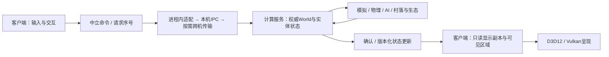

---
tags:
  - area/spec
---

# 项目范围与验收约定

## 已确认的目标

确认日期：2026-09-17。

2026-10-04 范围更新：用户确认先以 M3-T0 完成模块软硬边界，再以 T1/T2 分别实施世界和渲染模块变更。游戏生产代码统一归入 `game/`，测试脚手架统一归入根级 `test/`；DirectX 后端选定 Direct3D 12，不包含 Direct3D 11。本轮仅更新 spec，不表示相关实现或验收已经完成。

2026-10-05 基准分级更新：用户确认将 i7-10750H / GTX 1650 测试机列为指定低端性能基准机，将 Y9000P 列为指定中端性能基准机。GTX 1650 本次九轮结果已归档；分级是本项目的设备角色，不是行业硬件排名，也不代表最低配置认证或性能验收通过。本次不修改游戏或重新采样。

同日基准冻结：`laptop-result` 与 `this-result` 已完成离线核验及归档，指定中端与当前开发对照各九轮有效。按用户确认，新建测试窗口未获焦/失焦只记入分析，不列为失败；三档记录与固定协议见 [基准冻结 20261005](../project/benchmark/exp/Benchmark-基准冻结-20261005.md)，不再以前台复测作为基准成立条件。本次仅改文档和归档，不改工程实现、原始结果或历史失败判定。

2026-10-05 实施启动：用户在聊天中确认玩法回归通过并授权 M3-T0，允许并行迁移。当前实现与验收记录见 [M3-T0 报告](../milestones/m3-t0/README.md)，模块功能与类设计统一放入 [project/architecture](../project/architecture/Overview.md)。迁移前的用户确认不替代迁移后输入、窗口与玩法复查，也不推定未提供的逐机、逐项或长时测试细节。

同日 M3-T0 交付：九模块、app 及测试迁移完成，Debug/Release 各 60/60、CPU-only 43/43、独立工具 5/5；边界、增量编译、真实 OpenGL 和资源失败验证完成。用户确认迁移后本机移动/跳跃、视角、放置/破坏、切出切回、最小化恢复及正常退出全部正常。T0 实现与检查项已完成，整体验收待用户批准；未开始 T1，不将下文历史规划中的“仅更新设计”解释为本轮仍未实施。

2026-10-07 规划调整：按用户确认，在原 T2 渲染任务前插入 GLFW 到 SDL3 迁移，作为新 M3-T2；原 M3-T2 渲染改为 T3，原 M3-T3 应用/平台/模拟改为 T4，原 M3-T4 ECS/内存及整体验收改为 T5。用户已填写迁移方案并形成 [T2 正式计划](M3-T2-SDL3迁移.md)，此前草稿完整保留于其 [归档附录](M3-T2-SDL3迁移.md#附录归档)。D01 顺序已确认，D02–D09=A、D10=B、D11–D12=A；准备和实施尚未授权、实验和验收未执行。本轮只更新计划，不宣布 SDL3 已接入。已完成的 M2/T0/T1 历史编号、M4/M5/M6 大阶段与其子任务不变。

2026-10-08 T2 状态快照：后续 Q04 已关闭、P06 已批准，S1/S2 生产迁移及 S3 开发已实施，不再以上述早期计划快照推定尚未授权或接入。用户当时暂缓 Y9000P 验证，冻结 S3 可运行包并推进 S4；[平台契约交接](../milestones/m3-t2/s4-platform-handoff.md) 已完成，当时双机/预算/发布稳定性与 T2 最终验收仍未关闭。当前硬件前置按下文最新范围覆盖，历史 Y9000P 结果不改为通过；T3-R1/v1 不因验证包冻结自动成立，另行授权的独立 D3D12 前置实验保留自身门槛。

同日最新验收范围确认：用户要求 **M3 的功能/兼容验收只限定本机 RTX 5070 Ti**，T2/T3/T4 同步采用该范围，其他 GPU 或第二台机器不作为当前节点的验收前置，不因缺少这些结果阻塞节点。指定 Y9000P 中端和 GTX 1650 低端整机的性能验证仍在下一玩法阶段功能开发前必须完成，不取消两档设备角色或改写历史基准。该决定覆盖原双机门槛及后续增加第二 GPU 的安排；本机必验项目和用户批准仍须成立，不因缩小环境范围自动通过。统一规则见 [[project-scope#M3 本机 RTX 5070 Ti 验收与下一玩法阶段性能门槛|当前验收范围与后续性能门槛]]。

同日玩法范围更新：用户确认加入装备栏、攻击动作、NPC 实体、NPC AI、生态生成和村落演化。其中 **NPC 实体、NPC AI、村落演化为下一玩法阶段的最高优先级**；其余三项纳入后续玩法任务。新增阶段的编号及与既有技术节点的衔接点在阶段 spec 中确认，不默认排在 M6 之后，也不以本次范围更新改动已确认的 M3 顺序或授权实施。用户同时确认：需要其决策的方案选型由原先两个候选扩大为三至四个，具体编写规则见下文“方案决策与选型规则”。

同日渲染方向调整：用户确认 T3 先由 **D3D12 接管现有玩法，再接入 Vulkan；两个现代后端都完成接管后才验收 T3**。OpenGL 仅作过渡和回归对照，停止新增渲染特性的完整移植，最终退出生产构建与发布留后续单独节点，不以永久三后端等价为目标。PImpl、游戏侧 Renderer v1、可演进的私有后端及按真实重复需求提取小型内部 RHI 的原则不变。已选 D01/1、D02/2 及候选对比见 [T3 阶段决策](M3-T3-渲染器重构.md#已确定的阶段决策)。Micro voxel 纳入下一玩法阶段的 NPC/玩家实体外表构建思路，基础方块保持原样；不扩为细体素世界、破坏或光追系统，不自动选定第三方 RHI。本次仅更新设计，不授权渲染实施或删除 OpenGL。

2026-10-08 T4 物理边界确认：用户选择 **当前采用方案2，逐步迁移到方案3**。先在 simulation 下建立独立物理板块与真实 CPU target，单步运动/碰撞核心只消费中立数据与只读查询；固定步预算归 SimulationSession，ECS 遍历及 World 碰撞适配留在 simulation。后续迁为 `game/modules/physics` 正式模块，保持 target/include/命名空间和调用语义，按证据更新模块清单与构建边界；不以此改写 T0 九模块的历史交付。正式迁移落在 T4 内还是后续节点尚待确认，不擅自设为 T4 完成门槛。候选职责、接口、迁移及方案表见 [M3-T4 draft](M3-T4-draft.md)。本次只记录路线和拟定草案，不授权 T4 实施，不撤销 T2 当前开发或独立 D3D12 前置实验的既有授权。

同日长期架构确认：用户要求逐步迁移到 **dedicated compute server + render client**，用于多实体世界、NPC/AI、村落及生态的演化计算。计算服务承载权威模拟，渲染客户端承载呈现与交互；先建立可无窗口运行的逻辑边界，再分阶段验证独立进程及按需求独立机器部署。这里的 compute 是世界演化计算，不是 GPU compute shader 或云端视频渲染。具体边界、迁移和验收方向见下文 [[project-scope#长期架构：独立计算服务与渲染客户端|长期架构]]。本次仅纳入长期范围，不启动服务部署或通信实现，不改变当前 M3 顺序及 NPC/AI/村落的 P0 优先级；T4 草稿是否需要补充只在聊天分析，尚未修改。

2026-10-09 节点与预算决定：用户明确批准 **T2 节点正式通过**，并选择 MB01 方案2：working set ≤ **704 MiB**、private bytes ≤ **1408 MiB**；已选 FB01 方案2的 P95 ≤ 10 ms、P99 ≤ 12 ms 保持。批准及适用范围见 [T2 正式节点批准](../milestones/m3-t2/README.md#t2-正式节点批准) 和 [批准身份](../milestones/m3-t2/evidence/t2-approval-20261009.json)。用户节点决定覆盖此前遗留事项阻断 T2 节点的安排，不把 Win32 1175、暂停的 Fix1、正式同源 Q06 未完成、首次可操作时间预算未确认改判为已修复或实测通过，也不恢复 002 废弃数据的预算资格。T3 的 T2 节点批准前置已解除，R1 自身交接、Renderer v1 冻结和 R2 生产实施仍需独立确认；下一玩法前的中低端整机性能门槛不变。本次只同步决定，不产生新验证成绩。

Symocraft 是 Windows x64 单机体素游戏工程，继续使用 C++，以现有 OpenGL 为过渡回归基线，在 M3 由 D3D12、Vulkan 接管现有玩法，长期聚焦两个现代后端。兼顾图形技术栈和游戏引擎技术栈，重点展示两者之间的数据流设计。

- 日常开发环境：CLion + MSVC + CMake。
- 优先级：尽快交付首个可玩版本，再进行深入架构重构及性能优化。
- 保留项目身份和现有玩法，不要求保留原有 ECS、内存管理或其他自研基础模块。
- 允许在有明确理由、迁移路径和验证方法的前提下替换基础模块，不为展示技术而堆叠抽象。
- 随玩家移动加载、卸载区块属于首个可玩版本之后的独立范围；当前只预留必要边界。
- M3 必须同时形成文件夹级软边界、CMake target 级硬边界，以及有实现和测试支持的公开类接口；不能只搬文件或只声明接口。
- M3-T0 负责整个模块结构及构建依赖的解耦；生产模块位于 `game/modules/`，包括 renderer，应用入口/编排位于 `game/app/`，测试代码及辅助程序位于根级 `test/`。这里的生产代码同时用于 Debug/Release，不是发布产物目录。
- M3-T2 先完成 GLFW 到 SDL3 的平台迁移；方案已形成正式计划，准备实验、实施前审核与授权、实施及验收仍独立进行，不与渲染后端重写同时实施。
- M3-T3 渲染器重构采用 PImpl 隔离实现，D3D12 先行、Vulkan 随后，两者完整接管后验收；OpenGL 仅作过渡对照，最终退役留后续。外部接口不随后端切换而改变。T2 迁移验收后进入 T3-R1，先通过 D3D12 真实实验冻结 CPU 输入与 SDL3 窗口/像素/私有图形桥接契约，Vulkan 接入前复核同组实验。
- M3-T4 完善应用、平台与模拟接口，并按方案2提取独立 CPU 物理板块；SimulationSession 调度、物理核心计算、ECS/世界适配各有单向职责。逐步迁至正式 physics 模块，具体迁移节点按 T4 草案 D02 选择，不在本轮重写物理算法或扩展完整动力学。
- 下一玩法阶段优先建立 NPC 实体 → NPC AI → 村落演化的可观察闭环；生态生成、装备栏、攻击动作不作为完整实现的前置条件阻塞这三项。
- 下一玩法阶段将 micro voxel 作为 NPC/玩家实体外表的构建思路；外表数据与基础方块世界分开，具体资产、姿态和渲染方案另行选型，不在 T3 重写基础方块或引入细体素世界。
- 长期逐步形成独立计算服务与渲染客户端：模拟权威、推进时间和显示副本分开；保持单玩家本地运行路径，独立进程不等于要求云部署、多玩家联网或立即拆成多服务。
- 存档、联网、完整生存系统、通用编辑器、D3D11 和 OpenGL 过渡/D3D12/Vulkan 范围以外的图形 API 不自动进入当前范围。
- 按节点交付，由用户验收后进入下一节点；重要依赖替换、范围扩大或指标调整单独说明。

## 参考硬件

| 用途 | 配置 | 核实状态 |
| --- | --- | --- |
| 开发与主要调试 / 开发性能对照 | AMD Ryzen 7 9700X、RTX 5070 Ti、64 GB 内存 | 当前采用 `this-desktop-20261005` 九轮有效基准；2026-10-04 记录保留历史对照，不合并统计 |
| 指定低端性能基准机 | Yecat，i7-10750H、GTX 1650、约 16 GB 内存 | 回收数据确认 CPU / 实际 GL 设备；系统可见内存约 15.87 GiB。修复版 1080p 九轮有效，主要失焦；见 [低端机基线归档](../project/benchmark/exp/Benchmark-GTX1650低端机基线.md) |
| 指定中端性能基准机；M2 必验的第二台玩法机器 | Y9000P，i7-12700H、RTX 3070 Ti Laptop、32 GB 内存 | `laptop-y9000p-20261005` 九轮有效；声明混合显卡，实际 GL 设备为 RTX 3070 Ti Laptop；[中端机归档](../project/benchmark/exp/Benchmark-Y9000P中端机基线.md)。旧 strict 首轮失败仍保留 |

低端和中端基准均绑定上述整机配置与运行条件，不单凭显卡型号代替整机实测。两档均不是已认证的最低配置。测试时记录供电、性能模式、混合显卡/独显设置、驱动、温度和实际 OpenGL 渲染设备；缺失指标明确标注。不能把台式机数据、限制帧率或减少 CPU 核心数等同于低配实测。

M2-A 当前先在上述桌面环境恢复和验证现有玩法。Y9000P 笔记本已正式纳入 M2 整体验收，不再仅作为可选参考；桌面端 M2-A 完成不能替代笔记本实测，也不能单独使 M2 通过。

历史低端基准的加入未将 M2 双机玩法扩为三机矩阵，M2 已确认记录保持不变。当前 M3 的功能/兼容硬件范围只限定本机 RTX 5070 Ti；Y9000P 与 GTX 1650 的既有基准仍不能代替新候选版本的性能、人工玩法、长期稳定性或其他后端验证。

### M3 本机 RTX 5070 Ti 验收与下一玩法阶段性能门槛

2026-10-08 用户最新确认：M3 功能/兼容只在开发本机 **Ryzen 7 9700X / RTX 5070 Ti / 64 GB** 验收。T2/T3/T4 不再要求第二 GPU 或 Y9000P 的功能结果；本机适用项目全部成立并取得用户节点批准后即可推进，不为扩大硬件覆盖等待另一设备。其余输入、故障、当前部署检查、回归预算及节点审批仍保留，不将范围调整等同于已完成验收。

| 范围 | 当前必须验证 | 不代表的结论 |
| --- | --- | --- |
| T2 平台迁移 | 本机 RTX 5070 Ti 执行实际 GL 路径、适用窗口/输入/玩法、失败清理及同源 GLFW/SDL3 短采样与协议回归 | 不代表其他 GPU、第二套系统/CPU、笔记本显示链路或独立整机部署已验证 |
| T3 现代后端接管 | D3D12 和 Vulkan 各自在本机 RTX 5070 Ti 完成关键实验、适用整组验收及 14 项玩法/至少 15 分钟连续操作；两后端证据分别保存 | 不以另一 API、清屏/软件设备/初始化成功代完整玩法，也不据此通过中端 60 FPS |
| T4 应用/平台/模拟 | CPU 独立推进及原单机行为继续验证；D3D12/Vulkan 各自在本机 RTX 5070 Ti 留适用组合证据 | 同进程 CPU 会话与本机图形结果不是双机计算服务、远程通信或客户端/服务器产品交付 |
| 下一玩法阶段前性能验证 | 在指定 Y9000P 中端和 GTX 1650 低端整机上运行届时的功能开发前候选版本，分别取得性能验证与用户结论 | 不能由开发本机、限帧、旧 OpenGL 冻结基准或另一档整机替代，不把“延期”写成“免验” |

设备和证据要求：

- 本机按阶段核实实际 GL 4.6/4x MSAA、D3D12 FL12_0/SM6.0、Vulkan 1.2 及必需 surface/swapchain/呈现能力，不根据型号或设备清单推定通过。能力不满足则具名受阻、另行确认范围，不静默降低要求。
- 每次运行记录实际 RTX 5070 Ti 的 adapter/GL renderer、设备身份、驱动、图形 API、候选包/资源身份及显示连接条件；默认路由、偏好选项或设备清单本身不是运行证明。不得用其他硬件、软件设备或另一后端冒充目标结果。
- 同一 RTX 5070 Ti 的前后版本使用同条件基线及预先确认的回归预算，不套用另一整机的成绩。固定世界/画面负载不隐降，必要测试配置变更先确认，不混入旧冻结成绩或冒称原条件通过。
- 本机测试不验证 Y9000P 的 CPU/供电/温度/混合显卡、独立整机部署或跨机器服务行为。这些风险保留为未覆盖项；M6 的无开发环境目标机器部署门槛及长期计算服务跨机验证仍按各自 spec 执行。

**下一玩法阶段的进入门槛：** 中端与低端性能验证是 NPC 实体、NPC AI、村落演化等新增功能开始实施前的必做事项；可先编写或审核阶段 spec，不得先实现新玩法再补测。使用进入阶段前的候选版本，明确后端、设备实际能力、画面/世界/工作负载、采样和预算；保留三场景原始数据、CPU/GPU/present、P95/P99、内存及失败复测，两档分别报告。采样方案沿用已批准协议，必要变更先确认；各 GPU 使用自己的可比版本/条件，不拿旧 GL 数值当新后端已通过。

Y9000P 的既有中端目标保持；GTX 1650 的低端 FPS/P95/P99 硬阈值仍须在正式性能验收前单独确认，不能临时照搬中端目标或根据实测倒定通过线。记录有效、预算判定、未覆盖项及用户验收结论明确后，才解除新增功能实施门槛；不达标时先定位/优化/复测，若要调整目标需另获确认。这里前置的是两档性能验证，不把 M4 的全部优化任务或 M5/M6 整体搬成新玩法前置，也不宣称任何延期项已通过。

## 阶段与通过条件

| 节点 | 主要产物 | 通过条件 |
| --- | --- | --- |
| M0 现状基线 | 环境、原始构建/启动证据、范围、问题和依赖清单 | 能区分环境问题、已复现问题和静态风险，明确后续修复范围；不要求已经修复 |
| M1 可靠构建 | 目标级构建配置、CLion 接入说明、可复现命令 | 全新目录 Debug/Release 构建通过，选择的工具链明确，不依赖 IDE 隐含配置 |
| M2 首个可玩版本 | 运行包、操作说明、桌面与指定 Y9000P 笔记本的玩法结果和初始性能记录 | 两台机器分别完成基础玩法、资源定位、初始化/退出和 15 分钟连续游玩验收；记录笔记本实际渲染设备及运行条件；严重问题不以“待优化”名义放行 |
| M3 模块化、多后端与正确性 | 模块目录及独立 CMake target、稳定公开类接口及底层实现、PImpl 渲染器与 D3D12/Vulkan 接管、OpenGL 过渡与后续退役记录、模块文档 | CPU 核心可无窗口构建测试；公开头不泄露图形 SDK；依赖图无环；两个现代后端在本机 RTX 5070 Ti 分别通过同一功能契约和既有玩法回归；生命周期与失败路径验证完成，不以空壳接口或清屏演示代替。不为第二 GPU/机器阻塞节点，OpenGL 最终退役不作为本阶段通过条件 |
| M4 性能 | 同场景优化前后对照、可重复测量方法 | 在冻结的场景和配置下达到约定指标，不靠降低世界规模或画质隐性达标 |
| M5 稳定性 | 长时运行、重复启动退出与异常场景记录 | 连续至少 60 分钟无崩溃、卡死和无法解释的持续资源增长；异常情况可恢复或清楚退出 |
| M6 独立交付 | Release 发布包、技术文档、第三方通知、验收摘要 | 脱离源码和 IDE 可用，并在没有开发环境的目标机器验证运行依赖和资源完整性 |

M0 构建成功不自动使 M1 通过；M0 看到世界画面也不自动使 M2 通过。每个阶段有自己的范围和证据要求。

新增玩法阶段单列于下文“下一玩法阶段：NPC 与村落演化”，不重编号上述 M0–M6 技术里程碑。此处确认功能范围和内部优先级；启动位置、实现规模及正式通过条件仍需在该阶段的 spec 中敲定。

M2-A 阶段曾交付桌面候选版和局部验证报告，当时待用户人工验收，范围和进展见 [M2-A 桌面阶段报告](../milestones/m2-a/README.md)。M2 整体通过、人工 15 分钟游玩通过、性能基线建立和笔记本通过均须有各自记录，不能由已完成的代码修改或自动测试推导。

## 性能目标与测量约束

正式观测基准与协议已于 2026-10-05 冻结，完整身份和成绩见 [冻结记录](../project/benchmark/exp/Benchmark-基准冻结-20261005.md)。下表区分固定实验条件与性能验收目标；冻结基准不等于 M4 整体通过，后续调整须另行记录和确认。

| 项目 | 初始约定 |
| --- | --- |
| 机器 | 指定低端 GTX 1650 整机与指定中端 Y9000P 分档记录，接电并记录性能及显卡模式；开发台式机作为开发回归对照 |
| 构建与画面 | 修复版 Release、实际 1920×1080、4x MSAA、VSync 请求关闭、普通无边框窗口；当前游戏/执行器及资源哈希见冻结记录 |
| 中端流畅度目标 | Y9000P 沿用目标稳定 60 FPS；预热后的 P95 帧耗时不超过 16.7 ms，P99 不超过 33.3 ms |
| 低端流畅度目标 | GTX 1650 列为必留证的低端性能基准；FPS / P95 / P99 硬性验收目标待单独确认，不擅自设为 30 FPS、降低画质，或将中端门槛自动移用为低端通过条件 |
| 场景 | seed 424242、441 区块、regression v1、workload v2；static / walk / edit，编辑间隔 0.25 秒；首次加载单独测量 |
| 采样 | 每场景预热 60 秒、记录 180 秒、重复 3 次，每轮独立进程；static 三轮后 walk 三轮再 edit 三轮；正常游玩另行验收 VSync 开启体验 |
| 焦点与有效性 | 固定 allow-unfocused；新窗口未获焦及轮内失焦均不失败、不删帧，仅记录时长/比例/转换。最小化、尺寸改变、崩溃、未完成或数据校验不符仍失败 |
| 必须记录 | 原始帧时间、CPU/GPU 耗时、首次可操作时间、网格生成/重建耗时、上传字节数、内存及显存 |
| 尚未设定的阶段级硬预算 | 低端流畅度、首次加载时间、整机分档的内存和显存上限；T2 本机迁移预算已另确认 FB01/MB01 方案2，不据此移用到 M4 或其他机器。不以实测值倒定通过线，不影响观测基准成立 |

P95 表示 95% 的样本不慢于该数值；P99 关注更少见的慢帧。不能仅用平均 FPS 宣称不存在卡顿，也不能删除编辑操作产生的慢帧改善结果。采集期间的外部干扰需记录，必要时整轮重测。

2026-10-04 的 GTX 1650 结果采用修复版 Release、1920×1080、4x MSAA、VSync 请求关闭、seed 424242、441 区块和协议/工作负载 v2，三场景各 60 秒预热、180 秒采样、三轮；9/9 有效且无重试。约 99.90% 的正式采样时间失焦，因此归为低端机日常使用基线，不是受控前台基线。static / walk / edit 的逐轮 FPS 中位数为 60.64 / 60.64 / 69.75；8/9 轮 P95 超过中端参考线，另有约 274 / 440 ms 长帧，不能宣布稳定 60 FPS。完整结论与证据见 [归档报告](../project/benchmark/exp/Benchmark-GTX1650低端机基线.md)。

两档结果分别报告，不能混合样本或用其中一台替代另一台。优化前后对照需匹配场景、实际画面设置、焦点策略与环境，记录被测改动及各版身份；日常失焦数据不与受控前台数据合并。数据有效、性能达标和玩法通过分别判定；本次设备分级不修改既有中端阈值，也不预先通过 M4。

此次 Y9000P / 本机正式采样失焦比例分别为 92.95% / 88.89%，属于接受的基准条件。用户说明每轮新建窗口后会失焦，日志确认 18 轮首帧均未获焦；失焦不再触发本批分析中的失败或强制重测。Y9000P 九轮均满足现有 P95/P99 数值条件，但保留 91.276 ms 长帧；详情见各机报告。纯前台/后台影响研究为可选专项，不是未完成的基准前置项。

M2-A 世界日志里的 seed 不能完整重放生成结果。M2-T2 已建立当前生成版本及构建环境内的 seed/配置/方块摘要契约，见 [M2-T2 报告](../milestones/m2-t2/README.md)；后续对照使用新固定场景。原始程序的短暂启动观测及 M2-T2 有限帧运行都不能充当此处的性能基准。

## 文档与学习交付

采用中文技术文档、英文代码标识符。工程文档和学习说明跟随模块交付，至少包括设计理由、数据流、所有权、调用入口、测试与限制。

针对当前知识基础，学习说明重点放在：单线程正确性如何建立、后台任务为什么不能共享任意可变数据、CPU/GPU 如何交接资源、固定步长模拟与渲染帧的关系，以及如何用测量而非猜测定位瓶颈。

首个可玩版本之后再根据测量选择深入优化方向，不提前承诺必须采用某一种 ECS、线程池或网格算法。M3 的 PImpl 与 D3D12/Vulkan 现有玩法接管是本次明确的架构交付范围，不再属于可选性能优化；OpenGL 的最终退役另立后续节点，不维持永久三后端等价路线。

### Milestone 人工核查入口

2026-10-08 用户确认：从本次起，每个新建或继续实施的 milestone（包括独立子节点）必须在自己的 `docs/milestones/<节点>/` 下维护 **`manul-verification.md`**，作为用户人工核查的固定入口。文件名按本约定保留，不随 S/R 子步骤或候选包版本改名。当前先接入 T2/T3；已完成阶段的历史证据和批准记录不因补入口而重写或重新验收。

- 阶段启动时建立入口并由本阶段 `README.md` 链接；首次请求人工核查前必须补齐实际候选包/启动入口、版本、环境、前提和操作。尚未交付的入口标为“待入口交付”，不让用户猜命令或检查不存在的功能。
- 文首明确 **当前节点 → 拟推进的下一节点**，维护一个权威 checkbox 主表，直接列出“推进至下一节点前，用户还需人工核验哪些项目”。至少包含 **状态、稳定编号/核查时点、需要用户执行的操作或审阅材料、预期结果/通过标准、实际结果与证据**。只列本次推进所需项；后续节点用文字预告，不另立待勾选表或混作当前阻塞项。无需人工操作的节点也保留入口，明确仅需审核哪些报告，不凭空增加试玩要求。
- 自动构建、CPU/边界测试、故障注入和数值采样由实施方运行并给出报告；本表明确用户要看什么、操作什么，不把整套自动测试转交用户。硬件/后端/时长和预算沿用阶段 spec，不借统一入口新增验收范围。
- `[ ]` 表示未完成；失败或受阻保持未勾并写原因。只有用户实际核查通过，且结果绑定相应版本/环境/证据，才填 `[x]`。“不适用”保留理由及确认，不勾成通过。既有明确反馈可在注明来源、适用版本并核对未受影响后复用，不清空用户填写，也不无端要求重做。
- 每次阶段推进、候选交付或受影响行为变更时原地更新当前/目标节点和主表：上一节点结果保留于同文件历史记录，列入新推进所需项目；复测仅覆盖受影响项。失效的通过记录说明原因，不覆盖旧失败/复测证据、不删除或复用既有编号。多后端/多环境要求成立时分别列行，不能用一个勾替代多个实际组合。
- 子步骤清单或候选包副本可以保留，但当前待核查项和用户结论只在固定入口维护，详细步骤/历史记录由链接定位。各阶段文件同名，跨阶段引用必须包含目录，不使用裸文件名双链。整张表完成也不自动表示用户批准节点或授权下一阶段；节点批准仍单独记录。

可复用结构见 [人工核查模板](../Obsidian-功能笔记模板/templates/11-Milestone人工核查.md)。本次仅建立文档约定和入口，不执行人工核查、不替用户勾选或批准。

### 方案决策与选型规则

2026-10-07 起，新增或修订 spec 中需要用户选择的待定方案，按以下规则编写：

- **每项决策提供 3–4 个可行候选方案，不再默认只提供两个。** 候选必须适用于当前项目和阶段边界，不能把同一方案换名或明显不可实施的方案当作额外选项。确实不足三个时，显式记录约束与原因，交由用户确认是否缩减候选。
- 待选择表格使用“最终敲定方案、候选方案1、候选方案2、候选方案3”表头；有第四方案时再增加“候选方案4”。“最终敲定方案”在用户确认前写“待确认”；推荐方案与最终选择分开记录，不代替用户决策。
- 附录按决策编号提供方案对比表，比较适用场景、功能及架构影响、实现与迁移成本、运行开销、风险和验证方法；尚未测量的开销明确标为估计或待测，不虚构性能结论。
- 需要查看后文对比的决策格直接附上可跳转的文档内链接，采用与 Obsidian At Links 兼容的标题链接；不能只在前文阅读顺序提供入口。Markdown 表格内的链接分隔符按现有规范转义。
- 用户敲定后记录选择、理由、日期及影响范围，并在正式 spec 附录保留候选对比与决策历史。新规则不重新打开已确认的决策，也不改写归档草稿当时的候选数量。

## 当前重构进度与后续任务

更新日期：2026-10-07。任务规划保留 `17e23e0` 起点之后的工作区、里程碑和冻结基准证据；T0 负责结构解耦，T1 负责世界变更，新 T2 负责 SDL3 迁移，原 T2 渲染变更后移为 T3，原应用/平台/模拟与 ECS/内存任务分别为 T4/T5。T2 已按用户选择形成正式计划；用户明确树叶剔除与视角突变不属于 T1 spec 或 T2 前置范围，两项继续延期，并授权直接继续 T2 准备。后续为 T2 准备评审及实施授权 → T2 实施及验收 → T3-R1 冻结 → T3 渲染实施 → T4 → T5。实际准备证据见 [T2 准备记录](../milestones/m3-t2/README.md)，未标注的人工/硬件验收不能推定完成。

### 当前起点

| 方面 | 已有基础 | 接下来仍需解决 |
| --- | --- | --- |
| 构建与资源 | Windows x64 预设、构建脚本、资源随包部署和独立于工作目录的定位已经接入 | 补齐当前版本验证与候选包身份；M1 报告中尚未记录完成的 CLion 人工确认需核实 |
| 生命周期与安全 | 初始化失败可上报，图形资源先于上下文释放；区块使用拥有内存的容器，批次有容量检查 | 保留回归保护，不把这些已修复项重新列为从零实现的任务；完整 ECS/分配器正确性尚未验证 |
| 玩家循环 | 已有固定物理步、追赶上限、键盘快照、模拟后相机同步、体素射线及放置保护 | 完整碰撞、焦点恢复、边界编辑和持续游玩仍需验收 |
| 自动测试 | M2-T3 脚本补丁后，本机 Debug/Release 各 17/17；含 Windows PowerShell 与可选 PowerShell 7 脚本测试 | 结果见 M2-T3 首轮笔记本诊断；原桌面基线 15/15、M2-T2 13/13 和 M2-A 9/9 是历史结果，不代替人工玩法 |
| 世界生成 | 固定 441 个区块，最多 361 个进入绘制；M2-T2 确定性契约保留；指定低/中端及开发机基准已冻结 | 固定场景下的完整人工玩法仍待补齐；前台影响实验可选，不再阻塞基准成立 |
| 模块与渲染 | 有目录划分和局部无窗口测试；只重建脏区块的 CPU 网格 | `Application::Run` 仍承担过多编排；世界直接向全局批次提交，每帧重新装入并上传全部有效网格 |

M2 的未完成验收仍保留，不因本次规划而自动通过；M3 的设计可以先行，实施仍按节点确认。**M3-T0 先完成模块软硬边界，再由 T1 修改世界模块、T2 迁移 SDL3、T3 修改渲染模块，不同时重写 ECS、启用线程池或扩展无限世界。** 一旦复现阻断玩法的问题，先修复再继续验收。

### 第一优先级：完成 M2

#### M2-T1 当前版本回归与候选包更新

- [x] 使用当前源码在独立目录完成 Debug/Release 构建及全部 CTest，保留日志、工具链版本和运行权限信息。
- [x] 核实 M1 尚待确认的 CLion 构建结果；没有用户确认记录时保留待验收状态，不自行补写通过。
- [x] 复用现有运行与资源故障探针，补跑真实 Debug 有限帧渲染、Release 安装目录启动/退出、不同工作目录及隔离损坏资源检查。
- [x] 生成新的候选版本清单和资源/exe 哈希；源码有未提交改动时记录实际构建输入，不复用旧 M2-A 包身份。

入口：[构建脚本](../../scripts/build.ps1)、[运行探针](../../scripts/verify-runtime.ps1)、[故障探针](../../scripts/verify-runtime-faults.ps1)、[测试注册](../../test/CMakeLists.txt)。

完成条件：当前注册的全部测试在两种配置通过；真实运行和故障退出有独立证据；新旧结果可区分。此项通过不等于 M2 玩法通过。

#### M2-T2 建立可复现的世界与测试场景

- [x] 为世界初始化提供显式 seed 输入，统一派生全部噪声源和植被随机状态；保留默认随机开局，并记录可重放的实际 seed。
- [x] 明确区块遍历和跨区块植被写入顺序，避免共享随机序列受无序容器遍历影响；不能只固定日志中的 seed 或某一个噪声源。
- [x] 记录生成配置与版本，按固定坐标顺序计算方块内容摘要；补充相同 seed 重复生成、清理后重新生成及不同 seed 的无窗口测试。
- [x] 固定用于回归的出生点/测试位置、视角、移动路线和编辑序列；保留正负坐标交界、四块交点、墙角、低顶及单方块落地场景。

主要入口：[世界生成](../../game/modules/world/src/chunk.cpp)、[初始化编排](../../game/app/src/application.cpp)、[启动参数](../../game/app/src/main.cpp)。固定输入入口属于验证工具，不扩展为存档系统或通用回放框架。

完成条件：同一生成版本、构建环境、seed 和配置重复运行时得到相同方块摘要，能复现指定边界场景；确定性范围写清楚，不默认承诺跨编译器/平台位级一致。

2026-10-03 实现与上述范围内验证完成，待用户验收，见 [M2-T2 报告](../milestones/m2-t2/README.md)、[生成技术说明](../legacy/architecture/world-generation.md)、[固定场景指南](../project/benchmark/testing/reproducible-scenes.md)。Debug/Release 各 13 项 CTest 及各 120 帧真实运行通过。固定路线为人工路点定义，编辑入口为启动前有序写入，不是输入回放、玩法通过或性能基线；M2-T3/T4 状态不变。

#### M2-T3 增加最小性能观测并采集基线

- [x] 将真实性能帧时间与截断后的模拟 `delta_time` 分开记录；区分事件/模拟、网格重建、CPU 提交、GPU 绘制及呈现等待。
- [x] 记录每帧重建区块数、有效顶点数、上传字节数和绘制调用数；分别记录资源加载、地形/植被生成、首批网格、首次上传和首次可操作时间。
- [x] 提供可复现的 framebuffer 分辨率、VSync 和采样配置；导出原始样本及 P95/P99 汇总，保留编辑产生的慢帧。
- [x] 补齐内存/显存及 GPU 时间的采集方法；不能即时取得的指标标为缺失，不能用 CPU 提交耗时冒充 GPU 耗时，也不能为了每帧读数引入强制等待扭曲基线。
- [x] 台式机与指定中端 Y9000P 各三场景九轮有效基线已归档并冻结；供电/显卡模式/驱动/实际 GL 设备已记录，温度和频率明确未采集；按确认的 allow-unfocused 口径保留全部失焦帧。
- [x] 归档指定低端 GTX 1650 修复版三场景九轮结果，保留失焦、温度/频率缺失、性能漂移和长帧边界；仅表示现有日常使用基线已留证。

主要入口：[主循环](../../game/app/src/application.cpp)、[区块更新与提交的 T0 历史记录](../milestones/m3-t0/README.md)、[批次上传](../../game/modules/renderer/src/batch.hpp)、[渲染器](../../game/modules/renderer/src/renderer.cpp)。原 `chunk_manager.cpp` 已在 T1 重构中移除；M2 历史采样结果不随源码入口更新而改变。

依赖 M2-T2。完成条件：相同场景可重复采集，有原始数据、采样边界和硬件条件，能够区分 CPU、上传与 GPU 成本。M2 在此建立基线，不提前宣称已经满足 M4 的性能目标；严重卡顿若阻断玩法，仍须在 M2 处理。

2026-10-03：前四项实现及桌面验证完成，Debug/Release 各 15/15；桌面正式 9/9 采样有效。首次可操作时间采用 main 入口至首帧交换返回的近似，不是输入到显示延迟；CPU 温度及精确每进程显存缺失，设备显存范围明确另列。见 [M2-T3 报告](../milestones/m2-t3/README.md)、[计时技术说明](../legacy/architecture/performance-observation.md) 及 [双机采样指南](../project/benchmark/testing/performance-baseline.md)。Y9000P 尚未执行，因此最后一项与 M2-T3 整体验收保持未完成，不由桌面数据推定笔记本达标。

随后收到 Y9000P 首轮数据，按当时 strict 协议因失焦无效；已交付采集脚本版本 2 修复空退出码及相对路径问题，本机 Debug/Release 各 17/17，原游戏 exe 不变。当时笔记本有效三场景九轮仍待执行，详见 [诊断与补丁](../milestones/m2-t3/laptop-first-run.md)；旧无效结果保持原判，后续新基准见下文。

2026-10-05：先归档 GTX 1650 修复版 9/9 并确定低/中端分级，随后收到 laptop / this 各九轮有效记录。现已复算并冻结指定低端、中端和开发机基准，M2-T3 的双机有效采样证据补齐。仅失焦不失败，前台复测不再作为前置条件；温度、频率及背景活动缺失照实保留。归档不是新实测，也不使 M2-T4 人工玩法、M4 整体或长期稳定性自动通过。

#### M2-T4 完整玩法与双机验收

2026-10-05 用户在本聊天明确确认桌面与 Y9000P 已完成完整验收，下列勾选及连续玩法 `pass` 按用户确认保留。本次只整理 Git 和文档，不重做验收、不补写未提供的逐项日志、机器时长或资源曲线；M3-T0 整体验收仍独立待批准。

- [x] 按 [14 项玩法用例](../testing/gameplay-smoke.md) 分别补齐桌面和 Y9000P 的结果，重点检查持续移动、墙角/低顶碰撞、负坐标及区块交点编辑、失焦/最小化恢复和退出后重启。
- [x] 补齐材料循环、选择框和纹理显示检查；水与树叶可见不等于透明处理正确，异常须记录位置、角度和复现步骤。
- [x] 两台机器分别完成进入可操作世界后的至少 15 分钟连续游玩，保留帧时间、内存变化、错误日志和正常退出记录。
- [x] 对复现故障先增加适当的自动回归或固定人工场景，再修复并记录复测；旧失败证据保留。
- [x] 汇总当前候选包、双机玩法结果及性能基线，交由用户确认 M2 是否通过。

最终验收使用包含 M2-T1 至 M2-T3 改动的同一候选版本。人工检查可提前用于发现问题，但改动影响到的项目必须复测。未执行项保留原因，不以单元测试或有限帧运行代替。

### 第二优先级：M3 模块化、多后端与正确性

M3 的任务编号与顺序为 T0、T1、T2 SDL3、T3 渲染、T4 应用/平台/模拟、T5 ECS/内存及整体验收。用户已确认将 SDL3 迁移放在原渲染任务前并填写方案，见 [T2 已确定的决策](M3-T2-SDL3迁移.md#已确定的决策)。T2 准备已获直接授权；完成准备、实施前审核与授权、实施及验收后再进入 T3-R1 冻结及渲染实施，不再把 T2/T3 顺序列为待选项。T0/T1 状态以各自报告为准；两项延期问题不作为 T2 准备门槛，其余阶段仍需独立授权和节点验收，不补写既有阶段缺失的实测细节。

#### M3 的共同完成标准

| 边界 | 必须形成的约定 | 不算完成的情况 |
| --- | --- | --- |
| 软边界 | `game/modules/<模块>/include/symocraft/<模块>/` 只放公开头，模块 `src/` 放实现和私有头；应用编排在 `game/app/`；所有测试脚手架在根级 `test/` | 只改目录名，仍任意包含兄弟模块私有头，或将生产源码散留在根级 `src/include` |
| 硬边界 | 每个模块有自己的 `CMakeLists.txt` 和命名 target，明确 `PUBLIC/PRIVATE/INTERFACE`；根构建只组织模块、工具与安装 | 仍把全部源文件和整个仓库 include/vendor 路径塞进游戏目标，或用全局编译选项掩盖依赖 |
| 生产/测试边界 | 测试链接真实生产模块；生产 target 不依赖测试 target；`BUILD_TESTING=OFF` 不引入测试框架、fixture 或故障注入程序 | 测试重复编译生产 `.cpp`，或游戏依赖 `test/support` 提供运行能力 |
| 接口边界 | 公开类写明职责、参数/返回、所有权、生命周期、错误、线程、复制/移动及兼容策略；契约测试使用与生产相同的库 | 只有类声明/转发空壳，或通过公开裸成员泄露状态和图形句柄 |
| 实现边界 | 每个公开操作有真实实现与失败路径；实现变化不要求调用者知道底层 API；内部状态不由全局服务定位器获取 | 为每个旧函数套一层接口，但调用者仍操作全局批次、设备、窗口句柄或 Registry 内部容器 |

模块清单与职责的唯一详细定义见 [M3-T0 模块软硬边界](M3-T0-模块软硬边界.md)。拟划分 foundation、scene、assets、world、ecs、simulation、platform、renderer、telemetry 九个生产模块；`game/app` 负责组合，`tools/benchmark` 保持独立工具，根级 `test` 承载测试。模块说明包含通俗作用、职责/非职责、输入输出、所有权、依赖和现有源码归属，供用户理解审核。

#### M3-T0 完成模块软边界与硬边界解耦

实施状态：真实模块、接口及测试已完成迁移与约定检查；下列勾选表示实现/验证已有证据，见 [逐项报告](../milestones/m3-t0/README.md)。T0 整个节点仍等待用户验收，不自动启动 T1。

- [x] 确认模块职责和目录归属，迁移根级游戏 `src/include` 到 `game/app` 与 `game/modules`；renderer 及后续后端同属游戏生产代码。
- [x] 将现有 `tests` 与工具测试脚手架归入根级 `test/unit`、`test/integration`、`test/benchmark`、`test/support`，不保留模块内并行测试树。
- [x] 为每个生产模块建立真实 CMake target，明确公开头、私有实现和依赖方向；拆解 `core.h`，移除全局 include 路径、循环依赖和跨模块私有引用。
- [x] 通过必要的数据类型抽取、参数传递及窄接口断开 world -> renderer、simulation -> platform/Application、renderer -> Application 等反向耦合；不提前重写算法或接入新图形后端。
- [x] 保持生产与测试单向依赖、CPU-only 测试、游戏构建和 benchmark 独立构建；同步资源路径、安装与构建脚本，不搬迁 `assets/vendor/out`。
- [x] 完成 T0 的目录、构建、链接、负向边界检查及现有 OpenGL 回归，交付迁移清单和 target 图。

完成条件：全部约定模块具有实际实现与可验证边界，旧功能仍可用；不是只有 CPU 子图完成，也不是建立空 target 后把依赖问题留给 T1/T2。T0 可以保持模块内部旧算法和旧私有状态，后续步骤负责模块内部设计变更。

#### M3-T1 世界模块变更需求

详细设计、已确定决策和 T1 完成标准见 [M3-T1 世界模块重构](M3-T1-世界模块重构.md)。九项草稿决策及历史附录保持；2026-10-06 用户已授权实施，现完成下列实现与自动验证，并确认其余人工项目正常、两项已知问题延期。技术交付与节点待批准状态见 [T1报告](../milestones/m3-t1/README.md)，不继承 T0 验收或自动进入 T2。

- [x] 在 T0 已成立的 world/scene 边界内，进一步分离 `Chunk` 的方块存储、生成和网格构建职责；沿用 M2-T2 的 `Generation::Generator` 与确定性契约。
- [x] 确定世界查询/编辑、网格构建及脏标记/版本的公开类接口，落实底层实现、所有权和失败语义；移除模块内部共享网格临时状态。
- [x] 完善拥有自身数据的 CPU 网格及邻居读取契约，不保留失效的邻块缓冲引用；GPU 对象继续不进入世界模块。
- [x] 在根级 `test/unit/world` 与集成场景补齐真实坐标、配置、邻居、编辑和网格回归；不重新建立一套目录或绕开 T0 的正式库测试。

完成条件：世界模块的新设计、实现及测试一致，seed 摘要和固定场景保持正确，旧 OpenGL 调用仍可用；交付供后续 T3 渲染使用的 CPU 数据契约，交接入口见 [T1→T3 CPU 契约清单](M3-T1-T3-CPU契约清单.md)。T0 的职责是让模块彼此隔离，T1 的职责是在隔离后完成世界模块的内部设计变更；编号调整不改变已交付 CPU 数据语义。

#### M3-T2 GLFW 到 SDL3 平台迁移

正式计划及唯一的迁移决策/验收契约见 [M3-T2 SDL3 迁移](M3-T2-SDL3迁移.md)，原 draft 完整保留于其 [归档附录](M3-T2-SDL3迁移.md#附录归档)。D02–D08=A、D10=B、D11–D12=A 保持；D09 按 2026-10-08 最新确认只限定本机 RTX 5070 Ti 的功能与兼容验收，原双机选择留历史。只替换平台实现，准备 GL/原生/Vulkan 三种模式；官方 `release-3.4.18` 源码纳入 vendor 并静态链接；保持物理键位、现有鼠标手感与实际 1920×1080 Benchmark 负载。Q04/P06 与 S1–S5 实施授权已生效，S1/S2/S3 开发、S4 交接及活动 GLFW 依赖清理已有记录，保留休眠源码与历史材料供 T5 审计。**T2 于 2026-10-09 获用户正式节点批准**，不再以前述遗留事项阻断其节点状态；正式同源短采样、发布稳定性和未确认的首次可操作预算继续具名跟踪，不宣布性能等价或将未执行项勾成实测通过。FB01 方案2与 MB01 方案2已确认，详情见 [批准记录](../milestones/m3-t2/README.md#t2-正式节点批准)。

- [x] 2026-10-09 用户明确批准 T2 节点正式通过；此项仅记录人类节点决定，下列原技术清单保留实际证据状态，不批量改成通过。

- [ ] 按已选方案完成 [准备步骤与进入条件](M3-T2-SDL3迁移.md#准备步骤与进入条件)：核实官方源码 tag/完整 commit/摘要/许可证、静态构建、入口与部署策略，准备同源码 GLFW 对照包及窗口/输入行为映射。
- [x] 更换 platform 私有窗口、键鼠事件、计时和必要图形桥接实现；公开头不暴露 SDL/SDK 类型，CPU-only 与独立 benchmark 不引入 SDL。实现完成不替代剩余本机 RTX 5070 Ti 验收。
- [ ] 保留焦点/最小化恢复、短按与有序指针事件、实际像素尺寸、Benchmark 任务栏与 allow-unfocused 协议；通过真实 GL 呈现、原生 HWND 与 Vulkan instance/surface/loader 清理验证。
- [x] 按 S4 交付实际窗口/像素/私有图形桥接契约及已验证范围，最终迁移验收仍保留；T2 的真实 GL 回归和 D3D12/Vulkan 桥接探针不代替 T3 两个现代后端的完整玩法接管验收。
- [ ] 按 [验收案例](M3-T2-SDL3迁移.md#验收案例) 完成本机 RTX 5070 Ti 的适用玩法、当前范围部署检查、失败清理、短采样与协议回归；中低端整机性能验证移至下一玩法开发前，本机预算未确认前不宣称性能等价，独立整机覆盖仍具名保留。
- [ ] 迁移验收后清除活动 GLFW 依赖并更新实际平台说明，保留休眠旧代码与历史材料，不提前删除回退依据。

原技术完成条件保留在正式计划及上述清单中，失败/未执行事实不回写。当前节点状态按 2026-10-09 用户正式批准执行，T3 的 T2 节点批准前置已解除；D10/B 延后的正式九轮对照、未完成的正式同源 Q06、Win32 1175 与暂停 Fix1 继续跟踪，FB01/MB01 已选预算不等于实测成立，首次可操作时间预算仍未确认，不推定性能等价或 M4 达标。SDL3 不替代 T3 的 renderer 实现；完整应用/模拟对象重构留 T4，ECS/内存审计留 T5。

#### M3-T3 渲染模块变更需求：PImpl 与现代后端接管

详细设计和唯一的渲染器验收表见 [M3-T3 渲染器重构](M3-T3-渲染器重构.md)，采用 Obsidian 完整功能模板的“当前设计 / 本次变更 / 后续考虑”结构。T3-R1 在 T2 SDL3 迁移验收后冻结，不沿用未经验证的 GLFW 窗口前提。

2026-10-07 用户确认保持 T3 当前方向：先稳定游戏侧 Renderer v1，私有后端接口允许演进；仅在实际重复渲染算法形成明确复用需求时提取小型内部 RHI，公共算法留在 renderer，不扩为完整通用 RHI。R1 须验证实际纹理绘制、资源更新/删除和窗口呈现资源重建后再冻结，具体门槛见 [[M3-T3-渲染器重构#R1 关键契约实验与冻结门槛|R1 关键契约实验与冻结门槛]]。本次只确认设计，不代表实验已完成或实施已授权。

同日进一步确认：D3D12 先行，随后 Vulkan；两者都完整接管后申请 T3 验收，OpenGL 最终退役留后续。决策及三个候选对比见 [[M3-T3-渲染器重构#已确定的阶段决策|T3 阶段决策]]。优先完成现代玩法路径，不以完整重写 GL 门面为前置；旧 GL 对照包或隔离路径保留必要回归，不承担新增特性的永久等价移植。

- [ ] 经 D3D12 的 R1 关键契约实验后，基于 T1 的 CPU 数据契约与 T2 已验收的平台契约冻结 `Rendering::Renderer` v1 公开接口与行为，采用 `std::unique_ptr<Impl>`；后端接口、工厂、API 类型和资源实现全部私有，内部接口不作同等级稳定承诺。
- [ ] 让 D3D12 完整接管现有固定方块世界与玩家操作，取得本机 RTX 5070 Ti 适用验收证据；经用户批准后默认切到 D3D12，不静默回退 OpenGL。只完成先行接管不使整个 T3 通过。
- [ ] 在 T3 内接入 Vulkan，接入前在本机 RTX 5070 Ti 复核相同关键实验，并由同一游戏侧调用方完成各自玩法、当前范围部署检查、成本记录及失败验收，不继承 D3D12 结果；启动时选择已交付并编入的后端，不做运行中热切换。
- [ ] 在 T0 已有 `game/modules/renderer` target 内落实门面与真实现代后端子 target，GL target 仅按实际过渡需要保留；测试统一在根级 `test`，关闭或未交付后端不要求其 SDK、编译器、资产或运行库，不以空 target 宣称完成。
- [ ] 完成两个现代后端的窗口呈现、世界网格、纹理数组、深度/剔除、选择框、resize、资源更新/销毁和失败清理；GPU 同步、shader 编译和诊断具有真实实现。
- [ ] 将呈现、截图和计时落实为后端中立契约，保持基准数据语义与旧 GL 记录可读性；不重新把原生 API 泄露回 Application/Window 公共接口。记录 GL 过渡路径及退出条件，最终生产构建/发布清理另行确认。

完成条件：详细 spec 的 A01–A19 适用项和现代单/双后端整合验收有证据，D3D12、Vulkan 分别在本机 RTX 5070 Ti 运行现有体素玩法后，才申请 T3 整体验收；只有设备初始化、清屏/三角形或假后端测试不算完成。不等待其他 GPU 或第二机器；中低端整机性能验证另为下一玩法开发前门槛，不把本机功能通过宣称为 Y9000P 或 M4 通过。OpenGL 最终退役不是本次通过条件，不能宣称已移除。Micro voxel 外表留下一玩法阶段，基础方块不改。稳定承诺首先针对源码接口与行为，不据 PImpl 宣称跨编译器/STL 的二进制 ABI 兼容。

#### M3-T4 完成应用、平台与模拟模块接口

候选设计见 [M3-T4-draft](M3-T4-draft.md)，按完整功能模板区分当前实现、拟变更与后续能力。2026-10-08 已确认物理方案2→方案3路线；其余待定项分别提供三个候选和附录跳转，入口见 [[M3-T4-draft#方案决策表|T4 方案决策表]]。本文仍为草案，T4 实施需前序必需契约与验收成立、草案正式化及独立授权，不推定 T2/T3 已通过。

- [ ] 在 T0 已落实的 app/platform/simulation/telemetry 边界内完善类设计、状态所有者和编排流程；输入回调不直接操作 ECS，渲染器不回读应用相机。
- [ ] 建立 app 私有 Application、平台 Runtime/Window 的明确独占与借用接口，验证部分装配失败及正确销毁顺序；沿用 T2 成立的 SDL3/输入/私有桥接能力，不重复窗口库迁移。
- [ ] 完善输入意图、世界查询、相机描述和交互结果的值/借用契约；复核 T0 已移除的跨模块服务定位没有回流，不以 T4 为理由延后 T0 的断环工作。
- [ ] 将固定步余数、追赶上限、暂停恢复与控制状态收束到 SimulationSession；保持每帧角色规则与零到多个固定物理步的频率，以及输入 -> 固定步模拟 -> 相机同步 -> 射线编辑顺序，不顺便改为全玩法固定步。
- [ ] 按方案2在 simulation 下建立独立 `symocraft_physics` CPU target，定义中立运动/形状/只读碰撞查询契约；ECS/World 适配单向调用核心，核心不依赖 simulation、ecs、world、窗口或 renderer。
- [ ] 撤掉活动全局物理预算与重复调用路径，完成单步、真实碰撞、查询失败和两份 CPU 会话隔离测试；后续按 D02 确定节点迁到 `game/modules/physics`，不保留两套实现，不以空 target 或搬文件宣称独立。
- [ ] 完成公开类底层实现与类设计笔记，补充真实物理及玩家循环场景测试，覆盖墙角、低顶、接地、失去支撑及调试模式恢复。
- [ ] 将 telemetry 记录/封闭/导出与 BenchmarkScenario 分开；观测不拥有被测对象，既有 seed/workload/采样及文件语义保留，额外探针档位和裁剪按草案 D06 敲定。
- [ ] 确认 benchmark 独立构建、原有协议与采样流程仍可工作，不通过依赖游戏大目标取得公共工具。

完成条件：模拟、独立物理核心与数据导出不依赖窗口/GPU，平台图形桥接仅被后端使用；已交付现代后端沿用同一模拟/交互调用方，在本机 RTX 5070 Ti 完成适用组合回归。T4 选定范围内的对象、底层实现、软硬边界和真实验收一致，物理方案2必须成立；方案3是否同时必验由 D02 在正式化前敲定，后续归属与退出条件明确，未完成不标通过。输入历史、相机插值、实体间动力学和细体素碰撞不默认新增；不由接口重构推定算法缺陷或 M4 性能已解决。

#### M3-T5 完成 ECS/内存契约与整体验收

- [ ] 验证实体销毁/复用、旧 ID、组件增删、稀疏/稠密索引、遍历、扩容失败和重复清理；Release 不依赖断言维护安全。
- [ ] 明确容器所有权、复制/移动、引用有效期和分配失败行为；按测试结果选择修复或替换，重要依赖变更单独确认。
- [ ] 仅移除确认无调用的旧分配器、线程池和输入路径；完成每个公开类的实现及测试，不留长期兼容空壳。
- [ ] 汇总模块公开头、依赖图、无图形构建、后端构建矩阵、接口消费者测试及玩法回归证据，消除已结束用途的临时适配；尚保留的 GL 过渡路径须隔离并记录退出节点，不以本项强制提前最终退役或允许现代调用回用旧全局状态。

主要入口：[Registry](../../game/modules/ecs/include/symocraft/ecs/registry.h)、[私有组件容器](../../game/modules/ecs/src/component_container.h)、[现有内存模块](../../game/modules/foundation/src/legacy/AmoBase.cpp)。完成条件是 M3 共同标准全部满足，不是仅将 ECS 换库或让游戏编译成功。

每个模块/类的接口先在对应设计笔记确定，再落实实现与契约测试，验证后才将候选设计转为“当前设计”。保留 M0 历史架构文档，新建实际完成的 M3 架构说明；尚未执行的验收一律不勾选。

### 下一玩法阶段：NPC 与村落演化

本阶段的核心是让世界中出现能够持续行动、参与村落运行的 NPC，而不只是生成静态村落或放置没有行为的模型。**P0 为最高优先级，先形成最小闭环；P1 已纳入范围，但不要求与 P0 同时交付。** 阶段编号、与当前 M3 的切换点及下表尚未敲定的细节，在实施前单独确认。

2026-10-08 已确认进入限制：可先拟定本阶段设计和方案，但 NPC/AI/村落、外表及其他新增功能开始实现前，必须完成 [[project-scope#M3 本机 RTX 5070 Ti 验收与下一玩法阶段性能门槛|中低端整机性能验证门槛]] 并取得用户结论；M3 的本机功能/兼容通过不解除该限制。

| 优先级 | 功能 | 需要交付的能力 | 阶段 spec 的重点确认范围 |
| --- | --- | --- | --- |
| P0 | NPC 实体 | 可创建、显示、移动和移除的 NPC，具有稳定身份、位置及必要状态，明确生命周期和与世界交互的边界；外表采用下文 micro voxel 构建思路 | 实体/组件表示、外表资产与姿态、碰撞范围、数量预算、销毁后引用安全；不要求为 NPC 先整体替换 ECS |
| P0 | NPC AI | 从感知、决策到行动的完整流程，能够在世界中移动并执行选定任务，遇到不可达目标或失败时有明确处理 | 决策范式、寻路及可通行规则、任务与状态切换、更新频率和计算预算；不预先指定行为树、GOAP 或多线程 |
| P0 | 村落演化 | 村落状态随模拟时间和 NPC 行为发生变化，围绕资源、岗位和建设形成可观察的运行闭环；不是只在开局生成建筑 | 初始村落来源、资源与工作规则、建设及人口变化范围、演化时间尺度、观察指标；出生/死亡/迁入等机制不未经选型全部纳入 |
| P1 | 生态生成 | 在已有地形/植被生成上补充生态区域、资源及生物分布规则，为 NPC 与村落提供环境输入 | 生态区域与资源规则、动植物范围、seed/生成版本及可复现性；完整食物链与生态模拟另行确认 |
| P1 | 装备栏 | 装备槽位、装备/卸下及当前装备显示，区分装备与现有方块材料选择 | 槽位、物品及装备数据契约、交互方式和界面；不自动扩为完整背包、合成或生存系统 |
| P1 | 攻击动作 | 攻击触发、动作反馈和命中/伤害结算，明确玩家及 NPC 哪些主体可使用 | 武器及攻击类型、动作与命中时机、冷却、目标和伤害规则；不以此默认加入完整战斗体系 |

#### NPC 与玩家外表的 Micro Voxel 设计边界

已确认方向：在本阶段将 micro voxel 用于 **NPC 与玩家实体的外表构建**，使角色外观能够表现比基础方块更细的形体。这里确认的是外表构建思路，不是现成资产格式、渲染算法或实现授权；也不是将整个世界转换为细体素。

- 基础方块继续沿用当前存储、尺度、坐标、生成/查询/编辑、纹理层和 T1 CPU 网格语义；现有玩家移动与方块交互保持，不因新增角色外表重新定义世界。
- 外表资产、实例/姿态和渲染数据与世界方块、AI 决策及村落状态分开。外表分辨率不直接决定物理碰撞、寻路或每个细体素的模拟频率，不自动加入细体素破坏、逐体素物理、完整第三人称系统或硬件光追。
- 资产表示、细节预算、部件/动画和渲染路径在阶段 spec 中分别提供 3–4 个可行候选及对比。先生成三角网格供现代后端光栅化与直接体素渲染等路径均需按实际角色规模评估，不在本次预先选定 SVO、DXR、第三方 RHI 或新增模块。
- 新的实体外表 CPU 输入与 renderer 能力另定受控扩展，不强行塞进既有基础方块顶点格式，也不倒改已交付 T1 契约。NPC 实体、AI、村落演化仍为最高优先级；最小角色外表与行为闭环先验证，不以完整高精细角色渲染阻塞全部 P0 交付。

#### 首批任务与完成依据

- [ ] 在新增功能开始实施前，完成指定 Y9000P 中端与 GTX 1650 低端整机的候选版本性能验证，先确认低端预算，分别留原始证据/预算判定和用户进入结论；不能仅凭 20261005 冻结数据、本机 RTX 5070 Ti 或 M3 通过跳过。
- [ ] 先制定 NPC 实体、NPC AI、村落演化的阶段 spec，按上文规则列出需要用户选择的 3–4 个候选方案及附录对比；确定初始闭环、实现顺序、运行规模和验收场景后再实施。
- [ ] 制定 NPC/玩家 micro voxel 外表的资产、实例/姿态及 renderer 输入设计，确认预算、候选渲染路径和最小验收场景；与基础方块世界、物理及 AI 数据契约分别管理，不作为 T3 接管任务。
- [ ] 建立 NPC 实体生命周期与世界交互基础，再接入 AI 的感知/决策/行动及失败恢复；准备实体删除、阻挡、目标失效和重复创建/退出场景。
- [ ] 在固定初始村落与最小资源配置下，验证 NPC 行为确实推动村落状态变化，能够追踪变化原因；不依赖完整生态生成、装备或战斗系统才能运行。
- [ ] 分别确定生态生成、装备栏、攻击动作的后续 spec 和 P1 内部顺序；若某项最小能力是 P0 的真实依赖，明确列入 P0 spec，不因此将整项 P1 功能提前扩大为前置要求。

新增能力沿用已有模块软硬边界，CPU 模拟不依赖窗口或具体图形后端；模块归属、状态所有者、OOP/DOD 分工和必要 RAII 资源在对应 spec 中确定，不凭功能名称预先新增空模块。NPC/AI/村落场景另行记录数量、规则、模拟时长及 CPU/内存成本，不覆盖或混入已冻结的 static / walk / edit 基准；现有移动、放置/破坏和生命周期回归继续保留。本次所有新增任务均为规划，未实施、未验收。

### 长期架构：独立计算服务与渲染客户端

确认日期：2026-10-08。长期目标是让多实体世界的推进不依赖某一扇窗口的渲染循环，并可逐步把演化计算放到独立进程或专用机器。当前仍以 Windows x64 单玩家玩法为交付形态；新增架构方向不自动加入多人联机、云账户、Linux 部署、分布式世界分片、GPU 模拟或完整持久化系统。

#### 职责与权威边界

| 侧 / 能力 | 功能与作用 | 明确边界 |
| --- | --- | --- |
| dedicated compute server | 拥有权威 World、实体/组件状态与模拟会话；推进物理、角色规则、NPC AI、村落/生态演化，校验并提交玩法命令 | 核心可无窗口/renderer运行，不依赖客户端GPU/原生输入；计算结果不是渲染图像，不预设全部系统同一更新频率 |
| render client | 拥有窗口、键鼠、镜头呈现、UI及D3D12/Vulkan资源；发送中立意图/请求，消费状态更新并组织可见画面 | 不是纯视频播放器；可持有只读显示副本/视觉状态，但不直接修改服务端Registry或成为第二份世界权威 |
| 交接数据与传输适配 | 传递命令、确认/拒绝、带版本的状态更新及必要初始化/重同步信息 | 业务数据契约与IPC/网络实现分开，不传C++指针、引用、span、GPU句柄或完整对象内存；不在本次选传输库 |
| 可见区域与几何准备 | 按观察范围提供客户端需要的方块/实体显示数据，控制更新量 | 不默认每tick发送全世界或所有网格；CPU网格在服务端、客户端或混合生成的归属另行选型，GPU资源始终归客户端 |
| 观测与诊断 | 服务端记录模拟/tick/实体成本，客户端记录帧/GPU/呈现成本，分别汇合中立记录 | 进程/机器及指标来源具名，按tick/请求关联；不直接相减不同进程的steady-clock时间，旧性能协议保持可辨识 |

这里的“权威”表示由计算侧最终接受、拒绝和提交玩法状态变更。客户端可以立即更新UI或未来采用可撤销预测，但确认、纠正及冲突策略须在专门spec定义；不能用显示副本覆盖服务端结果。角色朝向/瞄准若影响玩法，作为命令数据处理；FOV、窗口比例及GPU投影不成为演化计算的必需输入。

图中箭头表示长期业务数据流，不表示本轮已经建立通信target、已决定传输或必须完成远程部署。

#### 调度与生命周期原则

- 模拟tick、AI/村落演化更新和客户端渲染帧是不同时间域；分别定义频率、预算、落后处理及必要顺序，不把所有实体都以每个渲染帧或120Hz完整演算作为默认。
- 服务端推进由自己的模拟调度策略控制。客户端失焦、最小化、关闭或断连不直接触发全世界暂停；继续/暂停/停止的单玩家运行策略须明确选型。当前T4的暂停与步进基线仍有效，长期模式另定，不在此静默改变现有行为。
- 进程内借用只在所属进程内成立。跨边界数据具有明确所有权、序列/版本及寿命；进程内EntityId/WorldId不自动成为重连、重启或持久化身份，需要另定会话身份与映射。
- 命令确认与可合并的显示更新不能共用无差别丢弃策略。定义队列容量、背压、旧更新丢弃、创建/销毁顺序和缺版本时重同步，不以不断积累全量快照换取表面正确。
- 独立计算进程与客户端分别拥有自己的资源和关闭责任；连接不是对象借用，客户端退出不等于可以析构远端World。服务中断、协议不兼容、重连和恢复事实必须可观察，不承诺跨进程RAII、自动续算或无损故障恢复。
- 无渲染不代表无资源：计算侧仍加载玩法必需的方块/规则/资产数据；不要求shader、显示纹理和图形SDK。基础方块表示不变，micro voxel仅沿用NPC/玩家外表方向，不成为服务器碰撞/AI的前置。

#### 分阶段迁移与进入条件

| 阶段方向 | 需要形成的能力 | 完成依据与范围提醒 |
| --- | --- | --- |
| 单进程内逻辑拆分 | 模拟核心可独立推进；输入意图、玩法提交、显示数据提取分开；沿用T4物理方案2→3路线 | 纯CPU场景不创建窗口/renderer，现有玩法与协议回归成立；不为未来通信预建空服务框架 |
| 无窗口计算运行入口 | 用同一套模拟核心运行固定多实体场景，具有可观察tick/预算/演化结果 | 不依赖客户端帧率，有固定输入及正确性/成本证据；实体规模和目标单独确认，不宣称已经支持大世界 |
| 本机独立计算进程与客户端 | 定义并验证命令/状态协议及一条IPC路径，两进程分开启动/关闭 | 同场景与单进程对照，延迟/序列化/队列/内存可测；初始化、错误、断开及重同步有结果 |
| 按需求迁至专用机器 | 不改世界规则和renderer公开接口，通过已定义协议提供跨机适配 | 实际带宽/往返延迟及故障验证，身份/版本/部署完整；远程可靠性、鉴权及维护成本单独确认 |
| 多实体规模优化 | 按实测优化兴趣区域、差量发布、模拟活跃等级和AI/演化更新预算 | 正确性与可解释的演化规则先成立；不默认世界分片、多服务、GPU计算或替换ECS |

该表是长期路线，不新增未经确认的M阶段编号或实施日期。NPC实体→NPC AI→村落演化的最小P0闭环可以先用单进程计算侧实现，不以完整服务化或远程协议为前置阻塞。各步进入时按既有规则编写专项spec、提供3–4个可行选型、取得实施授权并独立验收。

#### 后续spec的重点确认范围

| 待确认主题 | 必须敲定的内容 |
| --- | --- |
| 计算服务与部署范围 | 仅本机双进程、局域网或远程专用机器的目标及回退路径；服务器是否在客户端退出后继续演化 |
| 协议与身份 | 输入命令、确认/拒绝、状态版本、实体创建/销毁、旧引用、初始状态、重连和兼容策略；不照搬Registry内存 |
| 更新与呈现 | 发布频率、兴趣区域、全量/差量与重同步、几何生成归属；是否需要插值/预测及允许误差 |
| 调度与演化正确性 | 物理/角色/AI/村落更新顺序与预算，掉tick/补算规则、实体活跃等级，固定场景可复现性边界 |
| 生命周期与异常 | 启动/就绪/退出、背压、服务失效、重连、会话恢复；检查点/持久化若需要，另确认最小范围，不自动加入完整玩家存档 |
| 性能与运行证据 | 实体规模、模拟tick成本、客户端帧/GPU成本、复制/序列化与带宽、两侧内存/队列上限及故障记录 |

收益预期是隔离模拟与呈现、复用无窗口演化并为跨机计算提供路径；不是自动增加算力或保证更多实体。同机双进程仍争用CPU/内存，还增加数据交换与维护成本；远程模式另有延迟、部署和可靠性代价，须以固定多实体场景验证。

参考 [Godot官方专用服务器导出说明](https://docs.godotengine.org/en/stable/tutorials/export/exporting_for_dedicated_servers.html) 的无显示运行与资源裁剪原则，以及 [Unreal官方客户端/服务端说明](https://dev.epicgames.com/documentation/unreal-engine/setting-up-dedicated-servers-in-unreal-engine) 的权威状态分工；仅借鉴原则，不选用对应引擎、复制其多人系统或推定本项目已实现服务端。

### 后续节点：按测量结果推进

| 任务 | 进入条件与实施内容 | 完成依据 |
| --- | --- | --- |
| M4-T1 优化已交付现代后端的资源提交成本 | M3-T3 已要求资源句柄、持久网格和按变更上传的正确实现；M4 再按各现代后端基线优化批次、分配/暂存策略、帧并行和同步等待，不要求向待退役 GL 移植新增优化 | 同配置比较 CPU/GPU、上传与内存；不重新把 M3 的基本资源实现当作未做功能，也不以多后端接入本身宣称性能达标 |
| M4-T2 选择下一项优化 | 根据剩余瓶颈分别评估视锥剔除、网格压缩/合面或后台构建，一次只改变可独立验证的主要因素 | 每项有低/中端分档的优化前后原始数据、正确性回归与代价说明；Y9000P 沿用中端目标，GTX 1650 的硬性性能目标须在验收前另行确认 |
| M5-T1 长时与异常验证 | 在稳定候选版上执行至少 60 分钟循环、重复启动退出、资源故障和窗口恢复，持续采样相同场景的资源使用 | 无崩溃/卡死及无法解释的持续资源增长；异常可恢复或清楚退出，不以 M2 的 15 分钟记录替代 |
| M6-T1 独立发布 | 明确 MSVC/UCRT 部署方式，整理第三方许可、版本清单和资源完整性检查；验证含空格路径，完整 Unicode 路径另行验证并写明支持范围 | Release 包脱离源码和 IDE，在无开发环境的目标机器完成安装/解压、启动、操作及退出验证 |

若测量后决定采用后台任务，必须先定义不可变输入快照、结果版本、过期结果丢弃、取消和退出等待；GPU 资源和命令提交继续由各后端的线程及同步契约控制，OpenGL 过渡保留期间的操作仍需有效当前上下文。不能直接把旧全局循环放进线程池。

动态区块加载/卸载继续作为首个可玩版本之后的独立范围，先单独确认设计与验收。NPC 实体、NPC AI、村落演化、生态生成、装备栏和攻击动作已明确纳入下一玩法阶段，NPC/玩家 micro voxel 外表作为该阶段设计思路，不再笼统排除“新玩法”；基础方块保持原样，细体素世界/破坏不进入当前范围。其他未确认玩法，以及存档、联网、完整生存系统、通用编辑器、D3D11 及其他图形 API 仍不自动进入范围。D3D12/Vulkan 接管已明确纳入 M3-T3，OpenGL 最终退役另立后续节点。

独立计算服务/渲染客户端已纳入长期方向，其进程间状态交换不等于多人联网玩法已获授权；实际通信、服务器部署和故障恢复按长期专项spec推进。T4-draft 已按后续确认补充可独立推进的计算核心与单机组合边界，不将实际拆进程或上述服务化阶段自动加进T4验收。

### 执行顺序与任务完成规则

1. 保留已完成的 M2-T1/T2 及 T3 冻结的低端/中端/开发机基准，继续补齐 M2-T4；优化对照按固定 allow-unfocused 协议另留证，不因失焦重复采集已确认基准。
2. M3-T0 已按独立 spec 完成模块职责、目录、依赖及实际回归检查；先验收本轮交付，再启动 T1。
3. T2 SDL3 准备（2026-10-07 已授权） → 准备评审及实施授权 → T2 实施及验收 → T3-R1 冻结 → T3 渲染实施 → T4 应用/平台/模拟 → T5 ECS/内存及整体验收。树叶剔除与视角突变继续延期，不作为准备门槛；就绪审核、回归预算、实施授权与节点验收仍分别确认，严重正确性缺陷随时修复。
4. M3 通过后按基线选择 M4 优化，随后完成 M5 稳定性与 M6 独立发布。

以上保留既有技术路线，不表示新增玩法必须等到 M6 后才开始。下一玩法阶段的内部顺序以 NPC 实体 → NPC AI → 村落演化的 P0 闭环为先，再按确认的依赖开展 P1；与技术路线的衔接点须在该阶段 spec 明确，但功能实施前必须先完成已确认的中低端整机性能验证门槛，不能因本次 scope 更新自行中断已授权任务或启动新功能实现。

T3 内部按 R1 D3D12 实验冻结 → R2/R3 D3D12 接管及验收 → R4 Vulkan 接管及双现代整体验收推进。OpenGL 最终退役的后续节点与上述技术/玩法阶段的衔接点单独确认，不新增未经确认的大阶段编号。

每项任务完成时记录实现范围、测试命令与结果、证据路径和已知限制；涉及模块边界变化时同步更新技术说明。只有对应验证完成才勾选，不能因为代码已经写完就把人工验收、性能或稳定性标记为通过。
